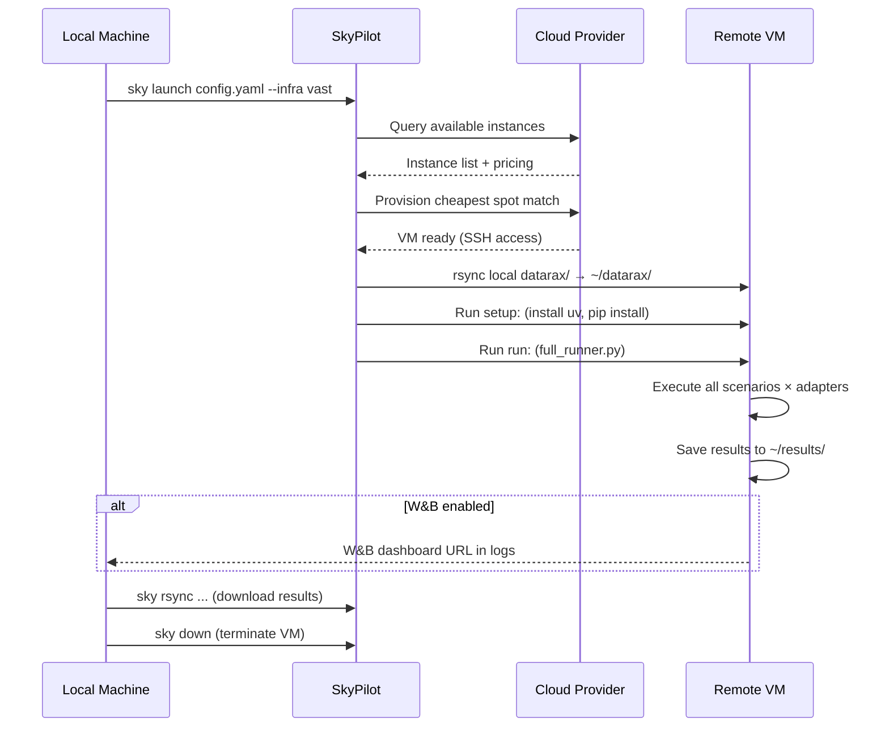

# Cloud Benchmarking with SkyPilot

This guide walks through running the full Datarax benchmark suite on cloud GPU/CPU/TPU instances using [SkyPilot](https://skypilot.readthedocs.io/) for orchestration.

SkyPilot provisions spot instances across cloud providers, rsyncs your code, runs benchmarks, and tears down automatically. Supported providers include **Vast.ai**, **Lambda Cloud**, **RunPod**, **GCP**, **AWS**, and [20+ others](https://github.com/skypilot-org/skypilot).

---

## Prerequisites

### 1. Install SkyPilot

Install SkyPilot with your target cloud provider:

```bash
# Vast.ai
pip install "skypilot[vast]"

# Lambda Cloud
pip install "skypilot[lambda]"

# Multiple providers
pip install "skypilot[vast,lambda,gcp]"

# All supported providers
pip install "skypilot[all]"
```

### 2. Configure cloud credentials

Each provider requires API key setup. SkyPilot walks you through it interactively:

```bash
# Configure and verify a specific provider
sky check vast
sky check lambda

# Check all configured providers
sky check
```

**Vast.ai API key permissions**: When creating an API key at [cloud.vast.ai/account](https://cloud.vast.ai/account/), use minimum privilege:

| Permission | Level | Reason |
|-----------|-------|--------|
| User | Read | Account info lookup |
| Machines | Read | Query available instances |
| Instances | **Read & Write** | Provision and destroy VMs |
| Billing/Earning | No Access | Not needed |
| Team | No Access | Not needed |
| Miscellaneous | No Access | Not needed |

### 3. W&B API key (optional)

If you want benchmark results exported to Weights & Biases directly from the remote VM:

```bash
# Set in your shell profile (~/.bashrc or ~/.zshrc)
export WANDB_API_KEY="your-key-here"
```

This is passed to the remote VM at launch time via `--env` (never stored in config files or committed to git). If you skip this, benchmarks still run — results are saved as local JSON and can be exported to W&B later.

---

## SkyPilot Config Files

Pre-configured YAML files live in `benchmarks/sky/`:

| File | Platform | Hardware | Profile |
|------|----------|----------|---------|
| `cpu-benchmark.yaml` | CPU | 8+ vCPUs, 32GB RAM | `ci_cpu` (6 Tier-1 scenarios) |
| `gpu-benchmark.yaml` | GPU | A100 (80GB) | `gpu_a100` (all 13 scenarios) |
| `tpu-benchmark.yaml` | TPU | TPU v5 lite pod (4 chips) | `tpu_v5e` |

Each config defines:

- **`resources`** — hardware requirements (SkyPilot finds the cheapest match)
- **`envs`** — environment variables forwarded to the VM
- **`setup`** — one-time install commands (uv + benchmark dependencies)
- **`run`** — the benchmark command
- **`file_mounts`** — rsyncs your local working tree to the VM

---

## Running Benchmarks

### CPU benchmarks

```bash
# On Vast.ai (auto-teardown after run)
sky launch benchmarks/sky/cpu-benchmark.yaml --infra vast --down

# On Vast.ai with W&B export
sky launch benchmarks/sky/cpu-benchmark.yaml --infra vast --down \
    --env WANDB_API_KEY=$WANDB_API_KEY

# On any provider (SkyPilot picks cheapest)
sky launch benchmarks/sky/cpu-benchmark.yaml --down
```

!!! tip "Always use `--down` for benchmark runs"
    The `--down` flag auto-terminates the VM when the run finishes, preventing idle billing. Omit it only when you need to SSH in afterward for debugging.

The CPU config sets `JAX_PLATFORMS=cpu` and `XLA_FLAGS="--xla_force_host_platform_device_count=4"` to simulate 4 CPU devices for distributed scenarios.

### GPU benchmarks

```bash
# On Vast.ai (spot A100, auto-teardown)
sky launch benchmarks/sky/gpu-benchmark.yaml --infra vast --down \
    --env WANDB_API_KEY=$WANDB_API_KEY

# On Lambda Cloud
sky launch benchmarks/sky/gpu-benchmark.yaml --infra lambda --down \
    --env WANDB_API_KEY=$WANDB_API_KEY
```

!!! important "GPU JAX requires the `gpu` extra"
    The GPU config installs `.[benchmark,gpu]` — the `gpu` extra provides `jax[cuda12]`. Without it, JAX silently falls back to CPU even on a GPU instance.

### TPU benchmarks

TPU benchmarks require GCP with [TPU Research Cloud (TRC)](https://sites.research.google/trc/about/) access or a GCP project with TPU quota:

```bash
sky launch benchmarks/sky/tpu-benchmark.yaml --infra gcp --down \
    --env WANDB_API_KEY=$WANDB_API_KEY
```

---

## What Happens During a Launch



The `file_mounts` rsync respects your `.gitignore`, so `.venv/` (5-15GB) and `.git/` are excluded automatically.

---

## Monitoring

### Watch logs in real-time

```bash
# Follow the benchmark output
sky logs datarax-benchmark-gpu

# Check status of all clusters
sky status
```

### SSH into a running VM

```bash
sky ssh datarax-benchmark-gpu
```

Useful for debugging setup failures or inspecting intermediate results.

---

## Retrieving Results

### Download results to local machine

```bash
# GPU results
sky rsync datarax-benchmark-gpu:~/results/ ./benchmark-data/reports/cloud-gpu/

# CPU results
sky rsync datarax-benchmark-cpu:~/results/ ./benchmark-data/reports/cloud-cpu/
```

### W&B Artifact persistence (automatic with `--down`)

When `WANDB_API_KEY` is set, the benchmark runner automatically uploads raw results as a **W&B Artifact** before the W&B run closes. This means even with `--down` (auto-terminate), all JSON manifests, per-adapter results, and summary files are persisted to W&B and survive VM teardown.

To download artifacts later:

```bash
# Via W&B CLI
wandb artifact get your-entity/datarax-benchmarks/benchmark-results-abc1234:latest \
    --root ./benchmark-data/reports/cloud-gpu/

# Or via Python
import wandb
run = wandb.init()
artifact = run.use_artifact("benchmark-results-abc1234:latest")
artifact.download(root="./benchmark-data/reports/cloud-gpu/")
```

### Download results via SkyPilot (before teardown)

If the VM is still running (no `--down`), you can rsync results directly:

```bash
# GPU results
sky rsync datarax-benchmark-gpu:~/results/ ./benchmark-data/reports/cloud-gpu/

# CPU results
sky rsync datarax-benchmark-cpu:~/results/ ./benchmark-data/reports/cloud-cpu/
```

### Export to W&B locally (if skipped during run)

If you ran without `WANDB_API_KEY`, export the downloaded results locally:

```bash
export WANDB_API_KEY="your-key"
datarax-bench export --results-dir ./benchmark-data/reports/cloud-gpu/
```

---

## Re-running Without Reprovisioning

If the VM is still running (check with `sky status`), skip the setup phase entirely:

```bash
# Re-run with different scenarios
sky exec datarax-benchmark-gpu -- \
    "cd ~/datarax && python -m benchmarks.runners.full_runner \
        --platform gpu --profile gpu_a100 \
        --scenarios CV-1 CV-2 NLP-1 \
        --output ~/results/"

# Re-run with specific adapters only
sky exec datarax-benchmark-gpu -- \
    "cd ~/datarax && python -m benchmarks.runners.full_runner \
        --platform gpu --profile gpu_a100 \
        --adapters Datarax 'Google Grain' 'PyTorch DataLoader' \
        --output ~/results/"
```

`sky exec` reuses the existing VM and installed environment — runs start in seconds instead of minutes.

---

## Tearing Down

**Always tear down after collecting results** — spot instances are cheap but still bill while running.

```bash
# Terminate a specific cluster
sky down datarax-benchmark-gpu

# Terminate all clusters
sky down --all

# Check nothing is still running
sky status
```

!!! warning "Spot preemption"
    Spot instances can be reclaimed by the provider mid-run. For long benchmarks (>1 hour), use `sky jobs launch` instead of `sky launch` — this enables automatic recovery. If preempted, SkyPilot re-provisions a new instance and restarts the job.

    ```bash
    sky jobs launch benchmarks/sky/gpu-benchmark.yaml --infra vast \
        --env WANDB_API_KEY=$WANDB_API_KEY
    ```

---

## Cost Reference

Approximate costs on Vast.ai spot pricing (as of early 2026):

| Run | Instance | Duration | Cost |
|-----|----------|----------|------|
| CPU (8 vCPU, 32GB) | ~$0.05-0.10/hr | ~30-60 min | ~$0.05-0.10 |
| GPU (A100 80GB) | ~$0.80-1.50/hr | ~30-60 min | ~$0.50-1.00 |

Prices vary by availability and provider. Use `sky show-gpus` to check current rates:

```bash
# Show A100 pricing across all providers
sky show-gpus A100
```

---

## Using Docker Images Instead

For fully reproducible environments (pinned dependencies, no install step), use the [benchmark Docker images](../contributing/docker.md) instead of SkyPilot's `setup:` block:

```bash
# Build locally, push to registry
docker build -f benchmarks/docker/Dockerfile.gpu -t datarax-bench:gpu .
docker tag datarax-bench:gpu your-registry/datarax-bench:gpu
docker push your-registry/datarax-bench:gpu

# Run on any cloud VM with Docker + NVIDIA runtime
docker run --rm --gpus all \
    -e WANDB_API_KEY=$WANDB_API_KEY \
    -v $(pwd)/results:/app/results \
    your-registry/datarax-bench:gpu
```

SkyPilot's `setup:` approach installs from scratch each launch (~5-10 min for the benchmark extra) but always uses your latest code. Docker images are faster to start but require a rebuild when code changes.

---

## Quick Reference

| Action | Command |
|--------|---------|
| CPU bench (Vast.ai) | `sky launch benchmarks/sky/cpu-benchmark.yaml --infra vast --down` |
| GPU bench (Vast.ai) | `sky launch benchmarks/sky/gpu-benchmark.yaml --infra vast --down` |
| GPU bench (Lambda) | `sky launch benchmarks/sky/gpu-benchmark.yaml --infra lambda --down` |
| TPU bench (GCP) | `sky launch benchmarks/sky/tpu-benchmark.yaml --infra gcp --down` |
| Any provider (cheapest) | `sky launch benchmarks/sky/gpu-benchmark.yaml --down` |
| With W&B export | Append `--env WANDB_API_KEY=$WANDB_API_KEY` |
| Watch logs | `sky logs <cluster-name>` |
| SSH into VM | `sky ssh <cluster-name>` |
| Download results | `sky rsync <cluster>:~/results/ ./local-dir/` |
| Re-run (skip setup) | `sky exec <cluster> -- "command"` |
| Stop billing | `sky down <cluster>` |
| Stop all | `sky down --all` |
| Check GPU prices | `sky show-gpus A100` |
