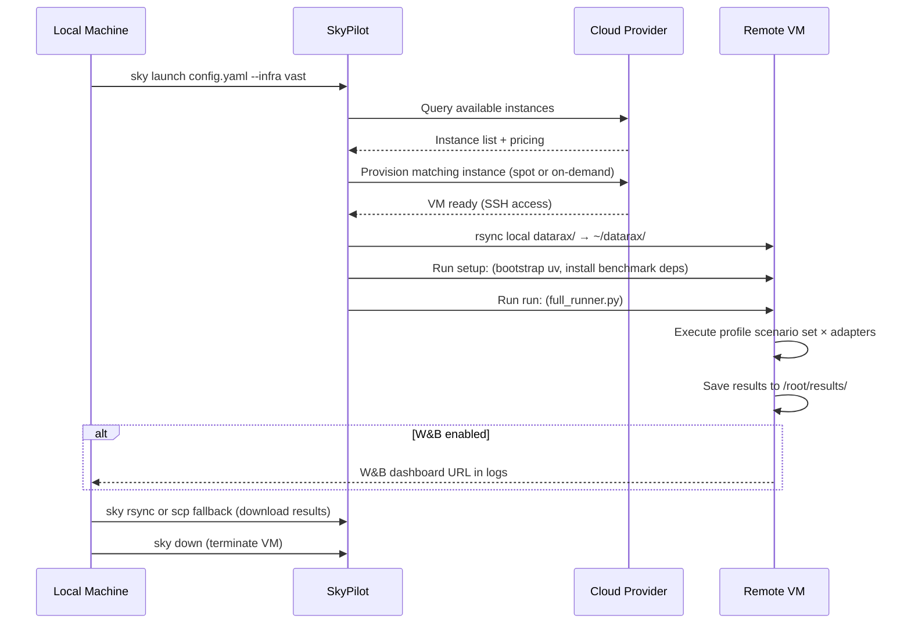

# Cloud Benchmarking with SkyPilot

This guide walks through running the full Datarax benchmark suite on cloud GPU/CPU/TPU instances using [SkyPilot](https://skypilot.readthedocs.io/) for orchestration.

SkyPilot provisions cloud instances across providers, syncs your code, runs benchmarks, and tears down automatically. Supported providers include **Vast.ai**, **Lambda Cloud**, **RunPod**, **GCP**, **AWS**, and [20+ others](https://github.com/skypilot-org/skypilot).

---

## Prerequisites

### 1. Install SkyPilot

Install SkyPilot with your target cloud provider. Prefer installing into the project virtualenv so `sky` is always on PATH during benchmark runs:

```bash
# Preferred for this repo (installs orchestrator-compatible cloud deps)
uv sync --extra automation

# Recommended: install in project venv
./.venv/bin/pip install "skypilot[vast]"

# Vast.ai
pip install "skypilot[vast]"

# Lambda Cloud
pip install "skypilot[lambda]"

# Multiple providers
pip install "skypilot[vast,lambda,gcp]"

# All supported providers
pip install "skypilot[all]"
```

Known compatibility pitfalls:

- `skypilot 0.11.x` + `click >= 8.3` can break `sky launch` with:
  `ValueError: False backend is not supported.`
- `skypilot 0.11.x` + `vastai-sdk >= 1.0` can break Vast.ai
  provisioning with: `'VastAI' object has no attribute 'api_key_access'`.
  The 1.0 SDK removed the attribute that SkyPilot's adapter at
  `sky/adaptors/vast.py` uses; pin to the 0.2.x line until the
  next SkyPilot upgrades the adapter.
- After changing any SkyPilot dependency, restart the SkyPilot API
  daemon so the new packages are reloaded — `pip install` updates
  packages on disk but the running daemon keeps in-memory copies:

```bash
# fix click compatibility
./.venv/bin/pip install -U "skypilot[vast]"
# or
./.venv/bin/pip install "click<8.3"

# fix vastai-sdk compatibility (and bounce the daemon)
./.venv/bin/pip install "vastai-sdk<0.3"
./.venv/bin/sky api stop
```

The `automation` extra in `pyproject.toml` already pins both
`click<8.3` and `vastai-sdk<0.3`, so a fresh
`uv sync --extra automation` picks up the working combination.

### 2. Configure cloud credentials

Each provider requires API key setup. SkyPilot walks you through it interactively:

```bash
# Configure and verify a specific provider
sky check vast
sky check lambda

# Check all configured providers
sky check
```

If `sky` is not found in your shell, run through the venv binary directly:

```bash
./.venv/bin/sky check vast
```

**Vast.ai API key permissions**: When creating an API key at [cloud.vast.ai/account](https://cloud.vast.ai/account/), use minimum privilege:

| Permission | Level | Reason |
|-----------|-------|--------|
| User | Read | Account info lookup |
| Machines | Read | Query available instances |
| Instances | **Read & Write** | Provision and destroy VMs |
| Billing/Earning | No Access | Not needed |
| Team | No Access | Not needed |
| Miscellaneous | No Access | Not needed |

### 3. W&B API key (optional)

If you want benchmark results exported to Weights & Biases directly from the remote VM:

```bash
# Set in your shell profile (~/.bashrc or ~/.zshrc)
export WANDB_API_KEY="your-key-here"
```

Recommended for this repository: keep the key in `secret.sh` and source it before running orchestrator/sky commands:

```bash
# secret.sh
export WANDB_API_KEY="your-key-here"

# current shell
source secret.sh
```

Avoid inline one-off commands like `WANDB_API_KEY=... <command>` when possible, because the key is exposed in shell history and terminal logs.

For orchestrator runs, the key is forwarded to remote stage jobs via `sky exec --secret WANDB_API_KEY` when available.

If you skip this, benchmarks still run — results are saved as local JSON and can be exported to W&B later.

---

## SkyPilot Config Files

Pre-configured YAML files live in `benchmarks/sky/`:

| File | Platform | Hardware | Profile |
|------|----------|----------|---------|
| `cpu-benchmark.yaml` | CPU | 8+ vCPUs, 16+ GB RAM | `ci_cpu` (6 CI scenarios) |
| `gpu-benchmark.yaml` | GPU | A100 (80GB) | `gpu_a100` (13 core cross-framework scenarios) |
| `tpu-benchmark.yaml` | TPU | TPU v5 lite pod (4 chips) | `tpu_v5e` |

Each config defines:

- **`resources`** — hardware requirements (SkyPilot finds the cheapest match)
- **`envs`** — environment variables forwarded to the VM
- **`setup`** — one-time bootstrap commands (uv + benchmark dependencies)
- **`run`** — the benchmark command
- **`file_mounts`** — rsyncs your local working tree to the VM

---

## Running Benchmarks

### CPU benchmarks

```bash
# On Vast.ai (auto-teardown after run)
sky launch benchmarks/sky/cpu-benchmark.yaml --infra vast --down

# On Vast.ai with W&B export
sky launch benchmarks/sky/cpu-benchmark.yaml --infra vast --down \
    --env WANDB_API_KEY=$WANDB_API_KEY

# On any provider (SkyPilot picks cheapest)
sky launch benchmarks/sky/cpu-benchmark.yaml --down
```

!!! tip "Always use `--down` for benchmark runs"
    The `--down` flag auto-terminates the VM when the run finishes, preventing idle billing. Omit it only when you need to SSH in afterward for debugging.

The CPU config sets `JAX_PLATFORMS=cpu` and `XLA_FLAGS="--xla_force_host_platform_device_count=4"` to simulate 4 CPU devices for distributed scenarios.

### GPU benchmarks

```bash
# On Vast.ai (spot A100, auto-teardown)
sky launch benchmarks/sky/gpu-benchmark.yaml --infra vast --down \
    --env WANDB_API_KEY=$WANDB_API_KEY

# On Lambda Cloud
sky launch benchmarks/sky/gpu-benchmark.yaml --infra lambda --down \
    --env WANDB_API_KEY=$WANDB_API_KEY
```

!!! important "GPU JAX requires the `gpu` extra"
    The GPU config installs `.[benchmark,gpu]` — the `gpu` extra provides `jax[cuda12]`. Without it, JAX silently falls back to CPU even on a GPU instance.

### Automated Vast Two-Pass (Recommended)

Use the orchestrator for accuracy-first runs with backend/hardware verification,
subset gating, and automatic artifact validation:

```bash
./.venv/bin/python -m benchmarks.automation.vast_orchestrator \
    --infra vast \
    --cluster datarax-vast-a100 \
    --mode two-pass \
    --on-demand \
    --download-dir benchmark-data/reports/vast/latest \
    --analyze \
    --yes \
    --no-spot-fallback \
    --launch-timeout-sec 900 \
    --stall-timeout-sec 300
```

Defaults:

- `--on-demand` is the default for canonical/published runs.
- Use `--spot` for exploratory cost-optimized runs.
- The orchestrator validates `requested_platform=gpu`, `active_backend=gpu`, and CUDA devices from manifests and per-result metadata.
- Remote verify and benchmark stage commands are GPU-pinned (`sky exec --gpus A100:1`) so stage runs cannot silently execute without a CUDA device.
- The orchestrator emits step progress bars and long-command heartbeat updates in the terminal.
- The orchestrator also emits live `peek:` lines from long-running `sky` commands so you can see setup and benchmark progress without opening log files.
- Launch always pins the explicit cluster name (`-c <cluster>`), which keeps launch/status/teardown on the same cluster identity.
- Artifact download method is detected in preflight. If your SkyPilot build has no `sky rsync`, orchestration automatically switches to `scp` compatibility mode.

Two-pass execution order:

1.  Run subset gate: `CV-1 NLP-1 TAB-1 PC-1 IO-1 PR-2` (default repetitions: 3).
2.  Validate backend/hardware truth from downloaded artifacts.
3.  Only then run the full profile scenario set (default repetitions: 5).

### Orchestrator Safety and Controls

```bash
# Dry run: validate environment and generate Sky config only (no provisioning)
./.venv/bin/python -m benchmarks.automation.vast_orchestrator \
    --infra vast \
    --cluster datarax-vast-a100 \
    --mode two-pass \
    --download-dir benchmark-data/reports/vast/latest \
    --dry-run \
    --yes
```

```bash
# Interactive mode: requires explicit confirmation before provisioning
./.venv/bin/python -m benchmarks.automation.vast_orchestrator \
    --infra vast \
    --cluster datarax-vast-a100 \
    --mode two-pass \
    --on-demand \
    --download-dir benchmark-data/reports/vast/latest \
    --analyze
```

Key flags:

- `--yes`: Auto-confirm prompts (recommended for CI/non-interactive runs).
- `--dry-run`: Validate and generate config without launching cloud resources.
- `--allow-spot-fallback` (default): On on-demand failure, retry visibility checks and same-cluster launch first, then offer spot fallback.
- `--no-spot-fallback`: Disable spot fallback for strict canonical runs.
- `--launch-timeout-sec`: Max wait per launch attempt (default: 300; use 900 for strict on-demand canonical runs).
- `--stall-timeout-sec`: Fail fast if no new launch output appears for N seconds (default: 300). On stall, orchestrator auto-runs `sky queue` and `sky logs --tail` diagnostics before aborting.
- `--live-peek` / `--no-live-peek`: Enable/disable live command output peeking (default: enabled).
- `--peek-interval-sec`: Minimum seconds between `peek:` status lines (default: 5).
- `--artifact-transfer {auto,sky-rsync,scp}`: Artifact download path. `auto` (default) uses preflight capability detection.
- `--keep-cluster`: Skip teardown for debugging or manual reruns.

### Launch Timeout and Fallback Flow

For on-demand runs, launch handling is:

1.  Attempt on-demand launch.
2.  If timeout/failure happens, check `sky status <cluster> --refresh`.
3.  If cluster is already visible, retry on-demand launch on the same cluster.
4.  If retry still fails and spot fallback is enabled, prompt/fallback to spot.

### TPU benchmarks

TPU benchmarks require GCP with [TPU Research Cloud (TRC)](https://sites.research.google/trc/about/) access or a GCP project with TPU quota:

```bash
sky launch benchmarks/sky/tpu-benchmark.yaml --infra gcp --down \
    --env WANDB_API_KEY=$WANDB_API_KEY
```

---

## What Happens During a Launch


```mermaid
sequenceDiagram
    participant You as Local Machine
    participant Sky as SkyPilot
    participant Cloud as Cloud Provider
    participant VM as Remote VM

    You->>Sky: sky launch config.yaml --infra vast
    Sky->>Cloud: Query available instances
    Cloud-->>Sky: Instance list + pricing
    Sky->>Cloud: Provision matching instance (spot or on-demand)
    Cloud-->>Sky: VM ready (SSH access)
    Sky->>VM: rsync local datarax/ → ~/datarax/
    Sky->>VM: Run setup: (bootstrap uv, install benchmark deps)
    Sky->>VM: Run run: (full_runner.py)
    VM->>VM: Execute profile scenario set × adapters
    VM->>VM: Save results to /root/results/
    alt W&B enabled
        VM-->>You: W&B dashboard URL in logs
    end
    You->>Sky: sky rsync or scp fallback (download results)
    You->>Sky: sky down (terminate VM)
```

The `file_mounts` rsync respects your `.gitignore`, so `.venv/` (5-15GB) and `.git/` are excluded automatically.

---

## Monitoring

### Watch logs in real-time

```bash
# Follow the benchmark output
sky logs datarax-vast-a100

# Check status of all clusters
sky status
```

### SSH into a running VM

```bash
sky ssh datarax-vast-a100
```

Useful for debugging setup failures or inspecting intermediate results.

---

## Retrieving Results

### Download results to local machine

```bash
# GPU results (SkyPilot CLI with rsync support)
sky rsync datarax-vast-a100:~/results/ ./benchmark-data/reports/cloud-gpu/

# CPU results (SkyPilot CLI with rsync support)
sky rsync datarax-benchmark-cpu:~/results/ ./benchmark-data/reports/cloud-cpu/
```

If your SkyPilot CLI does not include `rsync`, use `scp` after `sky status`:

```bash
sky status datarax-vast-a100
scp -r datarax-vast-a100:~/results ./benchmark-data/reports/cloud-gpu/
# or
scp -r datarax-vast-a100:/root/results ./benchmark-data/reports/cloud-gpu/
```

### W&B Artifact persistence (automatic with `--down`)

When `WANDB_API_KEY` is set, the benchmark runner automatically uploads raw results as a **W&B Artifact** before the W&B run closes. This means even with `--down` (auto-terminate), all JSON manifests, per-adapter results, and summary files are persisted to W&B and survive VM teardown.

To download artifacts later:

```bash
# Via W&B CLI
wandb artifact get your-entity/datarax-benchmarks/benchmark-results-abc1234:latest \
    --root ./benchmark-data/reports/cloud-gpu/

# Or via Python
import wandb
run = wandb.init()
artifact = run.use_artifact("benchmark-results-abc1234:latest")
artifact.download(root="./benchmark-data/reports/cloud-gpu/")
```

### Download results via SkyPilot (before teardown)

If the VM is still running (no `--down`), you can copy results directly:

```bash
# GPU results (rsync-capable SkyPilot builds)
sky rsync datarax-vast-a100:~/results/ ./benchmark-data/reports/cloud-gpu/

# CPU results (rsync-capable SkyPilot builds)
sky rsync datarax-benchmark-cpu:~/results/ ./benchmark-data/reports/cloud-cpu/
```

```bash
# Compatibility path when `sky rsync` is unavailable
sky status datarax-vast-a100
scp -r datarax-vast-a100:~/results ./benchmark-data/reports/cloud-gpu/
# or
scp -r datarax-vast-a100:/root/results ./benchmark-data/reports/cloud-gpu/
```

Some OpenSSH/scp combinations reject `~/results/.` with:
`error: unexpected filename: .`
Use `~/results` instead. The orchestrator now auto-retries compatible source forms and normalizes nested downloads.

### Export to W&B locally (if skipped during run)

If you ran without `WANDB_API_KEY`, export the downloaded results locally:

```bash
export WANDB_API_KEY="your-key"
datarax-bench export --results-dir ./benchmark-data/reports/cloud-gpu/
```

---

## Backend and Artifact Verification

For canonical runs, verify backend truth from the downloaded run directory:

```bash
# Pick latest orchestrator run directory
LATEST="$(ls -td benchmark-data/reports/vast/latest/* | head -1)"

# High-level orchestration + per-stage validation status
cat "$LATEST/validation_report.json"
cat "$LATEST/validation_report_subset.json"
cat "$LATEST/validation_report_full.json"

# Inspect manifest backend fields
cat "$LATEST/results/full/manifest.json"
```

Minimum expected values for GPU runs:

- `requested_platform = "gpu"`
- `active_backend = "gpu"`
- `environment.platform.devices` contains `cuda`

The orchestrator exits non-zero if these checks fail.
`validation_report.json` is written for both success and failure and includes the failing step when a run aborts early.

---

## Re-running Without Reprovisioning

If the VM is still running (check with `sky status`), skip the setup phase entirely:

```bash
# Re-run with different scenarios
sky exec datarax-vast-a100 -- \
    "cd ~/datarax && python -m benchmarks.runners.full_runner \
        --platform gpu --profile gpu_a100 \
        --scenarios CV-1 CV-2 NLP-1 \
        --output-dir ~/results/"

# Re-run with specific adapters only
sky exec datarax-vast-a100 -- \
    "cd ~/datarax && python -m benchmarks.runners.full_runner \
        --platform gpu --profile gpu_a100 \
        --adapters Datarax 'Google Grain' 'PyTorch DataLoader' \
        --output-dir ~/results/"
```

`sky exec` reuses the existing VM and installed environment — runs start in seconds instead of minutes.

---

## Troubleshooting

### `sky: command not found`

Install SkyPilot in the project venv and invoke it directly:

```bash
./.venv/bin/pip install "skypilot[vast]"
./.venv/bin/sky check vast
```

### `Error: No such command 'rsync'`

Your SkyPilot CLI build does not expose `sky rsync`.

1.  Upgrade SkyPilot:

```bash
./.venv/bin/pip install -U "skypilot[vast]"
```

2.  Use orchestrator auto-detection (`--artifact-transfer auto`, default), or force compatibility mode:

```bash
./.venv/bin/python -m benchmarks.automation.vast_orchestrator \
    --infra vast \
    --cluster datarax-vast-a100 \
    --mode two-pass \
    --artifact-transfer scp \
    --download-dir benchmark-data/reports/vast/latest \
    --yes
```

### `WANDB_API_KEY is None` during `sky launch`

This means the YAML has a null env value for `WANDB_API_KEY`. Fix by ensuring it is passed as a string:

```bash
# Ensure key is set in current shell
export WANDB_API_KEY="your-key"

# Or pass explicitly on launch
sky launch ... --env WANDB_API_KEY="$WANDB_API_KEY"
```

For orchestrator runs, inspect generated YAML:

```bash
LATEST="$(ls -td benchmark-data/reports/vast/latest/* | head -1)"
grep -n "WANDB_API_KEY" "$LATEST"/generated_sky_config*.yaml
```

Expected: `WANDB_API_KEY` appears with a concrete string value (possibly empty `""`), not `null`.

For orchestrator runs, current versions no longer fail benchmark stages when the key is missing:
- preflight warns that `WANDB_API_KEY` is not set
- stage commands are emitted with `--no-wandb`
- benchmark execution continues, with local artifacts still downloaded/validated

### Benchmark appears to have run on CPU

Check the stage validation reports and manifests:

```bash
LATEST="$(ls -td benchmark-data/reports/vast/latest/* | head -1)"
cat "$LATEST/validation_report_subset.json"
cat "$LATEST/results/subset/manifest.json"
```

If `active_backend` is not `gpu`, rerun after confirming GPU env vars (`JAX_PLATFORMS`, `JAX_PLATFORM_NAME`) and GPU JAX installation.

### `CUDA_ERROR_NO_DEVICE` during subset/full stage

If hardware verification passes but stage logs contain:
`operation cuInit(0) failed: CUDA_ERROR_NO_DEVICE`,
the stage command likely ran without GPU reservation.

Verify in `orchestrator_logs/run_subset.log` or `run_full.log` that the command includes:
`sky exec <cluster> --gpus A100:1 -- ...`

Current orchestrator versions pin GPUs for verify + benchmark stage commands; update to latest repository code if this appears.

### `Subset validation failed` with missing manifest

If validation reports:
`Missing manifest: .../results/subset/manifest.json`,
check two things:

1.  Benchmark command failed before writing outputs (see `orchestrator_logs/run_subset.log`).
2.  Artifact layout is nested (`results/results/subset`) due `scp` behavior.
3.  Older orchestrator versions may pass quoted `~/...` CLI paths, writing outputs under a literal `~/` directory in repo instead of `/root/results`.
4.  Older repository revisions invoked benchmarks via `python -m benchmarks.cli` while `benchmarks/cli.py` had no module entrypoint, so the command could exit `0` without running benchmark work.
5.  Older repository revisions emitted scenarios as `--scenarios CV-1 NLP-1 ...` (single flag with many values), which Click parses as `Got unexpected extra argument (...)`.

The orchestrator now auto-normalizes nested layouts, but for older runs you can flatten manually:

```bash
LATEST="$(ls -td benchmark-data/reports/vast/latest/* | head -1)"
if [ -d "$LATEST/results/results" ]; then
  cp -r "$LATEST/results/results/"* "$LATEST/results/"
fi
```

### Run appears stuck with no output

The orchestrator emits step updates, heartbeat lines, and periodic `peek:` lines from live command output. If output stops completely:

1.  Inspect `orchestrator_logs/sky_launch.log` under the run directory.
2.  If timeout/retry/fallback kicked in, also inspect:
    - `orchestrator_logs/sky_status_check.log`
    - `orchestrator_logs/sky_launch_retry.log`
    - `orchestrator_logs/sky_launch_spot_fallback.log`
3.  Check `validation_report.json` for the failing `step`.
4.  Re-run once with `--dry-run --yes` to validate local prerequisites quickly.

### Two instances appear live on Vast.ai

This can happen if local timeout/fallback logic races with delayed provider allocation.

Cleanup:

1.  Refresh Sky state:

```bash
sky status --refresh
```

2.  Tear down the benchmark cluster:

```bash
sky down datarax-vast-a100
```

3.  Re-check `sky status --refresh`.
4.  If an extra instance still appears only in Vast UI, terminate it manually in Vast UI.

Prevention:

- Canonical runs: `--on-demand --no-spot-fallback --launch-timeout-sec 900`
- Exploratory runs: keep fallback enabled but use a longer timeout (for example 600s) to reduce timeout races.
- If launch output goes silent, set `--stall-timeout-sec` to a lower threshold for faster fail-fast diagnostics during debugging.

### Vast shows A100 offers but no instance appears yet

This can still happen even when the Vast offers page shows many A100 rows:

1.  The offers list is global and dynamic; `sky launch` still needs to secure a currently-available match for your exact request.
2.  Allocation can be delayed while SkyPilot negotiates and retries candidate offers.
3.  On-demand placement can take longer than spot in busy windows.

Practical guidance:

- Normal instance appearance after launch starts: usually ~30-120s.
- Delayed but still healthy launch: 2-6 minutes can happen.
- If no instance appears by your timeout window, let orchestrator run its timeout flow (`status` check -> same-cluster retry -> optional spot fallback).

Recommended commands:

```bash
# Strict canonical run (on-demand only, no spot fallback)
./.venv/bin/python -m benchmarks.automation.vast_orchestrator \
    --infra vast \
    --cluster datarax-vast-a100 \
    --mode two-pass \
    --on-demand \
    --download-dir benchmark-data/reports/vast/latest \
    --analyze \
    --yes \
    --no-spot-fallback \
    --launch-timeout-sec 900 \
    --stall-timeout-sec 300
```

```bash
# Exploratory run (allow on-demand -> spot fallback after retry path)
./.venv/bin/python -m benchmarks.automation.vast_orchestrator \
    --infra vast \
    --cluster datarax-vast-a100 \
    --mode two-pass \
    --on-demand \
    --download-dir benchmark-data/reports/vast/latest \
    --analyze \
    --yes \
    --allow-spot-fallback \
    --launch-timeout-sec 600 \
    --stall-timeout-sec 300
```

---

## Tearing Down

**Always tear down after collecting results** — spot instances are cheap but still bill while running.

```bash
# Terminate a specific cluster
sky down datarax-vast-a100

# Terminate all clusters
sky down --all

# Check nothing is still running
sky status
```

!!! warning "Spot preemption"
    Spot instances can be reclaimed by the provider mid-run. For long benchmarks (>1 hour), use `sky jobs launch` instead of `sky launch` — this enables automatic recovery. If preempted, SkyPilot re-provisions a new instance and restarts the job.

    ```bash
    sky jobs launch benchmarks/sky/gpu-benchmark.yaml --infra vast \
        --env WANDB_API_KEY=$WANDB_API_KEY
    ```

---

## Cost Reference

Approximate costs on Vast.ai spot pricing (as of early 2026):

| Run | Instance | Duration | Cost |
|-----|----------|----------|------|
| CPU (8 vCPU, 16-32GB) | ~$0.05-0.10/hr | ~30-60 min | ~$0.05-0.10 |
| GPU (A100 80GB) | ~$0.80-1.50/hr | ~30-60 min | ~$0.50-1.00 |

Prices vary by availability and provider. Use `sky show-gpus` to check current rates:

```bash
# Show A100 pricing across all providers
sky show-gpus A100
```

---

## Using Docker Images Instead

For fully reproducible environments (pinned dependencies, no install step), use the [benchmark Docker images](../contributing/docker.md) instead of SkyPilot's `setup:` block:

```bash
# Build locally, push to registry
docker build -f benchmarks/docker/Dockerfile.gpu -t datarax-bench:gpu .
docker tag datarax-bench:gpu your-registry/datarax-bench:gpu
docker push your-registry/datarax-bench:gpu

# Run on any cloud VM with Docker + NVIDIA runtime
docker run --rm --gpus all \
    -e WANDB_API_KEY=$WANDB_API_KEY \
    -v $(pwd)/results:/app/results \
    your-registry/datarax-bench:gpu
```

SkyPilot's `setup:` approach installs from scratch each launch (~5-10 min for the benchmark extra) but always uses your latest code. Docker images are faster to start but require a rebuild when code changes.

---

## Quick Reference

| Action | Command |
|--------|---------|
| Automated Vast two-pass (canonical) | `./.venv/bin/python -m benchmarks.automation.vast_orchestrator --infra vast --cluster datarax-vast-a100 --mode two-pass --on-demand --download-dir benchmark-data/reports/vast/latest --analyze --yes --no-spot-fallback --launch-timeout-sec 900 --stall-timeout-sec 300` |
| Orchestrator dry run | `./.venv/bin/python -m benchmarks.automation.vast_orchestrator --infra vast --cluster datarax-vast-a100 --mode two-pass --download-dir benchmark-data/reports/vast/latest --dry-run --yes` |
| Orchestrator with forced `scp` transfer | `./.venv/bin/python -m benchmarks.automation.vast_orchestrator --infra vast --cluster datarax-vast-a100 --mode two-pass --artifact-transfer scp --download-dir benchmark-data/reports/vast/latest --analyze --yes` |
| CPU bench (Vast.ai) | `sky launch benchmarks/sky/cpu-benchmark.yaml --infra vast --down` |
| GPU bench (Vast.ai) | `sky launch benchmarks/sky/gpu-benchmark.yaml --infra vast --down` |
| GPU bench (Lambda) | `sky launch benchmarks/sky/gpu-benchmark.yaml --infra lambda --down` |
| TPU bench (GCP) | `sky launch benchmarks/sky/tpu-benchmark.yaml --infra gcp --down` |
| Any provider (cheapest) | `sky launch benchmarks/sky/gpu-benchmark.yaml --down` |
| With W&B export | Append `--env WANDB_API_KEY=$WANDB_API_KEY` |
| Watch logs | `sky logs <cluster-name>` |
| SSH into VM | `sky ssh <cluster-name>` |
| Download results | `sky rsync <cluster>:~/results/ ./local-dir/` (or `scp` compatibility path) |
| Re-run (skip setup) | `sky exec <cluster> -- "command"` |
| Stop billing | `sky down <cluster>` |
| Stop all | `sky down --all` |
| Check GPU prices | `sky show-gpus A100` |
