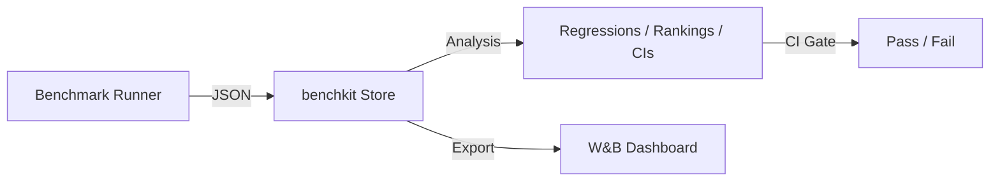
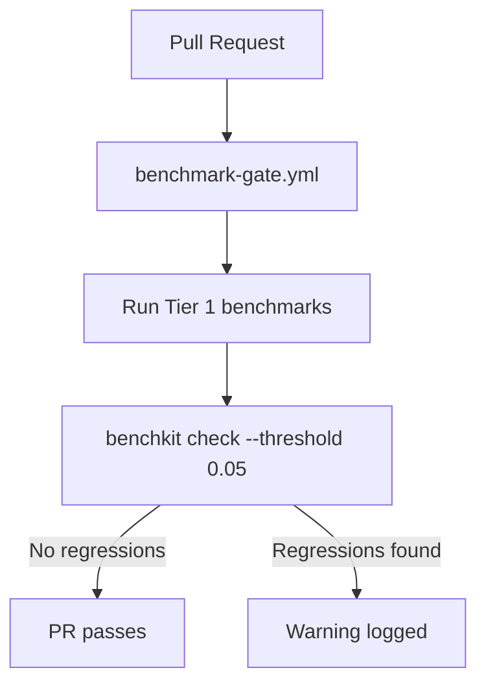
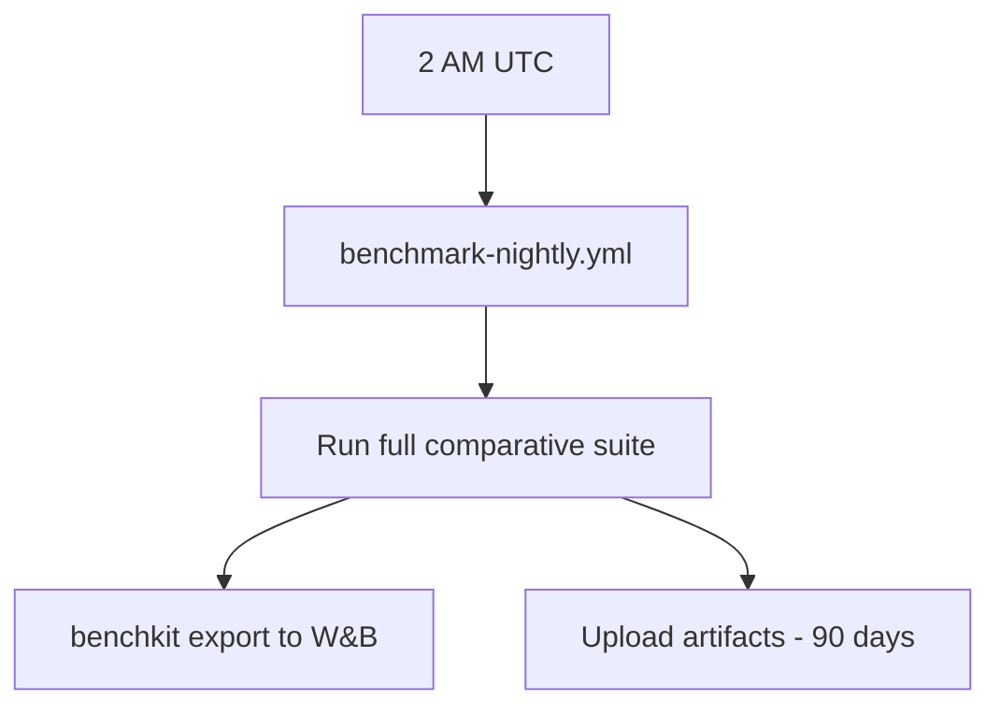

# Dashboard & benchkit

**benchkit** is a standalone Python library that powers benchmark analysis and the W&B dashboard. It provides direction-aware metrics, regression detection, statistical analysis, and automated export to [Weights & Biases](https://wandb.ai).



---

## Why W&B?

Rather than building a custom visualization frontend, we use W&B as the dashboard UI. It provides interactive charts, run history, comparison tables, filtering, and team collaboration — all well-established and familiar to ML practitioners. W&B is free for open-source projects.

**What benchkit adds on top of W&B:**

-   Direction-aware metric definitions (`higher` throughput is better, `lower` latency is better)
-   Best-value highlighting with correct direction semantics
-   Regression detection with CI gate (`benchkit check`)
-   Bootstrap confidence intervals (pure Python, no scipy)
-   Framework ranking tables
-   JSON-per-run local storage (works fully offline)

---

## Installation

benchkit lives at `tools/benchkit/` in the datarax repo:

```bash
# Core (analysis + CLI, no W&B dependency)
uv pip install -e tools/benchkit

# With W&B export support
uv pip install -e "tools/benchkit[wandb]"
```

---

## Data Model

benchkit's data model captures the semantics that W&B doesn't track natively:

| Concept | Description |
|---------|-------------|
| `MetricDef` | How to interpret a metric — name, unit, direction (`higher`/`lower`/`info`), group, priority |
| `Metric` | A single value with optional CI bounds and raw samples |
| `Point` | One benchmark + one configuration (e.g., "CV-1/small" for Datarax) |
| `Run` | One execution of a benchmark suite — a collection of Points |

All metric definitions live in a `config.json` file inside the local data store:

```json
{
  "wandb_project": "datarax-benchmarks",
  "metric_defs": {
    "throughput": {
      "unit": "elem/s",
      "direction": "higher",
      "group": "Throughput",
      "priority": "primary"
    },
    "latency_p50": {
      "unit": "ms",
      "direction": "lower",
      "group": "Latency",
      "priority": "primary"
    }
  }
}
```

---

## CLI Reference

### `benchkit ingest`

Import benchmark results from a JSON file into the local store.

```bash
benchkit ingest --data benchmark-data/ --input results.json
```

### `benchkit export`

Export the latest run to W&B. Reads project/entity from `config.json`.

```bash
export WANDB_API_KEY="..."
benchkit export --data benchmark-data/
```

Override project or entity:

```bash
benchkit export --data benchmark-data/ --project my-project --entity my-team
```

### `benchkit check`

Run regression detection against baseline. Exits with code 1 if regressions exceed the threshold. This is the CI gate — fully offline, no W&B needed.

```bash
benchkit check --data benchmark-data/ --threshold 0.05
```

Example output:

```
FAIL: 2 regression(s) detected:
  ↓ CV-1/small throughput: 20158.00 → 18000.00 (-10.7%)
  ↑ CV-1/small latency_p50: 12.00 → 15.00 (+25.0%)
```

### `benchkit baseline`

Set a run as the regression baseline.

```bash
benchkit baseline --data benchmark-data/ --run latest
```

### `benchkit summary`

Print a human-readable run summary to the terminal.

```bash
benchkit summary --data benchmark-data/
```

### `benchkit trend`

Show metric trend across runs. Tracks how a specific metric for a specific framework/point changes over time.

```bash
benchkit trend --data benchmark-data/ --metric throughput --point CV-1/small --framework Datarax
benchkit trend --data benchmark-data/ --metric throughput --point CV-1/small --framework Datarax --n-runs 10
```

Output shows timestamp, value, optional CI bounds, and commit hash for each run.

---

## Python API

```python
import benchkit

# Initialize store (JSON backend)
store = benchkit.Store("benchmark-data/")

# Create and save a run
run = benchkit.Run(
    points=[
        benchkit.Point(
            "CV-1/small", scenario="CV-1",
            tags={"framework": "Datarax"},
            metrics={"throughput": benchkit.Metric(20158)},
        ),
        benchkit.Point(
            "CV-1/small", scenario="CV-1",
            tags={"framework": "Grain"},
            metrics={"throughput": benchkit.Metric(20071)},
        ),
    ],
    metric_defs={
        "throughput": benchkit.MetricDef(
            "throughput", "elem/s", "higher",
            group="Throughput",
            priority=benchkit.MetricPriority.PRIMARY,
        ),
    },
)
store.save(run)

# Run analysis (all offline, no W&B needed)
baseline = store.get_baseline()
if baseline:
    regressions = benchkit.detect_regressions(run, baseline)
    ranks = benchkit.rank_table(run, "throughput", group_by_tag="framework")
```

### Export to W&B

```python
from benchkit.exporters.wandb import WandBExporter

exporter = WandBExporter.from_store(store)
url = exporter.export_run(run)
exporter.export_analysis(run, baseline)
print(f"Dashboard: {url}")
```

---

## W&B Authentication

Credentials are read **exclusively** from environment variables — never stored in config files or committed to git.

### Local Development

```bash
export WANDB_API_KEY="your-key-here"
benchkit export --data benchmark-data/
```

### CI (GitHub Actions)

Add `WANDB_API_KEY` as a repository secret, then reference it in workflows:

```yaml
env:
  WANDB_API_KEY: ${{ secrets.WANDB_API_KEY }}
```

### Offline Mode

For testing or environments without internet access:

```bash
export WANDB_MODE=offline
benchkit export --data benchmark-data/
```

!!! note "Auth validation"
    benchkit validates authentication before calling `wandb.init()`. If `WANDB_API_KEY` is not set and offline mode is not enabled, the CLI prints an actionable error message instead of failing inside wandb.

---

## CI Integration

Two GitHub Actions workflows automate benchmarking:

### Performance Gate (per-PR)

**File:** `.github/workflows/benchmark-gate.yml`

Runs on every PR that touches `src/datarax/`, `benchmarks/`, or `pyproject.toml`. Executes Tier 1 benchmarks and runs `benchkit check` for regression detection.



!!! warning "Non-blocking gate"
    The regression check is currently **non-blocking** (`continue-on-error: true` in the workflow). Regressions are logged as warnings but will **not** prevent PR merge. This will change once a stable baseline is established.

### Nightly Comparative (scheduled)

**File:** `.github/workflows/benchmark-nightly.yml`

Runs the full comparative suite daily at 2 AM UTC. Exports results to W&B when `WANDB_API_KEY` is available.



GPU and TPU jobs are defined but commented out until cloud credits are available.

---

## Local Data Store

All results are saved locally as JSON regardless of W&B status. The default store directory is `benchmark-data/` (gitignored — not committed to version control). The directory structure is:

```
<store-dir>/
├── runs/
│   ├── <timestamp>_<hash>.json
│   └── ...
├── baselines/
│   └── main.json
└── config.json
```

This ensures:

-   **Offline access**: analysis and regression detection work without internet
-   **No lock-in**: data is portable and not dependent on W&B
-   **CI independence**: the regression gate uses only local JSON files

---

## W&B Export Details

When `benchkit export` runs, it creates:

| W&B Artifact | Content |
|-------------|---------|
| `wandb.config` | Environment fingerprint (CPU, GPU, OS, Python version) |
| Summary metrics | Slash-grouped: `Throughput/throughput/Datarax`, `Latency/latency_p50/Grain` |
| `comparison` table | `wandb.Table` with `" *"` suffix on best values |
| `comparison_styled` | `wandb.Html` with `<b>` tags on best values |
| `rankings/*` tables | Per-metric ranking with rank, value, is_best, delta % |
| Regression alerts | `wandb.Alert` for each detected regression |

!!! tip "Slash notation"
    W&B automatically groups metrics by slash prefix. `Throughput/throughput/Datarax` appears under a "Throughput" panel group. This keeps the dashboard organized without manual configuration.

---

## Regression Detection

benchkit's regression detection is **direction-aware**: a throughput drop is a regression, but a latency drop is an improvement.

| Direction | Regression when | Improvement when |
|-----------|----------------|-----------------|
| `higher` | Value decreases beyond threshold | Value increases |
| `lower` | Value increases beyond threshold | Value decreases |
| `info` | Never (skipped) | Never (skipped) |

The default threshold is 5% — any change beyond this triggers a regression flag.

Points are matched between runs using a composite key of `(name, tags)`, ensuring that "CV-1/small for Datarax" is compared against the correct baseline even when multiple frameworks share the same point name.
