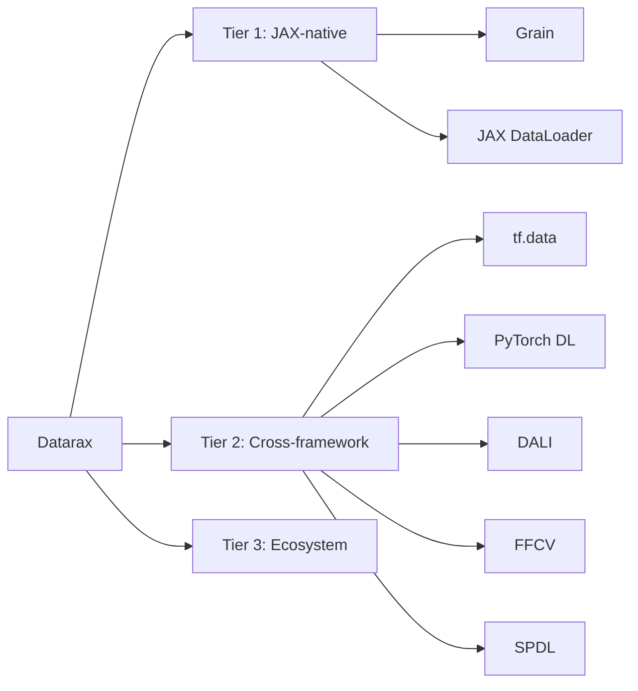

# Benchmark Results

Datarax includes a full benchmark suite that measures performance across 25 scenarios alongside 14 data loading frameworks. Results are analyzed with [benchkit](dashboard.md) and published to a W&B dashboard.

## Overview

The benchmark suite evaluates:

1.  **Throughput**: Elements processed per second
2.  **Latency**: Per-batch processing time distribution (p50, p95, p99)
3.  **Memory**: Peak RSS and GPU memory usage
4.  **Scaling**: Performance across batch sizes, workers, and devices
5.  **Feature coverage**: Which scenarios each framework supports

All metrics are **direction-aware** (higher throughput is better, lower latency is better), which drives automatic regression detection and ranking.

---

## Framework Comparison

We benchmark against frameworks across three tiers:

| Tier | Frameworks |
|------|-----------|
| **Tier 1** (JAX-native) | Grain, JAX DataLoader |
| **Tier 2** (Cross-framework) | tf.data, PyTorch DataLoader, DALI, FFCV, SPDL |
| **Tier 3** (Ecosystem) | MosaicML, WebDataset, HF Datasets, Ray Data, LitData, Energon, Deep Lake |



---

## Sections

-   [Methodology](methodology.md) -- Timing protocol, warmup strategy, statistical analysis
-   [Framework Comparison](comparison.md) -- Results with charts and comparative analysis
-   [Cloud Benchmarking](cloud.md) -- Running benchmarks on Vast.ai, Lambda, GCP via SkyPilot
-   [Dashboard & benchkit](dashboard.md) -- W&B dashboard, regression gates, and the benchkit analysis library

---

## Running Benchmarks End-to-End

The full workflow: install dependencies, run benchmarks, analyze results, export to W&B.

### 1. Install

```bash
# Core datarax + all benchmark adapters
uv sync --all-extras

# benchkit (analysis CLI)
uv pip install -e tools/benchkit

# Optional: W&B export support
uv pip install -e "tools/benchkit[wandb]"
```

### 2. Run

=== "datarax-bench CLI (Recommended)"

    The `datarax-bench` CLI is the preferred entry point. It runs benchmarks, converts results, stores them, and optionally exports to W&B — all in one command.

    ```bash
    datarax-bench run --platform cpu --repetitions 5
    datarax-bench run --platform cpu --scenarios CV-1 NLP-1 --adapters Datarax "Google Grain" --repetitions 3
    datarax-bench run --platform cpu --wandb --charts  # With W&B export and chart generation
    ```

    !!! note "Nightly CI uses `datarax-bench`"
        The nightly CI workflow uses `datarax-bench run` — this is the preferred entry point for all benchmark runs.

=== "Shell Script"

    Run all scenarios across every installed adapter:

    ```bash
    ./scripts/run_full_benchmark.sh             # CPU, 5 repetitions
    ./scripts/run_full_benchmark.sh cpu 3       # CPU, 3 repetitions
    ./scripts/run_full_benchmark.sh gpu         # GPU (requires CUDA)
    ```

    Or via Python directly:

    ```bash
    uv run python -m benchmarks.runners.full_runner --platform cpu --repetitions 5
    ```

=== "Custom Subset"

    Run specific scenarios and adapters:

    ```bash
    uv run python -m benchmarks.runners.full_runner \
        --platform cpu \
        --scenarios CV-1 NLP-1 TAB-1 \
        --adapters Datarax "Google Grain" "PyTorch DataLoader" \
        --repetitions 3
    ```

=== "CI Gate"

    Lightweight regression gate — 6 Tier 1 scenarios, Datarax only:

    ```bash
    uv run python -m benchmarks.runners.ci_runner --repetitions 3
    ```

    Runs automatically on PRs touching `src/datarax/` or `benchmarks/`. See [Performance Gate](dashboard.md#ci-integration).

Results are saved to a local `benchmark-data/` directory (not committed to version control).

#### Runner Options

| Flag | Default | Description |
|------|---------|-------------|
| `--platform` | `cpu` | Target platform (see [Platforms](#platforms) below) |
| `--scenarios` | all | Space-separated scenario IDs (see [Scenarios](#scenarios) below) |
| `--adapters` | all installed | Space-separated adapter names (see [Adapters](#adapters) below) |
| `--profile` | `ci_cpu` | Hardware profile (see [Profiles](#hardware-profiles) below) |
| `--repetitions` | `5` | Number of repetitions per scenario (median is selected) |
| `--output-dir` | `benchmark-data/reports/latest` | Output directory for result JSONs (local only, not committed) |
| `--wandb/--no-wandb` | `--wandb` | Enable/disable W&B export (`datarax-bench` only) |
| `--charts/--no-charts` | `--charts` | Enable/disable chart generation (`datarax-bench` only) |
| `--baseline/--no-baseline` | `--baseline` | Set run as baseline for future comparisons (`datarax-bench` only) |
| `--data` | `benchmark-data` | benchkit store directory path (`datarax-bench` only) |
| `--project` | from config | W&B project override (`datarax-bench` only) |
| `--entity` | from config | W&B entity override (`datarax-bench` only) |

#### Platforms

| Value | Description |
|-------|-------------|
| `cpu` | CPU-only execution (default, works everywhere) |
| `gpu` | GPU execution (requires CUDA) |
| `tpu` | TPU execution (requires TRC access or GCP) |

#### Scenarios

25 scenarios across 9 categories. Pass any combination to `--scenarios`:

| ID | Category | Description |
|----|----------|-------------|
| `CV-1` | Computer Vision | Image classification pipeline (canonical) |
| `CV-2` | Computer Vision | High-resolution medical imaging (3D U-Net) |
| `CV-3` | Computer Vision | Batch-level mixing (MixUp/CutMix) |
| `CV-4` | Computer Vision | Multi-resolution pipeline |
| `NLP-1` | NLP | Token-based LLM pretraining data |
| `NLP-2` | NLP | Variable-length text with dynamic padding |
| `TAB-1` | Tabular | Dense feature table loading |
| `TAB-2` | Tabular | Sparse feature processing (DLRM pattern) |
| `MM-1` | Multimodal | Image-text pair loading (CLIP-style) |
| `MM-2` | Multimodal | Audio-text pair loading (ASR-style) |
| `PC-1` | Pipeline Complexity | Deep transform chain scaling |
| `PC-2` | Pipeline Complexity | Branching/parallel pipeline (DAG) |
| `PC-3` | Pipeline Complexity | Differentiable rebatching |
| `PC-4` | Pipeline Complexity | Probabilistic & conditional pipeline |
| `PC-5` | Pipeline Complexity | End-to-end differentiable pipeline |
| `IO-1` | I/O Patterns | Source backend comparison |
| `IO-2` | I/O Patterns | Streaming vs eager loading |
| `IO-3` | I/O Patterns | Mixed-source pipeline |
| `IO-4` | I/O Patterns | Cache node effectiveness |
| `DIST-1` | Distributed | Multi-device sharding & prefetch |
| `DIST-2` | Distributed | Device mesh configuration |
| `PR-1` | Production | Checkpoint save/restore cycle |
| `PR-2` | Production | Multi-epoch determinism verification |
| `NNX-1` | Datarax Unique | Flax NNX module integration overhead |
| `XFMR-1` | Datarax Unique | JIT + vmap transform acceleration |

#### Adapters

15 adapters (Datarax + 14 peer frameworks). Pass any combination to `--adapters`. Only adapters whose framework is installed will run.

Each adapter supports only the scenarios where it implements the required transforms (e.g., CV-1 requires Normalize + CastToFloat32). This ensures fair comparisons — every framework performs equivalent work on each scenario.

| `--adapters` value | Tier | Framework | Supported Scenarios |
|--------------------|------|-----------|-------------------|
| `Datarax` | -- | Datarax (always available) | All 25 |
| `Google Grain` | Tier 1 | Google Grain | CV-1, NLP-1, TAB-1, DIST-1, PR-1 |
| `jax-dataloader` | Tier 1 | JAX DataLoader | CV-1 |
| `tf.data` | Tier 2 | TensorFlow tf.data | CV-1, NLP-1, TAB-1, DIST-1, PR-1 |
| `PyTorch DataLoader` | Tier 2 | PyTorch DataLoader | CV-1, NLP-1, TAB-1, DIST-1, PR-1 |
| `NVIDIA DALI` | Tier 2 | NVIDIA DALI | CV-1, NLP-1, TAB-1, DIST-1 |
| `FFCV` | Tier 2 | FFCV | CV-1 |
| `SPDL` | Tier 2 | SPDL | CV-1, NLP-1, TAB-1, DIST-1 |
| `MosaicML Streaming` | Tier 3 | MosaicML Streaming | CV-1, NLP-1 |
| `WebDataset` | Tier 3 | WebDataset | CV-1, NLP-1 |
| `HuggingFace Datasets` | Tier 3 | HuggingFace Datasets | NLP-1, TAB-1 |
| `Ray Data` | Tier 3 | Ray Data | NLP-1, TAB-1 |
| `LitData` | Tier 3 | LitData | CV-1 |
| `Energon` | Tier 3 | Megatron Energon | MM-1 |
| `Deep Lake` | Tier 3 | Deep Lake | CV-1 |

!!! warning "Names with spaces require shell quotes"
    Adapter names are exact-match. Names containing spaces must be quoted on the command line:
    `--adapters Datarax "Google Grain" "PyTorch DataLoader"`. Single-word names like `Datarax`, `FFCV`, `SPDL` don't need quotes.

#### Hardware Profiles

Profiles control warmup batches, measurement batches, and timeouts:

| Profile | Backend | Warmup | Batches | Timeout |
|---------|---------|--------|---------|---------|
| `ci_cpu` | CPU | 3 | 20 | 5 min |
| `gpu_a100` | GPU | 8 | 50 | -- |
| `tpu_v5e` | TPU | 8 | 50 | -- |

### 3. Analyze

After running, use benchkit to check for regressions and view a summary:

```bash
# Terminal summary
benchkit summary --data benchmark-data/

# Regression check against baseline (exits non-zero on failure)
benchkit check --data benchmark-data/ --threshold 0.05

# Set current run as the baseline for future comparisons
benchkit baseline --data benchmark-data/ --run latest
```

### 4. Export to W&B (optional)

```bash
export WANDB_API_KEY="..."
benchkit export --data benchmark-data/
```

See [Dashboard & benchkit](dashboard.md) for W&B setup details and the full benchkit CLI reference.

---

## Reproducibility

All benchmarks use:

1.  **Deterministic synthetic data** (seed=42) -- identical inputs across all frameworks
2.  **Fixed warmup protocol** -- 3-8 batches depending on hardware profile
3.  **Median-of-N selection** -- reduces sensitivity to outlier runs
4.  **Environment fingerprinting** -- hardware/software version tracking
5.  **JSON-per-run storage** -- every run saved locally for offline analysis
