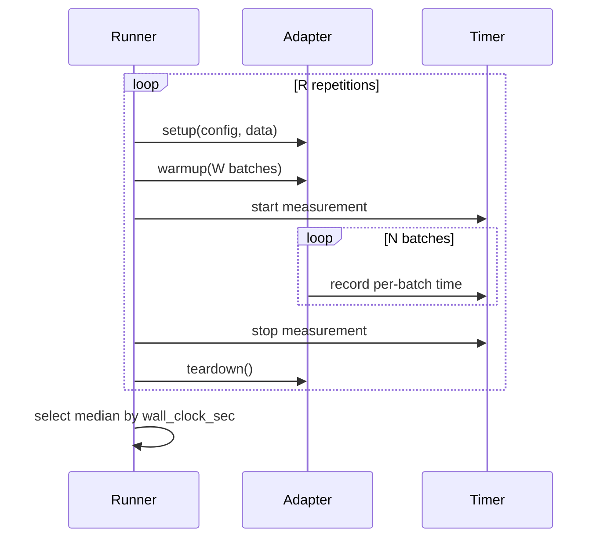

# Benchmark Methodology

This page summarizes the measurement methodology used in the Datarax benchmark suite.

## Timing Protocol

All benchmarks use `time.perf_counter()` for wall-clock measurement, with optional GPU synchronization barriers for accurate accelerator timing.



---

## Warmup Strategy

Warmup ensures JIT compilation, caching, and pipeline priming are excluded from measurements:

| Profile | Warmup Batches | Measurement Batches |
|---------|---------------|-------------------|
| CI CPU | 3 | 20 |
| GPU A100 | 8 | 50 |
| TPU v5e | 8 | 50 |

!!! note "Why warmup matters"
    JAX's XLA compiler JIT-compiles on first execution. Without warmup, the first batch includes compilation overhead that can be 100x slower than subsequent batches.

---

## Repetitions and Statistics

Each scenario runs multiple repetitions. The **median** result is selected to reduce sensitivity to outlier runs (cold caches, GC pauses, etc.).

Statistical analysis uses:

1.  **Coefficient of Variation (CV)**: Measurement stability check — CV < 10% required for publishable results
2.  **Bootstrap CI**: 95% confidence intervals via 1000 bootstrap resamples (`benchkit.bootstrap_ci`)
3.  **Threshold-based regression detection**: Direction-aware comparison against baseline (`benchkit.detect_regressions`). Default threshold is 5% — see [Dashboard & benchkit](dashboard.md#regression-detection) for details
4.  **Modified Z-score**: Outlier detection using MAD-based robust statistics

---

## Fairness Principles

1.  **Same data**: All frameworks process identical synthetic datasets
2.  **Same hardware**: All frameworks run on the same machine in sequence
3.  **Cache clearing**: JAX caches, Python GC, and CUDA memory cleared between framework runs
4.  **Supported scenarios only**: Each framework runs only the scenarios it supports (no penalty for missing features)
5.  **Equal transforms**: Each adapter implements the same transforms required by a scenario (e.g., CV-1 requires Normalize + CastToFloat32). Adapters that cannot implement a scenario's transforms are excluded from that scenario rather than measured with less work

---

## Scenario Categories

| Category | IDs | What It Measures |
|----------|-----|-----------------|
| Computer Vision | CV-1, CV-2, CV-3, CV-4 | Image loading + augmentation throughput |
| NLP | NLP-1, NLP-2 | Tokenization pipeline throughput |
| Tabular | TAB-1, TAB-2 | Structured data loading |
| Multimodal | MM-1, MM-2 | Multi-modal data interleaving |
| Pipeline Complexity | PC-1 to PC-5 | DAG depth, branching, caching |
| I/O Patterns | IO-1, IO-2, IO-3, IO-4 | Sequential vs random, streaming, caching |
| Distributed | DIST-1, DIST-2 | Multi-device sharding and mesh config |
| Production | PR-1, PR-2 | Checkpointing, determinism |
| Datarax Unique | NNX-1, XFMR-1 | Flax NNX integration, JIT+vmap acceleration |

---

## Stability Validation

Before publishing results, the `StabilityValidator` checks that all measurements have CV < 10%. Unstable scenarios are flagged for additional repetitions.

```python
from benchmarks.analysis.stability import StabilityValidator
from benchmarks.runners.full_runner import ComparativeResults

results = ComparativeResults.load("benchmark-data/reports/latest")
validator = StabilityValidator(cv_threshold=0.10)
report = validator.validate(results)

print(f"Stable: {report.stable_count}/{report.total_results}")
for sid, adapter, cv in report.unstable_scenarios:
    print(f"  UNSTABLE: {sid}/{adapter} CV={cv:.2%}")
```
