# Example Documentation Design Framework

> **Purpose**: Establish unified standards for creating educational examples and tutorials
> for the Datarax data pipeline library.

---

## Table of Contents

1. [Executive Summary](#1-executive-summary)
2. [Design Philosophy](#2-design-philosophy)
3. [Documentation Architecture](#3-documentation-architecture)
4. [Documentation Location Strategy](#4-documentation-location-strategy)
5. [Dual-Format Implementation](#5-dual-format-implementation)
6. [Output Capture Requirements](#6-output-capture-requirements)
7. [Framework Migration Guides](#7-framework-migration-guides)
8. [Content Principles](#8-content-principles)
9. [Visual Design System](#9-visual-design-system)
10. [Documentation Tiers](#10-documentation-tiers)
11. [Component Library](#11-component-library)
12. [Writing Guidelines](#12-writing-guidelines)
13. [Code Example Standards](#13-code-example-standards)
14. [Implementation Workflow](#14-implementation-workflow)
15. [Quality Checklist](#15-quality-checklist)
16. [Examples Demonstrating Principles](#16-examples-demonstrating-principles)
17. [Maintenance & Updates](#17-maintenance-updates)
18. [Quick Reference Summary](#18-quick-reference-summary)

---

## 1. Executive Summary

### Purpose

This document defines complete standards for documenting Datarax examples and
tutorials. It ensures consistent, high-quality educational content that serves users
from first-time learners to production ML engineers building distributed data pipelines.

### Three Core Objectives

| Objective | Description |
|-----------|-------------|
| **Educational Excellence** | Clear explanations with measurable learning outcomes for data pipeline concepts |
| **Visual Appeal** | Beautiful, consistent presentation using Material for MkDocs |
| **Practical Utility** | Copy-paste ready code that runs successfully with real data |

### Three Documentation Tiers


---

## 2. Design Philosophy

### Five Core Principles

These principles guide every documentation decision in Datarax:

#### 2.1 Progressive Disclosure

**Start simple, add complexity gradually.**

Users should be able to build a working pipeline with minimal code, then progressively
add operators, sharding, checkpointing, and monitoring as they understand each concept.

```python
# Level 1: Minimal viable pipeline (3 lines)
from datarax import from_source
from datarax.sources import MemorySource, MemorySourceConfig

pipeline = from_source(MemorySource(MemorySourceConfig(), data=data, rngs=nnx.Rngs(0)))

# Level 2: Add operators
pipeline = from_source(source, batch_size=32).add(OperatorNode(normalizer))

# Level 3: Add monitoring
pipeline = (
    from_source(source, batch_size=32)
    .add(OperatorNode(normalizer))
    .add(OperatorNode(augmenter))
)
# Then add callbacks for metrics collection

# Level 4: Add sharding for distributed execution
with Mesh(devices, axis_names=("data",)):
    for batch in pipeline:
        sharded_batch = jax.device_put(batch, sharding)
```

**Application in Documentation**:

- Quick Reference shows Level 1-2 only
- Tutorials progress through Level 1-3
- Advanced Guides cover Level 3-4 with production considerations

#### 2.2 Learning by Doing

**Every concept has runnable pipeline code.**

Theory sections should be concise. Users learn data pipelines by building pipelines,
not by reading about them. Every theoretical concept should be immediately followed
by executable code.

`````markdown
<!-- Theory (brief) -->
## Understanding Batch Dimensions

Datarax operates on dictionary-based data where each key maps to an array.
The first dimension is always the sample dimension, which becomes the batch
dimension after the batcher processes data.

<!-- Practice (immediate) -->
## Try It: Creating Batched Data

```python
# Create sample data - first dimension is samples
data = {
    "image": np.random.rand(1000, 28, 28, 1).astype(np.float32),
    "label": np.random.randint(0, 10, (1000,)).astype(np.int32),
}

# After batching, first dimension becomes batch
pipeline = from_source(source, batch_size=32)
for batch in pipeline:
    print(f"Batch dimension: {batch['image'].shape[0]}")  # 32
    break
```
`````

#### 2.3 Multiple Learning Paths

**Different users have different needs.**

| User Type | Needs | Best Tier |
|-----------|-------|-----------|
| Experienced ML engineer | Quick syntax reminder | Tier 1 Quick Reference |
| First-time Datarax user | Guided learning path | Tier 2 Tutorial |
| Production engineer | Optimization, scaling | Tier 3 Advanced Guide |
| Researcher exploring | Conceptual understanding | Tier 2 with theory focus |

**Documentation should support all paths without forcing users through unnecessary content.**

#### 2.4 Beautiful and Functional

**Visual design serves learning, not decoration.**

Good visual design reduces cognitive load and helps users understand relationships
between concepts. Datarax documentation uses Material for MkDocs features purposefully:

| Element | Purpose | Example Usage |
|---------|---------|---------------|
| Cards | Group related quick-start options | Example overview page |
| Callouts | Highlight important information | Warnings about memory requirements |
| Tables | Compare options or show specifications | Operator parameters |
| Code blocks | Executable examples with highlighting | All code examples |
| Mermaid diagrams | Show data flow and architecture | Pipeline DAG visualization |

#### 2.5 Trust Through Transparency

**Users should know exactly what to expect.**

Every example should clearly communicate:

- **Runtime estimate**: "~5 min (CPU) / ~2 min (GPU)"
- **Memory requirements**: "~2 GB RAM, ~4 GB VRAM for large datasets"
- **Prerequisites**: Links to required background knowledge
- **Device compatibility**: CPU/GPU/TPU support status
- **Expected output**: Comments showing what users will see

```python
# Expected output:
# Source contains 1000 samples
# Batch 0: image=(32, 28, 28, 1), label=(32,)
# Batch 1: image=(32, 28, 28, 1), label=(32,)
```

---

## 3. Documentation Architecture

### Three-Tier System Overview

```mermaid
flowchart TB
    subgraph journey["USER DOCUMENTATION JOURNEY"]
        direction TB

        subgraph tiers[" "]
            direction LR

            subgraph t1["TIER 1: Quick Ref"]
                t1info["5-10 min • Single topic • Copy-paste"]
                t1ex["Examples:<br/>• Simple Pipeline<br/>• HF Quick Ref<br/>• TFDS Quick Ref"]
            end

            subgraph t2["TIER 2: Tutorial"]
                t2info["30-60 min • Multiple topics"]
                t2ex["Examples:<br/>• Pipeline Tutorial<br/>• Operators Tutorial<br/>• HF Deep Dive"]
            end

            subgraph t3["TIER 3: Advanced"]
                t3info["60+ min • Production patterns"]
                t3ex["Examples:<br/>• Sharding Guide<br/>• Checkpoint Recovery<br/>• Performance Tuning"]
            end

            t1 --> t2 --> t3
        end

        subgraph api["API REFERENCE"]
            apiinfo["Full documentation of all modules, classes, functions"]
        end

        t1 --> api
        t2 --> api
        t3 --> api
    end

    style t1 fill:#e3f2fd,stroke:#1976d2
    style t2 fill:#fff3e0,stroke:#f57c00
    style t3 fill:#fce4ec,stroke:#c2185b
    style api fill:#e8f5e9,stroke:#388e3c
```



### When to Use Each Tier

| Scenario | Recommended Tier | Rationale |
|----------|------------------|-----------|
| "How do I load HuggingFace datasets?" | Tier 1 | Single concept, quick answer |
| "Never used Datarax before" | Tier 2 | Needs guided introduction |
| "How do I shard data across TPUs?" | Tier 3 | Complex production topic |
| "What operators are available?" | Tier 2 | Overview of multiple concepts |
| "How do I debug pipeline OOM errors?" | Tier 3 | Requires deep understanding |

### User Journey Through Documentation


---

## 4. Documentation Location Strategy

### Directory Structure

Datarax separates documentation from code, following a clean pattern where markdown
files in `docs/examples/` explain and link to runnable code in `examples/`:

```text
datarax/
├── docs/
│   └── examples/
│       ├── overview.md                      # Entry point with cards
│       ├── core/
│       │   ├── simple-pipeline.md           # Docs for simple pipeline
│       │   ├── pipeline-tutorial.md         # Docs for pipeline tutorial
│       │   ├── operators-tutorial.md        # Docs for operators tutorial
│       │   ├── cifar10-quickref.md          # Docs for CIFAR-10 quick ref
│       │   ├── augmentation-quickref.md     # Docs for augmentation quick ref
│       │   ├── mnist-tutorial.md            # Docs for MNIST tutorial
│       │   ├── fashion-augmentation-tutorial.md
│       │   ├── composition-strategies-tutorial.md
│       │   └── advanced-operators-tutorial.md
│       │
│       ├── integration/
│       │   ├── huggingface/
│       │   │   ├── hf-quickref.md           # Docs for HF quick reference
│       │   │   ├── hf-tutorial.md           # Docs for HF tutorial
│       │   │   └── imdb-quickref.md         # Docs for IMDB quick reference
│       │   ├── tfds/
│       │   │   └── tfds-quickref.md         # Docs for TFDS quick reference
│       │   └── arrayrecord/
│       │       └── arrayrecord-quickref.md  # Docs for ArrayRecord quick ref
│       │
│       └── advanced/
│           ├── augmentation/
│           │   └── mixup-cutmix-tutorial.md
│           ├── checkpointing/
│           │   ├── checkpoint-quickref.md
│           │   └── resumable-training-guide.md
│           ├── dag/
│           │   └── dag-fundamentals-guide.md
│           ├── distributed/
│           │   ├── sharding-quickref.md
│           │   └── sharding-guide.md
│           ├── monitoring/
│           │   └── monitoring-quickref.md
│           ├── multi_source/
│           │   └── interleaved-tutorial.md
│           ├── performance/
│           │   └── optimization-guide.md
│           ├── sampling/
│           │   └── sampling-tutorial.md
│           └── training/
│               └── e2e-cifar10-guide.md
│
├── examples/                                # Runnable code files
│   ├── README.md                            # Examples overview and guide
│   ├── _templates/
│   │   └── example_template.py              # Template for new examples
│   │
│   ├── core/
│   │   ├── 01_simple_pipeline.py            # Tier 1: Quick Reference
│   │   ├── 01_simple_pipeline.ipynb         # Generated notebook
│   │   ├── 02_pipeline_tutorial.py          # Tier 2: Tutorial
│   │   ├── 02_pipeline_tutorial.ipynb
│   │   ├── 03_operators_tutorial.py         # Tier 2: Deep dive
│   │   ├── 03_operators_tutorial.ipynb
│   │   ├── 04_cifar10_quickref.py           # Tier 1: CIFAR-10
│   │   ├── 04_cifar10_quickref.ipynb
│   │   ├── 05_augmentation_quickref.py      # Tier 1: Augmentation
│   │   ├── 05_augmentation_quickref.ipynb
│   │   ├── 06_mnist_tutorial.py             # Tier 2: MNIST
│   │   ├── 06_mnist_tutorial.ipynb
│   │   ├── 07_fashion_augmentation_tutorial.py  # Tier 2: Fashion-MNIST
│   │   ├── 07_fashion_augmentation_tutorial.ipynb
│   │   ├── 08_composition_strategies_tutorial.py
│   │   ├── 08_composition_strategies_tutorial.ipynb
│   │   ├── 09_advanced_operators_tutorial.py
│   │   └── 09_advanced_operators_tutorial.ipynb
│   │
│   ├── integration/
│   │   ├── huggingface/
│   │   │   ├── 01_hf_quickref.py
│   │   │   ├── 01_hf_quickref.ipynb
│   │   │   ├── 02_hf_tutorial.py
│   │   │   ├── 02_hf_tutorial.ipynb
│   │   │   ├── 03_imdb_quickref.py          # Tier 1: IMDB text
│   │   │   └── 03_imdb_quickref.ipynb
│   │   ├── tfds/
│   │   │   ├── 01_tfds_quickref.py
│   │   │   └── 01_tfds_quickref.ipynb
│   │   └── arrayrecord/
│   │       ├── 01_arrayrecord_quickref.py
│   │       └── 01_arrayrecord_quickref.ipynb
│   │
│   ├── advanced/
│   │   ├── augmentation/
│   │   │   ├── 01_mixup_cutmix_tutorial.py  # Tier 2: Batch mixing
│   │   │   └── 01_mixup_cutmix_tutorial.ipynb
│   │   ├── checkpointing/
│   │   │   ├── 01_checkpoint_quickref.py
│   │   │   ├── 01_checkpoint_quickref.ipynb
│   │   │   ├── 02_resumable_training_guide.py  # Tier 3: Resumable
│   │   │   └── 02_resumable_training_guide.ipynb
│   │   ├── dag/
│   │   │   ├── 01_dag_fundamentals_guide.py
│   │   │   └── 01_dag_fundamentals_guide.ipynb
│   │   ├── distributed/
│   │   │   ├── 01_sharding_quickref.py
│   │   │   ├── 01_sharding_quickref.ipynb
│   │   │   ├── 02_sharding_guide.py         # Tier 3: Distributed
│   │   │   └── 02_sharding_guide.ipynb
│   │   ├── monitoring/
│   │   │   ├── 01_monitoring_quickref.py
│   │   │   └── 01_monitoring_quickref.ipynb
│   │   ├── multi_source/
│   │   │   ├── 01_interleaved_tutorial.py   # Tier 2: Multi-source
│   │   │   └── 01_interleaved_tutorial.ipynb
│   │   ├── performance/
│   │   │   ├── 01_optimization_guide.py     # Tier 3: Performance
│   │   │   └── 01_optimization_guide.ipynb
│   │   ├── sampling/
│   │   │   ├── 01_sampling_tutorial.py
│   │   │   └── 01_sampling_tutorial.ipynb
│   │   └── training/
│   │       ├── 01_e2e_cifar10_guide.py      # Tier 3: End-to-end
│   │       └── 01_e2e_cifar10_guide.ipynb
│   │
│   └── utils/                               # Shared utilities
│       ├── __init__.py
│       └── sample_data.py
│
├── benchmarks/                              # Standalone benchmark scripts
│   ├── mnist_pipeline_benchmark.py
│   ├── distributed_scaling_benchmark.py
│   └── performance_sweep_benchmark.py
│
└── mkdocs.yml                               # Navigation configuration
```

### File Naming Conventions

| Location | Pattern | Example |
|----------|---------|---------|
| `docs/examples/` | `kebab-case.md` | `simple-pipeline.md` |
| `examples/` | `NN_snake_case.py` | `01_simple_pipeline.py` |
| `examples/` | `NN_snake_case.ipynb` | `01_simple_pipeline.ipynb` |

### Relationship Between `docs/examples/` and `examples/`

```text
docs/examples/               # Documentation (markdown files)
    └── core/
        └── simple-pipeline.md     # Explains the example, links to code

examples/                    # Runnable code (Python + Jupyter)
    └── core/
        ├── 01_simple_pipeline.py      # Source file with Jupytext markers
        └── 01_simple_pipeline.ipynb   # Generated notebook
```

**Key Principle**: Documentation and code are separated. Markdown files in
`docs/examples/` explain concepts and link to the actual code in `examples/`.

### Documentation Page Structure

Each markdown file in `docs/examples/` follows this pattern:

`````markdown
# Simple Pipeline Example

**Level:** Beginner | **Runtime:** ~5 min | **Format:** Python + Jupyter

## Overview

[Description of what this example demonstrates]

## What You'll Learn

- [Learning goal 1]
- [Learning goal 2]
- [Learning goal 3]

## Files

- **Python Script**: [`examples/core/01_simple_pipeline.py`](https://github.com/avitai/datarax/blob/main/examples/core/01_simple_pipeline.py)
- **Jupyter Notebook**: [`examples/core/01_simple_pipeline.ipynb`](https://github.com/avitai/datarax/blob/main/examples/core/01_simple_pipeline.ipynb)

## Quick Start

### Run the Python Script

```bash
python examples/core/01_simple_pipeline.py
```

### Run the Jupyter Notebook

```bash
jupyter lab examples/core/01_simple_pipeline.ipynb
```

## Key Concepts

[Explanation of concepts demonstrated in this example]

## Example Code

```python
[Key code snippets from the example]
```

## Next Steps

- [Link to related example]
- [Link to API reference]
`````

**Guidelines**:

- `docs/examples/` contains **markdown files only** that explain examples
- `examples/` contains **all runnable code** (`.py` and `.ipynb` files)
- Markdown files link to code via GitHub URLs for easy navigation
- The `.py` file is the source of truth; `.ipynb` is generated via Jupytext
- Keep documentation and code in sync when making changes

---

## 5. Dual-Format Implementation

### Philosophy

Datarax examples use a **dual-format approach**:

1. **Python scripts (`.py`)** as the source of truth
2. **Jupyter notebooks (`.ipynb`)** generated automatically via Jupytext

This ensures code is:

- Version-controllable (clean diffs in `.py` files)
- IDE-friendly (full Python tooling support)
- Interactive (Jupyter for exploration)
- Consistent (single source, two formats)

### Jupytext Header Format

Every Python example file MUST include a Jupytext header:

```python
# ---
# jupyter:
#   jupytext:
#     formats: py:percent,ipynb
#     text_representation:
#       extension: .py
#       format_name: percent
#       format_version: '1.3'
# ---
```

### Cell Marker Format

```python
# %% [markdown]
"""
# Title of Section

Markdown content goes here with **formatting**, `code`, and lists:

- Item 1
- Item 2
"""

# %%
# Python code cell
import datarax
print("This is executable code")

# %% [markdown]
"""
## Another Markdown Section

More explanation here.
"""
```

### Best Practices for Dual-Format Examples

#### DO

```python
# %% [markdown]
"""
## Step 1: Create Data Source

We create a `MemorySource` to wrap our dictionary data.
"""

# %%
# Create source with config
source = MemorySource(MemorySourceConfig(), data=data, rngs=nnx.Rngs(0))
print(f"Source length: {len(source)}")
# Expected output:
# Source length: 1000
```

#### DON'T

```python
# Bad: Mixing markdown and code without cell markers
# This is an explanation (should be in markdown cell)
source = MemorySource(MemorySourceConfig(), data=data)

# Bad: Long inline comments instead of markdown
# This creates a source object which wraps our data dictionary
# and provides random number generators for reproducibility
# via the rngs parameter using Flax NNX...
```

### Conversion Workflow

```bash
# Convert Python script to notebook
python scripts/jupytext_converter.py py-to-nb examples/core/01_simple_pipeline.py

# Batch convert directory
python scripts/jupytext_converter.py batch-py-to-nb examples/core/

# Watch for changes and auto-convert
python scripts/jupytext_converter.py watch examples/
```

### Synchronization Checklist

Before committing example changes:

- [ ] Python file has Jupytext header
- [ ] Cell markers properly separate code and markdown
- [ ] Notebook is regenerated from Python source
- [ ] Both files are staged for commit
- [ ] Code runs successfully as both `.py` and `.ipynb`

---

## 6. Output Capture Requirements

### Purpose

Each markdown documentation file (`docs/examples/*.md`) MUST include captured outputs
for code examples. This ensures:

- **Reproducibility**: Users can verify their output matches expected behavior
- **Debugging**: Easier to identify when something goes wrong
- **Self-contained documentation**: No need to run code to understand results

### Terminal Output Capture

Every code block that produces output must be followed by the captured terminal output:

````markdown
```python
print(f"Data shape: {data['image'].shape}")
print(f"Label range: [{data['label'].min()}, {data['label'].max()}]")
```

**Terminal Output:**
```
Data shape: (1000, 28, 28, 1)
Label range: [0, 9]
```
````

**Guidelines:**

- Capture actual output from running the code
- Include all relevant print statements
- Show shapes, dtypes, and value ranges for verification
- For variable outputs, note the expected format: "Output varies by hardware"

### Visualization Capture

All plots, charts, and visual outputs must be saved and embedded:

**Saving visualizations:**

```python
import matplotlib.pyplot as plt

# Create visualization
fig, axes = plt.subplots(2, 4, figsize=(10, 5))
for i, ax in enumerate(axes.flat):
    ax.imshow(batch['image'][i, :, :, 0], cmap='gray')
    ax.set_title(f"Label: {batch['label'][i]}")
    ax.axis('off')
plt.tight_layout()

# Save at 150 DPI for documentation
plt.savefig('docs/assets/images/examples/cv-mnist-sample-grid.png', dpi=150, bbox_inches='tight')
plt.close()
```

**Embedding in markdown:**

```markdown

```

### Image Naming Conventions

Store all example images in `docs/assets/images/examples/` with consistent naming:

| Category | Prefix | Examples |
|----------|--------|----------|
| Computer Vision | `cv-` | `cv-mnist-sample-grid.png`, `cv-cifar-mixup-samples.png` |
| Performance | `perf-` | `perf-throughput-comparison.png`, `perf-memory-profile.png` |
| Distributed | `dist-` | `dist-sharding-batch-distribution.png` |
| End-to-End | `e2e-` | `e2e-training-curves.png`, `e2e-confusion-matrix.png` |
| Checkpointing | `checkpoint-` | `checkpoint-resume-validation.png` |

**Directory structure:**

```text
docs/assets/images/examples/
├── cv-mnist-sample-grid.png
├── cv-mnist-training-loss.png
├── cv-cifar-mixup-samples.png
├── cv-cifar-cutmix-samples.png
├── perf-throughput-comparison.png
├── perf-memory-profile.png
├── dist-sharding-batch-distribution.png
├── e2e-training-curves.png
└── checkpoint-resume-validation.png
```

### Output Requirements by Tier

| Tier | Terminal Output | Visualizations | Architecture Diagrams |
|------|-----------------|----------------|----------------------|
| Tier 1: Quick Reference | Required | 1-2 sample images | Optional |
| Tier 2: Tutorial | Required (each step) | 3-4 visualizations | 1 Mermaid diagram |
| Tier 3: Advanced Guide | Required | Performance plots, profiles | Architecture diagrams |

### Mermaid Diagrams

Use Mermaid for architecture and flow diagrams (renders in MkDocs):

````markdown

````

---

## 7. Framework Migration Guides

### Purpose

Many Datarax users migrate from PyTorch, TensorFlow, or Google Grain. Each example
should include "Coming from X?" sections that map familiar concepts to Datarax equivalents.

### Required Migration Sections

Each markdown documentation file should include comparison tables for relevant frameworks:

````markdown
## Coming from PyTorch?

If you're familiar with PyTorch DataLoader, here's how Datarax compares:

| PyTorch | Datarax |
|---------|---------|
| `DataLoader(dataset, batch_size=32)` | `from_source(source, batch_size=32)` |
| `TensorDataset(data)` | `MemorySource(config, data=data)` |
| `transforms.Compose([T1, T2])` | `pipeline.add(OperatorNode(op1)).add(OperatorNode(op2))` |
| `transforms.RandomHorizontalFlip(p=0.5)` | `ProbabilisticOperator(config, fn=flip, p=0.5)` |
| `for images, labels in loader:` | `for batch in pipeline:` (dict-based) |

**Key differences:**

1. **Dict-based batches**: Datarax uses `batch['image']` instead of tuple unpacking
2. **JAX arrays**: Output is `jax.Array`, not `torch.Tensor`
3. **Functional transforms**: Operators use pure functions with explicit PRNG keys

## Coming from TensorFlow?

| TensorFlow tf.data | Datarax |
|--------------------|---------|
| `tf.data.Dataset.from_tensor_slices(data)` | `MemorySource(config, data=data)` |
| `dataset.batch(32).prefetch(2)` | `from_source(source, batch_size=32)` |
| `dataset.map(transform_fn)` | `pipeline.add(OperatorNode(operator))` |
| `dataset.shuffle(buffer_size)` | `ShuffleSampler(config)` |
| `dataset.cache()` | `CachingNode()` in DAG |

## Coming from Google Grain?

| Grain | Datarax |
|-------|---------|
| `grain.ArrayRecordDataSource(paths)` | `ArrayRecordSourceModule(config, paths)` |
| `grain.MapDataset(source, transforms)` | `from_source(source).add(operators)` |
| `grain.DataLoader(dataset)` | `from_source(source, batch_size=N)` |
| Manual checkpointing | Built-in `get_state()` / `set_state()` |
````

### Framework Mapping Reference

Use this reference when creating migration sections:

#### Data Sources

| Concept | PyTorch | TensorFlow | Grain | Datarax |
|---------|---------|------------|-------|---------|
| In-memory data | `TensorDataset` | `from_tensor_slices` | `MapDataset` | `MemorySource` |
| HuggingFace | `torchvision.datasets` | N/A | `HuggingFaceDataset` | `HfDataSourceModule` |
| TFRecords/ArrayRecord | N/A | `TFRecordDataset` | `ArrayRecordDataSource` | `ArrayRecordSourceModule` |
| TFDS | N/A | `tfds.load()` | N/A | `TFDSEagerSource` |

#### Transformations

| Concept | PyTorch | TensorFlow | Datarax |
|---------|---------|------------|---------|
| Chained transforms | `transforms.Compose` | `Sequential` | `SequentialStrategy` |
| Random application | `RandomApply(p=0.5)` | Custom | `ProbabilisticOperator` |
| Random choice | `RandomChoice([t1, t2])` | Custom | `SelectorOperator` |
| MixUp/CutMix | `torchvision.transforms.v2.MixUp` | Custom | `BatchMixOperator` |

#### Sampling

| Concept | PyTorch | TensorFlow | Datarax |
|---------|---------|------------|---------|
| Sequential | `SequentialSampler` | Default order | `SequentialSamplerModule` |
| Shuffled | `RandomSampler` | `.shuffle()` | `ShuffleSampler` |
| Subset | `SubsetRandomSampler` | `.take()` | `RangeSampler` |
| Distributed | `DistributedSampler` | `tf.distribute` | `JaxProcessSharder` |

#### Distribution

| Concept | PyTorch | TensorFlow | Datarax |
|---------|---------|------------|---------|
| Multi-device | `DistributedDataParallel` | `tf.distribute.Strategy` | `Mesh` + `NamedSharding` |
| Data parallelism | `DistributedSampler` | `MirroredStrategy` | `JaxProcessSharder` |

### When to Include Migration Sections

| Example Category | Include PyTorch? | Include TensorFlow? | Include Grain? |
|------------------|------------------|---------------------|----------------|
| Core Pipeline | Yes | Yes | No |
| HuggingFace Integration | Yes | No | No |
| TFDS Integration | No | Yes | No |
| ArrayRecord Integration | No | No | Yes |
| Sampling | Yes | Yes | No |
| Distributed/Sharding | Yes | Yes | Yes |
| Operators/Transforms | Yes | Yes | No |

---

## 8. Content Principles

### The 7-Part Structure

Every Datarax example follows this structure, adapted by tier:


### Part 1: Header & Metadata

```markdown
# Simple Pipeline Quick Reference

| Metadata | Value |
|----------|-------|
| **Level** | Beginner |
| **Runtime** | ~5 min (CPU) / ~2 min (GPU) |
| **Prerequisites** | Basic Python, NumPy fundamentals |
| **Format** | Python + Jupyter |
| **Memory** | ~1 GB RAM |
```

**Metadata Fields**:

| Field | Required | Options/Format |
|-------|----------|----------------|
| Level | Yes | Beginner / Intermediate / Advanced |
| Runtime | Yes | ~X min (CPU) / ~Y min (GPU) |
| Prerequisites | Yes | Links to prior knowledge |
| Format | Yes | Python + Jupyter |
| Memory | Recommended | ~X GB RAM, ~Y GB VRAM |
| Devices | Optional | CPU / GPU / TPU |

### Part 2: Overview & Goals

```markdown
## Overview

This quick reference demonstrates building a basic data pipeline with Datarax.
You'll create an in-memory data source, apply transformations using operators,
and iterate through batched data—the core workflow for any Datarax pipeline.

## Learning Goals

By the end of this example, you will be able to:

1. Create a `MemorySource` from dictionary data
2. Build a pipeline using the DAG-based `from_source()` API
3. Apply deterministic and stochastic operators to data
4. Iterate through batched pipeline output
```

**Guidelines for Learning Goals**:

- Use action verbs: Create, Build, Implement, Configure, Debug, Optimize
- Be specific and measurable
- Limit to 3-5 goals per example
- Tier 1: 2-3 goals, Tier 2: 4-5 goals, Tier 3: 4-6 goals

### Part 3: Setup & Prerequisites

````markdown
## Setup

```bash
# Install datarax with data dependencies
uv pip install "datarax[data]"
```

**Estimated Time**: 5-10 minutes


```python
# %%
# Imports
import jax
import jax.numpy as jnp
import numpy as np
from flax import nnx

from datarax import from_source
from datarax.sources import MemorySource, MemorySourceConfig
from datarax.operators import ElementOperator, ElementOperatorConfig
```
````

### Part 4: Core Concepts (Tier 2-3)

For tutorials and advanced guides, include theoretical background:

````markdown
## Core Concepts

### The DAG Execution Model

Datarax pipelines are represented as Directed Acyclic Graphs (DAGs). Each node
in the graph is either:

- **DataSourceNode**: Entry point that yields raw data elements
- **OperatorNode**: Transforms data (normalization, augmentation, etc.)
- **BatcherNode**: Groups elements into batches for efficient processing


### Deterministic vs. Stochastic Operators

| Type | Behavior | Use Case |
|------|----------|----------|
| Deterministic | Same output every time | Normalization, type casting |
| Stochastic | Randomized via PRNG key | Augmentation, dropout |

````

### Part 5: Hands-On Implementation

This is the main content section with step-by-step code:

````markdown
## Implementation

### Step 1: Create Sample Data

Datarax works with dictionary-based data where each key maps to an array.
The first dimension is the sample dimension.

```python
# %%
# Create sample MNIST-like data
num_samples = 1000
data = {
    "image": np.random.randint(0, 255, (num_samples, 28, 28, 1)).astype(np.float32),
    "label": np.random.randint(0, 10, (num_samples,)).astype(np.int32),
}

print(f"Created data: image={data['image'].shape}, label={data['label'].shape}")
# Expected output:
# Created data: image=(1000, 28, 28, 1), label=(1000,)
```
````

### Part 6: Results & Evaluation

```markdown
## Results Summary

| Component | Description |
|-----------|-------------|
| Data Source | 1000 samples of 28x28 grayscale images |
| Batch Size | 32 samples per batch |
| Operators | Normalization (deterministic) + Flip (stochastic) |
| Output Range | [0.0, 1.0] after normalization |

### What We Achieved

- Created a functional data pipeline from scratch
- Applied both deterministic and stochastic transformations
- Verified output shapes and value ranges

### Interpretation

The pipeline processes data lazily—batches are only created when iterated.
This memory-efficient approach is essential for large-scale datasets.
```

### Part 7: Next Steps

```markdown
## Next Steps

### Try These Experiments

1. Increase `batch_size` to 64 and observe memory usage
2. Add a second stochastic operator (e.g., random rotation)
3. Replace `MemorySource` with `HuggingFaceSource`

### Related Examples

- [Operators Tutorial](operators-tutorial.md) - Deep dive into all operator types
- [HuggingFace Integration](../integration/huggingface/hf-quickref.md) - Load real datasets
- [Sharding](../advanced/distributed/sharding-quickref.md) - Multi-device distribution

### API Reference

- [`MemorySource`](../../sources/memory_source.md) - In-memory data wrapper
- [`ElementOperator`](../../operators/element_operator.md) - Per-element transformations
- [`from_source()`](../../core/module.md) - Pipeline builder function
```

---

## 9. Visual Design System

### Design Tokens

Datarax documentation uses Material for MkDocs with these design choices:

| Token | Value | Usage |
|-------|-------|-------|
| Primary Color | Indigo | Headers, links, emphasis |
| Accent Color | Amber | Interactive elements, highlights |
| Code Font | Roboto Mono | All code blocks |
| Text Font | Roboto | Body text, headers |

### Material Design Cards

Use cards for navigation and feature highlights:

````markdown
<div class="grid cards" markdown>

-   :material-rocket-launch:{ .lg .middle } **Simple Pipeline**

    ---

    Build your first data pipeline in 5 minutes

    [:octicons-arrow-right-24: Quick Reference](core/simple-pipeline.md)

-   :material-database:{ .lg .middle } **HuggingFace Integration**

    ---

    Load datasets from HuggingFace Hub

    [:octicons-arrow-right-24: Quick Reference](integration/huggingface/hf-quickref.md)

</div>
````

### Callout Boxes

Use admonitions for different information types:

```markdown
!!! note "Key Concept"
    Datarax pipelines are lazy—data is only loaded when iterated.

!!! tip "Performance Tip"
    Use `batch_size` that is a power of 2 for optimal GPU utilization.

!!! warning "Memory Warning"
    Large datasets with `MemorySource` load entirely into RAM.
    Consider using `HuggingFaceSource` for streaming.

!!! danger "Breaking Change"
    In v0.2.0, `from_source()` requires explicit `batch_size` parameter.

!!! example "Try It"
    Modify the `batch_size` parameter and observe throughput changes.

!!! info "Device Support"
    This example works on CPU, GPU, and TPU.
```

### Code Blocks

Always use syntax highlighting and copy buttons:

````markdown
```python title="Creating a Pipeline" linenums="1"
from datarax import from_source
from datarax.sources import MemorySource, MemorySourceConfig

# Create pipeline with custom batch size
pipeline = from_source(source, batch_size=32)
```
````

For code with annotations:

````markdown
```python
pipeline = from_source(source, batch_size=32)  # (1)!
```

1. The `batch_size` parameter controls how many samples are grouped together.
    Larger batches improve throughput but require more memory.
````

### Tables

Use tables for structured data:

```markdown
| Operator Type | Stochastic | Use Case |
|---------------|------------|----------|
| `ElementOperator` | Optional | Per-element transformations |
| `MapOperator` | No | Batch-level mapping |
| `CompositeOperator` | Optional | Chained operations |
```

### Mermaid Diagrams

For pipeline architecture visualization:

````markdown

````

### Pipeline Flow Diagrams

````markdown

````

---

## 10. Documentation Tiers

### Tier 1: Quick Reference

#### Specification

| Attribute | Value |
|-----------|-------|
| **Target Audience** | Experienced developers needing quick syntax lookup |
| **Length** | 100-200 lines of code |
| **Time to Complete** | 5-10 minutes |
| **Code/Explanation Ratio** | 70% code / 30% explanation |
| **Prerequisites** | Working Datarax knowledge |

#### Structure Template

````python
# ---
# jupyter:
#   jupytext:
#     formats: py:percent,ipynb
#     text_representation:
#       extension: .py
#       format_name: percent
#       format_version: '1.3'
# ---

# %% [markdown]
"""
# [Feature] Quick Reference

| Metadata | Value |
|----------|-------|
| **Level** | Beginner / Intermediate |
| **Runtime** | ~5 min |
| **Prerequisites** | [Basic Datarax](link) |
| **Format** | Python + Jupyter |

## Overview

[1-2 sentences describing the feature]

## Learning Goals

1. [Goal 1]
2. [Goal 2]
3. [Goal 3]
"""

# %% [markdown]
"""
## Setup

```bash
uv pip install datarax
```
"""

# %%
# Imports
from datarax import from_source
# ... minimal imports

# %% [markdown]
"""
## Quick Start

[Brief explanation]
"""

# %%
# Core functionality - copy-paste ready
# ... working code with expected output comments

# %% [markdown]
"""
## Common Patterns

### Pattern 1: [Name]
"""

# %%
# Pattern implementation

# %% [markdown]
"""
## Results Summary

| Metric | Value |
|--------|-------|
| [Metric] | [Value] |

## Next Steps

- [Related example](link)
- [API Reference](link)
"""


# %%
def main():
    """CLI execution entry point."""
    # Complete example that can be run standalone
    pass


if __name__ == "__main__":
    main()
````

#### Tier 1 Exemplar: Simple Pipeline Quick Reference

Reference: [`examples/core/01_simple_pipeline.py`](https://github.com/avitai/datarax/blob/main/examples/core/01_simple_pipeline.py)

This example demonstrates ideal Tier 1 structure:

- Concise metadata table
- Clear, measurable learning goals
- Minimal setup section
- Step-by-step implementation with expected outputs
- Results summary table
- Next steps with links

### Tier 2: Tutorial

#### Specification

| Attribute | Value |
|-----------|-------|
| **Target Audience** | First-time learners of a feature |
| **Length** | 300-600 lines |
| **Time to Complete** | 30-60 minutes |
| **Code/Explanation Ratio** | 50% code / 50% explanation |
| **Prerequisites** | Basic Datarax, relevant domain knowledge |

#### Structure Template

````python
# ---
# jupyter:
#   jupytext:
#     formats: py:percent,ipynb
#     text_representation:
#       extension: .py
#       format_name: percent
#       format_version: '1.3'
# ---

# %% [markdown]
"""
# [Feature] Tutorial

| Metadata | Value |
|----------|-------|
| **Level** | Intermediate |
| **Runtime** | ~30 min |
| **Prerequisites** | [Prerequisite 1](link), [Prerequisite 2](link) |
| **Format** | Python + Jupyter |
| **Memory** | ~2 GB RAM |

## Overview

[2-3 paragraphs explaining what this tutorial covers and why it matters]

## Learning Goals

1. [Conceptual goal - Understand X]
2. [Practical goal - Implement Y]
3. [Practical goal - Configure Z]
4. [Applied goal - Debug/Optimize W]
"""

# %% [markdown]
"""
## Prerequisites

### Required Knowledge

- [Prerequisite 1](link) - Brief description
- [Prerequisite 2](link) - Brief description

### Installation

```bash
uv pip install "datarax[data]"
```

### Environment Setup

[Any environment variables, device configuration, etc.]
"""

# %%
# Imports - organized by category
import jax
import numpy as np
from flax import nnx

# Datarax imports
from datarax import from_source
from datarax.sources import MemorySource, MemorySourceConfig
from datarax.operators import ElementOperator, ElementOperatorConfig

# %% [markdown]
"""
## Core Concepts

### Concept 1: [Name]

[Detailed explanation with theory]


### Concept 2: [Name]

[Explanation with examples]

| Type | Description | Use Case |
|------|-------------|----------|
| Type A | ... | ... |
| Type B | ... | ... |
"""

# %% [markdown]
"""
## Implementation

### Part 1: [First Major Section]

[Explanation of what this section builds and why]
"""

# %%
# Part 1 implementation
# ... code with inline comments

# %% [markdown]
"""
### Part 2: [Second Major Section]

[Explanation connecting to Part 1]
"""

# %%
# Part 2 implementation

# %% [markdown]
"""
### Part 3: [Integration/Advanced Usage]

[How the pieces fit together]
"""

# %%
# Combined implementation

# %% [markdown]
"""
## Troubleshooting

### Common Issue 1: [Error/Problem]

**Symptom**: [What the user sees]

**Cause**: [Why it happens]

**Solution**:
```python
# Fixed code
```

### Common Issue 2: [Error/Problem]

...
"""

# %% [markdown]
"""
## Results & Evaluation

### What We Achieved

[Summary of completed work]

### Key Metrics

| Metric | Value | Notes |
|--------|-------|-------|
| [Metric 1] | [Value] | [Context] |
| [Metric 2] | [Value] | [Context] |

### Interpretation

[What the results mean for real-world usage]
"""

# %% [markdown]
"""
## Next Steps

### Experiments to Try

1. [Experiment 1] - [Expected outcome]
2. [Experiment 2] - [Expected outcome]
3. [Experiment 3] - [Expected outcome]

### Related Tutorials

- [Tutorial Name](link) - [Brief description]
- [Tutorial Name](link) - [Brief description]

### API Reference

- [`ClassName`](link) - [Purpose]
- [`function_name()`](link) - [Purpose]

### Advanced Topics

- [Advanced Guide](link) - [When to use]
"""


# %%
def main():
    """Complete tutorial as a runnable script."""
    print("Running [Feature] Tutorial...")

    # Complete implementation combining all parts

    print("Tutorial completed successfully!")


if __name__ == "__main__":
    main()
````

### Tier 3: Advanced Guide

#### Specification

| Attribute | Value |
|-----------|-------|
| **Target Audience** | Production engineers, expert users |
| **Length** | 500-1000+ lines |
| **Time to Complete** | 60+ minutes |
| **Code/Explanation Ratio** | 40% code / 60% explanation |
| **Prerequisites** | Complete Tier 2 tutorials, production experience |

#### Structure Template

````python
# ---
# jupyter:
#   jupytext:
#     formats: py:percent,ipynb
#     text_representation:
#       extension: .py
#       format_name: percent
#       format_version: '1.3'
# ---

# %% [markdown]
"""
# [Advanced Topic] Guide

| Metadata | Value |
|----------|-------|
| **Level** | Advanced |
| **Runtime** | ~60+ min |
| **Prerequisites** | [Tutorial 1](link), [Tutorial 2](link), Production experience |
| **Format** | Python + Jupyter |
| **Memory** | ~8 GB RAM, ~16 GB VRAM recommended |
| **Devices** | GPU/TPU recommended |

## Overview

[Thorough overview of the advanced topic, including:
- What problem it solves
- When to use it (and when not to)
- Performance implications
- Production considerations]

## Learning Goals

1. [Architecture goal - Design X for production]
2. [Implementation goal - Build Y with proper error handling]
3. [Optimization goal - Tune Z for performance]
4. [Debugging goal - Diagnose and fix common issues]
5. [Integration goal - Combine with existing systems]
"""

# %% [markdown]
"""
## Architecture Overview

### System Design


### Key Components

| Component | Responsibility | Considerations |
|-----------|---------------|----------------|
| [Component 1] | [Role] | [Memory, performance, etc.] |
| [Component 2] | [Role] | [...] |

### Design Decisions

[Explain architectural choices and tradeoffs]
"""

# %% [markdown]
"""
## Prerequisites

### Required Knowledge

!!! warning "Advanced Content"
    This guide assumes familiarity with:

    - JAX device placement and sharding
    - Distributed systems concepts
    - Memory management for large-scale ML

### System Requirements

- **Hardware**: [Minimum and recommended specs]
- **Software**: [Versions, dependencies]
- **Configuration**: [Environment variables, settings]
"""

# %% Implementation sections follow...

# %% [markdown]
"""
## Performance Optimization

### Profiling

[How to identify bottlenecks]

### Optimization Strategies

| Strategy | When to Use | Expected Improvement |
|----------|-------------|---------------------|
| [Strategy 1] | [Condition] | [X% speedup] |
| [Strategy 2] | [Condition] | [Y% memory reduction] |

### Benchmarking

```python
# Benchmark code
```
"""

# %% [markdown]
"""
## Production Deployment

### Configuration

[Production-ready configuration examples]

### Monitoring

[What to monitor, alerting thresholds]

### Error Handling

[How to handle failures gracefully]
"""

# %% [markdown]
"""
## Troubleshooting

### Issue: [Common Problem]

**Symptoms**:
- [Symptom 1]
- [Symptom 2]

**Diagnosis**:
```python
# Diagnostic code
```

**Resolution**:
```python
# Fix code
```

**Prevention**:
[How to prevent this issue]
"""
````

---

## 11. Component Library

### Reusable Documentation Components

These templates can be copied and adapted for new examples.

### Setup Section Template

```python
# %% [markdown]
"""
## Setup

### Installation

```bash
# Basic installation
uv pip install datarax

# With data source support
uv pip install "datarax[data]"

# Development installation
uv pip install -e ".[dev]"
```

### Environment

````markdown
```bash
# Optional: Configure JAX for specific device
export JAX_PLATFORM_NAME=gpu  # or cpu, tpu
```

# %%

```python
# Imports - organized by source

# Standard library

from typing import Dict, Any

# Third-party

import jax
import jax.numpy as jnp
import numpy as np
from flax import nnx

# Datarax

from datarax import from_source
from datarax.sources import MemorySource, MemorySourceConfig
from datarax.operators import ElementOperator, ElementOperatorConfig
from datarax.dag.nodes import OperatorNode

# Verify setup

print(f"JAX version: {jax.__version__}")
print(f"Devices: {jax.devices()}")

```
````

### Learning Objectives Template

```markdown
## Learning Goals

By the end of this example, you will be able to:

1. **Create** [specific outcome with Datarax component]
2. **Configure** [settings/parameters for specific use case]
3. **Implement** [working code pattern]
4. **Debug** [common issues in this domain]
```

### Code Example Template

```python
# %% [markdown]
"""
### Step N: [Descriptive Title]

[1-2 sentences explaining what this step accomplishes and why it's needed]

!!! tip "Best Practice"
    [Optional tip for optimal implementation]
"""

# %%
# Step N: [Title]

# Configuration
config = SomeConfig(
    param1="value1",
    param2=42,
)

# Create component
component = SomeClass(config, rngs=nnx.Rngs(0))

# Use component
result = component.process(data)

# Verify
print(f"Result shape: {result.shape}")
print(f"Result range: [{result.min():.3f}, {result.max():.3f}]")

# Expected output:
# Result shape: (32, 28, 28, 1)
# Result range: [0.000, 1.000]
```

### Troubleshooting Template

````markdown
## Troubleshooting

### Error: `OutOfMemoryError` during pipeline iteration

**Symptom**: Pipeline crashes with OOM after processing several batches.

**Cause**: Data accumulating in memory due to missing garbage collection
or oversized batch configuration.

**Solution**:
```python
# Reduce batch size
pipeline = from_source(source, batch_size=16)  # Was 64

# Or enable explicit garbage collection
import gc
for i, batch in enumerate(pipeline):
    process(batch)
    if i % 100 == 0:
        gc.collect()
```

**Prevention**: Monitor memory usage during development with:

```python
import jax
print(f"Memory: {jax.devices()[0].memory_stats()}")
```

### Error: `KeyError: 'image'` when accessing batch

**Symptom**: Batch dictionary doesn't contain expected keys.

**Cause**: Field names don't match between source data and operator expectations.

**Solution**:

```python
# Check available keys
for batch in pipeline:
    print(f"Keys: {batch.keys()}")
    break

# Ensure operator uses correct field names
def normalize(element, key=None):
    # Use actual key from your data
    return element.update_data({"features": element.data["features"] / 255.0})
```

````

### Summary Template

```markdown
## Results Summary

### What We Achieved

- ✅ [Accomplishment 1]
- ✅ [Accomplishment 2]
- ✅ [Accomplishment 3]

### Key Metrics

| Metric | Value | Notes |
|--------|-------|-------|
| Throughput | ~1000 samples/sec | On single GPU |
| Memory Usage | ~2 GB | Peak during iteration |
| Batch Latency | ~10ms | Average per batch |

### Pipeline Configuration

| Parameter | Value | Impact |
|-----------|-------|--------|
| `batch_size` | 32 | Balance of throughput and memory |
| Operators | 2 | Normalize + Augment |
| Stochastic | Yes | Random augmentations each epoch |
```

### Next Steps Template

```markdown
## Next Steps

### Experiments to Try

1. **Increase batch size**: Try `batch_size=64` and monitor GPU memory
2. **Add operators**: Chain additional augmentation operators
3. **Switch data source**: Replace `MemorySource` with `HuggingFaceSource`

### Related Examples

| Example | Level | What You'll Learn |
|---------|-------|-------------------|
| [Operators Tutorial](link) | Intermediate | All operator types and patterns |
| [HuggingFace Integration](link) | Beginner | Loading real datasets |
| [Sharding Guide](link) | Advanced | Multi-device distribution |

### API Reference

- [`from_source()`](../../core/module.md) - Pipeline builder
- [`MemorySource`](../../sources/memory_source.md) - In-memory data
- [`ElementOperator`](../../operators/element_operator.md) - Transformations

### External Resources

- [JAX Documentation](https://jax.readthedocs.io/) - JAX fundamentals
- [Flax NNX Guide](https://flax.readthedocs.io/) - NNX patterns
```

---

## 12. Writing Guidelines

### Voice and Tone

#### Educational

Write to teach, not to impress. Assume intelligence but not prior knowledge.

```markdown
<!-- Good -->
Operators transform data elements. There are two types:
deterministic (same output every time) and stochastic
(randomized using PRNG keys).

<!-- Avoid -->
The operator abstraction leverages functional composition
paradigms to enable deterministic and stochastic transformations
over data elements within the pipeline execution graph.
```

#### Encouraging

Acknowledge difficulty while providing clear paths forward.

```markdown
<!-- Good -->
Distributed sharding can be complex. Let's start with a simple
two-device setup before scaling to larger meshes.

<!-- Avoid -->
This is trivial for anyone familiar with JAX sharding.
```

#### Specific

Provide concrete numbers, not vague descriptions.

```markdown
<!-- Good -->
- Runtime: ~5 min on CPU, ~2 min on GPU
- Memory: ~2 GB RAM, ~4 GB VRAM
- Throughput: ~1000 samples/second on V100

<!-- Avoid -->
- This runs quickly
- Requires moderate memory
- High throughput
```

#### Active Voice

Use active voice for clearer instructions.

```markdown
<!-- Good -->
Create a MemorySource to wrap your data.
The pipeline processes batches lazily.

<!-- Avoid -->
A MemorySource should be created for data wrapping.
Batches are processed lazily by the pipeline.
```

### Grammar and Style

| Rule | Example |
|------|---------|
| Capitalize proper nouns | "Datarax", "JAX", "NumPy" |
| Use code formatting for code | "`from_source()`", "`MemorySource`" |
| Use present tense | "The operator transforms" not "will transform" |

### Technical Terms

#### Datarax-Specific Terminology

| Term | Definition | Usage |
|------|------------|-------|
| Pipeline | Complete data processing graph | "Build a pipeline with `from_source()`" |
| DAG | Directed Acyclic Graph of operations | "The pipeline DAG executes lazily" |
| Source | Data origin (MemorySource, HuggingFaceSource) | "Create a source from your data" |
| Operator | Data transformation node | "Add operators to transform batches" |
| Element | Single data sample before batching | "Operators process elements individually" |
| Batch | Group of elements | "Pipeline yields batches of size 32" |
| Stochastic | Random operation using PRNG | "Stochastic operators need `rngs`" |

#### Code Comment Standards

```python
# Good: Explain WHY, not WHAT
# Use power-of-2 batch size for optimal GPU memory alignment
batch_size = 32

# Good: Note non-obvious behavior
# Stochastic operators require explicit stream names for reproducibility
config = ElementOperatorConfig(stochastic=True, stream_name="augment")

# Avoid: Redundant comments
# Create a config object
config = ElementOperatorConfig()  # This is obvious
```

---

## 13. Code Example Standards

### Executable Code Philosophy

**All code in Datarax examples must be executable.**

- No pseudocode or placeholder syntax
- All imports must be real and available
- Expected outputs must match actual execution
- Examples should work on both CPU and GPU

### Code Organization Patterns

#### Import Organization

```python
# Standard library (alphabetical)
import gc
import time
from typing import Any, Dict

# Third-party (alphabetical)
import jax
import jax.numpy as jnp
import numpy as np
from flax import nnx

# Datarax core
from datarax import from_source
from datarax.core import DataSource, Operator

# Datarax submodules (alphabetical)
from datarax.dag.nodes import OperatorNode
from datarax.operators import ElementOperator, ElementOperatorConfig
from datarax.sources import MemorySource, MemorySourceConfig
```

#### Function Documentation

```python
def create_sample_data(
    num_samples: int = 1000,
    image_shape: tuple = (28, 28, 1),
) -> Dict[str, np.ndarray]:
    """Create sample data for pipeline demonstration.

    Args:
        num_samples: Number of samples to generate.
        image_shape: Shape of each image (H, W, C).

    Returns:
        Dictionary with 'image' and 'label' keys containing
        numpy arrays ready for pipeline processing.

    Example:
        >>> data = create_sample_data(100, (32, 32, 3))
        >>> data['image'].shape
        (100, 32, 32, 3)
    """
    return {
        "image": np.random.rand(num_samples, *image_shape).astype(np.float32),
        "label": np.random.randint(0, 10, (num_samples,)).astype(np.int32),
    }
```

### Configuration Examples

```python
# Explicit, documented configuration
source_config = MemorySourceConfig(
    # No specific config needed for MemorySource
)

# Operator configuration with explanation
operator_config = ElementOperatorConfig(
    stochastic=True,           # Enable random transformations
    stream_name="augment",     # Named stream for reproducibility
)

# Pipeline configuration
PIPELINE_CONFIG = {
    "batch_size": 32,          # Samples per batch
    "drop_last": False,        # Include partial final batch
    "prefetch": 2,             # Batches to prefetch
}
```

### Visualization Code Standards

When creating visualizations for metrics or pipeline outputs:

```python
# %% [markdown]
"""
## Visualizing Pipeline Throughput

Monitor performance with timing measurements.
"""

# %%
import time

def measure_throughput(pipeline, num_batches: int = 100) -> Dict[str, float]:
    """Measure pipeline throughput.

    Args:
        pipeline: Datarax pipeline to benchmark.
        num_batches: Number of batches to process.

    Returns:
        Dictionary with timing metrics.
    """
    # Warmup
    for i, batch in enumerate(pipeline):
        if i >= 5:
            break

    # Measurement
    start = time.perf_counter()
    samples = 0

    for i, batch in enumerate(pipeline):
        if i >= num_batches:
            break
        samples += batch["image"].shape[0]

        # Force computation
        _ = batch["image"].block_until_ready()

    elapsed = time.perf_counter() - start

    return {
        "total_samples": samples,
        "elapsed_seconds": elapsed,
        "samples_per_second": samples / elapsed,
        "batches_per_second": num_batches / elapsed,
    }

# Run benchmark
metrics = measure_throughput(pipeline)
print(f"Throughput: {metrics['samples_per_second']:.0f} samples/sec")

# Expected output (varies by hardware):
# Throughput: 15000 samples/sec
```

---

## 14. Implementation Workflow

### Four-Step Development Process

```mermaid
flowchart TB
    P1["📋 <b>STEP 1: PLANNING</b><br/>• Identify audience & tier<br/>• Define learning objectives<br/>• Outline sections<br/>• List prerequisites"]
    P2["✍️ <b>STEP 2: CONTENT</b><br/>• Write setup section<br/>• Implement code + outputs<br/>• Add markdown explanations<br/>• Include troubleshooting"]
    P3["✨ <b>STEP 3: ENHANCE</b><br/>• Add diagrams & tables<br/>• Include metrics<br/>• Write next steps<br/>• Create main()"]
    P4["🔍 <b>STEP 4: REVIEW</b><br/>• Execute end-to-end<br/>• Verify outputs<br/>• Test CPU/GPU<br/>• Generate notebook<br/>• Peer review"]

    P1 --> P2 --> P3 --> P4

    style P1 fill:#e1f5fe,stroke:#01579b
    style P2 fill:#f3e5f5,stroke:#4a148c
    style P3 fill:#e8f5e9,stroke:#1b5e20
    style P4 fill:#fff3e0,stroke:#e65100
```



### Step 1: Planning

Before writing any code, answer these questions:

1. **Who is the audience?**
    - [ ] First-time Datarax user
    - [ ] Developer familiar with basics
    - [ ] Production engineer
    - [ ] Researcher/data scientist

2. **What tier is appropriate?**
    - [ ] Tier 1: Quick Reference (single concept, <10 min)
    - [ ] Tier 2: Tutorial (guided learning, 30-60 min)
    - [ ] Tier 3: Advanced Guide (production, 60+ min)

3. **What are the learning objectives?**
    - List 3-5 specific, measurable outcomes
    - Use action verbs: Create, Build, Configure, Debug, Optimize

4. **What prerequisites are required?**
    - List prior examples users should complete
    - Note required domain knowledge

### Step 2: Content Creation

1. **Start with the setup section**
    - Verify installation commands work
    - Test imports in clean environment

2. **Build implementation incrementally**
    - Each step should be runnable independently
    - Add expected output comments after each code block
    - Use clear variable names and documentation

3. **Write explanations as you go**
    - Don't wait until the end to add markdown
    - Connect each step to the learning objectives

### Step 3: Enhancement

1. **Visual elements**
    - Add Mermaid diagrams for architecture
    - Use tables for configuration options
    - Include callout boxes for important notes

2. **Performance data**
    - Measure and report actual metrics
    - Note hardware used for benchmarks
    - Include memory usage estimates

3. **Navigation**
    - Link to related examples
    - Reference API documentation
    - Suggest experiments to try

### Step 4: Review & Testing

Use the quality checklist in Section 15.

---

## 15. Quality Checklist

### Pre-Submission Checklist

Use this checklist before submitting new examples or updates.

#### Content Quality

- [ ] **Learning objectives are specific and measurable**
    - Uses action verbs (Create, Build, Configure)
    - 3-5 objectives for Tier 1-2, 4-6 for Tier 3
- [ ] **Code quality**
    - [ ] All code executes without errors
    - [ ] Imports are organized and all used
    - [ ] Variables have descriptive names
    - [ ] Functions have docstrings
    - [ ] Expected outputs are accurate
- [ ] **Explanations are clear**
    - [ ] Theory connects to practice
    - [ ] Technical terms are defined or linked
    - [ ] No unexplained jargon
- [ ] **Structure follows 7-part template**
    - [ ] Header & Metadata
    - [ ] Overview & Goals
    - [ ] Setup & Prerequisites
    - [ ] Core Concepts (if Tier 2-3)
    - [ ] Implementation
    - [ ] Results & Evaluation
    - [ ] Next Steps

#### Visual Quality

- [ ] **Consistent formatting**
    - [ ] Markdown cells properly formatted
    - [ ] Code blocks have syntax highlighting
    - [ ] Tables are properly aligned
- [ ] **Visual elements enhance understanding**
    - [ ] Diagrams are clear and readable
    - [ ] Callout boxes used appropriately
    - [ ] No walls of text

#### Functional Quality

- [ ] **All links work**
    - [ ] Internal links to other examples
    - [ ] Links to API documentation
    - [ ] External resource links
- [ ] **Reproducibility**
    - [ ] Random seeds are set where needed
    - [ ] Output is deterministic (or variation noted)
    - [ ] Works on both CPU and GPU
- [ ] **Troubleshooting included**
    - [ ] Common errors addressed
    - [ ] Solutions provided
    - [ ] Prevention tips included

#### Dual-Format Quality

- [ ] Jupytext header present
- [ ] Cell markers properly placed
- [ ] Notebook generates correctly
- [ ] Both formats execute successfully

#### Metadata Quality

- [ ] **All metadata fields complete**
    - [ ] Level (Beginner/Intermediate/Advanced)
    - [ ] Runtime estimates
    - [ ] Prerequisites with links
    - [ ] Format (Python + Jupyter)
    - [ ] Memory requirements (if applicable)

---

## 16. Examples Demonstrating Principles

### Progressive Disclosure Example

This shows how to structure information from simple to complex:

```python
# %% [markdown]
"""
## Building a Pipeline: Three Levels

### Level 1: Minimal Pipeline (Copy-Paste Ready)
"""

# %%
# Just 3 lines to get started
from datarax import from_source
from datarax.sources import MemorySource, MemorySourceConfig

data = {"x": np.random.rand(100, 10).astype(np.float32)}
pipeline = from_source(
    MemorySource(MemorySourceConfig(), data=data, rngs=nnx.Rngs(0)),
    batch_size=32,
)

for batch in pipeline:
    print(batch["x"].shape)  # (32, 10)
    break

# %% [markdown]
"""
### Level 2: Adding Operators (Building Complexity)
"""

# %%
# Add normalization
def normalize(element, key=None):
    return element.update_data({"x": element.data["x"] / element.data["x"].max()})

normalizer = ElementOperator(
    ElementOperatorConfig(stochastic=False),
    fn=normalize,
    rngs=nnx.Rngs(0),
)

pipeline = from_source(source, batch_size=32).add(OperatorNode(normalizer))

# %% [markdown]
"""
### Level 3: Production Configuration (Full Control)
"""

# %%
# Full production setup with monitoring, checkpointing, sharding
# ... (shown in advanced guides)
```

### Learning by Doing Example

Every concept is followed immediately by runnable code:

```python
# %% [markdown]
"""
## Stochastic Operators

Stochastic operators use random keys for reproducible randomization.
Each call with the same key produces the same output.

**Key Concept**: The `stream_name` parameter creates an independent
random stream, allowing different operators to have different random states.
"""

# %%
# Immediately apply the concept
def random_flip(element, key):
    """Randomly flip with 50% probability."""
    flip = jax.random.bernoulli(key, 0.5)
    return element.update_data({
        "x": jax.lax.cond(flip, lambda x: -x, lambda x: x, element.data["x"])
    })

# Note the stream_name parameter
config = ElementOperatorConfig(stochastic=True, stream_name="flip")
flipper = ElementOperator(config, fn=random_flip, rngs=nnx.Rngs(flip=42))

# Test reproducibility
pipeline1 = from_source(source, batch_size=8).add(OperatorNode(flipper))
pipeline2 = from_source(source, batch_size=8).add(OperatorNode(flipper))

batch1 = next(iter(pipeline1))
batch2 = next(iter(pipeline2))

print(f"Same random state: {np.allclose(batch1['x'], batch2['x'])}")
# Expected output:
# Same random state: True
```

### Show Expected Outputs Example

All code shows what users will see:

```python
# %%
# Create pipeline
pipeline = from_source(source, batch_size=32)

# Show iteration
print("Iterating through pipeline:")
for i, batch in enumerate(pipeline):
    if i >= 3:
        break
    print(f"  Batch {i}: shape={batch['image'].shape}, dtype={batch['image'].dtype}")

# Expected output:
# Iterating through pipeline:
#   Batch 0: shape=(32, 28, 28, 1), dtype=float32
#   Batch 1: shape=(32, 28, 28, 1), dtype=float32
#   Batch 2: shape=(32, 28, 28, 1), dtype=float32
```

---

## 17. Maintenance & Updates

### Review Schedule

| Review Type | Frequency | Scope |
|-------------|-----------|-------|
| Link check | Weekly (automated) | All internal/external links |
| Example execution | Monthly | Run all examples, verify outputs |
| Content review | Quarterly | Update for API changes |
| Full audit | Annually | Full restructure if needed |

### Version History Tracking

Each example should include a version comment:

```python
# %% [markdown]
"""
# Simple Pipeline Quick Reference

...

---

**Version History**:

- v1.0 (2024-01): Initial release
- v1.1 (2024-03): Updated for datarax 0.2.0 API changes
- v1.2 (2024-06): Added GPU memory considerations
"""
```

### Handling Breaking Changes

When Datarax APIs change:

1. **Update all affected examples** before release
2. **Add migration notes** to examples
3. **Update troubleshooting** for common upgrade issues
4. **Test both old and new patterns** during transition

```markdown
!!! warning "API Change in v0.2.0"
    The `from_source()` function now requires an explicit `batch_size` parameter.

    **Before (v0.1.x)**:
    ```python
    pipeline = from_source(source)  # Default batch_size=1
    ```

    **After (v0.2.0+)**:
    ```python
    pipeline = from_source(source, batch_size=32)  # Explicit required
    ```
```

### Community Contributions

#### Accepting Example Contributions

1. Contributor opens PR with new example
2. Review against quality checklist (Section 13)
3. Request changes if needed
4. Merge when all checks pass
5. Add contributor to acknowledgments

#### Example Contribution Template

Contributors should use the template at [`examples/_templates/example_template.py`](https://github.com/avitai/datarax/blob/main/examples/_templates/example_template.py)
as a starting point for new examples.

---

## 18. Quick Reference Summary

### Documentation Tiers at a Glance

| Tier | Time | Code % | Audience | Structure |
|------|------|--------|----------|-----------|
| 1: Quick Ref | 5-10 min | 70% | Experienced | Setup → Code → Results |
| 2: Tutorial | 30-60 min | 50% | Learners | Setup → Theory → Steps → Results |
| 3: Advanced | 60+ min | 40% | Production | Architecture → Implementation → Optimization |

### Essential Sections Checklist

Every example must include:

- [ ] Jupytext header
- [ ] Title and metadata table
- [ ] Learning objectives
- [ ] Setup with imports
- [ ] Implementation with expected outputs
- [ ] Results summary
- [ ] Next steps with links
- [ ] `main()` function for CLI

### Visual Elements Checklist

Consider including:

- [ ] Mermaid diagram for architecture
- [ ] Tables for options/configurations
- [ ] Callout boxes for important notes
- [ ] Code blocks with syntax highlighting
- [ ] Expected output comments

### Writing Checklist

- [ ] Active voice
- [ ] Specific metrics (not "fast" but "~1000 samples/sec")
- [ ] Code terms in backticks
- [ ] Links to related content
- [ ] Troubleshooting for common issues

### File Checklist

Before committing:

- [ ] Python file has Jupytext header
- [ ] All code executes successfully
- [ ] Expected outputs are accurate
- [ ] Notebook is generated and tested
- [ ] Links are valid
- [ ] Added to `mkdocs.yml` navigation

---

## Appendix: Existing Exemplars

These existing examples demonstrate the principles in this guide:

### Tier 1 Exemplars

| Example | Location | Demonstrates |
|---------|----------|--------------|
| Simple Pipeline | [`examples/core/01_simple_pipeline.py`](https://github.com/avitai/datarax/blob/main/examples/core/01_simple_pipeline.py) | Ideal quick reference structure |
| HuggingFace Quick Ref | [`examples/integration/huggingface/01_hf_quickref.py`](https://github.com/avitai/datarax/blob/main/examples/integration/huggingface/01_hf_quickref.py) | Integration quick reference |
| Sharding Quick Ref | [`examples/advanced/distributed/01_sharding_quickref.py`](https://github.com/avitai/datarax/blob/main/examples/advanced/distributed/01_sharding_quickref.py) | Advanced quick reference |

### Tier 2 Exemplars

| Example | Location | Demonstrates |
|---------|----------|--------------|
| Pipeline Tutorial | [`examples/core/02_pipeline_tutorial.py`](https://github.com/avitai/datarax/blob/main/examples/core/02_pipeline_tutorial.py) | Full tutorial format |
| Operators Tutorial | [`examples/core/03_operators_tutorial.py`](https://github.com/avitai/datarax/blob/main/examples/core/03_operators_tutorial.py) | Deep-dive tutorial |

### Template

| File | Purpose |
|------|---------|
| [`examples/_templates/example_template.py`](https://github.com/avitai/datarax/blob/main/examples/_templates/example_template.py) | Starting point for new examples |

### Documentation Pages

| Page | Location | Purpose |
|------|----------|---------|
| Examples Overview | [`docs/examples/overview.md`](../examples/overview.md) | Entry point with navigation cards |
| Simple Pipeline Docs | [`docs/examples/core/simple-pipeline.md`](../examples/core/simple-pipeline.md) | Documentation for simple pipeline |
