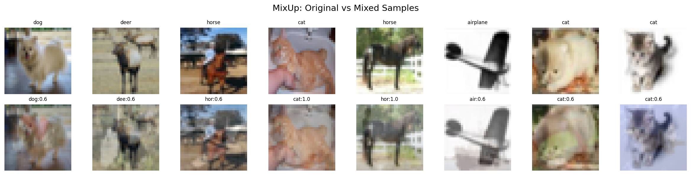
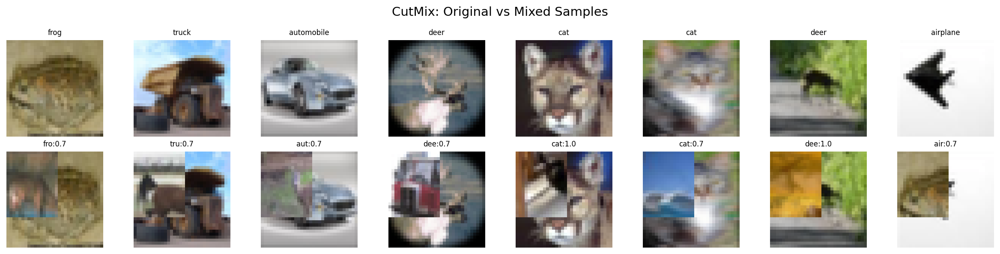
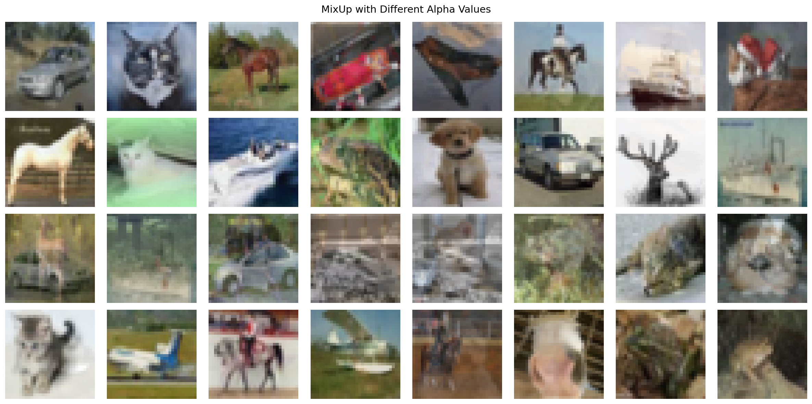
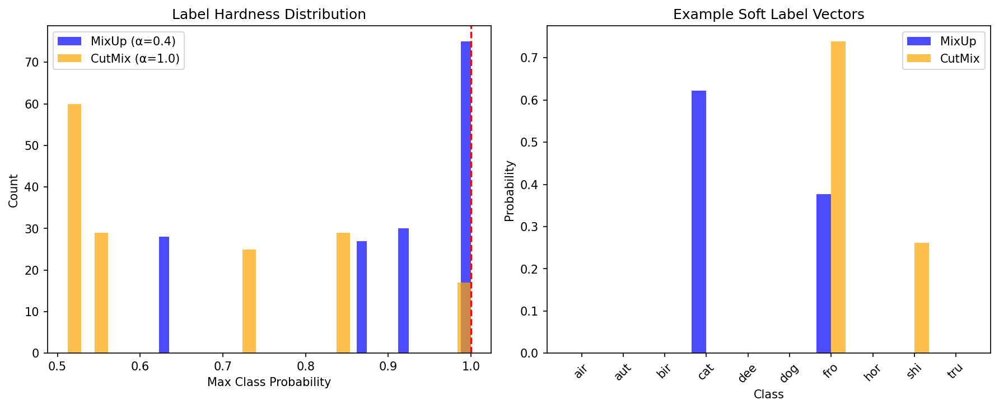

# MixUp and CutMix Augmentation Tutorial

| Metadata | Value |
|----------|-------|
| **Level** | Intermediate |
| **Runtime** | ~20 min |
| **Prerequisites** | [Operators Tutorial](../../core/operators-tutorial.md), [Augmentation basics](../../core/fashion-augmentation-tutorial.md) |
| **Format** | Python + Jupyter |

## Overview

MixUp and CutMix are powerful batch-level augmentation techniques that mix pairs of samples to create virtual training examples. Unlike element-level augmentations (rotation, brightness, noise), these require access to multiple samples simultaneously and produce soft labels for improved model calibration.

## What You'll Learn

1. Understand MixUp and CutMix augmentation techniques and their mathematical formulations
2. Use `BatchMixOperator` for both MixUp and CutMix modes
3. Understand soft label generation for mixed samples
4. Tune the alpha parameter to control mixing strength
5. Visualize mixed samples and label distributions
6. Compare MixUp vs CutMix trade-offs for different use cases

## Coming from PyTorch?

If you're familiar with PyTorch augmentations, here's how Datarax batch mixing compares:

| PyTorch (timm) | Datarax |
|----------------|---------|
| `Mixup(mixup_alpha=0.4)` | `BatchMixOperator(mode="mixup", alpha=0.4)` |
| `CutMix(cutmix_alpha=1.0)` | `BatchMixOperator(mode="cutmix", alpha=1.0)` |
| Applied in training loop | Applied as pipeline operator |
| Manual soft label handling | Automatic label mixing |
| `mix_batch(images, labels)` | `apply_batch(batch)` with RNG |

**Key difference:** Datarax integrates mixing into the pipeline DAG with explicit RNG management.

## Coming from TensorFlow?

| TensorFlow | Datarax |
|------------|---------|
| `tf.image.random_crop` + blend | `BatchMixOperator(mode="cutmix")` |
| Manual lambda sampling | Automatic Beta distribution sampling |
| Batch-level tf.function | `apply_batch()` with JAX JIT |

## Files

- **Python Script**: [`examples/advanced/augmentation/01_mixup_cutmix_tutorial.py`](https://github.com/avitai/datarax/blob/main/examples/advanced/augmentation/01_mixup_cutmix_tutorial.py)
- **Jupyter Notebook**: [`examples/advanced/augmentation/01_mixup_cutmix_tutorial.ipynb`](https://github.com/avitai/datarax/blob/main/examples/advanced/augmentation/01_mixup_cutmix_tutorial.ipynb)

## Quick Start

```bash
# Run the Python script
python examples/advanced/augmentation/01_mixup_cutmix_tutorial.py

# Or launch the Jupyter notebook
jupyter lab examples/advanced/augmentation/01_mixup_cutmix_tutorial.ipynb
```

## Background: Batch-Level Augmentation

### Why MixUp and CutMix?

Standard augmentations (rotation, brightness, noise) operate on individual samples. MixUp and CutMix operate on **pairs of samples**, creating "virtual" training examples that don't exist in the original dataset.

**Benefits:**
- Improved model calibration (better confidence estimates)
- Better generalization to out-of-distribution data
- Regularization through label smoothing
- Robustness to adversarial examples

### Element-Level vs Batch-Level

| Aspect | Element-Level | Batch-Level |
|--------|---------------|-------------|
| **Scope** | Single sample | Sample pairs |
| **Labels** | Unchanged | Mixed (soft labels) |
| **Examples** | Rotation, Noise, Brightness | MixUp, CutMix |
| **Implementation** | `apply()` with vmap | `apply_batch()` on full batch |
| **Dependencies** | None | Requires batch access |

### MixUp Formula

MixUp creates linear interpolations between pairs of samples:

```
x_mixed = λ * x_a + (1 - λ) * x_b
y_mixed = λ * y_a + (1 - λ) * y_b

where λ ~ Beta(α, α)
```

**Visual effect:** Ghostly overlap of two images

### CutMix Formula

CutMix cuts a rectangular patch from one image and pastes it onto another:

```
x_mixed = M ⊙ x_a + (1 - M) ⊙ x_b
y_mixed = (1 - area_ratio) * y_a + area_ratio * y_b

where M is a binary mask and area_ratio ~ Beta(α, α)
```

**Visual effect:** Sharp boundary between two images

## Setup

```python
# GPU Memory Configuration
import os
os.environ["CUDA_VISIBLE_DEVICES_FOR_TF"] = ""
os.environ["TF_CPP_MIN_LOG_LEVEL"] = "3"

import tensorflow as tf
tf.config.set_visible_devices([], "GPU")

# Core imports
from pathlib import Path
import jax.numpy as jnp
import matplotlib.pyplot as plt
import numpy as np
from flax import nnx

# Datarax imports
from datarax import from_source
from datarax.core.config import BatchMixOperatorConfig
from datarax.dag.nodes import OperatorNode
from datarax.operators import ElementOperator, ElementOperatorConfig
from datarax.operators.batch_mix_operator import BatchMixOperator
from datarax.sources import TFDSEagerConfig, TFDSEagerSource
```

**Terminal Output:**
```
TensorFlow configured for CPU-only
JAX backend: gpu
```

## Part 1: Load CIFAR-10 Data

We'll use CIFAR-10 because it's more complex than MNIST and benefits more from batch augmentation.

```python
# CIFAR-10 constants
CIFAR10_MEAN = jnp.array([0.4914, 0.4822, 0.4465])
CIFAR10_STD = jnp.array([0.2470, 0.2435, 0.2616])
CIFAR10_CLASSES = [
    "airplane", "automobile", "bird", "cat", "deer",
    "dog", "frog", "horse", "ship", "truck"
]

BATCH_SIZE = 32
NUM_CLASSES = 10

def preprocess_cifar10(element, key=None):
    """Preprocess CIFAR-10 with one-hot labels for mixing."""
    image = element.data["image"]

    # Normalize to [0, 1] then standardize
    image = image.astype(jnp.float32) / 255.0
    image = (image - CIFAR10_MEAN) / CIFAR10_STD

    # Convert labels to float32 one-hot for mixing
    label = element.data["label"]
    label_onehot = jnp.eye(NUM_CLASSES)[label].astype(jnp.float32)

    return element.update_data({
        "image": image,
        "label": label_onehot,  # Replace with one-hot for mixing
        "label_idx": label,     # Keep original for visualization
    })

preprocessor = ElementOperator(
    ElementOperatorConfig(stochastic=False),
    fn=preprocess_cifar10,
    rngs=nnx.Rngs(0),
)

def create_base_pipeline(seed=42, num_samples=256):
    """Create CIFAR-10 pipeline with preprocessing."""
    source = TFDSEagerSource(
        TFDSEagerConfig(
            name="cifar10",
            split=f"train[:{num_samples}]",
            shuffle=True,
            seed=seed,
            exclude_keys={"id"},
        ),
        rngs=nnx.Rngs(seed),
    )

    prep = ElementOperator(
        ElementOperatorConfig(stochastic=False),
        fn=preprocess_cifar10,
        rngs=nnx.Rngs(0),
    )

    return from_source(source, batch_size=BATCH_SIZE).add(OperatorNode(prep))
```

**Terminal Output:**
```
Loaded CIFAR-10 dataset
Preprocessing: normalize + one-hot encode labels
Base pipeline factory created
```

## Part 2: MixUp Augmentation

MixUp creates linear interpolations between random pairs of samples.

### Create MixUp Operator

```python
# Create MixUp operator
mixup_op = BatchMixOperator(
    BatchMixOperatorConfig(
        mode="mixup",
        alpha=0.4,  # Beta distribution parameter
        data_field="image",
        label_field="label",
        stochastic=True,
        stream_name="mixup",
    ),
    rngs=nnx.Rngs(mixup=100),
)

print("MixUp operator created:")
print("  mode: mixup")
print("  alpha: 0.4 (moderate mixing)")
print("  data_field: image")
print("  label_field: label")
```

**Terminal Output:**
```
MixUp operator created:
  mode: mixup
  alpha: 0.4 (moderate mixing)
  data_field: image
  label_field: label
```

### Build MixUp Pipeline

```python
def create_mixup_pipeline(alpha=0.4, seed=42):
    """Create CIFAR-10 pipeline with MixUp."""
    source = TFDSEagerSource(
        TFDSEagerConfig(
            name="cifar10",
            split="train[:256]",
            shuffle=True,
            seed=seed,
            exclude_keys={"id"},
        ),
        rngs=nnx.Rngs(seed),
    )

    prep = ElementOperator(
        ElementOperatorConfig(stochastic=False),
        fn=preprocess_cifar10,
        rngs=nnx.Rngs(0),
    )

    mixup = BatchMixOperator(
        BatchMixOperatorConfig(
            mode="mixup",
            alpha=alpha,
            data_field="image",
            label_field="label",
            stochastic=True,
            stream_name="mixup",
        ),
        rngs=nnx.Rngs(mixup=100 + seed),
    )

    return (
        from_source(source, batch_size=BATCH_SIZE)
        .add(OperatorNode(prep))
        .add(OperatorNode(mixup))
    )

# Get MixUp batch
mixup_pipeline = create_mixup_pipeline(alpha=0.4)
mixup_batch = next(iter(mixup_pipeline))

print("\nMixUp batch:")
print(f"  Image shape: {mixup_batch['image'].shape}")
print(f"  Label shape: {mixup_batch['label'].shape}")
print(f"  Label is soft: {mixup_batch['label'].max() < 1.0}")  # Soft labels < 1
```

**Terminal Output:**
```
MixUp batch:
  Image shape: (32, 32, 32, 3)
  Label shape: (32, 10)
  Label is soft: True
```

### Visualize MixUp Results

```python
import matplotlib.pyplot as plt
from pathlib import Path

output_dir = Path("docs/assets/images/examples")
output_dir.mkdir(parents=True, exist_ok=True)

def denormalize_cifar10(images):
    """Denormalize CIFAR-10 images for display."""
    images = np.array(images)
    images = images * np.array(CIFAR10_STD) + np.array(CIFAR10_MEAN)
    return np.clip(images, 0, 1)

# Get original batch for comparison
base_pipeline = create_base_pipeline(seed=42)
original_batch = next(iter(base_pipeline))

# Plot MixUp samples
fig, axes = plt.subplots(2, 8, figsize=(16, 4))
fig.suptitle("MixUp: Original vs Mixed Samples", fontsize=14)

for i in range(8):
    # Original
    img_orig = denormalize_cifar10(original_batch["image"][i])
    axes[0, i].imshow(img_orig)
    axes[0, i].axis("off")
    label_idx = int(original_batch["label_idx"][i])
    axes[0, i].set_title(CIFAR10_CLASSES[label_idx], fontsize=8)

    # Mixed
    img_mixed = denormalize_cifar10(mixup_batch["image"][i])
    axes[1, i].imshow(img_mixed)
    axes[1, i].axis("off")

    # Show soft label distribution
    soft_label = mixup_batch["label"][i]
    top_classes = jnp.argsort(soft_label)[-2:][::-1]
    top_probs = soft_label[top_classes]
    label_str = f"{CIFAR10_CLASSES[int(top_classes[0])][:3]}:{top_probs[0]:.1f}"
    axes[1, i].set_title(label_str, fontsize=8)

axes[0, 0].set_ylabel("Original", fontsize=10)
axes[1, 0].set_ylabel("MixUp", fontsize=10)

plt.tight_layout()
plt.savefig(
    output_dir / "cv-cifar-mixup-samples.png",
    dpi=150, bbox_inches="tight", facecolor="white"
)
plt.close()
```

**Terminal Output:**
```
Saved: docs/assets/images/examples/cv-cifar-mixup-samples.png
```



## Part 3: CutMix Augmentation

CutMix cuts a rectangular patch from one image and pastes it onto another.

### Create CutMix Operator

```python
# Create CutMix operator
cutmix_op = BatchMixOperator(
    BatchMixOperatorConfig(
        mode="cutmix",
        alpha=1.0,  # Uniform cut sizes
        data_field="image",
        label_field="label",
        stochastic=True,
        stream_name="cutmix",
    ),
    rngs=nnx.Rngs(cutmix=200),
)

print("CutMix operator created:")
print("  mode: cutmix")
print("  alpha: 1.0 (uniform cut sizes)")
```

**Terminal Output:**
```
CutMix operator created:
  mode: cutmix
  alpha: 1.0 (uniform cut sizes)
```

### Build CutMix Pipeline

```python
def create_cutmix_pipeline(alpha=1.0, seed=42):
    """Create CIFAR-10 pipeline with CutMix."""
    source = TFDSEagerSource(
        TFDSEagerConfig(
            name="cifar10",
            split="train[:256]",
            shuffle=True,
            seed=seed,
            exclude_keys={"id"},
        ),
        rngs=nnx.Rngs(seed),
    )

    prep = ElementOperator(
        ElementOperatorConfig(stochastic=False),
        fn=preprocess_cifar10,
        rngs=nnx.Rngs(0),
    )

    cutmix = BatchMixOperator(
        BatchMixOperatorConfig(
            mode="cutmix",
            alpha=alpha,
            data_field="image",
            label_field="label",
            stochastic=True,
            stream_name="cutmix",
        ),
        rngs=nnx.Rngs(cutmix=200 + seed),
    )

    return (
        from_source(source, batch_size=BATCH_SIZE)
        .add(OperatorNode(prep))
        .add(OperatorNode(cutmix))
    )

# Get CutMix batch
cutmix_pipeline = create_cutmix_pipeline(alpha=1.0)
cutmix_batch = next(iter(cutmix_pipeline))

print("\nCutMix batch:")
print(f"  Image shape: {cutmix_batch['image'].shape}")
print(f"  Label shape: {cutmix_batch['label'].shape}")
```

**Terminal Output:**
```
CutMix batch:
  Image shape: (32, 32, 32, 3)
  Label shape: (32, 10)
```

### Visualize CutMix Results

```python
# Plot CutMix samples
fig, axes = plt.subplots(2, 8, figsize=(16, 4))
fig.suptitle("CutMix: Original vs Mixed Samples", fontsize=14)

for i in range(8):
    # Original
    img_orig = denormalize_cifar10(original_batch["image"][i])
    axes[0, i].imshow(img_orig)
    axes[0, i].axis("off")
    label_idx = int(original_batch["label_idx"][i])
    axes[0, i].set_title(CIFAR10_CLASSES[label_idx], fontsize=8)

    # CutMix
    img_cut = denormalize_cifar10(cutmix_batch["image"][i])
    axes[1, i].imshow(img_cut)
    axes[1, i].axis("off")

    # Show soft label
    soft_label = cutmix_batch["label"][i]
    top_classes = jnp.argsort(soft_label)[-2:][::-1]
    top_probs = soft_label[top_classes]
    label_str = f"{CIFAR10_CLASSES[int(top_classes[0])][:3]}:{top_probs[0]:.1f}"
    axes[1, i].set_title(label_str, fontsize=8)

axes[0, 0].set_ylabel("Original", fontsize=10)
axes[1, 0].set_ylabel("CutMix", fontsize=10)

plt.tight_layout()
plt.savefig(
    output_dir / "cv-cifar-cutmix-samples.png",
    dpi=150, bbox_inches="tight", facecolor="white"
)
plt.close()
```

**Terminal Output:**
```
Saved: docs/assets/images/examples/cv-cifar-cutmix-samples.png
```



## Part 4: Alpha Parameter Effect

The alpha parameter controls the Beta distribution for mixing ratio λ.

### Understanding Alpha

- **α < 1**: Strong bias toward original samples (λ near 0 or 1)
- **α = 1**: Uniform distribution (any λ equally likely)
- **α > 1**: Bias toward 50/50 mixing (λ near 0.5)

```python
# Visualize effect of different alpha values
alphas = [0.2, 0.5, 1.0, 2.0]

fig, axes = plt.subplots(len(alphas), 8, figsize=(16, 8))
fig.suptitle("MixUp with Different Alpha Values", fontsize=14)

for row, alpha in enumerate(alphas):
    pipeline = create_mixup_pipeline(alpha=alpha, seed=row * 100)
    batch = next(iter(pipeline))

    for col in range(8):
        img = denormalize_cifar10(batch["image"][col])
        axes[row, col].imshow(img)
        axes[row, col].axis("off")

        if col == 0:
            axes[row, col].set_ylabel(
                f"α={alpha}", fontsize=10, rotation=0, ha="right", va="center"
            )

plt.tight_layout()
plt.savefig(output_dir / "cv-cifar-mix-alpha.png", dpi=150, bbox_inches="tight", facecolor="white")
plt.close()
```

**Terminal Output:**
```
Saved: docs/assets/images/examples/cv-cifar-mix-alpha.png
```



## Part 5: Label Distribution Visualization

Soft labels are crucial - the model learns that mixed samples have uncertain class membership.

```python
# Collect label distributions from multiple batches
mixup_labels = []
cutmix_labels = []

for i in range(5):
    mixup_pipe = create_mixup_pipeline(alpha=0.4, seed=i)
    cutmix_pipe = create_cutmix_pipeline(alpha=1.0, seed=i + 100)

    mixup_batch = next(iter(mixup_pipe))
    cutmix_batch = next(iter(cutmix_pipe))

    mixup_labels.append(np.array(mixup_batch["label"]))
    cutmix_labels.append(np.array(cutmix_batch["label"]))

mixup_labels = np.concatenate(mixup_labels, axis=0)
cutmix_labels = np.concatenate(cutmix_labels, axis=0)

# Compute max probability per sample (measure of label "hardness")
mixup_max_probs = mixup_labels.max(axis=1)
cutmix_max_probs = cutmix_labels.max(axis=1)

# Plot label distribution comparison
fig, axes = plt.subplots(1, 2, figsize=(12, 5))

# Histogram of max probabilities
axes[0].hist(mixup_max_probs, bins=30, alpha=0.7, label="MixUp (α=0.4)", color="blue")
axes[0].hist(cutmix_max_probs, bins=30, alpha=0.7, label="CutMix (α=1.0)", color="orange")
axes[0].set_xlabel("Max Class Probability")
axes[0].set_ylabel("Count")
axes[0].set_title("Label Hardness Distribution")
axes[0].legend()
axes[0].axvline(x=1.0, color="red", linestyle="--", alpha=0.5)

# Example soft label vectors
sample_mixup = mixup_labels[0]
sample_cutmix = cutmix_labels[0]

x = np.arange(NUM_CLASSES)
width = 0.35

axes[1].bar(x - width / 2, sample_mixup, width, label="MixUp", color="blue", alpha=0.7)
axes[1].bar(x + width / 2, sample_cutmix, width, label="CutMix", color="orange", alpha=0.7)
axes[1].set_xlabel("Class")
axes[1].set_ylabel("Probability")
axes[1].set_title("Example Soft Label Vectors")
axes[1].set_xticks(x)
axes[1].set_xticklabels([c[:3] for c in CIFAR10_CLASSES], rotation=45)
axes[1].legend()

plt.tight_layout()
plt.savefig(output_dir / "cv-cifar-mix-labels.png", dpi=150, bbox_inches="tight", facecolor="white")
plt.close()
```

**Terminal Output:**
```
Saved: docs/assets/images/examples/cv-cifar-mix-labels.png
```



## Architecture Diagram

```mermaid
flowchart TB
    subgraph Source["Data Source"]
        TFDS[TFDSEagerSource<br/>CIFAR-10]
    end

    subgraph Preprocess["Preprocessing"]
        Norm[Normalize<br/>μ, σ per channel]
        OneHot[One-Hot Encode<br/>10 classes]
    end

    subgraph BatchMix["Batch Mixing"]
        Mode{Mode?}
        MixUp[MixUp<br/>Linear blend<br/>λ ~ Beta(α, α)]
        CutMix[CutMix<br/>Rectangular patch<br/>area ~ Beta(α, α)]
        SoftLabel[Soft Label Mixing<br/>y = λ·y₁ + (1-λ)·y₂]
    end

    subgraph Output["Output"]
        Mixed[Mixed Images<br/>+ Soft Labels]
    end

    TFDS --> Norm --> OneHot
    OneHot --> Mode
    Mode -->|mixup| MixUp --> SoftLabel
    Mode -->|cutmix| CutMix --> SoftLabel
    SoftLabel --> Mixed

    style Source fill:#e1f5ff
    style Preprocess fill:#fff4e1
    style BatchMix fill:#ffe1e1
    style Output fill:#e1ffe1
```

## MixUp vs CutMix Comparison

| Aspect | MixUp | CutMix |
|--------|-------|--------|
| **Operation** | Linear blend: `λ·x₁ + (1-λ)·x₂` | Patch paste: `M⊙x₁ + (1-M)⊙x₂` |
| **Visual effect** | Ghostly overlap of images | Sharp boundary between regions |
| **Information** | Global features from both | Local features preserved |
| **Label mixing** | Smooth blending | Proportional to area |
| **Best for** | General regularization | Object detection, localization |
| **Typical α** | 0.2 - 0.4 | 1.0 |
| **Computation** | Element-wise multiply + add | Mask generation + multiply + add |

## Results Summary

### Recommended Settings

| Use Case | Mode | Alpha | Rationale |
|----------|------|-------|-----------|
| **Image classification** | MixUp | 0.2-0.4 | Smooth regularization |
| **Strong regularization** | MixUp | 1.0 | Maximum diversity |
| **Object detection** | CutMix | 1.0 | Preserves local features |
| **Combined (timm-style)** | Both | 0.2 MixUp + 1.0 CutMix | Best of both worlds |

### Alpha Parameter Guide

| Alpha (α) | Distribution Shape | Mixing Behavior | When to Use |
|-----------|-------------------|-----------------|-------------|
| 0.1 - 0.3 | U-shaped (extremes) | Mostly original images | Conservative augmentation |
| 0.4 - 0.6 | Moderate | Balanced mixing | Standard training |
| 1.0 | Uniform | All ratios equally likely | Aggressive augmentation |
| 2.0+ | Bell-shaped (center) | Mostly 50/50 mixes | Experimental |

### Key Takeaways

1. **Soft labels required**: Both techniques produce mixed labels for cross-entropy loss
2. **Alpha matters**: Lower α = more "pure" samples, higher α = more mixing
3. **Batch-level operation**: Uses `apply_batch()` instead of per-element `apply()`
4. **Pipeline order**: Apply after preprocessing, before model forward pass
5. **Training only**: Never use during evaluation/inference
6. **One-hot encoding**: Labels must be one-hot encoded before batch mixing

### Integration into Training Loop

```python
# Typical usage in training pipeline
def create_training_pipeline():
    source = TFDSEagerSource(train_config, rngs=nnx.Rngs(42))

    # Element-level preprocessing
    preprocessor = ElementOperator(
        ElementOperatorConfig(stochastic=False),
        fn=preprocess_with_onehot,  # Must one-hot encode!
        rngs=nnx.Rngs(0),
    )

    # Batch-level mixing
    mixup = BatchMixOperator(
        BatchMixOperatorConfig(
            mode="mixup",
            alpha=0.4,
            data_field="image",
            label_field="label",  # Must be one-hot!
            stochastic=True,
            stream_name="mixup",
        ),
        rngs=nnx.Rngs(mixup=100),
    )

    return (
        from_source(source, batch_size=128)
        .add(OperatorNode(preprocessor))
        .add(OperatorNode(mixup))  # After preprocessing, before training
    )

# Use soft labels in loss function
@nnx.jit
def train_step(model, batch):
    images = batch["image"]
    soft_labels = batch["label"]  # Soft labels from MixUp/CutMix

    logits = model(images)
    # Soft cross-entropy loss
    loss = optax.softmax_cross_entropy(logits, soft_labels).mean()
    return loss
```

## Next Steps

- **Multi-source pipelines**: [Interleaved Datasets](../multi_source/interleaved-tutorial.md) for mixing data sources
- **Full training pipeline**: [End-to-end CIFAR-10](../training/e2e-cifar10-guide.md) with complete workflow
- **Performance optimization**: [Optimization Guide](../performance/optimization-guide.md) for throughput improvements
- **Custom batch operators**: [API Reference](../../../operators/batch_mix_operator.md) for building your own batch-level augmentations
