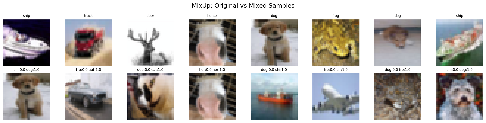
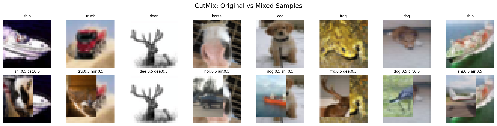
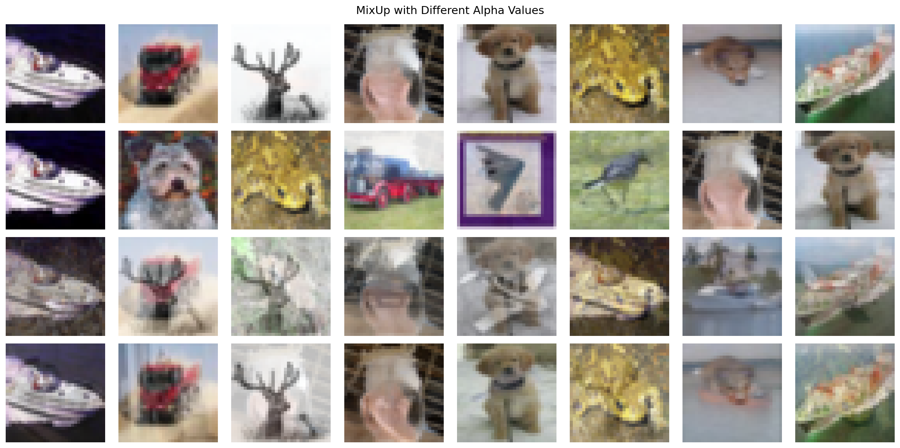
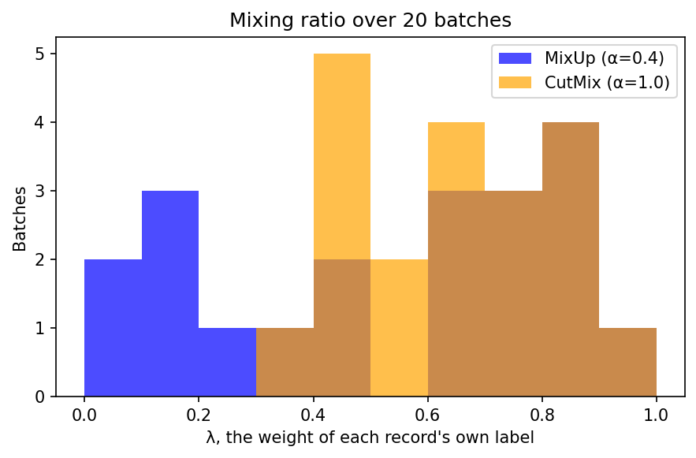

# MixUp and CutMix Augmentation Tutorial

| Metadata | Value |
|----------|-------|
| **Level** | Intermediate |
| **Runtime** | ~20 min |
| **Prerequisites** | [Operators Tutorial](../../core/operators-tutorial.md), [Augmentation basics](../../core/fashion-augmentation-tutorial.md) |
| **Format** | Python + Jupyter |

## Overview

MixUp and CutMix are powerful batch-level augmentation techniques that mix pairs of samples to create virtual training examples. Unlike element-level augmentations (rotation, brightness, noise), these require access to multiple samples simultaneously. The operator leaves labels untouched and records each sample's partner and the mixing ratio, which the loss reads.

## What You'll Learn

1. Understand MixUp and CutMix augmentation techniques and their mathematical formulations
2. Use `BatchMixOperator` for both MixUp and CutMix modes
3. Train on mixed samples with the loss the MixUp and CutMix papers use, reading each sample's partner and the mixing ratio from the batch
4. Tune the alpha parameter to control mixing strength
5. Visualize mixed samples and the mixing ratios
6. Compare MixUp vs CutMix trade-offs for different use cases

## Coming from PyTorch?

If you're familiar with PyTorch augmentations, here's how Datarax batch mixing compares:

| PyTorch (timm) | Datarax |
|----------------|---------|
| `Mixup(mixup_alpha=0.4)` | `BatchMixOperator(mode="mixup", alpha=0.4)` |
| `CutMix(cutmix_alpha=1.0)` | `BatchMixOperator(mode="cutmix", alpha=1.0)` |
| Applied in training loop | Applied as pipeline operator |
| Mixed (soft) targets | Labels untouched; partner and λ in the batch for the loss |
| `mix_batch(images, labels)` | `apply_batch(batch)` with RNG |

**Key difference:** Datarax integrates mixing into the pipeline DAG with explicit RNG management.

## Coming from TensorFlow?

| TensorFlow | Datarax |
|------------|---------|
| `tf.image.random_crop` + blend | `BatchMixOperator(mode="cutmix")` |
| Manual lambda sampling | Automatic Beta distribution sampling |
| Batch-level tf.function | `apply_batch()` with JAX JIT |

## Files

- **Python Script**: [`examples/advanced/augmentation/01_mixup_cutmix_tutorial.py`](https://github.com/avitai/datarax/blob/main/examples/advanced/augmentation/01_mixup_cutmix_tutorial.py)
- **Jupyter Notebook**: [`examples/advanced/augmentation/01_mixup_cutmix_tutorial.ipynb`](https://github.com/avitai/datarax/blob/main/examples/advanced/augmentation/01_mixup_cutmix_tutorial.ipynb)

## Quick Start

```bash
# Run the Python script
python examples/advanced/augmentation/01_mixup_cutmix_tutorial.py

# Or launch the Jupyter notebook
jupyter lab examples/advanced/augmentation/01_mixup_cutmix_tutorial.ipynb
```

## Background: Batch-Level Augmentation

### Why MixUp and CutMix?

Standard augmentations (rotation, brightness, noise) operate on individual samples. MixUp and CutMix operate on **pairs of samples**, creating "virtual" training examples that don't exist in the original dataset.

**Benefits:**
- Improved model calibration (better confidence estimates)
- Better generalization to out-of-distribution data
- Regularization through label smoothing
- Robustness to adversarial examples

### Element-Level vs Batch-Level

| Aspect | Element-Level | Batch-Level |
|--------|---------------|-------------|
| **Scope** | Single sample | Sample pairs |
| **Labels** | Unchanged | Unchanged; the loss mixes |
| **Examples** | Rotation, Noise, Brightness | MixUp, CutMix |
| **Implementation** | `apply()` with vmap | `apply_batch()` on full batch |
| **Dependencies** | None | Requires batch access |

### MixUp Formula

MixUp creates linear interpolations between pairs of samples:

```
x_mixed = λ * x + (1 - λ) * x[partner]
loss    = λ * CE(pred, y) + (1 - λ) * CE(pred, y[partner])

where λ ~ Beta(α, α)
```

**Visual effect:** Ghostly overlap of two images

### CutMix Formula

CutMix cuts a rectangular patch from one image and pastes it onto another:

```
x_mixed = M ⊙ x + (1 - M) ⊙ x[partner]
loss    = λ * CE(pred, y) + (1 - λ) * CE(pred, y[partner])

where M is a binary mask whose box covers about 1 - λ of the image, λ ~ Beta(α, α),
and λ is then the fraction of the image actually kept
```

The labels themselves are never mixed. The operator records each sample's partner row in
`states[MIX_PARTNER]` and λ in `batch_state[MIX_LAMBDA]`, and the loss reads them, as the
published implementations do (`mixup_criterion` in facebookresearch/mixup-cifar10 `train.py`; the
CutMix branch of clovaai/CutMix-PyTorch `train.py`). Integer class labels stay integers.

**Visual effect:** Sharp boundary between two images

## Setup

```python
# GPU Memory Configuration
import os
os.environ["TF_CPP_MIN_LOG_LEVEL"] = "3"

import tensorflow as tf
tf.config.set_visible_devices([], "GPU")

# Core imports
from pathlib import Path
import jax
import jax.numpy as jnp
import matplotlib.pyplot as plt
import numpy as np
from flax import nnx

# Datarax imports
from datarax.pipeline import Pipeline
from datarax.core.config import BatchMixOperatorConfig
from datarax.core.state_keys import MIX_LAMBDA, MIX_PARTNER
from datarax.operators import ElementOperator, ElementOperatorConfig
from datarax.operators.batch_mix_operator import BatchMixOperator
from datarax.sources import TFDSEagerConfig, TFDSEagerSource
```

## Part 1: Load CIFAR-10 Data

We'll use CIFAR-10 because it's more complex than MNIST and benefits more from batch augmentation.

```python
# CIFAR-10 constants
CIFAR10_MEAN = jnp.array([0.4914, 0.4822, 0.4465])
CIFAR10_STD = jnp.array([0.2470, 0.2435, 0.2616])
CIFAR10_CLASSES = [
    "airplane", "automobile", "bird", "cat", "deer",
    "dog", "frog", "horse", "ship", "truck"
]

BATCH_SIZE = 32
NUM_CLASSES = 10

def preprocess_cifar10(element, key=None):
    """Normalize CIFAR-10 images; labels stay integer class indices."""
    image = element.data["image"]

    # Normalize to [0, 1] then standardize
    image = image.astype(jnp.float32) / 255.0
    image = (image - CIFAR10_MEAN) / CIFAR10_STD

    return element.update_data({"image": image})

preprocessor = ElementOperator(
    ElementOperatorConfig(stochastic=False),
    fn=preprocess_cifar10,
    rngs=nnx.Rngs(0),
)

def create_base_pipeline(seed=42, num_samples=256):
    """Create CIFAR-10 pipeline with preprocessing."""
    source = TFDSEagerSource(
        TFDSEagerConfig(
            name="cifar10",
            split=f"train[:{num_samples}]",
            shuffle=True,
            seed=seed,
            exclude_keys={"id"},
        ),
        rngs=nnx.Rngs(seed),
    )

    prep = ElementOperator(
        ElementOperatorConfig(stochastic=False),
        fn=preprocess_cifar10,
        rngs=nnx.Rngs(0),
    )

    return Pipeline(source=source, stages=[prep], batch_size=BATCH_SIZE, rngs=nnx.Rngs(0))
```

**Terminal Output:**
```
Base pipeline factory created
```

## Part 2: MixUp Augmentation

MixUp creates linear interpolations between random pairs of samples.

### Create MixUp Operator

```python
# Create MixUp operator
mixup_op = BatchMixOperator(
    BatchMixOperatorConfig(
        mode="mixup",
        alpha=0.4,  # Beta distribution parameter
        data_field="image",
        stochastic=True,
        stream_name="mixup",
    ),
    rngs=nnx.Rngs(mixup=100),
)

print("MixUp operator created:")
print("  mode: mixup")
print("  alpha: 0.4 (moderate mixing)")
print("  data_field: image (labels are left as they are)")
```

**Terminal Output:**
```
MixUp operator created:
  mode: mixup
  alpha: 0.4 (moderate mixing)
  data_field: image (labels are left as they are)
```

### Build MixUp Pipeline

```python
def create_mixup_pipeline(alpha=0.4, seed=42):
    """Create CIFAR-10 pipeline with MixUp."""
    source = TFDSEagerSource(
        TFDSEagerConfig(
            name="cifar10",
            split="train[:256]",
            shuffle=True,
            seed=seed,
            exclude_keys={"id"},
        ),
        rngs=nnx.Rngs(seed),
    )

    prep = ElementOperator(
        ElementOperatorConfig(stochastic=False),
        fn=preprocess_cifar10,
        rngs=nnx.Rngs(0),
    )

    mixup = BatchMixOperator(
        BatchMixOperatorConfig(
            mode="mixup",
            alpha=alpha,
            data_field="image",
            stochastic=True,
            stream_name="mixup",
        ),
        rngs=nnx.Rngs(mixup=100 + seed),
    )

    return (
        Pipeline(source=source, stages=[prep, mixup], batch_size=BATCH_SIZE, rngs=nnx.Rngs(0))
    )

# Get MixUp batch
mixup_pipeline = create_mixup_pipeline(alpha=0.4)
mixup_batch = next(iter(mixup_pipeline))

print("\nMixUp batch:")
print(f"  Image shape: {mixup_batch['image'].shape}")
print(f"  Labels (unchanged integers): {mixup_batch['label'][:8]}")
print(f"  Partner of each record: {mixup_batch.states[MIX_PARTNER][:8]}")
print(f"  Mixing ratio λ: {float(mixup_batch.batch_state[MIX_LAMBDA]):.3f}")
```

**Terminal Output:**
```
MixUp batch:
  Image shape: (32, 32, 32, 3)
  Label shape: (32, 10)
  Label is soft: True
```

### Visualize MixUp Results

```python
import matplotlib.pyplot as plt
from substrax.artifacts import resolve_output_dir

output_dir = resolve_output_dir("examples").path

def denormalize_cifar10(images):
    """Denormalize CIFAR-10 images for display."""
    images = np.array(images)
    images = images * np.array(CIFAR10_STD) + np.array(CIFAR10_MEAN)
    return np.clip(images, 0, 1)

def mixed_title(batch, i):
    """Record ``i``'s class and its partner's, each with its weight in the loss."""
    lam = float(batch.batch_state[MIX_LAMBDA])
    own = CIFAR10_CLASSES[int(batch["label"][i])][:3]
    other = CIFAR10_CLASSES[int(batch["label"][batch.states[MIX_PARTNER][i]])][:3]
    return f"{own}:{lam:.1f} {other}:{1 - lam:.1f}"

# Get original batch for comparison
base_pipeline = create_base_pipeline(seed=42)
original_batch = next(iter(base_pipeline))

# Plot MixUp samples
fig, axes = plt.subplots(2, 8, figsize=(16, 4))
fig.suptitle("MixUp: Original vs Mixed Samples", fontsize=14)

for i in range(8):
    # Original
    img_orig = denormalize_cifar10(original_batch["image"][i])
    axes[0, i].imshow(img_orig)
    axes[0, i].axis("off")
    axes[0, i].set_title(CIFAR10_CLASSES[int(original_batch["label"][i])], fontsize=8)

    # Mixed
    img_mixed = denormalize_cifar10(mixup_batch["image"][i])
    axes[1, i].imshow(img_mixed)
    axes[1, i].axis("off")

    # The record's own class with weight λ, its partner's with 1 - λ
    axes[1, i].set_title(mixed_title(mixup_batch, i), fontsize=8)

axes[0, 0].set_ylabel("Original", fontsize=10)
axes[1, 0].set_ylabel("MixUp", fontsize=10)

plt.tight_layout()
plt.savefig(
    output_dir / "cv-cifar-mixup-samples.png",
    dpi=150, bbox_inches="tight", facecolor="white"
)
plt.close()
```

**Terminal Output:**
```
Saved: docs/assets/images/examples/cv-cifar-mixup-samples.png
```



## Part 3: CutMix Augmentation

CutMix cuts a rectangular patch from one image and pastes it onto another.

### Create CutMix Operator

```python
# Create CutMix operator
cutmix_op = BatchMixOperator(
    BatchMixOperatorConfig(
        mode="cutmix",
        alpha=1.0,  # Uniform cut sizes
        data_field="image",
        stochastic=True,
        stream_name="cutmix",
    ),
    rngs=nnx.Rngs(cutmix=200),
)

print("CutMix operator created:")
print("  mode: cutmix")
print("  alpha: 1.0 (uniform cut sizes)")
```

**Terminal Output:**
```
CutMix operator created:
  mode: cutmix
  alpha: 1.0 (uniform cut sizes)
```

### Build CutMix Pipeline

```python
def create_cutmix_pipeline(alpha=1.0, seed=42):
    """Create CIFAR-10 pipeline with CutMix."""
    source = TFDSEagerSource(
        TFDSEagerConfig(
            name="cifar10",
            split="train[:256]",
            shuffle=True,
            seed=seed,
            exclude_keys={"id"},
        ),
        rngs=nnx.Rngs(seed),
    )

    prep = ElementOperator(
        ElementOperatorConfig(stochastic=False),
        fn=preprocess_cifar10,
        rngs=nnx.Rngs(0),
    )

    cutmix = BatchMixOperator(
        BatchMixOperatorConfig(
            mode="cutmix",
            alpha=alpha,
            data_field="image",
            stochastic=True,
            stream_name="cutmix",
        ),
        rngs=nnx.Rngs(cutmix=200 + seed),
    )

    return (
        Pipeline(source=source, stages=[prep, cutmix], batch_size=BATCH_SIZE, rngs=nnx.Rngs(0))
    )

# Get CutMix batch
cutmix_pipeline = create_cutmix_pipeline(alpha=1.0)
cutmix_batch = next(iter(cutmix_pipeline))

print("\nCutMix batch:")
print(f"  Image shape: {cutmix_batch['image'].shape}")
print(f"  Fraction of each image kept, λ: {float(cutmix_batch.batch_state[MIX_LAMBDA]):.3f}")
```

**Terminal Output:**
```
CutMix batch:
  Image shape: (32, 32, 32, 3)
  Label shape: (32, 10)
```

### Visualize CutMix Results

```python
# Plot CutMix samples
fig, axes = plt.subplots(2, 8, figsize=(16, 4))
fig.suptitle("CutMix: Original vs Mixed Samples", fontsize=14)

for i in range(8):
    # Original
    img_orig = denormalize_cifar10(original_batch["image"][i])
    axes[0, i].imshow(img_orig)
    axes[0, i].axis("off")
    axes[0, i].set_title(CIFAR10_CLASSES[int(original_batch["label"][i])], fontsize=8)

    # CutMix
    img_cut = denormalize_cifar10(cutmix_batch["image"][i])
    axes[1, i].imshow(img_cut)
    axes[1, i].axis("off")

    # The record's own class with weight λ, its partner's with 1 - λ
    axes[1, i].set_title(mixed_title(cutmix_batch, i), fontsize=8)

axes[0, 0].set_ylabel("Original", fontsize=10)
axes[1, 0].set_ylabel("CutMix", fontsize=10)

plt.tight_layout()
plt.savefig(
    output_dir / "cv-cifar-cutmix-samples.png",
    dpi=150, bbox_inches="tight", facecolor="white"
)
plt.close()
```

**Terminal Output:**
```
Saved: docs/assets/images/examples/cv-cifar-cutmix-samples.png
```



## Part 4: Alpha Parameter Effect

The alpha parameter controls the Beta distribution for mixing ratio λ.

### Understanding Alpha

- **α < 1**: Strong bias toward original samples (λ near 0 or 1)
- **α = 1**: Uniform distribution (any λ equally likely)
- **α > 1**: Bias toward 50/50 mixing (λ near 0.5)

```python
# Visualize effect of different alpha values
alphas = [0.2, 0.5, 1.0, 2.0]

fig, axes = plt.subplots(len(alphas), 8, figsize=(16, 8))
fig.suptitle("MixUp with Different Alpha Values", fontsize=14)

for row, alpha in enumerate(alphas):
    pipeline = create_mixup_pipeline(alpha=alpha, seed=row * 100)
    batch = next(iter(pipeline))

    for col in range(8):
        img = denormalize_cifar10(batch["image"][col])
        axes[row, col].imshow(img)
        axes[row, col].axis("off")

        if col == 0:
            axes[row, col].set_ylabel(
                f"α={alpha}", fontsize=10, rotation=0, ha="right", va="center"
            )

plt.tight_layout()
plt.savefig(output_dir / "cv-cifar-mix-alpha.png", dpi=150, bbox_inches="tight", facecolor="white")
plt.close()
```

**Terminal Output:**
```
Saved: docs/assets/images/examples/cv-cifar-mix-alpha.png
```



## Part 5: The Loss for Mixed Samples

The loss reads what the operator wrote: each sample's partner and λ. This is the loss the papers
train with (`mixup_criterion` in facebookresearch/mixup-cifar10, commit `eaff31a`,
`train.py:137-138`; clovaai/CutMix-PyTorch, commit `2d8eb68`, `train.py:237-240`). For integer
labels it equals cross-entropy against the soft label `λ * onehot(y) + (1 - λ) * onehot(y[partner])`,
which the cell checks.

```python
def mixed_cross_entropy(logits, batch):
    """Cross-entropy of mixed records: λ CE(y) + (1 - λ) CE(y[partner]), per record."""
    lam = batch.batch_state[MIX_LAMBDA]
    partner = batch.states[MIX_PARTNER]
    labels = batch["label"]
    log_probs = jax.nn.log_softmax(logits)
    own = -jnp.take_along_axis(log_probs, labels[:, None], axis=1)[:, 0]
    other = -jnp.take_along_axis(log_probs, labels[partner][:, None], axis=1)[:, 0]
    return lam * own + (1 - lam) * other

logits = jax.random.normal(jax.random.key(0), (BATCH_SIZE, NUM_CLASSES))
for name, batch in (("MixUp", mixup_batch), ("CutMix", cutmix_batch)):
    lam = batch.batch_state[MIX_LAMBDA]
    soft = lam * jax.nn.one_hot(batch["label"], NUM_CLASSES) + (1 - lam) * jax.nn.one_hot(
        batch["label"][batch.states[MIX_PARTNER]], NUM_CLASSES
    )
    soft_ce = -jnp.sum(soft * jax.nn.log_softmax(logits), axis=1)
    difference = float(jnp.max(jnp.abs(mixed_cross_entropy(logits, batch) - soft_ce)))
    print(f"{name}: mixed loss vs soft-label cross-entropy, max difference {difference:.2e}")
```

### How strongly samples are mixed

Each batch draws one λ. A mixed sample's weight on its own label is λ, so the distribution of λ
over batches shows how "hard" the targets are: near 1, samples are mostly themselves.

```python
mixup_lambdas = []
cutmix_lambdas = []

for i in range(20):
    mixup_lambdas.append(float(next(iter(create_mixup_pipeline(alpha=0.4, seed=i))).batch_state[MIX_LAMBDA]))
    cutmix_lambdas.append(float(next(iter(create_cutmix_pipeline(alpha=1.0, seed=i + 100))).batch_state[MIX_LAMBDA]))

fig, ax = plt.subplots(figsize=(6, 4))
ax.hist(mixup_lambdas, bins=10, range=(0, 1), alpha=0.7, label="MixUp (α=0.4)", color="blue")
ax.hist(cutmix_lambdas, bins=10, range=(0, 1), alpha=0.7, label="CutMix (α=1.0)", color="orange")
ax.set_xlabel("λ, the weight of each sample's own label")
ax.set_ylabel("Batches")
ax.set_title("Mixing ratio over 20 batches")
ax.legend()

plt.tight_layout()
plt.savefig(output_dir / "cv-cifar-mix-labels.png", dpi=150, bbox_inches="tight", facecolor="white")
plt.close()
```



## Architecture Diagram

```mermaid
flowchart TB
    subgraph Source["Data Source"]
        TFDS[TFDSEagerSource<br/>CIFAR-10]
    end

    subgraph Preprocess["Preprocessing"]
        Norm[Normalize<br/>μ, σ per channel]
    end

    subgraph BatchMix["Batch Mixing"]
        Mode{Mode?}
        MixUp[MixUp<br/>Linear blend<br/>λ ~ Beta(α, α)]
        CutMix[CutMix<br/>Rectangular patch<br/>λ = fraction kept]
        State[Partner per sample<br/>λ per batch]
    end

    subgraph Output["Output"]
        Mixed[Mixed Images<br/>+ integer labels]
        Loss[Loss<br/>λ·CE(y) + (1-λ)·CE(y[partner])]
    end

    TFDS --> Norm --> Mode
    Mode -->|mixup| MixUp --> State
    Mode -->|cutmix| CutMix --> State
    State --> Mixed --> Loss

    style Source fill:#e1f5ff
    style Preprocess fill:#fff4e1
    style BatchMix fill:#ffe1e1
    style Output fill:#e1ffe1
```

## MixUp vs CutMix Comparison

| Aspect | MixUp | CutMix |
|--------|-------|--------|
| **Operation** | Linear blend: `λ·x₁ + (1-λ)·x₂` | Patch paste: `M⊙x₁ + (1-M)⊙x₂` |
| **Visual effect** | Ghostly overlap of images | Sharp boundary between regions |
| **Information** | Global features from both | Local features preserved |
| **λ in the loss** | Blend ratio | Fraction of the image kept |
| **Best for** | General regularization | Object detection, localization |
| **Typical α** | 0.2 - 0.4 | 1.0 |
| **Computation** | Element-wise multiply + add | Mask generation + multiply + add |

## Results Summary

### Recommended Settings

| Use Case | Mode | Alpha | Rationale |
|----------|------|-------|-----------|
| **Image classification** | MixUp | 0.2-0.4 | Smooth regularization |
| **Strong regularization** | MixUp | 1.0 | Maximum diversity |
| **Object detection** | CutMix | 1.0 | Preserves local features |
| **Combined (timm-style)** | Both | 0.2 MixUp + 1.0 CutMix | Best of both worlds |

### Alpha Parameter Guide

| Alpha (α) | Distribution Shape | Mixing Behavior | When to Use |
|-----------|-------------------|-----------------|-------------|
| 0.1 - 0.3 | U-shaped (extremes) | Mostly original images | Conservative augmentation |
| 0.4 - 0.6 | Moderate | Balanced mixing | Standard training |
| 1.0 | Uniform | All ratios equally likely | Aggressive augmentation |
| 2.0+ | Bell-shaped (center) | Mostly 50/50 mixes | Experimental |

### Key Takeaways

1. **Mixed loss, not mixed labels**: the operator writes each sample's partner and λ; the loss is
   λ·CE(y) + (1 − λ)·CE(y[partner]), as in the published implementations
2. **Alpha matters**: Lower α = more "pure" samples, higher α = more mixing
3. **Batch-level operation**: Uses `apply_batch()` instead of per-element `apply()`
4. **Pipeline order**: Apply after preprocessing, before model forward pass
5. **Training only**: Never use during evaluation/inference
6. **Integer labels**: labels stay class indices; nothing averages two indices into a third

### Integration into Training Loop

```python
# Typical usage in training pipeline
def create_training_pipeline():
    source = TFDSEagerSource(train_config, rngs=nnx.Rngs(42))

    # Element-level preprocessing; labels stay integer class indices
    preprocessor = ElementOperator(
        ElementOperatorConfig(stochastic=False),
        fn=preprocess_cifar10,
        rngs=nnx.Rngs(0),
    )

    # Batch-level mixing, after preprocessing and before the model
    mixup = BatchMixOperator(
        BatchMixOperatorConfig(mode="mixup", alpha=0.4, data_field="image", stream_name="mixup"),
        rngs=nnx.Rngs(mixup=100),
    )

    return Pipeline(source=source, stages=[preprocessor, mixup], batch_size=128, rngs=nnx.Rngs(0))

# The loss reads each sample's partner and λ from the batch
@nnx.jit
def train_step(model, batch):
    logits = model(batch["image"])
    labels = batch["label"]
    lam = batch.batch_state[MIX_LAMBDA]
    partner_labels = labels[batch.states[MIX_PARTNER]]
    own = optax.softmax_cross_entropy_with_integer_labels(logits, labels)
    other = optax.softmax_cross_entropy_with_integer_labels(logits, partner_labels)
    return (lam * own + (1 - lam) * other).mean()
```

## Next Steps

- **Multi-source pipelines**: [Interleaved Datasets](../multi_source/interleaved-tutorial.md) for mixing data sources
- **Full training pipeline**: [End-to-end CIFAR-10](../training/e2e-cifar10-guide.md) with complete workflow
- **Performance optimization**: [Optimization Guide](../performance/optimization-guide.md) for throughput improvements
- **Custom batch operators**: [API Reference](../../../operators/batch_mix_operator.md) for building your own batch-level augmentations
