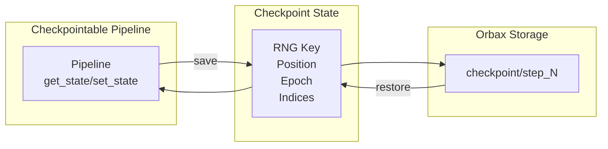

# Pipeline Checkpointing Quick Reference

| Metadata | Value |
|----------|-------|
| **Level** | Intermediate |
| **Runtime** | ~10 min |
| **Prerequisites** | Basic Datarax pipeline, JAX fundamentals |
| **Format** | Python + Jupyter |

## Overview

Save and restore data pipeline state to enable resumable processing.
This is essential for long-running data jobs that may be interrupted
and need to continue from where they left off.

## What You'll Learn

1. Create a `CheckpointableIterator` with proper state management
2. Use `PipelineCheckpoint` to save/restore state
3. Implement resumable data processing loops
4. Handle interrupted jobs gracefully

## Coming from PyTorch?

| PyTorch | Datarax |
|---------|---------|
| `torch.save(state_dict, path)` | `checkpointer.save(pipeline, step=N)` |
| `model.load_state_dict(torch.load(path))` | `checkpointer.restore_latest(pipeline)` |
| Custom `state_dict()` methods | `get_state()` / `set_state()` protocol |
| DataLoader `sampler.set_epoch()` | State includes epoch, position, RNG |

**Key difference:** Datarax checkpoints include full iterator state (RNG, position, indices) for exact resumption.

## Coming from TensorFlow?

| TensorFlow | Datarax |
|------------|---------|
| `tf.train.Checkpoint` | `PipelineCheckpoint` |
| `ckpt.save(path)` | `checkpointer.save(pipeline, step=N)` |
| `ckpt.restore(latest)` | `checkpointer.restore_latest(pipeline)` |
| `tf.train.CheckpointManager` | Built-in `keep` parameter |

## Files

- **Python Script**: [`examples/advanced/checkpointing/01_checkpoint_quickref.py`](https://github.com/avitai/datarax/blob/main/examples/advanced/checkpointing/01_checkpoint_quickref.py)
- **Jupyter Notebook**: [`examples/advanced/checkpointing/01_checkpoint_quickref.ipynb`](https://github.com/avitai/datarax/blob/main/examples/advanced/checkpointing/01_checkpoint_quickref.ipynb)

## Quick Start

```bash
python examples/advanced/checkpointing/01_checkpoint_quickref.py
```

## Architecture



## Key Concepts

### Step 1: Create Checkpointable Iterator

A `CheckpointableIterator` must implement `get_state()` and `set_state()`:

```python
from datarax.typing import CheckpointableIterator

class SimplePipeline(CheckpointableIterator[dict[str, jax.Array]]):
    def __init__(self, data, batch_size=10, seed=42):
        self.data = data
        self.batch_size = batch_size
        self.rng = jax.random.key(seed)
        self.epoch = 0
        self.position = 0

    def get_state(self) -> dict:
        return {
            "rng": jax.random.key_data(self.rng),
            "epoch": self.epoch,
            "position": self.position,
        }

    def set_state(self, state: dict) -> None:
        self.rng = jax.random.wrap_key_data(state["rng"])
        self.epoch = state["epoch"]
        self.position = state["position"]
```

### Step 2: Set Up Checkpointing

```python
from datarax.checkpoint import PipelineCheckpoint

checkpoint_dir = "/path/to/checkpoints"
checkpointer = PipelineCheckpoint(checkpoint_dir)
print(f"Checkpoint directory: {checkpoint_dir}")
```

**Terminal Output:**
```
Checkpoint directory: /path/to/checkpoints
```

### Step 3: Save Checkpoints During Processing

```python
step = 0
for epoch in range(2):
    for batch in pipeline:
        step += 1
        # Process batch...

        if step % 100 == 0:  # Save every 100 steps
            checkpointer.save(
                pipeline,
                step=step,
                metadata={"epoch": epoch},
                keep=3,  # Keep last 3 checkpoints
            )
            print(f"Saved checkpoint at step {step}")
```

**Terminal Output:**
```
Saved checkpoint at step 100
Saved checkpoint at step 200
Saved checkpoint at step 300
```

### Step 4: Restore from Checkpoint

```python
# Create new pipeline (simulating restart)
new_pipeline = SimplePipeline(data)
print(f"Before restore: position={new_pipeline.position}")

# Restore from latest checkpoint
checkpointer.restore_latest(new_pipeline)
print(f"After restore: position={new_pipeline.position}")

# Continue processing from checkpoint
for batch in new_pipeline:
    # Processing continues from saved position
    pass
```

**Terminal Output:**
```
Before restore: position=0
After restore: position=300
```

## Checkpoint State Contents

| Field | Type | Description |
|-------|------|-------------|
| `rng` | Array | JAX random key state |
| `epoch` | int | Current epoch number |
| `position` | int | Position within epoch |
| `indices` | Array | Shuffled sample indices |
| `batch_size` | int | Batch size setting |

## Results Summary

| Feature | Description |
|---------|-------------|
| State Saved | RNG, position, epoch, indices |
| Checkpoint Format | Orbax (efficient, async-capable) |
| Retention | Configurable via `keep` parameter |
| Metadata | Custom fields (epoch, batch, etc.) |

**Key benefits:**

- **Fault tolerance**: Resume interrupted jobs
- **Incremental processing**: Process data in stages
- **Reproducibility**: Exact state restoration

## Next Steps

- [Resumable Training Guide](resumable-training-guide.md) - Complete training with checkpointing
- [Monitoring](../monitoring/monitoring-quickref.md) - Track pipeline metrics
- [Distributed Checkpointing](../distributed/sharding-guide.md) - Multi-device checkpoints
- [API Reference: Checkpoint](../../../checkpoint/handlers.md) - Complete API
