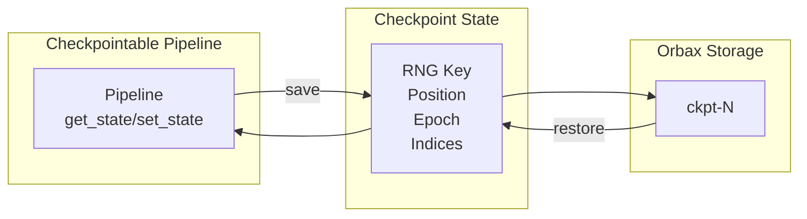

# Pipeline Checkpointing Quick Reference

| Metadata | Value |
|----------|-------|
| **Level** | Intermediate |
| **Runtime** | ~10 min |
| **Prerequisites** | Basic Datarax pipeline, JAX fundamentals |
| **Format** | Python + Jupyter |

## Overview

Save and restore data pipeline state to enable resumable processing.
This is essential for long-running data jobs that may be interrupted
and need to continue from where they left off.

## What You'll Learn

1. Create a `CheckpointableIterator` with proper state management
2. Use `IteratorCheckpoint` to save/restore state
3. Implement resumable data processing loops
4. Handle interrupted jobs gracefully

## Coming from PyTorch?

| PyTorch | Datarax |
|---------|---------|
| `torch.save(state_dict, path)` | `checkpoint.save(pipeline, step=N)` |
| `model.load_state_dict(torch.load(path))` | `checkpoint.restore(pipeline)` |
| Custom `state_dict()` methods | `get_state()` / `set_state()` protocol |
| DataLoader `sampler.set_epoch()` | State includes epoch, position, RNG |

**Key difference:** Datarax checkpoints include full iterator state (RNG, position, indices) for exact resumption.

## Coming from TensorFlow?

| TensorFlow | Datarax |
|------------|---------|
| `tf.train.Checkpoint` | `IteratorCheckpoint` |
| `ckpt.save(path)` | `checkpoint.save(pipeline, step=N)` |
| `ckpt.restore(latest)` | `checkpoint.restore(pipeline)` |
| `tf.train.CheckpointManager` | Built-in `max_to_keep` parameter |

## Files

- **Python Script**: [`examples/advanced/checkpointing/01_checkpoint_quickref.py`](https://github.com/avitai/datarax/blob/main/examples/advanced/checkpointing/01_checkpoint_quickref.py)
- **Jupyter Notebook**: [`examples/advanced/checkpointing/01_checkpoint_quickref.ipynb`](https://github.com/avitai/datarax/blob/main/examples/advanced/checkpointing/01_checkpoint_quickref.ipynb)

## Quick Start

```bash
python examples/advanced/checkpointing/01_checkpoint_quickref.py
```

## Architecture


```mermaid
flowchart LR
    subgraph Pipeline["Checkpointable Pipeline"]
        P[Pipeline<br/>get_state/set_state]
    end

    subgraph State["Checkpoint State"]
        S[RNG Key<br/>Position<br/>Epoch<br/>Indices]
    end

    subgraph Storage["Orbax Storage"]
        F[ckpt-N]
    end

    P -->|save| S --> F
    F -->|restore| S --> P
```

## Key Concepts

### Step 1: Create Checkpointable Iterator

A `CheckpointableIterator` must implement `get_state()` and `set_state()`:

```python
from datarax.typing import CheckpointableIterator

class SimplePipeline(CheckpointableIterator[dict[str, jax.Array]]):
    def __init__(self, data, batch_size=10, shuffle=True, seed=42):
        self.data = data
        self.batch_size = batch_size
        self.shuffle = shuffle
        self.seed = seed
        self.rng = jax.random.key(seed)
        self.epoch = 0
        self.position = 0
        self.indices = self._create_indices()

    def get_state(self) -> dict:
        return {
            "batch_size": self.batch_size,
            "shuffle": self.shuffle,
            "seed": self.seed,
            "rng": jax.random.key_data(self.rng),  # Convert key to raw data
            "epoch": self.epoch,
            "position": self.position,
            "indices": self.indices,
        }

    def set_state(self, state: dict) -> None:
        self.batch_size = state["batch_size"]
        self.shuffle = state["shuffle"]
        self.seed = state["seed"]
        self.rng = jax.random.wrap_key_data(state["rng"])  # Convert back to key
        self.epoch = state["epoch"]
        self.position = state["position"]
        self.indices = state["indices"]
```

### Step 2: Set Up Checkpointing

`IteratorCheckpoint` stores each step with substrax's Orbax checkpoint store and keeps the most
recent `max_to_keep` of them.

```python
# Create checkpoint directory
checkpoint_dir = tempfile.mkdtemp(prefix="datarax_ckpt_")
checkpoint = IteratorCheckpoint(os.path.join(checkpoint_dir, "pipeline_state"), max_to_keep=2)

print(f"Checkpoint directory: {checkpoint_dir}")
```

**Terminal Output:**
```
Checkpoint directory: /tmp/datarax_ckpt_8amyhhxp
```

### Step 3: Save Checkpoints During Processing

```python
# Process data with checkpointing
step = 0
for epoch in range(2):
    print(f"\nEpoch {epoch}:")
    pipeline_iter = pipeline.iterator()

    for batch_idx, batch in enumerate(pipeline_iter):
        batch_mean = jnp.mean(batch["x"]).item()
        step += 1

        print(f"  Batch {batch_idx}: mean={batch_mean:.2f}")

        # Save checkpoint every 3 steps; the epoch is a field of the checkpoint record
        if checkpoint.save_if_due(
            pipeline, step, interval=3, epoch=epoch, metadata={"batch": batch_idx}
        ):
            print(f"  -> Saved checkpoint at step {step}")

print(f"\nProcessed {step} total steps")
```

**Terminal Output:**
```
Epoch 0:
  Batch 0: mean=21.30
  Batch 1: mean=19.80
  Batch 2: mean=21.90
  -> Saved checkpoint at step 3
  Batch 3: mean=26.10
  Batch 4: mean=33.40

Epoch 1:
  Batch 0: mean=22.70
  -> Saved checkpoint at step 6
  Batch 1: mean=24.30
  Batch 2: mean=29.50
  Batch 3: mean=27.00
  -> Saved checkpoint at step 9
  Batch 4: mean=19.00

Processed 10 total steps
```

### Step 4: Restore from Checkpoint

```python
# Create new pipeline (simulating restart)
new_pipeline = SimplePipeline(data, batch_size=10, shuffle=True)
print(f"New pipeline state: epoch={new_pipeline.epoch}, position={new_pipeline.position}")

# Restore from the latest checkpoint
checkpoint.restore(new_pipeline)
print(f"Restored state: epoch={new_pipeline.epoch}, position={new_pipeline.position}")

# Continue processing
print("\nContinuing from checkpoint:")
for batch_idx, batch in enumerate(new_pipeline):
    batch_mean = jnp.mean(batch["x"]).item()
    print(f"  Batch {batch_idx}: mean={batch_mean:.2f}")
```

**Terminal Output:**
```
New pipeline state: epoch=0, position=0
Restored state: epoch=1, position=40

Continuing from checkpoint:
  Batch 0: mean=19.00
```

## Checkpoint State Contents

| Field | Type | Description |
|-------|------|-------------|
| `rng` | Array | JAX random key state |
| `epoch` | int | Current epoch number |
| `position` | int | Position within epoch |
| `indices` | Array | Shuffled sample indices |
| `batch_size` | int | Batch size setting |

## Results Summary

| Feature | Description |
|---------|-------------|
| State Saved | RNG, position, epoch, indices |
| Checkpoint Format | Orbax (efficient, async-capable) |
| Retention | Configurable via `max_to_keep` |
| Metadata | `epoch` is a field of the checkpoint record; `metadata` holds free keys (batch, run name, etc.) |

**Key benefits:**

- **Fault tolerance**: Resume interrupted jobs
- **Incremental processing**: Process data in stages
- **Reproducibility**: Exact state restoration

## Next Steps

- [Resumable Training Guide](resumable-training-guide.md) - Complete training with checkpointing
- [Distributed Checkpointing](../distributed/sharding-guide.md) - Multi-device checkpoints
- [API Reference: Checkpoint](../../../checkpoint/iterators.md) - Complete API
