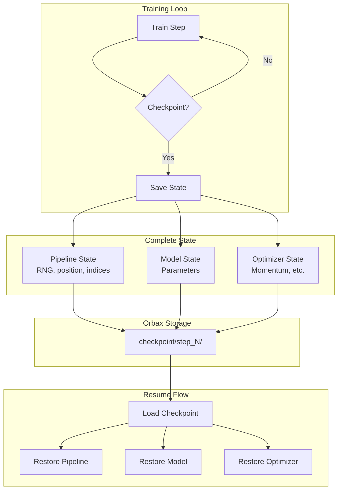

# Checkpointing and Resumable Training Guide

| Metadata | Value |
|----------|-------|
| **Level** | Advanced |
| **Runtime** | ~45 min |
| **Prerequisites** | Checkpoint Quick Reference, Training pipelines |
| **Format** | Python + Jupyter |
| **Memory** | ~1 GB RAM |

## Overview

Implement fault-tolerant training pipelines that can resume from interruptions.
This guide covers checkpointing pipeline state, model parameters, and optimizer
state for seamless training resumption.

## What You'll Learn

1. Implement `CheckpointableIterator` for custom pipelines
2. Save and restore complete training state (data + model + optimizer)
3. Verify deterministic resumption across checkpoints
4. Handle checkpoint lifecycle (creation, restoration, cleanup)
5. Optimize checkpoint storage and latency

## Coming from PyTorch?

| PyTorch | Datarax |
|---------|---------|
| `torch.save({'model': model.state_dict(), 'optimizer': opt.state_dict()})` | `checkpointer.save(pipeline, model_state, optimizer_state)` |
| `torch.load(path)` | `checkpointer.restore_latest(pipeline)` |
| `checkpoint['epoch']` | Metadata stored with checkpoint |
| DataLoader state not saved | Full iterator state preserved |

**Key difference:** Datarax checkpoints include complete pipeline state (RNG, position, indices) enabling exact reproducibility.

## Coming from TensorFlow?

| TensorFlow | Datarax |
|------------|---------|
| `tf.train.Checkpoint(model=model, optimizer=opt)` | Separate pipeline + model checkpointing |
| `ckpt_manager.save()` | `checkpointer.save(pipeline, step=N)` |
| `ckpt.restore(ckpt_manager.latest_checkpoint)` | `checkpointer.restore_latest(pipeline)` |
| `tf.train.CheckpointManager(max_to_keep=3)` | `keep=3` parameter |

## Files

- **Python Script**: [`examples/advanced/checkpointing/02_resumable_training_guide.py`](https://github.com/avitai/datarax/blob/main/examples/advanced/checkpointing/02_resumable_training_guide.py)
- **Jupyter Notebook**: [`examples/advanced/checkpointing/02_resumable_training_guide.ipynb`](https://github.com/avitai/datarax/blob/main/examples/advanced/checkpointing/02_resumable_training_guide.ipynb)

## Quick Start

```bash
python examples/advanced/checkpointing/02_resumable_training_guide.py
```

## Architecture



## Part 1: The CheckpointableIterator Protocol

```python
from datarax.typing import CheckpointableIterator

class TrainingPipeline(CheckpointableIterator[dict]):
    def __init__(self, source, batch_size, seed):
        self.source = source
        self.batch_size = batch_size
        self.rng = jax.random.key(seed)
        self.epoch = 0
        self.step = 0

    def get_state(self) -> dict:
        """Return complete state for checkpointing."""
        return {
            "rng": jax.random.key_data(self.rng),
            "epoch": self.epoch,
            "step": self.step,
            "position": self.position,
        }

    def set_state(self, state: dict) -> None:
        """Restore from checkpoint state."""
        self.rng = jax.random.wrap_key_data(state["rng"])
        self.epoch = state["epoch"]
        self.step = state["step"]
        self.position = state["position"]
```

## Part 2: Complete Training State

```python
from datarax.checkpoint import PipelineCheckpoint

# Create checkpointers for different components
pipeline_ckpt = PipelineCheckpoint("checkpoints/pipeline")
model_ckpt = orbax.checkpoint.PyTreeCheckpointer()

def save_training_state(step, pipeline, model, optimizer):
    """Save complete training state."""
    # Save pipeline state
    pipeline_ckpt.save(
        pipeline,
        step=step,
        metadata={"epoch": pipeline.epoch},
        keep=3,
    )

    # Save model and optimizer (using Orbax)
    model_state = nnx.state(model)
    opt_state = nnx.state(optimizer)

    # Save to orbax
    save_args = orbax.checkpoint.args.StandardSave(model_state)
    model_ckpt.save(f"checkpoints/model/step_{step}", model_state, save_args)

    print(f"Saved checkpoint at step {step}")
```

**Terminal Output:**
```
Saved checkpoint at step 1000
Saved checkpoint at step 2000
Saved checkpoint at step 3000
```

## Part 3: Resumable Training Loop

```python
def train_with_checkpointing(
    pipeline, model, optimizer, num_epochs,
    checkpoint_every=100
):
    """Training loop with periodic checkpointing."""
    step = 0

    for epoch in range(num_epochs):
        pipeline.epoch = epoch

        for batch in pipeline:
            # Training step
            loss = train_step(model, optimizer, batch)
            step += 1

            # Periodic checkpoint
            if step % checkpoint_every == 0:
                save_training_state(step, pipeline, model, optimizer)

            # Log progress
            if step % 50 == 0:
                print(f"Step {step}: loss={loss:.4f}")

    return step
```

## Part 4: Resuming Training

```python
def resume_training(checkpoint_dir):
    """Resume training from latest checkpoint."""
    # Create fresh instances
    pipeline = create_training_pipeline()
    model = create_model()
    optimizer = create_optimizer(model)

    # Restore pipeline state
    pipeline_ckpt = PipelineCheckpoint(f"{checkpoint_dir}/pipeline")
    restored_step = pipeline_ckpt.restore_latest(pipeline)

    if restored_step:
        print(f"Resumed from step {restored_step}")
        print(f"  Epoch: {pipeline.epoch}")
        print(f"  Position: {pipeline.position}")
    else:
        print("No checkpoint found, starting fresh")

    return pipeline, model, optimizer, restored_step or 0
```

**Terminal Output:**
```
Resumed from step 2000
  Epoch: 3
  Position: 256
```

## Part 5: Verification

```python
def verify_determinism():
    """Verify checkpoint produces identical results."""
    # Train and checkpoint
    pipeline1 = create_pipeline(seed=42)
    for i, batch in enumerate(pipeline1):
        if i == 50:
            pipeline1_ckpt.save(pipeline1, step=50)
            batch_at_50 = batch
            break

    # Restore and verify
    pipeline2 = create_pipeline(seed=42)
    pipeline1_ckpt.restore_latest(pipeline2)
    batch_restored = next(iter(pipeline2))

    match = jnp.allclose(batch_at_50["image"], batch_restored["image"])
    print(f"Deterministic restoration: {match}")
```

**Terminal Output:**
```
Deterministic restoration: True
```

## Results Summary

| Component | Checkpointed Data |
|-----------|-------------------|
| Pipeline | RNG, epoch, position, indices |
| Model | All parameters |
| Optimizer | Momentum, learning rate state |
| Metadata | Step, timestamp, config |

**Best Practices:**

1. **Checkpoint frequency**: Balance between safety and I/O overhead
2. **Keep parameter**: Retain last N checkpoints to save disk space
3. **Async checkpointing**: Use Orbax async saves for large models
4. **Verification**: Test restoration produces identical results

## Next Steps

- [Performance Guide](../performance/optimization-guide.md) - Optimize checkpoint I/O
- [Distributed Checkpointing](../distributed/sharding-guide.md) - Multi-device checkpoints
- [Monitoring](../monitoring/monitoring-quickref.md) - Track checkpoint events
- [API Reference: Checkpoint](../../../checkpoint/index.md) - Complete API
