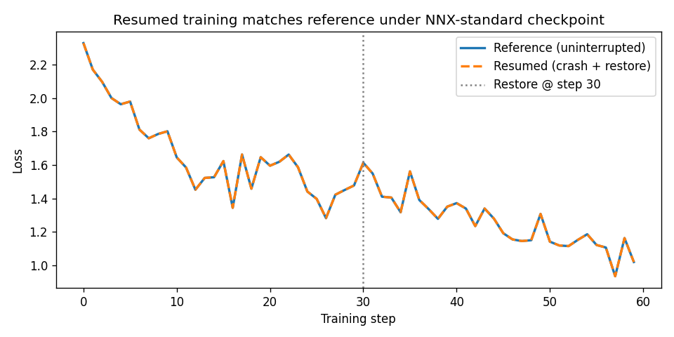

# Checkpointing and Resumable Training Guide

| Metadata | Value |
|----------|-------|
| **Level** | Advanced |
| **Runtime** | ~3 min |
| **Prerequisites** | Pipeline Quickstart, Operators Tutorial |
| **Format** | Python + Jupyter |
| **Memory** | ~500 MB RAM |

## Overview

Implement fault-tolerant training pipelines that can resume from
interruptions using the **NNX-standard checkpoint pattern** —
`nnx.to_pure_dict` for snapshotting state, `orbax.checkpoint.StandardCheckpointer`
for persistence, and `nnx.replace_by_pure_dict` + `nnx.update` for
restoration. The triple `(pipeline, model, optimizer)` is checkpointed
together so resumption restores data-cursor position, model weights,
and optimizer state from a single Orbax directory.

## Learning Goals

1. Snapshot an `nnx.Module`'s state with `nnx.to_pure_dict`.
2. Persist that snapshot with `orbax.checkpoint.StandardCheckpointer`.
3. Restore the snapshot back into a freshly-constructed module with
   `nnx.replace_by_pure_dict` followed by `nnx.update`.
4. Checkpoint a `(pipeline, model, optimizer)` triple atomically so
   resumption preserves data position, model weights, and optimizer
   state simultaneously.
5. Verify deterministic resumption: a run that checkpoints at step `k`,
   loads, and continues should match a never-interrupted run exactly.

## Coming from PyTorch?

| PyTorch | Datarax |
|---------|---------|
| `torch.save({'model': model.state_dict(), 'optimizer': opt.state_dict()})` | `checkpointer.save(path, {'model': nnx.to_pure_dict(nnx.state(model)), ...})` |
| `model.load_state_dict(torch.load(path)['model'])` | `nnx.replace_by_pure_dict(nnx.state(model), saved)` then `nnx.update(model, state)` |
| DataLoader state not saved | `Pipeline` is itself an `nnx.Module` — same checkpoint API includes its state |

**Key difference:** Datarax `Pipeline` is an `nnx.Module`, so the
data-cursor position, sampler state, and stochastic-stage RNGs
checkpoint with the exact same three-call pattern as the model.

## Coming from TensorFlow?

| TensorFlow | Datarax |
|------------|---------|
| `tf.train.Checkpoint(model=model, optimizer=opt)` | `nnx.to_pure_dict(nnx.state(...))` per object |
| `ckpt_manager.save()` | `StandardCheckpointer.save(path, snapshot_dict)` |
| `ckpt.restore(...)` | `StandardCheckpointer.restore(path, template)` then `nnx.update` |
| `tf.train.CheckpointManager(max_to_keep=3)` | `orbax.checkpoint.CheckpointManager(max_to_keep=3)` |

## Files

- **Python Script**: [`examples/advanced/checkpointing/02_resumable_training_guide.py`](https://github.com/avitai/datarax/blob/main/examples/advanced/checkpointing/02_resumable_training_guide.py)
- **Jupyter Notebook**: [`examples/advanced/checkpointing/02_resumable_training_guide.ipynb`](https://github.com/avitai/datarax/blob/main/examples/advanced/checkpointing/02_resumable_training_guide.ipynb)

## Quick Start

```bash
python examples/advanced/checkpointing/02_resumable_training_guide.py
```

```bash
jupyter lab examples/advanced/checkpointing/02_resumable_training_guide.ipynb
```

## Key Concepts

### The Three-Call NNX Checkpoint Pattern

```python
import orbax.checkpoint as ocp
from flax import nnx

# Save
checkpointer = ocp.StandardCheckpointer()
checkpointer.save(path, {
    "model": nnx.to_pure_dict(nnx.state(model)),
    "optimizer": nnx.to_pure_dict(nnx.state(optimizer)),
    "pipeline": nnx.to_pure_dict(nnx.state(pipeline)),
})
checkpointer.wait_until_finished()

# Restore — into freshly-constructed objects
template = {
    "model": nnx.to_pure_dict(nnx.state(model)),
    "optimizer": nnx.to_pure_dict(nnx.state(optimizer)),
    "pipeline": nnx.to_pure_dict(nnx.state(pipeline)),
}
saved = checkpointer.restore(path, template)

for module, pure in (
    (model, saved["model"]),
    (optimizer, saved["optimizer"]),
    (pipeline, saved["pipeline"]),
):
    state = nnx.state(module)
    nnx.replace_by_pure_dict(state, pure)
    nnx.update(module, state)
```

### Why `nnx.update`?

`nnx.state(module)` returns a *copy* of the module's state. Calling
`nnx.replace_by_pure_dict` on that copy mutates the local object but
not the module. `nnx.update(module, state)` writes the updated state
back into the module — without it, the resume looks like a reset.

### Three-Phase Verification

The example runs:

1. **Reference** — train uninterrupted for `N` steps; record loss curve.
2. **Crash** — re-train with the same seed but interrupt at step `k`,
   writing a checkpoint just before.
3. **Resume** — construct fresh model/optimizer/pipeline, load the
   step-`k` checkpoint, continue to step `N`.

Both the loss curve and the final model parameters must match the
reference exactly. The example asserts:

```python
max_param_diff = max(
    jax.tree_util.tree_leaves(
        jax.tree.map(_max_abs_diff, ref_params, restored_params)
    )
)
assert max_param_diff < 1e-3
```

## Pipeline State Captured

The `Pipeline` `nnx.Module` includes:

- `_position` — current iteration index (advances by `batch_size` per step).
- `rngs` — the Pipeline's own `nnx.Rngs`, used to generate per-step keys.
- `source` — the data source as a child module (its index, RNGs, cached
  state are all part of the tree).
- Each stage in `stages=[...]` — including any stochastic operator's
  `nnx.Rngs`.

`nnx.to_pure_dict(nnx.state(pipeline))` captures all of these in a
single call.

## Results

Running the guide produces:

```
PHASE 1: reference run (60 steps, no checkpoints)
============================================================
Reference: 60 steps, final loss=1.0196

PHASE 2: train, checkpoint every 10, interrupt at step 30
============================================================
Crashed: 30 steps, final loss=1.5023
Available checkpoints: ['step_10', 'step_20', 'step_30']

PHASE 3: restore from step 30, train to step 60
============================================================
Resumed: end step=60, final loss=1.0196
Total resumed-curve length: 60 (expected 60)

Max |reference - resumed| over 60 steps: 0.0000e+00
Max |reference - resumed| over model params: 0.0000e+00
Determinism check passed: model parameters round-trip through Orbax.
```

## Visualization



The reference curve (uninterrupted) and the resumed curve (crash +
restore) coincide exactly — every step before and after the
checkpoint produces the same loss in both runs.

## Best Practices

### Snapshot Everything That Mutates

If you forget to checkpoint a piece of state that the training step
mutates, the resumed run will diverge silently. The state-equality
assertion in this example surfaces such bugs immediately. The
canonical "everything that mutates" set is `(model, optimizer,
pipeline)` — Pipeline being an `nnx.Module` is what makes the data
position checkpointable on equal footing with model weights.

### Use `CheckpointManager` for Production

For periodic-cleanup, async writes, and atomic step-N labeling, wrap
the `StandardCheckpointer` calls in
`orbax.checkpoint.CheckpointManager`:

```python
manager = ocp.CheckpointManager(
    directory=ckpt_dir,
    options=ocp.CheckpointManagerOptions(max_to_keep=3),
)
manager.save(step, snapshot)
manager.wait_until_finished()
```

### Restore Templates Must Match

`StandardCheckpointer.restore(path, template)` requires the template
to have the same PyTree structure as the saved data. Build the
template by snapshotting the freshly-constructed modules — that
guarantees the structures match.

## Common Pitfalls

| Pitfall | Symptom | Fix |
|---------|---------|-----|
| Forgot `nnx.update` after `replace_by_pure_dict` | Resumed run produces same losses as a fresh run, ignoring restore | Add `nnx.update(module, state)` |
| Missing pipeline in snapshot | Resumed run sees the same data again from step 0 | Include pipeline in the snapshot dict |
| Saving `nnx.Module` directly to Orbax | `TypeError: cannot serialize <Module>` | Always wrap in `nnx.to_pure_dict(nnx.state(...))` |
| Template mismatch on restore | Orbax raises a structure-mismatch error | Build template by snapshotting freshly-constructed objects |

## Next Steps

- [Checkpoint Quick Reference](checkpoint-quickref.md) — single-pipeline checkpoint basics
- [DAG Construction Guide](../../../user_guide/dag_construction.md) — branching pipelines (the checkpoint pattern is identical)
- [Sharding Guide](../distributed/sharding-guide.md) — checkpointing under multi-device sharding

## API Reference

- [`Pipeline`](../../../user_guide/dag_construction.md) — Pipeline class as an `nnx.Module`
- [Orbax Checkpoint Documentation](https://orbax.readthedocs.io/) — `StandardCheckpointer`, `CheckpointManager`
- [Flax NNX Checkpointing Guide](https://flax.readthedocs.io/en/latest/nnx_basics.html#checkpointing) — `nnx.to_pure_dict`, `nnx.replace_by_pure_dict`, `nnx.update`
