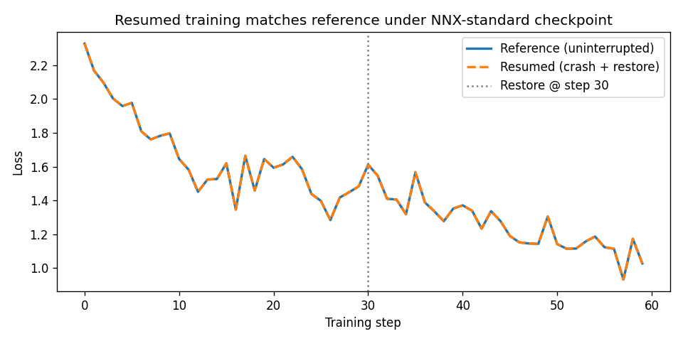

# Checkpointing and Resumable Training Guide

| Metadata | Value |
|----------|-------|
| **Level** | Advanced |
| **Runtime** | ~3 min |
| **Prerequisites** | Pipeline Quickstart, Operators Tutorial |
| **Format** | Python + Jupyter |
| **Memory** | ~500 MB RAM |

## Overview

Implement fault-tolerant training pipelines that can resume from
interruptions using the **NNX-standard checkpoint pattern** —
`nnx.to_pure_dict` for snapshotting state, Orbax for persistence, and
`nnx.replace_by_pure_dict` + `nnx.update` for restoration. The model,
the optimizer and the pipeline are checkpointed together so resumption
restores the model weights, the optimizer state, the pipeline stages'
state and where iteration stands in the data, from a single Orbax
directory.

## Learning Goals

1. Snapshot an `nnx.Module`'s state with `nnx.to_pure_dict`.
2. Persist that snapshot, and the pipeline's `get_state()`, in one
   Orbax checkpoint.
3. Restore the snapshot back into a freshly-constructed module with
   `nnx.replace_by_pure_dict` followed by `nnx.update`, and the
   pipeline's place with `set_state`.
4. Checkpoint model, optimizer and pipeline atomically so resumption
   preserves data position, model weights, and optimizer state
   simultaneously.
5. Verify deterministic resumption: a run that checkpoints at step `k`,
   loads, and continues should match a never-interrupted run exactly.

## Coming from PyTorch?

| PyTorch | Datarax |
|---------|---------|
| `torch.save({'model': model.state_dict(), 'optimizer': opt.state_dict()})` | `checkpointer.save(path, {'model': nnx.to_pure_dict(nnx.state(model)), ...})` |
| `model.load_state_dict(torch.load(path)['model'])` | `nnx.replace_by_pure_dict(nnx.state(model), saved)` then `nnx.update(model, state)` |
| DataLoader state not saved | `pipeline.get_state()` is where iteration stands, saved beside the model |

**Key difference:** the stages of a Datarax `Pipeline` are an
`nnx.Module` (`pipeline.dag`), so their parameters and random keys
checkpoint with the same three-call pattern as the model, and the
pipeline's place in the data is a small dictionary saved beside them.

## Coming from TensorFlow?

| TensorFlow | Datarax |
|------------|---------|
| `tf.train.Checkpoint(model=model, optimizer=opt)` | `nnx.to_pure_dict(nnx.state(...))` per object |
| `ckpt_manager.save()` | `checkpointer.save(path, args=ocp.args.Composite(...))` |
| `ckpt.restore(...)` | `checkpointer.restore(path, args=ocp.args.Composite(...))` then `nnx.update` |
| `tf.train.CheckpointManager(max_to_keep=3)` | `orbax.checkpoint.CheckpointManager(max_to_keep=3)` |

## Files

- **Python Script**: [`examples/advanced/checkpointing/02_resumable_training_guide.py`](https://github.com/avitai/datarax/blob/main/examples/advanced/checkpointing/02_resumable_training_guide.py)
- **Jupyter Notebook**: [`examples/advanced/checkpointing/02_resumable_training_guide.ipynb`](https://github.com/avitai/datarax/blob/main/examples/advanced/checkpointing/02_resumable_training_guide.ipynb)

## Quick Start

```bash
python examples/advanced/checkpointing/02_resumable_training_guide.py
```

```bash
jupyter lab examples/advanced/checkpointing/02_resumable_training_guide.ipynb
```

## Key Concepts

### The Three-Call NNX Checkpoint Pattern

```python
import orbax.checkpoint as ocp
from flax import nnx


def snapshot(model, optimizer, pipeline):
    return {
        "model": nnx.to_pure_dict(nnx.state(model)),
        "optimizer": nnx.to_pure_dict(nnx.state(optimizer)),
        "stages": nnx.to_pure_dict(nnx.state(pipeline.dag)),
    }


# Save: the arrays as one item, where iteration stands as a JSON item
checkpointer = ocp.Checkpointer(ocp.CompositeCheckpointHandler())
checkpointer.save(path, args=ocp.args.Composite(
    arrays=ocp.args.StandardSave(snapshot(model, optimizer, pipeline)),
    data=ocp.args.JsonSave(pipeline.get_state()),
))

# Restore — into freshly-constructed objects
restored = checkpointer.restore(path, args=ocp.args.Composite(
    arrays=ocp.args.StandardRestore(snapshot(model, optimizer, pipeline)),
    data=ocp.args.JsonRestore(),
))
saved = restored["arrays"]
for module, pure in (
    (model, saved["model"]),
    (optimizer, saved["optimizer"]),
    (pipeline.dag, saved["stages"]),
):
    state = nnx.state(module)
    nnx.replace_by_pure_dict(state, pure)
    nnx.update(module, state)
pipeline.set_state(restored["data"])
```

### Why `nnx.update`?

`nnx.state(module)` returns a *copy* of the module's state. Calling
`nnx.replace_by_pure_dict` on that copy mutates the local object but
not the module. `nnx.update(module, state)` writes the updated state
back into the module — without it, the resume looks like a reset.

### Three-Phase Verification

The example runs:

1. **Reference** — train uninterrupted for `N` steps; record loss curve.
2. **Crash** — re-train with the same seed but interrupt at step `k`,
   writing a checkpoint just before.
3. **Resume** — construct fresh model/optimizer/pipeline, load the
   step-`k` checkpoint, continue to step `N`.

Both the loss curve and the final model parameters must match the
reference exactly. The example asserts:

```python
max_param_diff = max(
    jax.tree_util.tree_leaves(
        jax.tree.map(_max_abs_diff, ref_params, restored_params)
    )
)
assert max_param_diff < 1e-3
```

## Pipeline State Captured

Two items hold a pipeline:

- `pipeline.get_state()` — where `for batch in pipeline` stands: the
  epoch, the records served in it, the epoch the run ends at, and a
  fingerprint of the configuration it is valid for (batch size, length,
  the shuffle seed). `set_state` refuses a state saved by a pipeline
  configured differently.
- `nnx.state(pipeline.dag)` — every stage's parameters, statistics and
  random keys. A stochastic operator keys each record on its stable
  base key, so no random stream advances while iterating.

## Results

Running the guide produces:

```
============================================================
PHASE 1: reference run (60 steps, no checkpoints)
============================================================
Reference: 60 steps, final loss=1.0263

============================================================
PHASE 2: train, checkpoint every 10, interrupt at step 30
============================================================
Crashed: 30 steps, final loss=1.4828
Available checkpoints: ['step_10', 'step_20', 'step_30']

============================================================
PHASE 3: restore from step 30, train to step 60
============================================================
Resumed: end step=60, final loss=1.0263
Total resumed-curve length: 60 (expected 60)
Max |reference - resumed| over 60 steps: 0.0000e+00
Max |reference - resumed| over model params: 0.0000e+00
Determinism check passed: model parameters round-trip through Orbax.
```

## Visualization



The reference curve (uninterrupted) and the resumed curve (crash +
restore) coincide exactly — every step before and after the
checkpoint produces the same loss in both runs.

## Best Practices

### Snapshot Everything That Mutates

If you forget to checkpoint a piece of state that the training step
mutates, the resumed run will diverge silently. The state-equality
assertion in this example surfaces such bugs immediately. The
canonical "everything that mutates" set is the model, the optimizer,
the pipeline's stages and the pipeline's place in the data.

### Use `CheckpointManager` for Production

For periodic-cleanup, async writes, and atomic step-N labeling, wrap
the `Checkpointer` calls in
`orbax.checkpoint.CheckpointManager`:

```python
manager = ocp.CheckpointManager(
    directory=ckpt_dir,
    options=ocp.CheckpointManagerOptions(max_to_keep=3),
)
manager.save(step, snapshot)
manager.wait_until_finished()
```

### Restore Templates Must Match

`ocp.args.StandardRestore(template)` requires the template to have the
same PyTree structure as the saved data. Build the
template by snapshotting the freshly-constructed modules — that
guarantees the structures match.

## Common Pitfalls

| Pitfall | Symptom | Fix |
|---------|---------|-----|
| Forgot `nnx.update` after `replace_by_pure_dict` | Resumed run produces same losses as a fresh run, ignoring restore | Add `nnx.update(module, state)` |
| Missing `pipeline.get_state()` in the checkpoint | Resumed run sees the same data again from step 0 | Save it beside the arrays and restore it with `set_state` |
| Saving `nnx.Module` directly to Orbax | `TypeError: cannot serialize <Module>` | Always wrap in `nnx.to_pure_dict(nnx.state(...))` |
| Template mismatch on restore | Orbax raises a structure-mismatch error | Build template by snapshotting freshly-constructed objects |

## Next Steps

- [Checkpoint Quick Reference](checkpoint-quickref.md) — single-pipeline checkpoint basics
- [DAG Construction Guide](../../../user_guide/dag_construction.md) — branching pipelines (the checkpoint pattern is identical)
- [Sharding Guide](../distributed/sharding-guide.md) — checkpointing under multi-device sharding

## API Reference

- [`Pipeline`](../../../user_guide/dag_construction.md) — Pipeline class as an `nnx.Module`
- [Orbax Checkpoint Documentation](https://orbax.readthedocs.io/) — `CompositeCheckpointHandler`, `CheckpointManager`
- [Flax NNX Checkpointing Guide](https://flax.readthedocs.io/en/latest/nnx_basics.html#checkpointing) — `nnx.to_pure_dict`, `nnx.replace_by_pure_dict`, `nnx.update`
