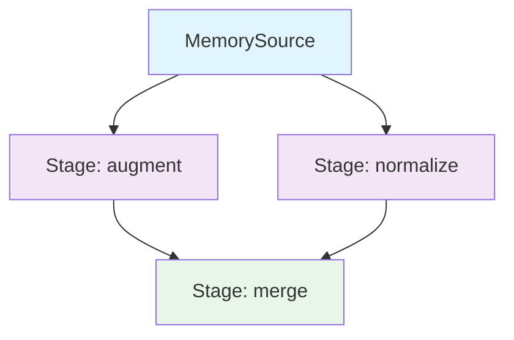

# DAG Pipeline Fundamentals Guide

| Metadata | Value |
|----------|-------|
| **Level** | Intermediate |
| **Runtime** | ~3 min |
| **Prerequisites** | Pipeline Quickstart, Operators Tutorial |
| **Format** | Python + Jupyter |

## Overview

The `Pipeline` class supports two composition modes:

- **Linear**: a list of stages applied in order via
  `Pipeline(source=..., stages=[...])`.
- **DAG**: an explicit graph of named nodes with edges via
  `Pipeline.from_dag(source=..., nodes={...}, edges={...}, sink=...)`.

The DAG mode supports branching (one node consumes the source, two
downstream nodes consume it independently) and merging (a node
consumes the outputs of multiple predecessors). Both modes share the
same `step`, `scan`, and iterator semantics.

## Setup

```bash
uv pip install datarax
```

Activate the project virtualenv:

```bash
source activate.sh
```

## Learning Goals

By the end of this guide, you will be able to:

1. Build a linear pipeline with `Pipeline(stages=[...])`.
2. Build a branching DAG with `Pipeline.from_dag(...)`.
3. Reason about topological execution order.
4. Choose between linear and DAG composition modes.

## Coming from PyTorch?

| PyTorch | Datarax |
|---------|---------|
| `DataLoader(dataset, batch_size=32)` | `Pipeline(source=source, stages=[], batch_size=32, rngs=nnx.Rngs(0))` |
| `transforms.Compose([T1, T2])` | `Pipeline(source=source, stages=[T1, T2], ...)` |
| `for x, y in loader:` | `for batch in pipeline:` (dict-keyed) |
| Manual two-loader fan-in | `Pipeline.from_dag(nodes={...}, edges={...}, sink=...)` |

## Coming from TensorFlow?

| TensorFlow tf.data | Datarax |
|--------------------|---------|
| `tf.data.Dataset.from_tensor_slices(data)` | `MemorySource(MemorySourceConfig(), data=data, rngs=nnx.Rngs(0))` |
| `dataset.batch(32).prefetch(2)` | `Pipeline(source=..., batch_size=32, ...)` |
| `dataset.map(fn)` | An `nnx.Module` placed in `stages=[...]` |
| `tf.data.Dataset.zip((a, b))` | `Pipeline.from_dag` with a merge sink |

## Coming from Google Grain?

| Grain | Datarax |
|-------|---------|
| `grain.DataLoader` | `Pipeline(source=..., stages=[...], ...)` |
| `grain.MapTransform` | `nnx.Module` (or `OperatorModule` subclass) in `stages=[...]` |
| `grain.Batch` | The `batch_size=N` argument on `Pipeline(...)` |

## Files

- **Python Script**: [`examples/advanced/dag/01_dag_fundamentals_guide.py`](https://github.com/avitai/datarax/blob/main/examples/advanced/dag/01_dag_fundamentals_guide.py)
- **Jupyter Notebook**: [`examples/advanced/dag/01_dag_fundamentals_guide.ipynb`](https://github.com/avitai/datarax/blob/main/examples/advanced/dag/01_dag_fundamentals_guide.ipynb)

## Quick Start

```bash
python examples/advanced/dag/01_dag_fundamentals_guide.py
```

```bash
jupyter lab examples/advanced/dag/01_dag_fundamentals_guide.ipynb
```

## Architecture Overview



## Key Concepts

### Part 1: Linear Pipeline

The simplest composition mode is a linear chain of stages. Each
stage receives the previous stage's output and returns the next.

```python
from flax import nnx

from datarax.operators import ElementOperator, ElementOperatorConfig
from datarax.pipeline import Pipeline
from datarax.sources import MemorySource, MemorySourceConfig


def normalize(element, key=None):
    del key
    image = element.data["image"]
    return element.update_data({"image": (image - 0.5) / 0.5})


normalize_op = ElementOperator(
    ElementOperatorConfig(stochastic=False),
    fn=normalize,
    rngs=nnx.Rngs(0),
)

source = MemorySource(MemorySourceConfig(), data=data, rngs=nnx.Rngs(0))
linear_pipeline = Pipeline(
    source=source,
    stages=[normalize_op],
    batch_size=16,
    rngs=nnx.Rngs(0),
)
```

### Part 2: Branching DAG

When two downstream stages need to consume the source independently
(for example, an augmentation branch and a clean-reference branch
running side by side), use `Pipeline.from_dag`. Each node declares
its predecessors via the `edges` mapping.

```python
import jax.numpy as jnp


class _Augment(nnx.Module):
    """Multiplicative brightness jitter."""

    def __init__(self, factor: float = 1.2) -> None:
        self.factor = jnp.float32(factor)

    def __call__(self, batch):
        return {**batch, "image": batch["image"] * self.factor}


class _Normalize(nnx.Module):
    """Standardise to zero-mean unit-variance."""

    def __call__(self, batch):
        return {**batch, "image": (batch["image"] - 0.5) / 0.5}


class _StackBranches(nnx.Module):
    """Merge two batches by stacking the image fields."""

    def __call__(self, augmented, clean):
        return {
            "image": jnp.stack([augmented["image"], clean["image"]], axis=1),
            "label": augmented["label"],
        }


nodes = {
    "augment": _Augment(),
    "normalize": _Normalize(),
    "stack": _StackBranches(),
}
edges = {
    "augment": [],            # consumes source directly
    "normalize": [],          # consumes source directly
    "stack": ["augment", "normalize"],  # merges both branches
}

dag_pipeline = Pipeline.from_dag(
    source=source,
    nodes=nodes,
    edges=edges,
    sink="stack",
    batch_size=16,
    rngs=nnx.Rngs(0),
)
```

### Part 3: Topological Execution Order

The DAG executor topologically sorts the nodes so each node runs
after all its predecessors. You do not need to specify execution
order manually — only the dependency edges. Cycles raise
`ValueError` at construction time.

The `pipeline.stages` property returns the resolved modules in
topological order — useful for inspection or partial replacement.

### Part 4: When To Use Each Mode

- **Linear (`stages=[...]`)** — when each stage produces input for
  the next stage and there is no branching. Most augmentation
  pipelines fit this shape.
- **DAG (`from_dag(...)`)** — when you need branching (one input,
  multiple downstream consumers), merging (one node consumes
  multiple predecessors), or named nodes for inspection or partial
  replacement.

Both modes share `pipeline.step`, `pipeline.scan`, the iterator
protocol, and JIT semantics. There is no performance difference for
identical topologies.

## Execution Model

| Aspect | Description |
|--------|-------------|
| **Pull-based** | Data pulled through stages on iteration or scan |
| **Topological** | Stages execute after all predecessors complete |
| **JIT-aware** | `Pipeline.step` is `@nnx.jit`-decorated; `Pipeline.scan` compiles whole epochs |
| **NNX-native** | Stages are `nnx.Module`s; state flows naturally through `nnx.value_and_grad` |

## Results

Running the guide produces:

```
JAX version: 0.9.1
Source: 64 samples
Linear pipeline output: image shape=(16, 32, 32, 3)
DAG pipeline output: image shape=(16, 2, 32, 32, 3)
Linear pipeline: 1 stages
DAG pipeline:    3 stages
DAG Pipeline Fundamentals Guide
==================================================
Linear: processed 64 samples
DAG: processed 64 samples
Guide completed successfully!
```

## Next Steps

- [Branching DAG Cookbook](branching-dag-cookbook.md) — Branch / Merge / Parallel recipes (runnable)
- [Sharding Guide](../distributed/sharding-guide.md) — Distributed pipelines
- [Performance Guide](../performance/optimization-guide.md) — Optimization tips

## API Reference

- [`Pipeline`](../../../user_guide/dag_construction.md) — Linear and DAG pipelines
- [`MemorySource`](../../../sources/memory_source.md) — In-memory data source
