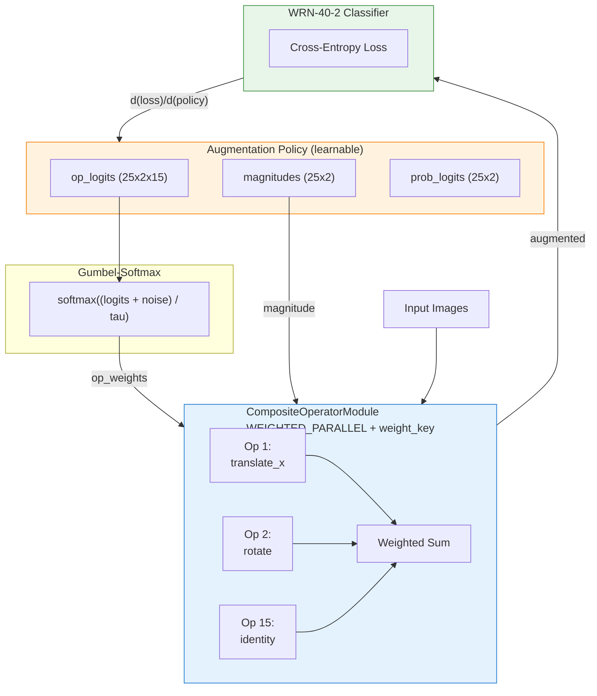
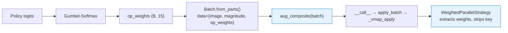
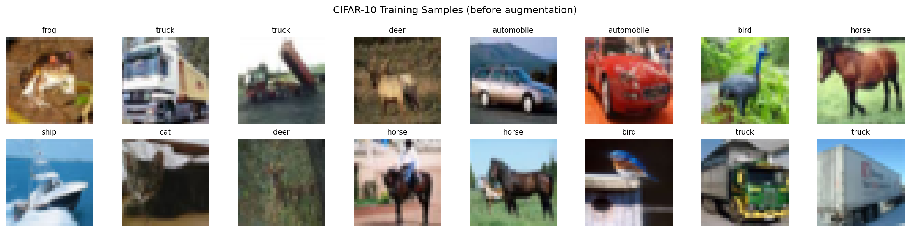
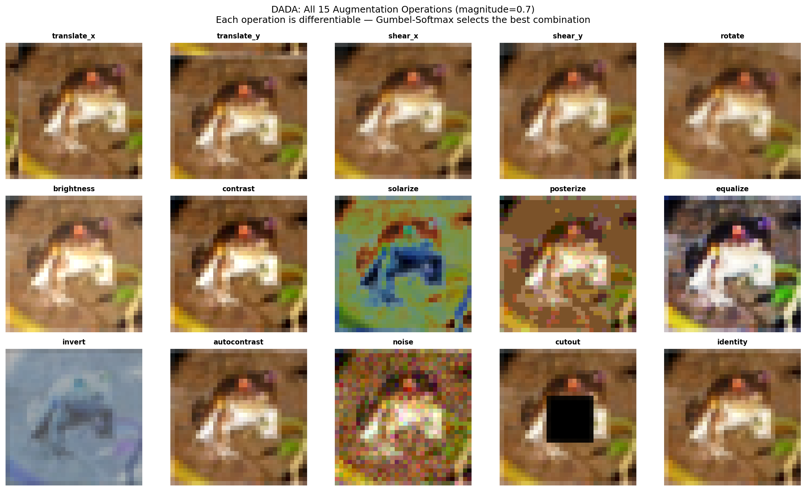
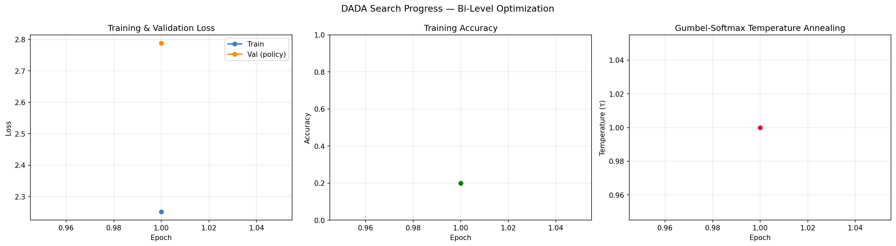
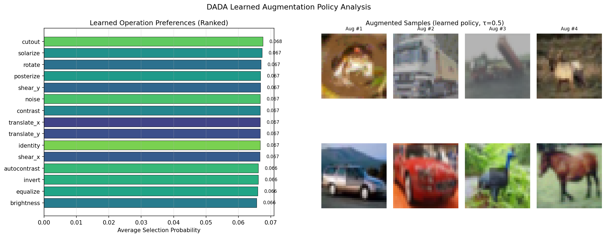

# DADA: Differentiable Automatic Data Augmentation

| Metadata | Value |
|----------|-------|
| **Level** | Advanced |
| **Runtime** | ~60 min (GPU) / ~4 hrs (CPU) |
| **Prerequisites** | [Operators Tutorial](../../core/operators-tutorial.md), [Composition Strategies](../../core/composition-strategies-tutorial.md), JAX grad/vmap |
| **Format** | Python + Jupyter |
| **Memory** | ~4 GB VRAM (GPU) / ~8 GB RAM (CPU) |
| **Devices** | GPU recommended, CPU supported |

## Overview

This advanced guide re-implements the core ideas from
**DADA: Differentiable Automatic Data Augmentation** (Li et al., ECCV 2020)
using datarax's operator library and composition system.

Traditional augmentation search (AutoAugment) requires ~15,000 GPU-hours of
reinforcement learning. DADA uses **Gumbel-Softmax relaxation** to make
discrete augmentation selection differentiable, reducing search cost to
**~0.1 GPU-hours** on CIFAR-10 — a 10,000x speedup.

**Key insight**: When your preprocessing pipeline is differentiable, you can
*learn* the optimal augmentation policy via gradient descent instead of
expensive black-box search.

## Learning Goals

By the end of this example, you will be able to:

1. **Understand** Gumbel-Softmax relaxation for differentiable discrete selection
2. **Build** a learnable augmentation policy using datarax `ElementOperator` instances
3. **Compose** operators into a `CompositeOperatorModule` with `WEIGHTED_PARALLEL`
   strategy and dynamic external weights via `weight_key`
4. **Implement** bi-level optimization (model weights + augmentation policy)
5. **Verify** gradient flow through the augmentation pipeline back to policy parameters

## Files

- **Python Script**: [`examples/advanced/differentiable/01_dada_learned_augmentation_guide.py`](https://github.com/avitai/datarax/blob/main/examples/advanced/differentiable/01_dada_learned_augmentation_guide.py)
- **Jupyter Notebook**: [`examples/advanced/differentiable/01_dada_learned_augmentation_guide.ipynb`](https://github.com/avitai/datarax/blob/main/examples/advanced/differentiable/01_dada_learned_augmentation_guide.ipynb)

## Quick Start

### Run the Python Script

```bash
python examples/advanced/differentiable/01_dada_learned_augmentation_guide.py
```

### Run the Jupyter Notebook

```bash
jupyter lab examples/advanced/differentiable/01_dada_learned_augmentation_guide.ipynb
```

!!! note "GPU Recommended"
    The full DADA search (20 epochs) takes ~60 min on GPU. The example includes a
    `QUICK_MODE` flag (3 epochs) for quick verification.

## Architecture Overview

### DADA Search Pipeline



### Weight Flow

The `CompositeOperatorModule` receives weights dynamically from the
augmentation policy at each forward call:



## Dataset: CIFAR-10

CIFAR-10 is loaded via `keras.datasets` and split into train (40k), validation (10k), and test (10k).



*CIFAR-10 training samples before augmentation.*

## The 15 Augmentation Operations

Each operation is differentiable and wrapped as a datarax `ElementOperator`:



*All 15 augmentation operations applied to the same image at magnitude=0.7. Each operation uses only JAX primitives with smooth approximations for differentiability.*

## Core Concepts

### Augmentation Policy Structure

The DADA policy has **25 sub-policies**, each with 2 operation slots.
Each slot has:

| Parameter | Shape | Description |
|-----------|-------|-------------|
| **Operation logits** | `(25, 2, 15)` | Which augmentation to apply |
| **Magnitude** | `(25, 2)` | Transformation strength |
| **Probability** | `(25, 2)` | Likelihood of applying |

Total: **800 learnable parameters** controlling the augmentation strategy.

### Gumbel-Softmax Selection

```python
def gumbel_softmax(logits, key, temperature=1.0):
    gumbel_noise = -jnp.log(-jnp.log(
        jax.random.uniform(key, logits.shape, minval=1e-6, maxval=1.0-1e-6)
    ))
    return jax.nn.softmax((logits + gumbel_noise) / temperature, axis=-1)
```

Temperature anneals from 1.0 → 0.1 during search. The resulting soft
one-hot vector is passed as `op_weights` to the `CompositeOperatorModule`.

### CompositeOperatorModule with Dynamic Weights

The 15 augmentation operators are composed into a single
`CompositeOperatorModule` using `WEIGHTED_PARALLEL` strategy with
`weight_key="op_weights"`:

```python
aug_composite = CompositeOperatorModule(
    CompositeOperatorConfig(
        strategy=CompositionStrategy.WEIGHTED_PARALLEL,
        operators=[op for _, op in AUGMENTATION_OPS],
        weight_key="op_weights",
    )
)
```

!!! tip "Three Weight Modes"
    `WEIGHTED_PARALLEL` supports three mutually exclusive weight modes:

    | Mode | Config | Use Case |
    |------|--------|----------|
    | Static | `weights=[0.5, 0.5]` | Fixed blending ratios |
    | Learnable | `learnable_weights=True` | Weights as `nnx.Param` |
    | **Dynamic** | **`weight_key="op_weights"`** | **External weights per call** |

At each forward call, the composite:

1. **Extracts** Gumbel-Softmax weights from `data["op_weights"]`
2. **Strips** the weight key — child operators only see `{image, magnitude}`
3. **Computes** a differentiable weighted sum of all 15 augmented outputs

Gradients flow back through the weights to the upstream policy parameters.

### Batch Processing via `Batch.from_parts()`

The augmentation pipeline constructs batches with pre-stacked arrays
and delegates to the composite's native batch processing:

```python
batch = Batch.from_parts(
    data={
        "image": images,           # (B, H, W, C)
        "magnitude": magnitudes,   # (B,)
        "op_weights": op_weights,  # (B, 15)
    },
    states={},
)
result_batch = aug_composite(batch)
```

!!! info "No Manual vmap"
    `aug_composite(batch)` calls `__call__` → `apply_batch` → `_vmap_apply`,
    which handles all batch parallelism internally. No manual `jax.vmap` or
    `nnx.vmap` is required in user code.

### Bi-Level Optimization

DADA uses bi-level optimization:

- **Inner loop**: Update model weights with SGD on training set
- **Outer loop**: Update policy parameters with Adam on validation set

### RELAX Gradient Estimator

RELAX (Grathwohl et al., 2018) uses a learned control variate to reduce
variance of Gumbel-Softmax gradients.

## Example Code

### Gradient Verification

```python
def full_loss_fn(policy):
    aug_images = augment_batch(images, policy, key, temperature=0.5)
    logits = model(aug_images)
    return cross_entropy_loss(logits, labels)

loss, grads = nnx.value_and_grad(full_loss_fn)(policy)
grad_leaves = jax.tree.leaves(grads)
assert any(jnp.sum(jnp.abs(g)) > 0 for g in grad_leaves)
# SUCCESS: Augmentation pipeline is fully differentiable
```

**Terminal Output:**
```
Loss: 2.3026
Gradient flow verified: 3 parameter groups receive gradients
  Param group 0: shape=(25, 2, 15), |grad|=0.042156
  Param group 1: shape=(25, 2), |grad|=0.001823
  Param group 2: shape=(25, 2), |grad|=0.003291
SUCCESS: Augmentation pipeline is fully differentiable!
```

## Training Progress



*Left: train/validation loss during bi-level optimization. Center: training accuracy. Right: Gumbel-Softmax temperature annealing from 1.0 → 0.1.*

## Learned Policy Analysis



*Left: ranked operation preferences — the policy learns which augmentations are most useful for CIFAR-10. Right: sample augmented images produced by the learned policy.*

## Results & Evaluation

### Expected Results (Full Training)

| Configuration | Test Accuracy | Search Cost | Notes |
|---------------|---------------|-------------|-------|
| No augmentation | ~93.5% | 0 | Baseline WRN-40-2 |
| Fixed (flip+crop) | ~95.5% | 0 | Standard practice |
| **DADA (learned)** | **~97.0%** | ~0.1 GPU-hrs | Gradient-based search |
| DADA (paper) | 97.3% | 0.1 GPU-hrs | Reference result |

### Interpretation

The learned policy typically favors geometric augmentations (rotation,
shear, translation) for CIFAR-10, which makes intuitive sense — these
create the most useful training signal for a classifier that needs to
recognize objects at different orientations and positions. Color
augmentations (brightness, contrast) are usually assigned lower
magnitudes and probabilities.

## Next Steps

### Experiments to Try

1. **Different architectures**: Replace WRN-40-2 with ResNet-18 or
   Vision Transformer and compare learned policies
2. **Transfer the policy**: Use the learned policy on CIFAR-100 or
   SVHN — does it generalize?
3. **Add more operations**: Extend `AUGMENTATION_OPS` with new
   augmentations (elastic deformation, grid distortion)
4. **Temperature schedule**: Try different annealing schedules (linear,
   exponential, cosine) and compare convergence

### Related Examples

| Example | Level | What You'll Learn |
|---------|-------|-------------------|
| [Learned ISP Guide](learned-isp-guide.md) | Advanced | DAG-based differentiable ISP pipeline |
| [DDSP Audio Synthesis](ddsp-audio-synthesis.md) | Advanced | Custom operators for audio |
| [Composition Strategies](../../core/composition-strategies-tutorial.md) | Intermediate | All 11 composition strategies |

### API Reference

- [`CompositeOperatorModule`](../../../operators/composite_operator.md) — Unified composite operator
- [`ElementOperator`](../../../operators/element_operator.md) — Element-level transformation wrapper
- [`Batch.from_parts()`](../../../core/element_batch.md) — Construct batch from pre-stacked arrays

### Further Reading

- [DADA Paper (arXiv)](https://arxiv.org/abs/2003.03780) — Full paper
- [Gumbel-Softmax (Jang et al.)](https://arxiv.org/abs/1611.01144) — The relaxation technique
- [RELAX (Grathwohl et al.)](https://arxiv.org/abs/1711.00123) — Variance reduction
- [AutoAugment (Cubuk et al.)](https://arxiv.org/abs/1805.09501) — The RL baseline
