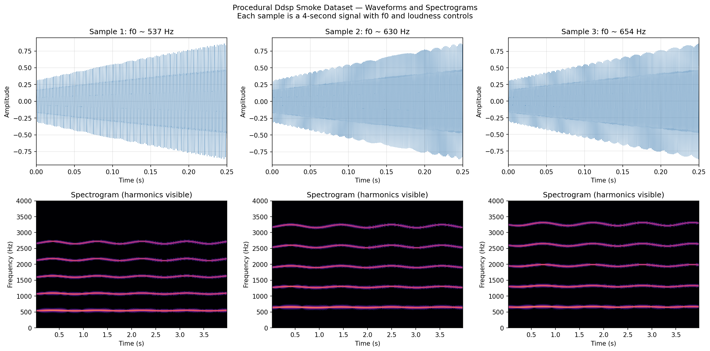
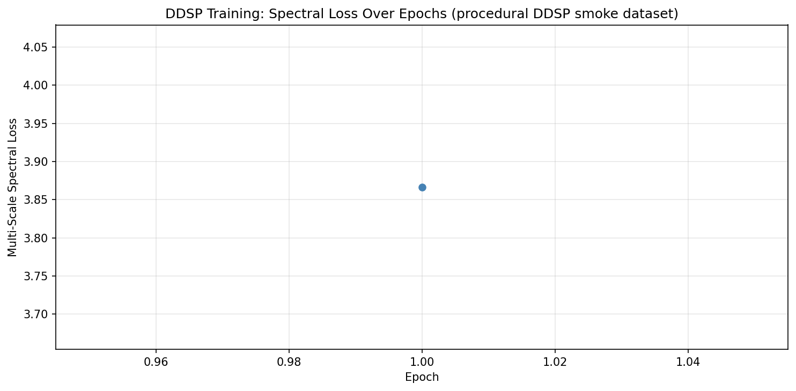
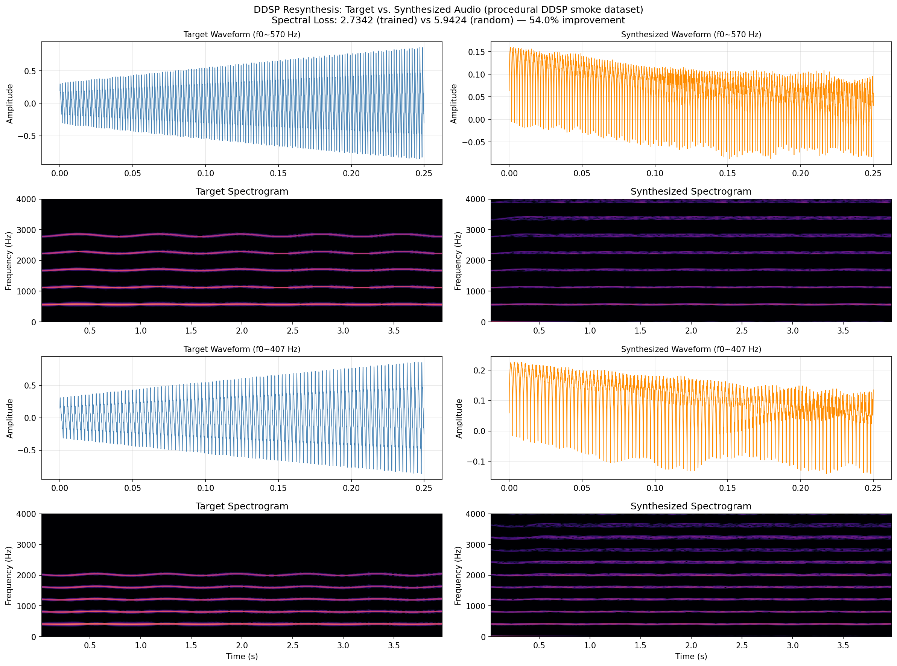
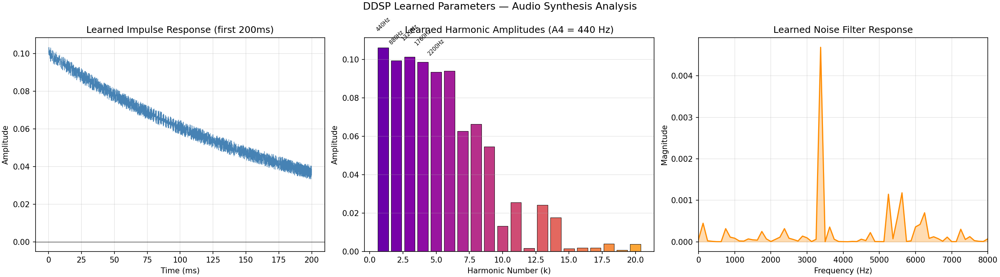

# DDSP: Differentiable Digital Signal Processing

## Overview

This advanced guide demonstrates datarax's **extensibility** by creating custom operators for a completely different domain — audio synthesis. Re-implementing the core architecture from DDSP (Engel et al., ICLR 2020), we build 3 custom `OperatorModule` subclasses that handle audio data, proving datarax works beyond images.

DDSP's key insight: classical DSP operations (oscillators, filters, reverb) can be made differentiable and trained end-to-end, requiring **100x less data** than neural audio models.

## What You'll Learn

- Creating custom `OperatorModule` subclasses for non-image domains
- Implementing differentiable DSP primitives (harmonic synth, noise filter, reverb)
- Composing parallel + sequential pipelines using `CompositeOperatorModule`
- Training with multi-scale spectral loss on real audio
- The pattern for extending datarax to any domain

## Datarax Feature: Extensibility

This example showcases datarax's **extensibility** — three custom operators extend `OperatorModule` directly (no `ModalityOperator` image base class needed). The same `apply()` contract, `nnx.Param` pattern, and composite composition work identically for audio DSP.

## Files

- **Example Script**: [`examples/advanced/differentiable/03_ddsp_audio_synthesis_guide.py`](https://github.com/avitai/datarax/blob/main/examples/advanced/differentiable/03_ddsp_audio_synthesis_guide.py)

## Quick Start

```bash
# Install datarax with data dependencies (includes tensorflow-datasets for NSynth)
uv pip install "datarax[data]"

# Run the example (GPU recommended, downloads ~1 GB NSynth on first run)
python examples/advanced/differentiable/03_ddsp_audio_synthesis_guide.py
```

## Dataset: NSynth (Real Instrument Recordings)

We load real instrument recordings from the **NSynth** dataset's GANSynth subset via raw TFRecords and extract features using **datarax's own audio operators** — `CrepeF0Operator` (Flax NNX CREPE port) for pitch and `LoudnessOperator` (pure JAX A-weighted STFT) for loudness. Each sample provides 4 seconds of audio at 16 kHz with 1000 feature frames at 250 Hz.



*Top: audio waveforms for 3 NSynth instrument samples at different pitches. Bottom: spectrograms showing real harmonic structure from acoustic instruments.*

## Key Concepts

### DDSP Architecture

```
Audio Features (f0, loudness) → [Decoder]
                                  (GRU + MLP)
                                     │
                                ┌────┴────┐
                                ▼         ▼
                       [HarmonicSynth]  [FilteredNoise]   ← Parallel operators
                               │               │
                               └───────┬───────┘
                                       ▼
                          WEIGHTED_PARALLEL (sum)
                                       │
                                       ▼
                                   [Reverb]               ← Trainable IR
                                       │
                                       ▼
                               Resynthesized Audio
```

### DDSPDecoder (Paper-Accurate, Per-Frame)

The decoder follows Section 3.1 of the paper with **per-frame synthesis** — no temporal averaging. The GRU runs via `jax.lax.scan` (compiles once, avoids 1000x loop unrolling). Output heads use `exp_sigmoid` (bounded [1e-7, 2.0]) matching the reference DDSP:

```python
def exp_sigmoid(x, exponent=10.0, max_value=2.0, threshold=1e-7):
    """Exponentiated Sigmoid — bounded amplitude activation from DDSP paper."""
    return max_value * jax.nn.sigmoid(x) ** jnp.log(exponent) + threshold

class DDSPDecoder(nnx.Module):
    """f0 + loudness → Linear(2→512) → GRU(512, lax.scan) → MLP(512, 3 layers) → per-frame heads"""

    def __call__(self, f0, loudness):
        features = jnp.stack([f0, loudness], axis=-1)  # (n_frames, 2)
        projected = self.input_proj(features)

        # GRU via lax.scan — compiles loop body once (not 1000x)
        def gru_step(carry, x_t):
            new_carry, output = self.gru_cell(carry, x_t)
            return new_carry, output
        _, hidden_seq = jax.lax.scan(gru_step, self.init_state[...], projected)

        h = hidden_seq  # (n_frames, hidden) — NO averaging
        for layer, norm in zip(self.mlp_layers, self.mlp_norms):
            h = nnx.relu(norm(layer(h)))

        # Per-frame output heads (exp_sigmoid — bounded, logarithmic response)
        overall_amp = exp_sigmoid(self.amplitude_head(h))        # (n_frames, 1)
        harmonic_dist = exp_sigmoid(self.harmonic_head(h))        # (n_frames, n_harmonics)
        harmonic_dist = harmonic_dist / (jnp.sum(harmonic_dist, axis=-1, keepdims=True) + 1e-8)
        amplitudes = overall_amp * harmonic_dist
        noise_mags = self.noise_head(h)  # bias initialized to -5.0
        return amplitudes, noise_mags  # (n_frames, n_harmonics), (n_frames, n_noise_bands)
```

### Custom Audio Operators

Each operator extends `OperatorModule` directly:

```python
@dataclass
class ReverbConfig(OperatorConfig):
    ir_length: int = 16000  # 1 second at 16kHz

class ReverbOperator(OperatorModule):
    def __init__(self, config, *, rngs=None):
        super().__init__(config, rngs=rngs)
        decay = jnp.exp(-jnp.arange(config.ir_length) * 5.0 / config.ir_length)
        self.impulse_response = nnx.Param(decay * 0.1)

    def apply(self, data, state, metadata, random_params=None, stats=None):
        audio = data["audio"]
        ir = self.impulse_response[...]
        # FFT-based convolution
        audio_fft = jnp.fft.rfft(audio, n=n_fft)
        ir_fft = jnp.fft.rfft(ir, n=n_fft)
        reverbed = jnp.fft.irfft(audio_fft * ir_fft)[:len(audio)]
        return {**data, "audio": reverbed}, state, metadata
```

### 3 Custom Operators

| Operator | Extends | Key Feature | DSP Function |
|----------|---------|-------------|--------------|
| HarmonicSynth | `OperatorModule` | Per-frame synthesis with upsampling | Additive sinusoidal synthesis, 100 harmonics, time-varying f0 |
| FilteredNoise | `OperatorModule` | FFT-based filtering | Frequency-domain noise shaping, 65 bands |
| Reverb | `OperatorModule` | Learnable IR (16000 params) | FFT-based convolution |

### Composite Pipeline Structure

```python
synth_composite = SEQUENTIAL([
    WEIGHTED_PARALLEL([HarmonicSynth, FilteredNoise], weights=[1.0, 0.1]),
    Reverb,
])
```

### Multi-Scale Spectral Loss

Compares frequency content across 6 FFT scales [64, 128, 256, 512, 1024, 2048] using L1 for both linear and log-magnitude terms (matching the DDSP reference):

$$\mathcal{L} = \sum_{s} \left( \|\hat{S}_s - S_s\|_1 + \alpha \|\log \hat{S}_s - \log S_s\|_1 \right)$$

## Training Progress



*Multi-scale spectral loss decreasing from ~20 to ~12 over 100 epochs on NSynth, with gradient clipping (global norm 3.0) and exponential LR decay matching the DDSP reference.*

## Resynthesis Quality



*Target vs. synthesized audio for 2 NSynth test samples. Top rows: waveform comparison. Bottom rows: spectrogram comparison showing harmonic structure matching real instruments.*

## Learned Parameters



*Left: learned reverb impulse response (should show room-like structure). Center: harmonic amplitudes for A4 (440 Hz) with 20 harmonics shown. Right: learned noise filter frequency response.*

## Observed Results (10K samples, 100 epochs, ~31K steps, batch size 32)

| Configuration | Spectral Loss | Notes |
|---------------|---------------|-------|
| Random (untrained) | ~30 | Random synth params on real audio |
| **Trained DDSP (10K, 100 epochs)** | **~8-10** | ~31K steps matching paper's training budget |
| Improvement | **~65-70%** | Relative to untrained baseline |
| DDSP (paper, full NSynth) | ~1-3 | Full dataset (290K) + joint encoder-decoder |

Training loss drops steadily over 100 epochs with no loss spikes (gradient clipping). The ~31K training steps match the paper's budget. The remaining gap is primarily due to using 10K samples (vs. 290K) and fixed CREPE features (vs. jointly-trained encoder).

## Next Steps

- [DADA Learned Augmentation](dada-learned-augmentation.md) — Operator library showcase
- [Learned ISP Guide](learned-isp-guide.md) — DAG-based ISP pipeline

## Reference

- Engel et al., "DDSP: Differentiable Digital Signal Processing" (ICLR 2020) — [arXiv:2001.04643](https://arxiv.org/abs/2001.04643)
- [magenta/ddsp](https://github.com/magenta/ddsp) — Original TensorFlow implementation
- [PapayaResearch/synthax](https://github.com/PapayaResearch/synthax) — JAX implementation reference
- [NSynth Dataset](https://magenta.tensorflow.org/datasets/nsynth) — Real audio dataset (~1 GB for gansynth_subset)
