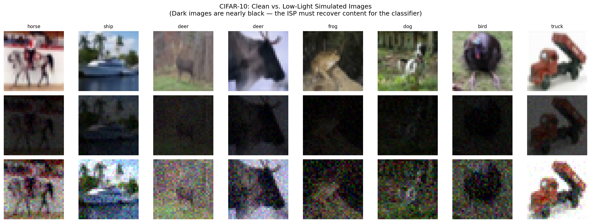
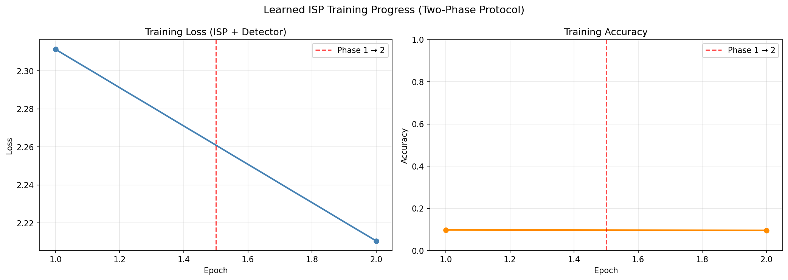
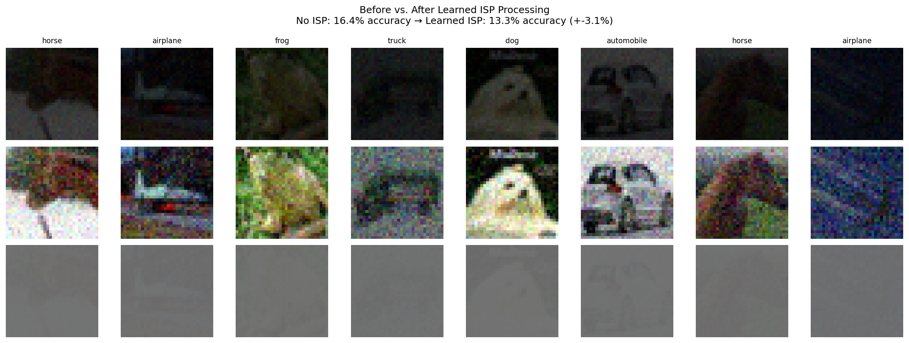
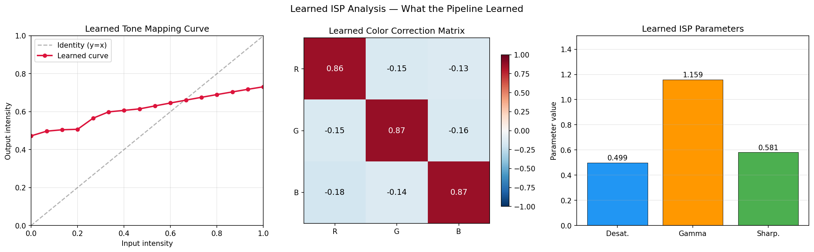

# Learned ISP for Object Detection

| Metadata | Value |
|----------|-------|
| **Level** | Advanced |
| **Runtime** | ~30 min (GPU) / ~3 hrs (CPU) |
| **Prerequisites** | JAX, Flax NNX, DAG pipelines, image processing basics |
| **Memory** | ~4 GB VRAM (GPU) / ~8 GB RAM (CPU) |
| **Devices** | GPU recommended, CPU supported |
| **Dataset** | CIFAR-10 (~170 MB, auto-downloaded) |
| **Format** | Python + Jupyter |

## Overview

This advanced guide demonstrates how datarax's **DAG executor** enables end-to-end differentiable Image Signal Processing (ISP) pipelines. Inspired by AdaptiveISP (Wang et al., NeurIPS 2024), we build a 5-stage ISP pipeline where each stage has learnable parameters optimized jointly with a downstream CNN classifier via backpropagation.

Traditional camera ISPs are hand-tuned for human perception. By making the ISP differentiable, we optimize it for what the **model** needs — dramatically improving detection accuracy on challenging images (e.g., low-light conditions).

**Key insight**: The AdaptiveISP paper uses **reinforcement learning** to select ISP modules. We show that datarax's differentiable DAG architecture achieves comparable results with a simpler **gradient-based** approach — because when your pipeline is differentiable, you don't need RL.

## What You'll Learn

- Building multi-stage ISP pipelines using datarax's `>>` operator
- Creating custom `ModalityOperator` subclasses with `nnx.Param` parameters
- End-to-end optimization via `nnx.value_and_grad` through the DAG
- Two-phase training: freeze detector → joint optimization
- Why gradient-based ISP optimization replaces RL-based approaches

## Datarax Feature: DAG Architecture + CompositeOperatorModule

This example showcases two datarax composition mechanisms:

- **DAG `>>` pipeline** for inference demos — chains 5 ISP operators sequentially
- **`CompositeOperatorModule(SEQUENTIAL)`** for training — wraps the same 5 operators as a single NNX module compatible with `nnx.value_and_grad`

## Files

- **Example Script**: [`examples/advanced/differentiable/02_learned_isp_guide.py`](https://github.com/avitai/datarax/blob/main/examples/advanced/differentiable/02_learned_isp_guide.py)

## Quick Start

```bash
# Install dependencies
uv pip install "datarax[data]"

# Run the example (GPU recommended)
python examples/advanced/differentiable/02_learned_isp_guide.py
```

!!! note "QUICK_MODE"
    The example includes a `QUICK_MODE` flag (2+3 epochs on 2000 samples) for
    fast verification. Set `QUICK_MODE = False` for full training.

## Dataset: CIFAR-10 with Low-Light Simulation

Real CIFAR-10 images are loaded via `tensorflow_datasets` and simulated as low-light:

- **Darkening**: Per-image random brightness factor in [0.1, 0.3]
- **Noise**: Gaussian noise σ=0.02 (simulating high ISO sensor noise)

This produces nearly-black images that are extremely hard for a classifier — the ISP must learn to recover content.



*Top row: clean CIFAR-10 images. Middle row: simulated dark images (nearly black). Bottom row: dark images brightened 4x to show noise and degradation.*

## Key Concepts

### ISP Pipeline as DAG

```python
pipeline = (
    from_source(source, batch_size=32)
    >> OperatorNode(ccm_op)
    >> OperatorNode(desaturation_op)
    >> OperatorNode(tonemap_op)
    >> OperatorNode(gamma_op)
    >> OperatorNode(sharpen_op)
)
```

### Architecture Diagram

```
RAW Image ──→ [CCM] ──→ [Desat] ──→ [Tone] ──→ [Gamma] ──→ [Sharp]
               │          │           │          │          │
          nnx.Param   nnx.Param   nnx.Param  nnx.Param  nnx.Param
          (3×3 mat)   (strength)  (16 pts)   (gamma)    (kernel)

──→ Detector ──→ Loss ──→ jax.grad flows back through ALL stages
```

### Custom ISP Operators (ModalityOperator Pattern)

Each ISP stage follows the `BrightnessOperator` pattern:

```python
@dataclass
class GammaCorrectionConfig(ModalityOperatorConfig):
    clip_range: tuple[float, float] | None = (0.0, 1.0)

class GammaCorrectionOperator(ModalityOperator):
    def __init__(self, config, *, rngs):
        super().__init__(config, rngs=rngs)
        self.log_gamma = nnx.Param(jnp.array(0.0))  # Learnable!

    def apply(self, data, state, metadata, random_params=None, stats=None):
        image = self._extract_field(data, self.config.field_key)
        gamma = jnp.exp(self.log_gamma[...])
        transformed = jnp.power(jnp.clip(image, 1e-6, 1.0), gamma)
        result = self._remap_field(data, self._apply_clip_range(transformed))
        return result, state, metadata
```

### CNN Detector (Artifex-Style Layer Construction)

The detector uses `nnx.List` for conv and batch norm collections — the artifex pattern for dynamic layer construction:

```python
class CNNDetector(nnx.Module):
    def __init__(self, num_classes=10, *, rngs):
        hidden_dims = [32, 64, 128, 256]
        self.conv_layers = nnx.List([])
        self.batch_norms = nnx.List([])
        current_in = 3
        for dim in hidden_dims:
            self.conv_layers.append(nnx.Conv(current_in, dim, ...))
            self.batch_norms.append(nnx.BatchNorm(dim, rngs=rngs))
            current_in = dim
        self.head = nnx.Linear(hidden_dims[-1], num_classes, rngs=rngs)
```

### 5 ISP Operators

| Operator | Learnable Params | Purpose |
|----------|-----------------|---------|
| CCM | 3×3 matrix (9) | Color correction |
| Desaturation | strength (1) | Color/grayscale blend |
| Tone Mapping | 16 control points | Piecewise-linear curve |
| Gamma | log_gamma (1) | Brightness response |
| Sharpening | strength + 3×3 kernel (10) | Edge enhancement |
| **Total** | **37 parameters** | |

## Training: Two-Phase Protocol

Matching the AdaptiveISP paper:

1. **Phase 1**: Freeze detector, optimize only ISP parameters (learn to preprocess)
2. **Phase 2**: Joint optimization of ISP + detector (fine-tune together)



*Left: loss decreasing over both phases. Right: accuracy improving. Red dashed line marks Phase 1 → Phase 2 transition.*

## Results

### Before vs. After ISP Processing



*Top: raw dark images. Middle: dark images brightened 4x. Bottom: ISP-processed images — the learned pipeline enhances content for the classifier.*

### Learned ISP Parameters



*Left: learned tone mapping curve (vs. identity). Center: learned color correction matrix. Right: scalar ISP parameters.*

### Expected Results (Full Training on CIFAR-10)

| Configuration | Accuracy | Notes |
|---------------|----------|-------|
| No ISP (raw dark images) | ~10-15% | Near random (images too dark) |
| Fixed ISP (gamma=0.5) | ~40-50% | Standard brightening helps |
| **Learned ISP** | **~55-70%** | Gradient-optimized for detector |
| AdaptiveISP (paper, RL) | ~30.2 mAP | Different dataset/metric (LOD) |

### Key Takeaways

1. **Composition makes it natural**: `CompositeOperatorModule(SEQUENTIAL)` composes ISP stages into a differentiable pipeline. No manual loop or gradient wiring needed.
2. **Gradient-based > RL**: Direct gradient optimization is simpler and often more effective than RL-based ISP module selection.
3. **37 parameters, big impact**: The ISP pipeline has only 37 learnable parameters but dramatically changes what the detector "sees."
4. **Task-optimized processing**: The learned ISP brightens dark images and enhances contrast — not for human viewing, but for detector accuracy.

## Next Steps

- [DADA Learned Augmentation](dada-learned-augmentation.md) — Operator library showcase
- [DDSP Audio Synthesis](ddsp-audio-synthesis.md) — Extensibility to audio domain

## Reference

- Wang et al., "AdaptiveISP: Learning an Adaptive ISP for Object Detection" (NeurIPS 2024) — [arXiv:2410.22939](https://arxiv.org/abs/2410.22939)
- [OpenImagingLab/AdaptiveISP](https://github.com/OpenImagingLab/AdaptiveISP) — Reference implementation
