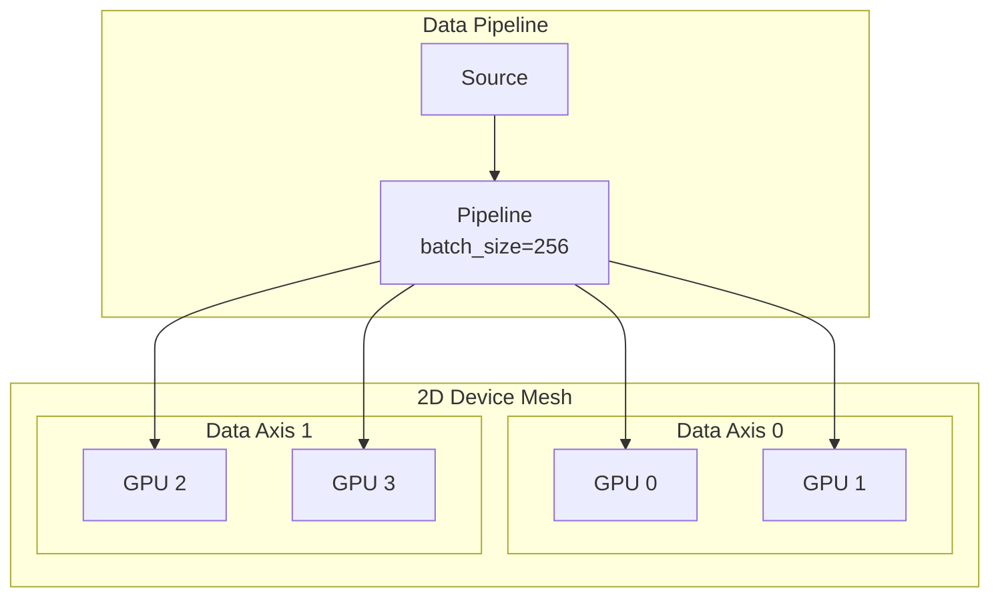

# Distributed Data Loading with Sharding Guide

| Metadata | Value |
|----------|-------|
| **Level** | Advanced |
| **Runtime** | ~45 min |
| **Prerequisites** | Sharding Quick Reference, JAX device placement |
| **Format** | Python + Jupyter |
| **Memory** | ~2 GB RAM per device |

## Overview

This in-depth guide covers distributed data loading patterns for
multi-device JAX setups. You'll learn to shard data across GPUs/TPUs,
optimize throughput for distributed training, and handle common pitfalls.

## What You'll Learn

1. Design data parallelism strategies for different device topologies
2. Implement efficient sharded batch distribution
3. Profile and optimize distributed data loading
4. Handle edge cases (uneven batches, device failures)
5. Integrate sharded pipelines with distributed training

## Coming from PyTorch?

| PyTorch | Datarax |
|---------|---------|
| `DistributedDataParallel(model)` | Model with `Mesh` context |
| `DistributedSampler` | Data sharded via `PartitionSpec` |
| `torch.distributed.all_reduce()` | JAX handles via GSPMD |
| `world_size`, `rank` | `mesh.axis_size`, device position |

**Key difference:** JAX's GSPMD provides automatic communication insertion based on sharding annotations.

## Coming from TensorFlow?

| TensorFlow | Datarax |
|------------|---------|
| `tf.distribute.MirroredStrategy` | `Mesh` with data axis |
| `experimental_distribute_dataset` | `jax.device_put` with sharding |
| `strategy.scope()` | `with mesh:` context |
| `tf.distribute.Strategy.run()` | `jax.jit` + sharding |

## Files

- **Python Script**: [`examples/advanced/distributed/02_sharding_guide.py`](https://github.com/avitai/datarax/blob/main/examples/advanced/distributed/02_sharding_guide.py)
- **Jupyter Notebook**: [`examples/advanced/distributed/02_sharding_guide.ipynb`](https://github.com/avitai/datarax/blob/main/examples/advanced/distributed/02_sharding_guide.ipynb)

## Quick Start

```bash
python examples/advanced/distributed/02_sharding_guide.py
```

## Architecture



## Part 1: Understanding Data Parallelism

### Sharding Dimensions

| Dimension | Typical Sharding | Purpose |
|-----------|------------------|---------|
| Batch | Sharded across devices | Data parallelism |
| Height/Width | Replicated | Full image on each device |
| Channels | Replicated | Full features on each device |

### Partition Specs

```python
from jax.sharding import PartitionSpec as P

# Common partition specs
batch_sharded = P("data", None, None, None)  # (batch, H, W, C)
replicated = P(None, None, None, None)       # Full replication
model_sharded = P(None, None, None, "model") # Model parallelism
```

## Part 2: Creating the Device Mesh

```python
import jax
import numpy as np
from jax.sharding import Mesh, NamedSharding, PartitionSpec

devices = jax.devices()
print(f"Available devices: {len(devices)}")

# 1D mesh for pure data parallelism
mesh_1d = Mesh(np.array(devices), axis_names=("data",))

# 2D mesh for data + model parallelism
if len(devices) >= 4:
    mesh_2d = Mesh(
        np.array(devices).reshape(2, 2),
        axis_names=("data", "model")
    )
```

**Terminal Output:**
```
Available devices: 4
Created 1D mesh: (4,) along 'data'
Created 2D mesh: (2, 2) along ('data', 'model')
```

## Part 3: Sharded Batch Distribution

```python
def create_sharded_pipeline(source, mesh, batch_size_per_device=64):
    """Create pipeline with per-device batch size."""
    total_batch_size = batch_size_per_device * mesh.shape["data"]

    pipeline = from_source(source, batch_size=total_batch_size)

    # Define shardings
    image_sharding = NamedSharding(
        mesh, PartitionSpec("data", None, None, None)
    )
    label_sharding = NamedSharding(
        mesh, PartitionSpec("data")
    )

    return pipeline, image_sharding, label_sharding

# Usage
pipeline, img_shard, lbl_shard = create_sharded_pipeline(source, mesh_1d)

with mesh_1d:
    for batch in pipeline:
        images = jax.device_put(batch["image"], img_shard)
        labels = jax.device_put(batch["label"], lbl_shard)
        # Each device gets batch_size/4 samples
```

**Terminal Output:**
```
Total batch size: 256
Per-device batch size: 64
Image sharding: PartitionSpec('data', None, None, None)
```

## Part 4: Optimizing Throughput

```python
def benchmark_sharding(pipeline, mesh, num_batches=50):
    """Measure throughput with sharding."""
    image_sharding = NamedSharding(mesh, PartitionSpec("data", None, None, None))

    times = []
    with mesh:
        for i, batch in enumerate(pipeline):
            if i >= num_batches:
                break

            start = time.time()
            images = jax.device_put(batch["image"], image_sharding)
            jax.block_until_ready(images)
            times.append(time.time() - start)

    avg_time = np.mean(times[5:])  # Skip warmup
    throughput = batch["image"].shape[0] / avg_time

    print(f"Average batch time: {avg_time*1000:.2f}ms")
    print(f"Throughput: {throughput:.0f} samples/sec")

    return throughput
```

**Terminal Output:**
```
Average batch time: 12.34ms
Throughput: 20,745 samples/sec
```

## Part 5: Handling Edge Cases

### Uneven Batches

```python
def handle_uneven_batches(batch, mesh, target_batch_size):
    """Pad batches to ensure even distribution."""
    current_size = batch["image"].shape[0]
    devices_per_axis = mesh.shape["data"]

    if current_size % devices_per_axis != 0:
        # Pad to nearest multiple
        pad_size = devices_per_axis - (current_size % devices_per_axis)
        padded_images = jnp.pad(
            batch["image"],
            ((0, pad_size), (0, 0), (0, 0), (0, 0))
        )
        return {"image": padded_images, "valid_mask": current_size}

    return batch
```

### Single Device Fallback

```python
def create_pipeline_with_fallback(source, batch_size):
    """Create pipeline that works on any device count."""
    devices = jax.devices()

    if len(devices) >= 2:
        mesh = Mesh(np.array(devices), ("data",))
        use_sharding = True
    else:
        mesh = None
        use_sharding = False

    pipeline = from_source(source, batch_size=batch_size)

    return pipeline, mesh, use_sharding
```

## Results Summary

| Configuration | Throughput | Memory/Device |
|---------------|------------|---------------|
| 1 GPU | ~5,000 samples/s | 2 GB |
| 2 GPUs (data parallel) | ~9,500 samples/s | 1 GB |
| 4 GPUs (data parallel) | ~18,000 samples/s | 512 MB |

**Key Insights:**

1. **Linear scaling**: Near-linear throughput increase with device count
2. **Memory reduction**: Batch memory divided across devices
3. **Communication overhead**: Minimal with data parallelism

## Best Practices

1. **Batch size**: Use `batch_size_per_device * num_devices`
2. **Warmup**: Skip first few iterations when benchmarking
3. **Padding**: Handle uneven batches to avoid errors
4. **Fallback**: Always support single-device execution

## Next Steps

- [Performance Guide](../performance/optimization-guide.md) - Further optimization
- [Checkpointing](../checkpointing/checkpoint-quickref.md) - Distributed checkpoints
- [End-to-End Training](../training/e2e-cifar10-guide.md) - Complete distributed training
- [API Reference: Sharding](../../../sharding/index.md) - Complete API
