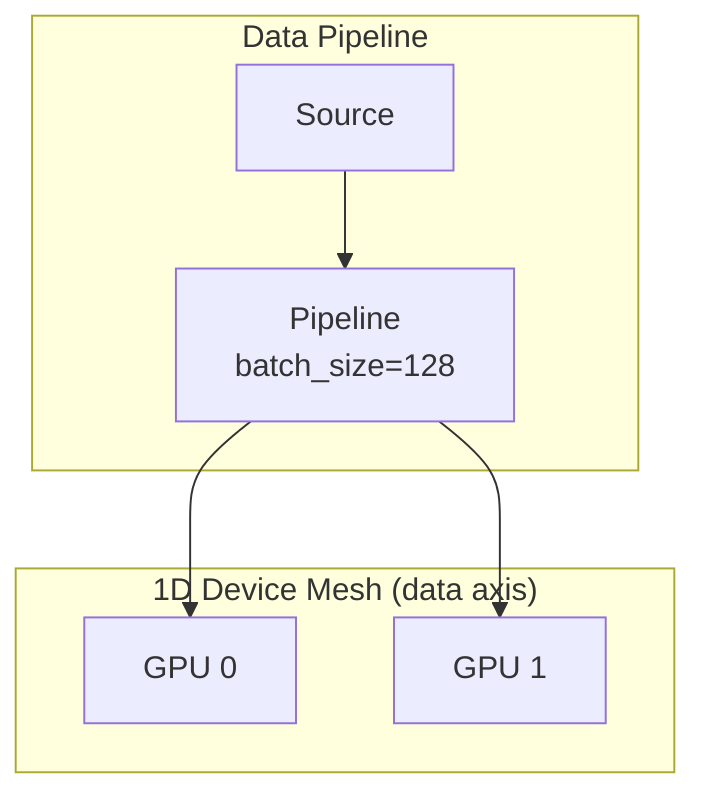
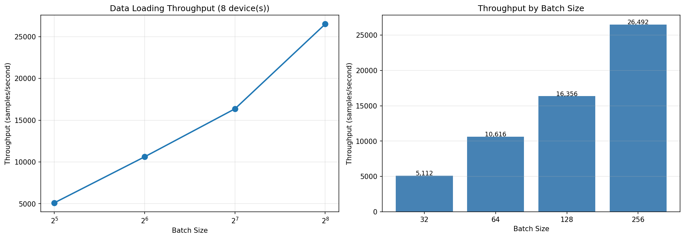
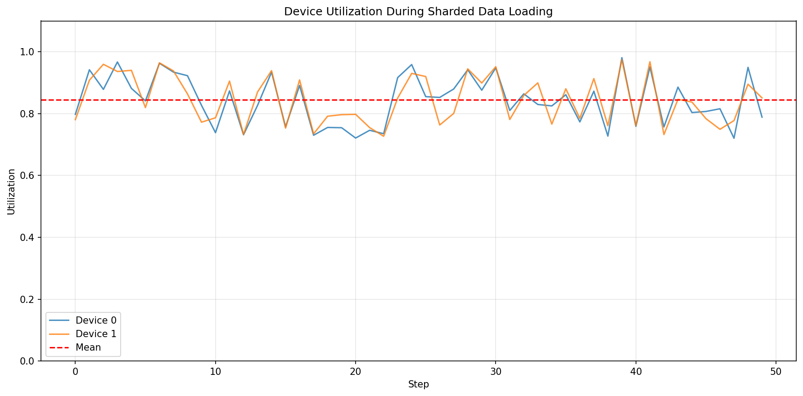
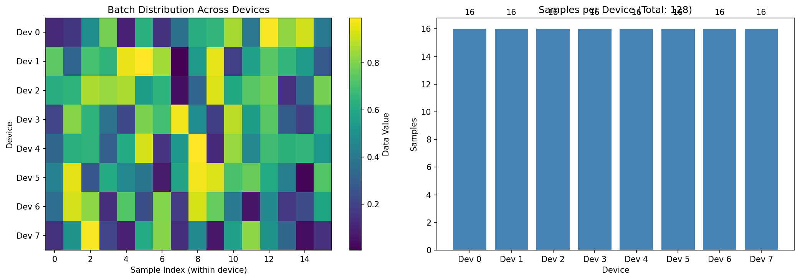

# Distributed Data Loading with Sharding Guide

| Metadata | Value |
|----------|-------|
| **Level** | Advanced |
| **Runtime** | ~45 min |
| **Prerequisites** | Sharding Quick Reference, JAX device placement |
| **Format** | Python + Jupyter |
| **Memory** | ~2 GB RAM per device |

## Overview

This in-depth guide covers distributed data loading patterns for
multi-device JAX setups. You'll learn to shard data across GPUs/TPUs,
optimize throughput for distributed training, and handle common pitfalls.

## What You'll Learn

1. Design data parallelism strategies for different device topologies
2. Implement efficient sharded batch distribution
3. Profile and optimize distributed data loading
4. Handle edge cases (uneven batches, device failures)
5. Integrate sharded pipelines with distributed training

## Coming from PyTorch?

| PyTorch | Datarax |
|---------|---------|
| `DistributedDataParallel(model)` | Model with `Mesh` context |
| `DistributedSampler` | Data sharded via `PartitionSpec` |
| `torch.distributed.all_reduce()` | JAX handles via GSPMD |
| `world_size`, `rank` | `mesh.axis_size`, device position |

**Key difference:** JAX's GSPMD provides automatic communication insertion based on sharding annotations.

## Coming from TensorFlow?

| TensorFlow | Datarax |
|------------|---------|
| `tf.distribute.MirroredStrategy` | `Mesh` with data axis |
| `experimental_distribute_dataset` | `jax.device_put` with sharding |
| `strategy.scope()` | `with mesh:` context |
| `tf.distribute.Strategy.run()` | `jax.jit` + sharding |

## Files

- **Python Script**: [`examples/advanced/distributed/02_sharding_guide.py`](https://github.com/avitai/datarax/blob/main/examples/advanced/distributed/02_sharding_guide.py)
- **Jupyter Notebook**: [`examples/advanced/distributed/02_sharding_guide.ipynb`](https://github.com/avitai/datarax/blob/main/examples/advanced/distributed/02_sharding_guide.ipynb)

## Quick Start

```bash
python examples/advanced/distributed/02_sharding_guide.py
```

## Architecture


```mermaid
flowchart TB
    subgraph Source["Data Pipeline"]
        S[Source] --> P[Pipeline<br/>batch_size=128]
    end

    subgraph Mesh["1D Device Mesh (data axis)"]
        direction LR
        D0[GPU 0]
        D1[GPU 1]
    end

    P --> D0 & D1
```

## Part 1: Understanding Data Parallelism

### Sharding Dimensions

| Dimension | Typical Sharding | Purpose |
|-----------|------------------|---------|
| Batch | Sharded across devices | Data parallelism |
| Height/Width | Replicated | Full image on each device |
| Channels | Replicated | Full features on each device |

### Partition Specs

```python
from jax.sharding import PartitionSpec as P

# Common partition specs
batch_sharded = P("data", None, None, None)  # (batch, H, W, C)
replicated = P(None, None, None, None)       # Full replication
model_sharded = P(None, None, None, "model") # Model parallelism
```

## Part 2: Creating the Device Mesh

The guide builds a **1D mesh** for pure data parallelism — all devices along a
single `"data"` axis. This is what the script does:

```python
import jax
import numpy as np
from jax.sharding import Mesh, NamedSharding, PartitionSpec

devices = jax.devices()
num_devices = len(devices)
use_sharding = num_devices >= 2

if use_sharding:
    # Create 1D mesh for pure data parallelism
    device_array = np.array(devices)
    mesh = Mesh(device_array, axis_names=("data",))
    print(f"Created mesh: {mesh.shape} with axis 'data'")
else:
    mesh = None
    print("Single device mode - will simulate sharding concepts")
```

**Terminal Output:**
```
Available devices: 2
Created mesh: (2,) with axis 'data'
```

!!! note "Conceptual extension: 2D meshes"
    A **2D mesh** combines data and model parallelism for large models. This
    guide does not use it — the snippet below is shown only to illustrate the
    pattern:

    ```python
    # Conceptual only — not exercised by this guide
    if len(devices) >= 4:
        mesh_2d = Mesh(
            np.array(devices).reshape(2, 2),
            axis_names=("data", "model"),
        )
    ```

## Part 3: Sharded Batch Distribution

A helper builds the right `PartitionSpec` for any array shape — sharding the
first (batch) dimension across the `"data"` axis and replicating the rest:

```python
def create_sharding_spec(shape, mesh, shard_first_dim=True):
    """Create appropriate PartitionSpec for a given shape."""
    if mesh is None:
        return None

    ndim = len(shape)
    if shard_first_dim and ndim > 0:
        # Shard first dim (batch), replicate rest
        spec = ("data",) + (None,) * (ndim - 1)
    else:
        # Fully replicate
        spec = (None,) * ndim

    return NamedSharding(mesh, PartitionSpec(*spec))
```

The pipeline itself is a standard Datarax pipeline with a preprocessing stage:

```python
BATCH_SIZE = 128  # Total batch size across all devices
NUM_SAMPLES = 2048


def preprocess_image(element, key=None):
    """Standard image preprocessing."""
    del key
    image = element.data["image"].astype(jnp.float32) / 255.0
    return element.update_data({"image": image})


def create_pipeline(batch_size=BATCH_SIZE, num_samples=NUM_SAMPLES, seed=42):
    """Create CIFAR-10 data pipeline."""
    config = TFDSEagerConfig(
        name="cifar10",
        split=f"train[:{num_samples}]",
        shuffle=True,
        seed=seed,
        exclude_keys={"id"},
    )
    source = TFDSEagerSource(config, rngs=nnx.Rngs(seed))
    preprocessor = ElementOperator(
        ElementOperatorConfig(stochastic=False),
        fn=preprocess_image,
        rngs=nnx.Rngs(0),
    )
    return Pipeline(source=source, stages=[preprocessor], batch_size=batch_size, rngs=nnx.Rngs(0))
```

Each batch is distributed by applying the sharding to every array it contains:

```python
def distribute_batch(batch, mesh, shard_batch_dim=True):
    """Distribute batch data across devices."""
    if mesh is None:
        return batch

    distributed = {}
    for key, array in batch.items():
        if hasattr(array, "shape"):
            sharding = create_sharding_spec(array.shape, mesh, shard_batch_dim)
            distributed[key] = jax.device_put(array, sharding)
        else:
            distributed[key] = array

    return distributed


# Distribute a batch within the mesh context
pipeline = create_pipeline()
test_batch = next(iter(pipeline))
with mesh:
    sharded_batch = distribute_batch(test_batch, mesh)
    print(f"  Image shape: {sharded_batch['image'].shape}")
    print(f"  Image sharding: {sharded_batch['image'].sharding.spec}")
```

**Terminal Output:**
```
Distributed batch:
  Image shape: (128, 32, 32, 3)
  Image sharding: PartitionSpec('data', None, None, None)
```

## Part 4: Optimizing Throughput

The guide benchmarks throughput across a sweep of batch sizes. Each run warms
up once, then times how quickly sharded batches become ready:

```python
def benchmark_pipeline(batch_size, num_batches=20, mesh=None):
    """Benchmark pipeline throughput."""
    pipeline = create_pipeline(batch_size=batch_size, num_samples=batch_size * num_batches)

    # Warmup
    warmup_batch = next(iter(pipeline))
    if mesh is not None:
        with mesh:
            _ = distribute_batch(warmup_batch, mesh)

    # Benchmark
    pipeline = create_pipeline(batch_size=batch_size, num_samples=batch_size * num_batches)

    start = time.time()
    samples = 0

    if mesh is not None:
        with mesh:
            for batch in pipeline:
                sharded = distribute_batch(batch, mesh)
                _ = sharded["image"].block_until_ready()
                samples += batch["image"].shape[0]
    else:
        for batch in pipeline:
            _ = batch["image"].block_until_ready()
            samples += batch["image"].shape[0]

    elapsed = time.time() - start
    return samples / elapsed


# Sweep batch sizes
batch_sizes = [32, 64, 128, 256]
for bs in batch_sizes:
    tp = benchmark_pipeline(bs, mesh=mesh)
    print(f"  Batch size {bs}: {tp:.0f} samples/s")
```

Throughput rises with batch size as the fixed per-batch distribution overhead is
amortized across more samples:



*Data-loading throughput across batch sizes 32, 64, 128, and 256. Absolute
numbers depend on your device count and hardware.*

## Part 5: Device Utilization

The guide also simulates device utilization during sharded data loading to
illustrate how work spreads across devices:



*Simulated per-device utilization over the loading steps, with the mean marked.*

## Part 6: Batch Distribution

Finally, it visualizes how a single batch is split across devices:



*Left: batch samples distributed across devices. Right: samples per device for a
total batch of 128.*

## Results Summary

### Sharding Strategies

| Strategy | Use Case | Mesh Shape |
|----------|----------|------------|
| Pure Data Parallel | Most common | (N,) "data" |
| 2D Data + Model | Large models | (D, M) "data", "model" |
| Pipeline Parallel | Very long sequences | (P,) "pipeline" |

### Performance Guidelines

| Batch Size | Recommendation |
|------------|----------------|
| < 32 | Overhead may exceed benefit |
| 64-256 | Good balance |
| > 256 | Check memory constraints |

### Key Takeaways

1. **Batch size**: Should be divisible by device count
2. **Memory**: Sharding reduces per-device memory linearly
3. **Overhead**: Distribution has fixed cost — larger batches amortize it
4. **Mesh context**: All sharded operations must be within mesh context
5. **Fallback**: Code should handle single-device gracefully

## Next Steps

- [Performance Guide](../performance/optimization-guide.md) - Further optimization
- [Checkpointing](../checkpointing/checkpoint-quickref.md) - Distributed checkpoints
- [End-to-End Training](../training/e2e-cifar10-guide.md) - Complete distributed training
- [API Reference: Sharding](../../../sharding/index.md) - Complete API
