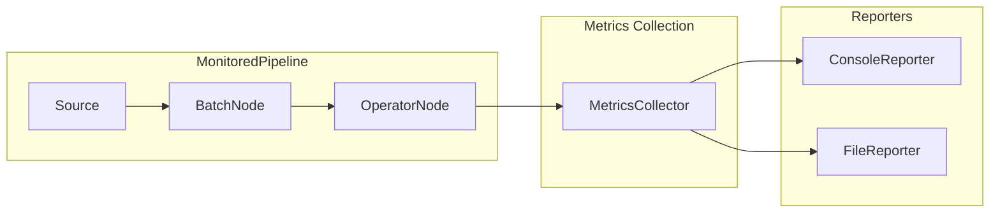

# Monitoring Quick Reference

| Metadata | Value |
|----------|-------|
| **Level** | Beginner |
| **Runtime** | ~5 min |
| **Prerequisites** | Basic Python, Simple Pipeline |
| **Format** | Python + Jupyter |

## Overview

This quick reference demonstrates Datarax's built-in monitoring system for
tracking pipeline metrics. You'll learn to use `MonitoredPipeline` with
`ConsoleReporter` to observe throughput and custom metrics in real-time.

## What You'll Learn

1. Create a `MonitoredPipeline` that collects metrics automatically
2. Register a `ConsoleReporter` for real-time metric display
3. Record custom metrics during pipeline iteration
4. Understand the metrics collection architecture

## Coming from PyTorch?

| PyTorch | Datarax |
|---------|---------|
| `tqdm(dataloader)` | `MonitoredPipeline` + `ConsoleReporter` |
| Custom timing with `time.time()` | Automatic `batch_production` timing |
| TensorBoard logging | `FileReporter` or custom observer |
| Manual throughput calculation | Built-in throughput metrics |

## Coming from TensorFlow?

| TensorFlow | Datarax |
|------------|---------|
| `tf.keras.callbacks.TensorBoard` | `MonitoredPipeline` + reporters |
| `tf.summary.scalar()` | `metrics.record_metric()` |
| `tf.profiler` | Built-in timing metrics |
| Custom callbacks | Implement `MetricsObserver` |

## Files

- **Python Script**: [`examples/advanced/monitoring/01_monitoring_quickref.py`](https://github.com/avitai/datarax/blob/main/examples/advanced/monitoring/01_monitoring_quickref.py)
- **Jupyter Notebook**: [`examples/advanced/monitoring/01_monitoring_quickref.ipynb`](https://github.com/avitai/datarax/blob/main/examples/advanced/monitoring/01_monitoring_quickref.ipynb)

## Quick Start

```bash
python examples/advanced/monitoring/01_monitoring_quickref.py
```

## Architecture



## Key Concepts

### Metric Types

| Metric | Description |
|--------|-------------|
| `batch_produced` | Count of batches yielded |
| `pipeline_iteration` | Total iteration time |
| `batch_production` | Per-batch production time |
| Custom metrics | User-defined via `record_metric()` |

### Step 1: Create Monitored Pipeline

```python
from datarax.monitoring.pipeline import MonitoredPipeline
from datarax.monitoring.reporters import ConsoleReporter
from datarax.sources import MemorySource, MemorySourceConfig

data = [{"value": i, "label": i % 5} for i in range(200)]
source = MemorySource(MemorySourceConfig(), data=data, rngs=nnx.Rngs(0))

pipeline = MonitoredPipeline(source, metrics_enabled=True)

# Register reporter
reporter = ConsoleReporter(report_interval=1.0)
pipeline.callbacks.register(reporter)

print("Created MonitoredPipeline with ConsoleReporter")
```

**Terminal Output:**
```
Created MonitoredPipeline with ConsoleReporter
```

### Step 2: Add Pipeline Stages

```python
from datarax.dag.nodes import BatchNode, OperatorNode

def double_value(element, key=None):
    result = dict(element.data)
    result["value"] = result["value"] * 2
    return element.update_data(result)

pipeline.add(BatchNode(batch_size=32))

double_op = ElementOperator(
    ElementOperatorConfig(stochastic=False),
    fn=double_value,
    rngs=nnx.Rngs(0),
)
pipeline.add(OperatorNode(double_op))

print("Pipeline: Source -> Batch(32) -> DoubleValue -> Output")
```

**Terminal Output:**
```
Pipeline: Source -> Batch(32) -> DoubleValue -> Output
```

### Step 3: Process with Custom Metrics

```python
for batch in pipeline:
    values = batch["value"]

    # Record custom metrics
    if pipeline.metrics.enabled:
        pipeline.metrics.record_metric(
            "batch_mean_value",
            float(jnp.mean(values)),
            "custom",
        )
        pipeline.metrics.record_metric(
            "batch_max_value",
            float(jnp.max(values)),
            "custom",
        )
```

**Terminal Output (Console Reporter):**
```
[Metrics Report @ 1.0s]
  batch_produced: 3
  batch_production_avg: 0.012s
  batch_mean_value: 128.5
  batch_max_value: 398
```

## Available Reporters

| Reporter | Output | Configuration |
|----------|--------|---------------|
| `ConsoleReporter` | stdout | `report_interval` |
| `FileReporter` | JSON/CSV file | `path`, `format` |
| Custom | Any destination | Implement `MetricsObserver` |

## Results Summary

| Component | Value |
|-----------|-------|
| Data Source | MemorySource (200 samples) |
| Batch Size | 32 |
| Transformation | Double value field |
| Reporter | ConsoleReporter (1s interval) |
| Custom Metrics | batch_mean_value, batch_max_value |

**The monitoring system automatically tracks:**

- Number of batches produced
- Pipeline iteration timing
- Node additions to the pipeline
- Custom metrics you record explicitly

## Next Steps

- [Performance Guide](../performance/optimization-guide.md) - Optimize based on metrics
- [Distributed Monitoring](../distributed/sharding-guide.md) - Multi-device metrics
- [Checkpointing](../checkpointing/checkpoint-quickref.md) - Save pipeline state
- [API Reference: Monitoring](../../../monitoring/index.md) - Complete API
