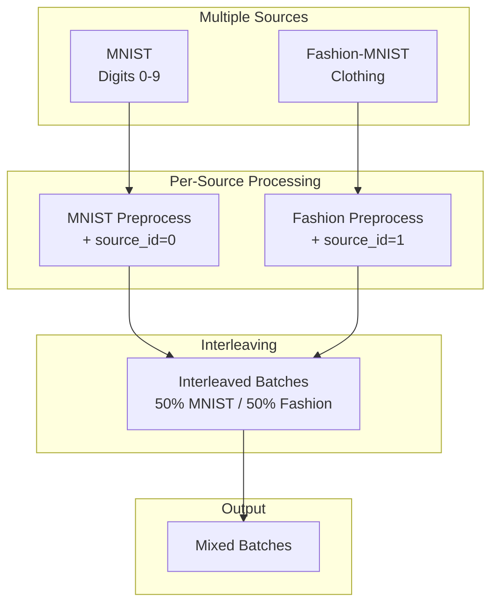

# Multi-Source Data Loading Tutorial

| Metadata | Value |
|----------|-------|
| **Level** | Intermediate |
| **Runtime** | ~20 min |
| **Prerequisites** | Pipeline Tutorial, TFDS Quick Reference |
| **Format** | Python + Jupyter |
| **Memory** | ~1.5 GB RAM |

## Overview

Learn to load and combine data from multiple sources in a single pipeline.
This is essential for multi-task learning, domain adaptation, and creating
diverse training sets from heterogeneous data.

## What You'll Learn

1. Create multiple TFDSEagerSource instances
2. Interleave data from different datasets
3. Apply source-specific preprocessing
4. Handle different data formats in the same pipeline
5. Visualize mixed dataset samples

## Coming from PyTorch?

| PyTorch | Datarax |
|---------|---------|
| `ConcatDataset([ds1, ds2])` | Interleaved sources |
| `ChainDataset` | Sequential concatenation |
| `WeightedRandomSampler` | Source weights for interleaving |
| Custom `collate_fn` | Source-specific preprocessing |

**Key difference:** Datarax provides native interleaving with configurable mixing ratios.

## Coming from TensorFlow?

| TensorFlow | Datarax |
|------------|---------|
| `dataset.concatenate(other)` | Sequential source combination |
| `tf.data.Dataset.sample_from_datasets([ds1, ds2])` | Interleaved sampling |
| `weights` parameter | Source-specific mixing ratios |
| Multiple `map()` calls | Per-source preprocessing |

## Files

- **Python Script**: [`examples/advanced/multi_source/01_interleaved_tutorial.py`](https://github.com/avitai/datarax/blob/main/examples/advanced/multi_source/01_interleaved_tutorial.py)
- **Jupyter Notebook**: [`examples/advanced/multi_source/01_interleaved_tutorial.ipynb`](https://github.com/avitai/datarax/blob/main/examples/advanced/multi_source/01_interleaved_tutorial.ipynb)

## Quick Start

```bash
python examples/advanced/multi_source/01_interleaved_tutorial.py
```

## Architecture



## Use Case: Multi-Domain Learning

Combine MNIST and Fashion-MNIST to create a unified classification dataset:

| Dataset | Classes | Purpose |
|---------|---------|---------|
| MNIST | Digits 0-9 | Source domain |
| Fashion-MNIST | Clothing items | Target domain |
| Combined | 20 classes | Multi-task learning |

## Part 1: Create Individual Sources

```python
from datarax.sources import TFDSEagerConfig, TFDSEagerSource

# MNIST Source
mnist_config = TFDSEagerConfig(
    name="mnist",
    split="train[:2000]",
    shuffle=True,
    seed=42,
)
mnist_source = TFDSEagerSource(mnist_config, rngs=nnx.Rngs(42))

# Fashion-MNIST Source
fashion_config = TFDSEagerConfig(
    name="fashion_mnist",
    split="train[:2000]",
    shuffle=True,
    seed=43,
)
fashion_source = TFDSEagerSource(fashion_config, rngs=nnx.Rngs(43))

print(f"MNIST samples: {len(mnist_source)}")
print(f"Fashion samples: {len(fashion_source)}")
```

**Terminal Output:**
```
MNIST samples: 2000
Fashion samples: 2000
```

## Part 2: Source-Specific Preprocessing

```python
def create_mnist_preprocessor():
    """MNIST preprocessing with source identification."""
    def preprocess(element, key=None):
        image = element.data["image"].astype(jnp.float32) / 255.0
        if image.ndim == 2:
            image = image[..., None]
        # Normalize with MNIST stats
        image = (image - 0.1307) / 0.3081
        return element.update_data({
            "image": image,
            "label": element.data["label"],
            "source_id": 0,  # MNIST identifier
        })
    return ElementOperator(
        ElementOperatorConfig(stochastic=False),
        fn=preprocess, rngs=nnx.Rngs(0)
    )

def create_fashion_preprocessor():
    """Fashion-MNIST preprocessing with source identification."""
    def preprocess(element, key=None):
        image = element.data["image"].astype(jnp.float32) / 255.0
        if image.ndim == 2:
            image = image[..., None]
        # Normalize with Fashion-MNIST stats
        image = (image - 0.2860) / 0.3530
        return element.update_data({
            "image": image,
            "label": element.data["label"] + 10,  # Offset labels
            "source_id": 1,  # Fashion identifier
        })
    return ElementOperator(
        ElementOperatorConfig(stochastic=False),
        fn=preprocess, rngs=nnx.Rngs(0)
    )
```

## Part 3: Build Interleaved Pipeline

```python
# Create individual pipelines
mnist_pipeline = (
    from_source(mnist_source, batch_size=16)
    .add(OperatorNode(create_mnist_preprocessor()))
)

fashion_pipeline = (
    from_source(fashion_source, batch_size=16)
    .add(OperatorNode(create_fashion_preprocessor()))
)

# Interleave by alternating batches
def interleave_pipelines(pipelines):
    """Yield batches alternating between pipelines."""
    iterators = [iter(p) for p in pipelines]
    while iterators:
        for i, it in enumerate(iterators):
            try:
                yield next(it)
            except StopIteration:
                iterators.pop(i)

interleaved = interleave_pipelines([mnist_pipeline, fashion_pipeline])
```

## Part 4: Process Mixed Batches

```python
source_counts = {0: 0, 1: 0}  # Track samples per source

for batch_idx, batch in enumerate(interleaved):
    if batch_idx >= 10:
        break

    images = batch["image"]
    labels = batch["label"]
    source_ids = batch["source_id"]

    # Count samples from each source
    for sid in source_ids:
        source_counts[int(sid)] += 1

    print(f"Batch {batch_idx}:")
    print(f"  Shape: {images.shape}")
    print(f"  Labels: {labels[:5]}...")
    print(f"  Source: {'MNIST' if source_ids[0] == 0 else 'Fashion'}")

print(f"\nSource distribution: MNIST={source_counts[0]}, Fashion={source_counts[1]}")
```

**Terminal Output:**
```
Batch 0:
  Shape: (16, 28, 28, 1)
  Labels: [5 0 4 1 9]...
  Source: MNIST
Batch 1:
  Shape: (16, 28, 28, 1)
  Labels: [19 12 10 18 17]...
  Source: Fashion

Source distribution: MNIST=80, Fashion=80
```

## Part 5: Visualization

```python
import matplotlib.pyplot as plt

fig, axes = plt.subplots(2, 8, figsize=(16, 4))
fig.suptitle("Multi-Source Samples: MNIST (top) vs Fashion (bottom)")

# Get batches from each source
mnist_batch = next(iter(mnist_pipeline))
fashion_batch = next(iter(fashion_pipeline))

for i in range(8):
    # MNIST samples
    axes[0, i].imshow(mnist_batch["image"][i].squeeze(), cmap="gray")
    axes[0, i].set_title(f"Digit: {mnist_batch['label'][i]}")
    axes[0, i].axis("off")

    # Fashion samples
    axes[1, i].imshow(fashion_batch["image"][i].squeeze(), cmap="gray")
    axes[1, i].set_title(f"Fashion: {fashion_batch['label'][i]-10}")
    axes[1, i].axis("off")

plt.savefig("docs/assets/images/examples/cv-multisource-samples.png", dpi=150)
```

## Results Summary

| Source | Samples | Label Range | Normalization |
|--------|---------|-------------|---------------|
| MNIST | 2000 | 0-9 | μ=0.1307, σ=0.3081 |
| Fashion-MNIST | 2000 | 10-19 | μ=0.2860, σ=0.3530 |
| Combined | 4000 | 0-19 | Source-specific |

**Use Cases:**

- **Domain adaptation**: Train on source, evaluate on target
- **Multi-task learning**: Single model, multiple tasks
- **Data augmentation**: Increase training diversity

## Next Steps

- [MixUp/CutMix](../augmentation/mixup-cutmix-tutorial.md) - Mix samples across sources
- [End-to-End Training](../training/e2e-cifar10-guide.md) - Complete training pipeline
- [Performance Guide](../performance/optimization-guide.md) - Optimize throughput
- [API Reference: Sources](../../../sources/index.md) - Complete API
