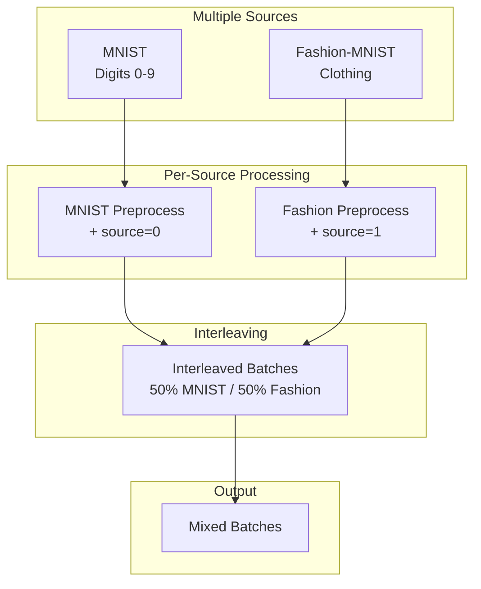

# Multi-Source Data Loading Tutorial

| Metadata | Value |
|----------|-------|
| **Level** | Intermediate |
| **Runtime** | ~20 min |
| **Prerequisites** | Pipeline Tutorial, TFDS Quick Reference |
| **Format** | Python + Jupyter |
| **Memory** | ~1.5 GB RAM |

## Overview

Learn to load and combine data from multiple sources in a single pipeline.
This is essential for multi-task learning, domain adaptation, and creating
diverse training sets from heterogeneous data.

## What You'll Learn

1. Create multiple TFDSEagerSource instances
2. Interleave data from different datasets
3. Apply source-specific preprocessing
4. Handle different data formats in the same pipeline
5. Visualize mixed dataset samples

## Coming from PyTorch?

| PyTorch | Datarax |
|---------|---------|
| `ConcatDataset([ds1, ds2])` | Interleaved sources |
| `ChainDataset` | Sequential concatenation |
| `WeightedRandomSampler` | Source weights for interleaving |
| Custom `collate_fn` | Source-specific preprocessing |

**Key difference:** Datarax provides native interleaving with configurable mixing ratios.

## Coming from TensorFlow?

| TensorFlow | Datarax |
|------------|---------|
| `dataset.concatenate(other)` | Sequential source combination |
| `tf.data.Dataset.sample_from_datasets([ds1, ds2])` | Interleaved sampling |
| `weights` parameter | Source-specific mixing ratios |
| Multiple `map()` calls | Per-source preprocessing |

## Files

- **Python Script**: [`examples/advanced/multi_source/01_interleaved_tutorial.py`](https://github.com/avitai/datarax/blob/main/examples/advanced/multi_source/01_interleaved_tutorial.py)
- **Jupyter Notebook**: [`examples/advanced/multi_source/01_interleaved_tutorial.ipynb`](https://github.com/avitai/datarax/blob/main/examples/advanced/multi_source/01_interleaved_tutorial.ipynb)

## Quick Start

```bash
python examples/advanced/multi_source/01_interleaved_tutorial.py
```

## Architecture


```mermaid
flowchart TB
    subgraph Sources["Multiple Sources"]
        M[MNIST<br/>Digits 0-9]
        F[Fashion-MNIST<br/>Clothing]
    end

    subgraph Preprocess["Per-Source Processing"]
        MP[MNIST Preprocess<br/>+ source=0]
        FP[Fashion Preprocess<br/>+ source=1]
    end

    subgraph Combine["Interleaving"]
        I[Interleaved Batches<br/>50% MNIST / 50% Fashion]
    end

    subgraph Output["Output"]
        O[Mixed Batches]
    end

    M --> MP --> I
    F --> FP --> I
    I --> O
```

## Use Case: Multi-Domain Learning

Combine MNIST and Fashion-MNIST to create a unified classification dataset:

| Dataset | Classes | Purpose |
|---------|---------|---------|
| MNIST | Digits 0-9 | Source domain |
| Fashion-MNIST | Clothing items | Target domain |
| Combined | 20 classes | Multi-task learning |

## Part 1: Create Individual Sources

```python
from datarax.sources import TFDSEagerConfig, TFDSEagerSource

# MNIST Source
mnist_config = TFDSEagerConfig(
    name="mnist",
    split="train[:2000]",
    shuffle=True,
    seed=42,
)
mnist_source = TFDSEagerSource(mnist_config, rngs=nnx.Rngs(42))

# Fashion-MNIST Source
fashion_config = TFDSEagerConfig(
    name="fashion_mnist",
    split="train[:2000]",
    shuffle=True,
    seed=43,
)
fashion_source = TFDSEagerSource(fashion_config, rngs=nnx.Rngs(43))

print(f"MNIST samples: {len(mnist_source)}")
print(f"Fashion samples: {len(fashion_source)}")
```

**Terminal Output:**
```
MNIST samples: 2000
Fashion samples: 2000
```

## Part 2: Source-Specific Preprocessing

```python
# Normalization constants
MNIST_MEAN, MNIST_STD = 0.1307, 0.3081
FASHION_MEAN, FASHION_STD = 0.2860, 0.3530

def preprocess_mnist(element, key=None):
    """Preprocess MNIST with source tag."""
    del key
    image = element.data["image"]

    # Normalize
    image = image.astype(jnp.float32) / 255.0
    if image.ndim == 2:
        image = image[..., None]
    image = (image - MNIST_MEAN) / MNIST_STD

    # Add source indicator (0 = MNIST, 1 = Fashion)
    return element.update_data(
        {
            "image": image,
            "label": element.data["label"],
            "source": jnp.array(0, dtype=jnp.int32),  # 0 = MNIST
        }
    )

def preprocess_fashion(element, key=None):
    """Preprocess Fashion-MNIST with source tag."""
    del key
    image = element.data["image"]

    # Normalize
    image = image.astype(jnp.float32) / 255.0
    if image.ndim == 2:
        image = image[..., None]
    image = (image - FASHION_MEAN) / FASHION_STD

    # Add source indicator (shift labels by 10 for unified label space)
    return element.update_data(
        {
            "image": image,
            "label": element.data["label"] + 10,  # Offset for unified labels
            "original_label": element.data["label"],
            "source": jnp.array(1, dtype=jnp.int32),  # 1 = Fashion
        }
    )

mnist_preprocessor = ElementOperator(
    ElementOperatorConfig(stochastic=False),
    fn=preprocess_mnist,
    rngs=nnx.Rngs(0),
)

fashion_preprocessor = ElementOperator(
    ElementOperatorConfig(stochastic=False),
    fn=preprocess_fashion,
    rngs=nnx.Rngs(0),
)
```

## Part 3: Build Interleaved Pipeline

```python
BATCH_SIZE = 32

# Create individual pipelines
mnist_pipeline = Pipeline(
    source=mnist_source, stages=[mnist_preprocessor], batch_size=BATCH_SIZE, rngs=nnx.Rngs(0)
)

# Fashion pipeline (need fresh source)
fashion_source2 = TFDSEagerSource(fashion_config, rngs=nnx.Rngs(43))
fashion_pipeline = Pipeline(
    source=fashion_source2, stages=[fashion_preprocessor], batch_size=BATCH_SIZE, rngs=nnx.Rngs(0)
)


# Round-robin interleaving that alternates between sources
class InterleavedIterator:
    """Round-robin iterator that alternates between multiple sources."""

    def __init__(self, pipelines: list, weights: list[float] | None = None):
        """Initialize with list of pipelines and optional weights."""
        self.pipelines = pipelines
        self.iterators = [iter(p) for p in pipelines]
        self.weights = weights or [1.0 / len(pipelines)] * len(pipelines)
        self.current_idx = 0
        self.exhausted = [False] * len(pipelines)

    def __iter__(self):
        """Iterate over interleaved pipeline batches."""
        return self

    def __next__(self):
        """Get next batch, cycling through sources."""
        if all(self.exhausted):
            raise StopIteration

        # Find next non-exhausted source
        attempts = 0
        while self.exhausted[self.current_idx] and attempts < len(self.pipelines):
            self.current_idx = (self.current_idx + 1) % len(self.pipelines)
            attempts += 1

        if attempts >= len(self.pipelines):
            raise StopIteration

        try:
            batch = next(self.iterators[self.current_idx])
            self.current_idx = (self.current_idx + 1) % len(self.pipelines)
            return batch
        except StopIteration:
            self.exhausted[self.current_idx] = True
            return self.__next__()


interleaved = InterleavedIterator([mnist_pipeline, fashion_pipeline])
```

## Part 4: Process Mixed Batches

```python
# Create fresh pipelines for interleaving (train[:500] subset per source)
def create_interleaved_pipelines():
    """Create fresh pipelines for interleaving."""
    mnist_src = TFDSEagerSource(
        TFDSEagerConfig(name="mnist", split="train[:500]", shuffle=True, seed=42),
        rngs=nnx.Rngs(42),
    )
    fashion_src = TFDSEagerSource(
        TFDSEagerConfig(name="fashion_mnist", split="train[:500]", shuffle=True, seed=43),
        rngs=nnx.Rngs(43),
    )

    mnist_prep = ElementOperator(
        ElementOperatorConfig(stochastic=False), fn=preprocess_mnist, rngs=nnx.Rngs(0)
    )
    fashion_prep = ElementOperator(
        ElementOperatorConfig(stochastic=False), fn=preprocess_fashion, rngs=nnx.Rngs(0)
    )

    mnist_pipe = Pipeline(
        source=mnist_src, stages=[mnist_prep], batch_size=BATCH_SIZE, rngs=nnx.Rngs(0)
    )
    fashion_pipe = Pipeline(
        source=fashion_src, stages=[fashion_prep], batch_size=BATCH_SIZE, rngs=nnx.Rngs(0)
    )

    return [mnist_pipe, fashion_pipe]


# Test interleaved iteration
interleaved = InterleavedIterator(create_interleaved_pipelines())

sources_seen = []
for i, batch in enumerate(interleaved):
    if i >= 10:  # Sample first 10 batches
        break
    sources_seen.append(int(batch["source"][0]))

print(f"Sources in first 10 batches: {sources_seen}")
print("(0=MNIST, 1=Fashion)")
```

**Terminal Output:**
```
Sources in first 10 batches: [0, 1, 0, 1, 0, 1, 0, 1, 0, 1]
(0=MNIST, 1=Fashion)
```

## Part 5: Visualization

```python
import matplotlib.pyplot as plt

# Collect samples from both sources
interleaved = InterleavedIterator(create_interleaved_pipelines())
all_images, all_sources, all_original_labels = [], [], []

for batch in interleaved:
    all_images.append(np.array(batch["image"]))
    all_sources.append(np.array(batch["source"]))
    if "original_label" in batch:
        all_original_labels.append(np.array(batch["original_label"]))
    else:
        all_original_labels.append(np.array(batch["label"]))

all_images = np.concatenate(all_images)
all_sources = np.concatenate(all_sources)
all_original_labels = np.concatenate(all_original_labels)

# Plot mixed dataset samples (4 rows x 8 cols)
fig, axes = plt.subplots(4, 8, figsize=(16, 8))
fig.suptitle("Multi-Source Dataset: MNIST + Fashion-MNIST", fontsize=14)

mnist_indices = np.where(all_sources == 0)[0][:16]
fashion_indices = np.where(all_sources == 1)[0][:16]

for i in range(8):
    # MNIST row 1 (denormalize: img * STD + MEAN)
    idx = mnist_indices[i]
    img = all_images[idx] * MNIST_STD + MNIST_MEAN
    axes[0, i].imshow(img.squeeze(), cmap="gray")
    axes[0, i].axis("off")
    axes[0, i].set_title(f"MNIST: {MNIST_CLASSES[all_original_labels[idx] % 10]}", fontsize=8)

    # Fashion row 2
    idx = fashion_indices[i]
    img = all_images[idx] * FASHION_STD + FASHION_MEAN
    axes[1, i].imshow(img.squeeze(), cmap="gray")
    axes[1, i].axis("off")
    axes[1, i].set_title(f"Fashion: {FASHION_CLASSES[all_original_labels[idx] % 10]}", fontsize=8)

    # MNIST row 3
    idx = mnist_indices[i + 8]
    img = all_images[idx] * MNIST_STD + MNIST_MEAN
    axes[2, i].imshow(img.squeeze(), cmap="gray")
    axes[2, i].axis("off")
    axes[2, i].set_title(f"MNIST: {MNIST_CLASSES[all_original_labels[idx] % 10]}", fontsize=8)

    # Fashion row 4
    idx = fashion_indices[i + 8]
    img = all_images[idx] * FASHION_STD + FASHION_MEAN
    axes[3, i].imshow(img.squeeze(), cmap="gray")
    axes[3, i].axis("off")
    axes[3, i].set_title(f"Fashion: {FASHION_CLASSES[all_original_labels[idx] % 10]}", fontsize=8)

plt.tight_layout()
plt.savefig("docs/assets/images/examples/cv-multisource-samples.png", dpi=150)
```

## Results Summary

| Source | Samples | Label Range | Normalization |
|--------|---------|-------------|---------------|
| MNIST | 2000 | 0-9 | μ=0.1307, σ=0.3081 |
| Fashion-MNIST | 2000 | 10-19 | μ=0.2860, σ=0.3530 |
| Combined | 4000 | 0-19 | Source-specific |

**Use Cases:**

- **Domain adaptation**: Train on source, evaluate on target
- **Multi-task learning**: Single model, multiple tasks
- **Data augmentation**: Increase training diversity

## Next Steps

- [MixUp/CutMix](../augmentation/mixup-cutmix-tutorial.md) - Mix samples across sources
- [End-to-End Training](../training/e2e-cifar10-guide.md) - Complete training pipeline
- [Performance Guide](../performance/optimization-guide.md) - Optimize throughput
- [API Reference: Sources](../../../sources/index.md) - Complete API
