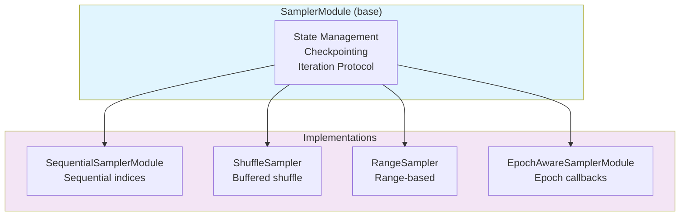

# Advanced Sampling Tutorial

| Metadata | Value |
|----------|-------|
| **Level** | Intermediate |
| **Runtime** | ~25 min |
| **Prerequisites** | Pipeline Tutorial |
| **Format** | Python + Jupyter |

## Overview

Master the sampling system in Datarax. This tutorial covers the built-in
samplers for controlling data access order, from simple sequential access
to epoch-aware shuffling with callbacks.

## Learning Goals

By the end of this tutorial, you will be able to:

1. Use `SequentialSamplerModule` for deterministic iteration
2. Apply `ShuffleSampler` for randomized data access
3. Work with `RangeSampler` for subset selection
4. Configure `EpochAwareSamplerModule` with callbacks
5. Implement custom samplers following Datarax patterns

## Coming from PyTorch?

| PyTorch | Datarax |
|---------|---------|
| `SequentialSampler` | `SequentialSamplerModule` |
| `RandomSampler` | `ShuffleSampler` |
| `SubsetRandomSampler` | `RangeSampler` |
| Custom `Sampler` class | Extend `SamplerModule` |

## Coming from TensorFlow?

| TensorFlow tf.data | Datarax |
|--------------------|---------|
| Default order | `SequentialSamplerModule` |
| `.shuffle(buffer_size)` | `ShuffleSampler(buffer_size)` |
| `.take(n)` | `RangeSampler(stop=n)` |
| Epoch callbacks | `EpochAwareSamplerModule` |

## Files

- **Python Script**: [`examples/advanced/sampling/01_sampling_tutorial.py`](https://github.com/avitai/datarax/blob/main/examples/advanced/sampling/01_sampling_tutorial.py)
- **Jupyter Notebook**: [`examples/advanced/sampling/01_sampling_tutorial.ipynb`](https://github.com/avitai/datarax/blob/main/examples/advanced/sampling/01_sampling_tutorial.ipynb)

## Quick Start

### Run the Python Script

```bash
python examples/advanced/sampling/01_sampling_tutorial.py
```

### Run the Jupyter Notebook

```bash
jupyter lab examples/advanced/sampling/01_sampling_tutorial.ipynb
```

## Sampler Architecture



## Key Concepts

### SequentialSamplerModule

Deterministic sequential iteration - ideal for evaluation:

```python
from datarax.samplers import SequentialSamplerModule, SequentialSamplerConfig

config = SequentialSamplerConfig(
    num_records=100,  # Dataset size
    num_epochs=2,     # Number of epochs
)
sampler = SequentialSamplerModule(config, rngs=nnx.Rngs(0))

# Yields: 0, 1, 2, ..., 99, 0, 1, 2, ..., 99
```

### ShuffleSampler

Randomized data access with reproducibility:

```python
from datarax.samplers import ShuffleSampler, ShuffleSamplerConfig

config = ShuffleSamplerConfig(
    buffer_size=1000,  # Shuffle buffer
    seed=42,           # Reproducibility
)
sampler = ShuffleSampler(config, rngs=nnx.Rngs(shuffle=42))
```

**How It Works:**
1. Fill buffer with indices
2. Shuffle buffer randomly
3. Yield indices from buffer
4. Refill and reshuffle as needed

### RangeSampler

Custom index ranges like Python's `range()`:

```python
from datarax.samplers import RangeSampler, RangeSamplerConfig

# First 50 samples
config = RangeSamplerConfig(start=0, stop=50, step=1)
sampler = RangeSampler(config, rngs=nnx.Rngs(0))

# Every 10th sample
strided_config = RangeSamplerConfig(start=0, stop=100, step=10)
# Yields: 0, 10, 20, 30, ..., 90
```

### EpochAwareSamplerModule

Advanced sampler with epoch callbacks:

```python
from datarax.samplers import EpochAwareSamplerModule, EpochAwareSamplerConfig

config = EpochAwareSamplerConfig(
    num_records=100,
    num_epochs=10,
    shuffle=True,  # Different shuffle per epoch
    seed=42,
)
sampler = EpochAwareSamplerModule(config, rngs=nnx.Rngs(sample=42))

# Add callback for epoch completion
sampler.add_epoch_callback(lambda epoch: print(f"Epoch {epoch} done!"))

# Get progress
progress = sampler.get_epoch_progress()
# {"current_epoch": 2, "total_epochs": 10, "progress_percent": 45.0}
```

## Checkpointing

All samplers support state serialization:

```python
# Save state
state = sampler.get_state()

# Later: restore and continue
new_sampler.set_state(state)
# Resumes from exact position
```

## Results

Running the tutorial produces:

```
============================================================
Advanced Sampling Tutorial
============================================================

1. SequentialSamplerModule:
   First 5 indices: [0, 1, 2, 3, 4]

2. ShuffleSampler:
   First 5 shuffled: [23, 7, 45, 12, 89]

3. RangeSampler:
   Range 10-20: [10, 11, 12, 13, 14, 15, 16, 17, 18, 19]

4. EpochAwareSamplerModule:
   Total samples (2 epochs × 50): 100

============================================================
Tutorial completed successfully!
============================================================
```

## Sampler Selection Guide

| Use Case | Recommended Sampler |
|----------|---------------------|
| Evaluation / Testing | `SequentialSamplerModule` |
| Training (shuffle) | `ShuffleSampler` or `EpochAwareSamplerModule` |
| Subset selection | `RangeSampler` |
| Epoch callbacks | `EpochAwareSamplerModule` |
| Reproducible shuffle | `ShuffleSampler(seed=...)` |
| Cross-validation folds | `RangeSampler` with different ranges |

## Sampler Summary

| Sampler | Stochastic | Checkpointable | Key Feature |
|---------|------------|----------------|-------------|
| `SequentialSamplerModule` | No | Yes | Deterministic order |
| `ShuffleSampler` | Yes | Yes | Buffered shuffle |
| `RangeSampler` | No | Yes | Custom ranges |
| `EpochAwareSamplerModule` | Configurable | Yes | Epoch callbacks |

## Next Steps

- [Pipeline Tutorial](../../core/pipeline-tutorial.md) - Full pipeline setup
- [Checkpointing Guide](../checkpointing/checkpoint-quickref.md) - Resume training
- [Distributed Sharding](../distributed/sharding-quickref.md) - Multi-device

## API Reference

- [`SamplerModule`](../../../core/sampler.md) - Base class
- [`SequentialSamplerModule`](../../../samplers/sequential_sampler.md)
- [`ShuffleSampler`](../../../samplers/shuffle_sampler.md)
- [`RangeSampler`](../../../samplers/range_sampler.md)
- [`EpochAwareSamplerModule`](../../../samplers/epoch_aware_sampler.md)
