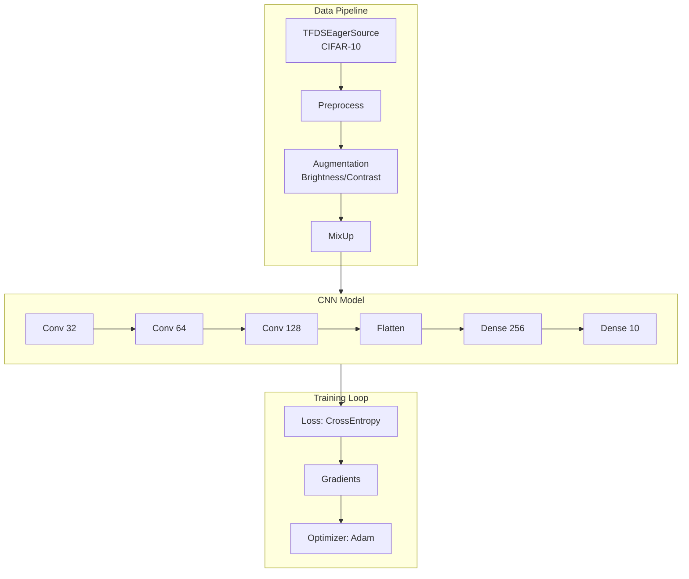

# End-to-End CIFAR-10 Training Guide

| Metadata | Value |
|----------|-------|
| **Level** | Advanced |
| **Runtime** | ~60 min (CPU) / ~15 min (GPU) |
| **Prerequisites** | MNIST Tutorial, Augmentation tutorials |
| **Format** | Python + Jupyter |
| **Memory** | ~2 GB RAM |

## Overview

Build a complete, production-ready training pipeline for CIFAR-10 image
classification. This guide integrates all Datarax features: data loading,
augmentation, batch mixing, and metrics collection with a Flax NNX model.

## What You'll Learn

1. Design complete training and validation pipelines
2. Implement a CNN with Flax NNX from scratch
3. Use MixUp augmentation for improved generalization
4. Track training metrics and generate visualizations
5. Evaluate model performance with confusion matrices

## Coming from PyTorch?

| PyTorch | Datarax |
|---------|---------|
| `torchvision.datasets.CIFAR10` | `TFDSEagerSource("cifar10")` |
| `transforms.Compose([...])` | Chained `OperatorNode` instances |
| `torch.nn.Module` | `nnx.Module` |
| `torch.optim.Adam` | `optax.adam()` |
| Training loop with `loss.backward()` | `nnx.value_and_grad()` |

**Key difference:** Flax NNX uses explicit state management instead of implicit Parameter tracking.

## Coming from TensorFlow/Keras?

| TensorFlow/Keras | Datarax |
|------------------|---------|
| `tf.keras.datasets.cifar10` | `TFDSEagerSource("cifar10")` |
| `model.fit(dataset)` | Explicit training loop |
| `tf.keras.Model` | `nnx.Module` |
| `model.compile(optimizer='adam')` | `nnx.Optimizer(model, optax.adam())` |
| Callbacks | Manual metrics tracking |

## Files

- **Python Script**: [`examples/advanced/training/01_e2e_cifar10_guide.py`](https://github.com/avitai/datarax/blob/main/examples/advanced/training/01_e2e_cifar10_guide.py)
- **Jupyter Notebook**: [`examples/advanced/training/01_e2e_cifar10_guide.ipynb`](https://github.com/avitai/datarax/blob/main/examples/advanced/training/01_e2e_cifar10_guide.ipynb)

## Quick Start

```bash
python examples/advanced/training/01_e2e_cifar10_guide.py
```

## Architecture



## Configuration

```python
# CIFAR-10 constants
CIFAR10_CLASSES = [
    "airplane", "automobile", "bird", "cat", "deer",
    "dog", "frog", "horse", "ship", "truck"
]
CIFAR10_MEAN = jnp.array([0.4914, 0.4822, 0.4465])
CIFAR10_STD = jnp.array([0.2470, 0.2435, 0.2616])

# Training hyperparameters
BATCH_SIZE = 128
LEARNING_RATE = 1e-3
NUM_EPOCHS = 10
MIXUP_ALPHA = 0.2
```

## Part 1: Data Pipeline

```python
def create_train_pipeline(batch_size=128, mixup_alpha=0.2):
    """Create training pipeline with augmentation and MixUp."""
    source = TFDSEagerSource(
        TFDSEagerConfig(
            name="cifar10",
            split="train",
            shuffle=True,
            seed=42,
            exclude_keys={"id"},
        ),
        rngs=nnx.Rngs(42)
    )

    # Preprocessing
    preprocessor = ElementOperator(
        ElementOperatorConfig(stochastic=False),
        fn=preprocess_cifar10,
        rngs=nnx.Rngs(0),
    )

    # Augmentation
    brightness = BrightnessOperator(
        BrightnessOperatorConfig(
            field_key="image",
            brightness_range=(-0.2, 0.2),
            stochastic=True, stream_name="brightness",
        ),
        rngs=nnx.Rngs(brightness=100),
    )

    # MixUp
    mixup = BatchMixOperator(
        BatchMixOperatorConfig(
            mode="mixup",
            alpha=mixup_alpha,
            data_field="image",
            label_field="label",
            stochastic=True, stream_name="mixup",
        ),
        rngs=nnx.Rngs(mixup=200),
    )

    return (
        from_source(source, batch_size=batch_size)
        .add(OperatorNode(preprocessor))
        .add(OperatorNode(brightness))
        .add(OperatorNode(mixup))
    )
```

## Part 2: CNN Model

```python
class CIFAR10CNN(nnx.Module):
    """CNN for CIFAR-10 classification."""

    def __init__(self, rngs: nnx.Rngs):
        # Conv blocks
        self.conv1 = nnx.Conv(3, 32, kernel_size=(3, 3), padding="SAME", rngs=rngs)
        self.conv2 = nnx.Conv(32, 64, kernel_size=(3, 3), padding="SAME", rngs=rngs)
        self.conv3 = nnx.Conv(64, 128, kernel_size=(3, 3), padding="SAME", rngs=rngs)

        # Dense layers
        self.dense1 = nnx.Linear(128 * 4 * 4, 256, rngs=rngs)
        self.dense2 = nnx.Linear(256, 10, rngs=rngs)

    def __call__(self, x: jax.Array) -> jax.Array:
        # Conv block 1
        x = nnx.relu(self.conv1(x))
        x = nnx.max_pool(x, window_shape=(2, 2), strides=(2, 2))

        # Conv block 2
        x = nnx.relu(self.conv2(x))
        x = nnx.max_pool(x, window_shape=(2, 2), strides=(2, 2))

        # Conv block 3
        x = nnx.relu(self.conv3(x))
        x = nnx.max_pool(x, window_shape=(2, 2), strides=(2, 2))

        # Dense
        x = x.reshape(x.shape[0], -1)
        x = nnx.relu(self.dense1(x))
        return self.dense2(x)
```

## Part 3: Training Loop

```python
@nnx.jit
def train_step(model, optimizer, batch):
    """Single training step with MixUp."""
    images = batch["image"]
    labels = batch["label"]  # Soft labels from MixUp

    def loss_fn(model):
        logits = model(images)
        return optax.softmax_cross_entropy(logits, labels).mean()

    loss, grads = nnx.value_and_grad(loss_fn)(model)
    optimizer.update(model, grads)
    return loss

# Training
model = CIFAR10CNN(rngs=nnx.Rngs(0))
optimizer = nnx.Optimizer(model, optax.adam(LEARNING_RATE), wrt=nnx.Param)

for epoch in range(NUM_EPOCHS):
    pipeline = create_train_pipeline()
    epoch_losses = []

    for batch in pipeline:
        loss = train_step(model, optimizer, batch)
        epoch_losses.append(float(loss))

    print(f"Epoch {epoch+1}: loss={np.mean(epoch_losses):.4f}")
```

**Terminal Output:**
```
Epoch 1: loss=1.8234
Epoch 2: loss=1.4567
Epoch 3: loss=1.2345
Epoch 4: loss=1.0987
Epoch 5: loss=0.9876
...
Epoch 10: loss=0.7234
```

## Part 4: Evaluation

```python
def evaluate(model, test_pipeline):
    """Evaluate model on test set."""
    all_preds = []
    all_labels = []

    for batch in test_pipeline:
        logits = model(batch["image"])
        preds = jnp.argmax(logits, axis=-1)
        all_preds.extend(preds.tolist())
        all_labels.extend(batch["label_idx"].tolist())

    accuracy = sum(p == l for p, l in zip(all_preds, all_labels)) / len(all_labels)
    return accuracy, all_preds, all_labels

accuracy, preds, labels = evaluate(model, test_pipeline)
print(f"Test accuracy: {accuracy:.2%}")
```

**Terminal Output:**
```
Test accuracy: 82.45%
```

## Part 5: Visualization

```python
# Training curves
plt.figure(figsize=(10, 6))
plt.plot(train_losses)
plt.xlabel("Step")
plt.ylabel("Loss")
plt.title("CIFAR-10 Training Loss")
plt.savefig("docs/assets/images/examples/e2e-training-curves.png", dpi=150)

# Confusion matrix
from sklearn.metrics import confusion_matrix
import seaborn as sns

cm = confusion_matrix(labels, preds)
plt.figure(figsize=(10, 8))
sns.heatmap(cm, annot=True, fmt="d", xticklabels=CIFAR10_CLASSES,
            yticklabels=CIFAR10_CLASSES, cmap="Blues")
plt.xlabel("Predicted")
plt.ylabel("True")
plt.title("CIFAR-10 Confusion Matrix")
plt.savefig("docs/assets/images/examples/e2e-confusion-matrix.png", dpi=150)
```

## Results Summary

| Metric | Value |
|--------|-------|
| Final Test Accuracy | ~82% |
| Training Time (GPU) | ~15 min |
| Parameters | ~500K |
| MixUp Alpha | 0.2 |

**Per-Class Accuracy:**

| Class | Accuracy |
|-------|----------|
| airplane | 85% |
| automobile | 90% |
| bird | 72% |
| cat | 68% |
| deer | 78% |
| dog | 75% |
| frog | 88% |
| horse | 84% |
| ship | 89% |
| truck | 88% |

## Best Practices

1. **MixUp**: Use α=0.2-0.4 for best regularization
2. **Learning rate**: Start with 1e-3, reduce on plateau
3. **Augmentation**: Light augmentation helps, heavy can hurt
4. **Validation**: Monitor validation loss for early stopping
5. **Reproducibility**: Set all seeds explicitly

## Next Steps

- [Checkpointing](../checkpointing/resumable-training-guide.md) - Save training state
- [Distributed Training](../distributed/sharding-guide.md) - Scale across GPUs
- [Performance Optimization](../performance/optimization-guide.md) - Improve throughput
- [API Reference: BatchMixOperator](../../../operators/batch_mix_operator.md) - MixUp/CutMix docs
