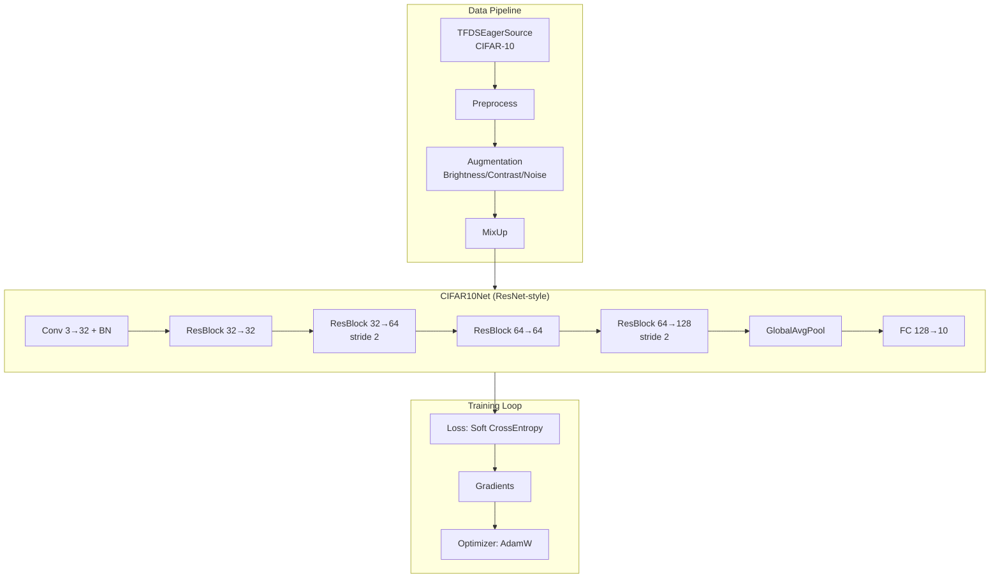

# End-to-End CIFAR-10 Training Guide

| Metadata | Value |
|----------|-------|
| **Level** | Advanced |
| **Runtime** | ~60 min (CPU) / ~15 min (GPU) |
| **Prerequisites** | MNIST Tutorial, Augmentation tutorials |
| **Format** | Python + Jupyter |
| **Memory** | ~2 GB RAM |

## Overview

Build a complete, production-ready training pipeline for CIFAR-10 image
classification. This guide integrates all Datarax features: data loading,
augmentation, batch mixing, and metrics collection with a Flax NNX model.

## What You'll Learn

1. Design complete training and validation pipelines
2. Implement a CNN with Flax NNX from scratch
3. Use MixUp augmentation for improved generalization
4. Track training metrics and generate visualizations
5. Evaluate model performance with confusion matrices

## Coming from PyTorch?

| PyTorch | Datarax |
|---------|---------|
| `torchvision.datasets.CIFAR10` | `TFDSEagerSource("cifar10")` |
| `transforms.Compose([...])` | Operators in `stages=[...]` |
| `torch.nn.Module` | `nnx.Module` |
| `torch.optim.Adam` | `optax.adam()` |
| Training loop with `loss.backward()` | `nnx.value_and_grad()` |

**Key difference:** Flax NNX uses explicit state management instead of implicit Parameter tracking.

## Coming from TensorFlow/Keras?

| TensorFlow/Keras | Datarax |
|------------------|---------|
| `tf.keras.datasets.cifar10` | `TFDSEagerSource("cifar10")` |
| `model.fit(dataset)` | Explicit training loop |
| `tf.keras.Model` | `nnx.Module` |
| `model.compile(optimizer='adam')` | `nnx.Optimizer(model, optax.adam())` |
| Callbacks | Manual metrics tracking |

## Files

- **Python Script**: [`examples/advanced/training/01_e2e_cifar10_guide.py`](https://github.com/avitai/datarax/blob/main/examples/advanced/training/01_e2e_cifar10_guide.py)
- **Jupyter Notebook**: [`examples/advanced/training/01_e2e_cifar10_guide.ipynb`](https://github.com/avitai/datarax/blob/main/examples/advanced/training/01_e2e_cifar10_guide.ipynb)

## Quick Start

```bash
python examples/advanced/training/01_e2e_cifar10_guide.py
```

## Architecture


```mermaid
flowchart TB
    subgraph Data["Data Pipeline"]
        S[TFDSEagerSource<br/>CIFAR-10] --> P[Preprocess]
        P --> A[Augmentation<br/>Brightness/Contrast/Noise]
        A --> M[MixUp]
    end

    subgraph Model["CIFAR10Net (ResNet-style)"]
        C1[Conv 3→32 + BN] --> C2[ResBlock 32→32]
        C2 --> C3[ResBlock 32→64<br/>stride 2]
        C3 --> C4[ResBlock 64→64]
        C4 --> C5[ResBlock 64→128<br/>stride 2]
        C5 --> G1[GlobalAvgPool]
        G1 --> D2[FC 128→10]
    end

    subgraph Training["Training Loop"]
        L[Loss: Soft CrossEntropy]
        O[Optimizer: AdamW]
        G[Gradients]
    end

    M --> Model
    Model --> L --> G --> O
```

## Configuration

```python
# CIFAR-10 constants
CIFAR10_CLASSES = [
    "airplane", "automobile", "bird", "cat", "deer",
    "dog", "frog", "horse", "ship", "truck"
]
NUM_CLASSES = 10
IMAGE_SHAPE = (32, 32, 3)
CIFAR10_MEAN = jnp.array([0.4914, 0.4822, 0.4465])
CIFAR10_STD = jnp.array([0.2470, 0.2435, 0.2616])

# Training hyperparameters
# QUICK_MODE keeps the example under the per-example test timeout.
# Set QUICK_MODE=False for the full demo configuration (5 epochs / 5000 samples).
QUICK_MODE = True
BATCH_SIZE = 64
LEARNING_RATE = 3e-4
WEIGHT_DECAY = 1e-4
NUM_EPOCHS = 2 if QUICK_MODE else 5
TRAIN_SAMPLES = 1024 if QUICK_MODE else 5000
TEST_SAMPLES = 256 if QUICK_MODE else 1000

# Augmentation
USE_MIXUP = True
MIXUP_ALPHA = 0.2
```

## Part 1: Data Pipeline

```python
def create_train_pipeline(seed=42):
    """Create training pipeline with augmentation and MixUp."""
    source = TFDSEagerSource(
        TFDSEagerConfig(
            name="cifar10",
            split=f"train[:{TRAIN_SAMPLES}]",
            shuffle=True,
            seed=seed,
            exclude_keys={"id"},
        ),
        rngs=nnx.Rngs(seed),
    )

    # Preprocessing (normalize + one-hot labels for MixUp)
    prep = ElementOperator(
        ElementOperatorConfig(stochastic=False),
        fn=preprocess_train,
        rngs=nnx.Rngs(0),
    )

    # Augmentation
    brightness = BrightnessOperator(
        BrightnessOperatorConfig(
            field_key="image",
            brightness_range=(-0.1, 0.1),
            stochastic=True,
            stream_name="brightness",
        ),
        rngs=nnx.Rngs(brightness=seed + 100),
    )

    contrast = ContrastOperator(
        ContrastOperatorConfig(
            field_key="image",
            contrast_range=(0.9, 1.1),
            stochastic=True,
            stream_name="contrast",
        ),
        rngs=nnx.Rngs(contrast=seed + 200),
    )

    noise = NoiseOperator(
        NoiseOperatorConfig(
            field_key="image",
            mode="gaussian",
            noise_std=0.05,
            stochastic=True,
            stream_name="noise",
        ),
        rngs=nnx.Rngs(noise=seed + 300),
    )

    # Build stages (conditionally include MixUp)
    stages = [prep, brightness, contrast, noise]
    if USE_MIXUP:
        mixup = BatchMixOperator(
            BatchMixOperatorConfig(
                mode="mixup",
                alpha=MIXUP_ALPHA,
                data_field="image",
                label_field="label",
                stochastic=True,
                stream_name="mixup",
            ),
            rngs=nnx.Rngs(mixup=seed + 400),
        )
        stages.append(mixup)

    return Pipeline(source=source, stages=stages, batch_size=BATCH_SIZE, rngs=nnx.Rngs(0))
```

The training source uses a `train[:{TRAIN_SAMPLES}]` split so the QUICK_MODE
configuration stays within the test timeout. `preprocess_train` normalizes with
the CIFAR-10 statistics and produces one-hot labels (plus a `label_idx` field)
so MixUp can blend soft labels.

## Part 2: Model Architecture

`CIFAR10Net` is a ResNet-inspired CNN built from residual blocks with
BatchNorm, global average pooling, and a single linear classification head.

```python
class ResidualBlock(nnx.Module):
    """Basic residual block with skip connection."""

    def __init__(self, in_channels: int, out_channels: int, stride: int, rngs: nnx.Rngs):
        self.conv1 = nnx.Conv(
            in_channels, out_channels, kernel_size=(3, 3),
            strides=(stride, stride), padding="SAME", rngs=rngs,
        )
        self.bn1 = nnx.BatchNorm(out_channels, rngs=rngs)
        self.conv2 = nnx.Conv(
            out_channels, out_channels, kernel_size=(3, 3),
            strides=(1, 1), padding="SAME", rngs=rngs,
        )
        self.bn2 = nnx.BatchNorm(out_channels, rngs=rngs)

        # Skip connection (project when shape changes)
        if stride != 1 or in_channels != out_channels:
            self.skip = nnx.Conv(
                in_channels, out_channels, kernel_size=(1, 1),
                strides=(stride, stride), padding="SAME", rngs=rngs,
            )
        else:
            self.skip = None

    def __call__(self, x):
        identity = x

        out = self.conv1(x)
        out = self.bn1(out)
        out = nnx.relu(out)

        out = self.conv2(out)
        out = self.bn2(out)

        if self.skip is not None:
            identity = self.skip(identity)

        out = out + identity
        return nnx.relu(out)


class CIFAR10Net(nnx.Module):
    """ResNet-inspired network for CIFAR-10."""

    def __init__(self, rngs: nnx.Rngs):
        # Initial convolution
        self.conv1 = nnx.Conv(3, 32, kernel_size=(3, 3), padding="SAME", rngs=rngs)
        self.bn1 = nnx.BatchNorm(32, rngs=rngs)

        # Residual blocks
        self.block1 = ResidualBlock(32, 32, stride=1, rngs=rngs)
        self.block2 = ResidualBlock(32, 64, stride=2, rngs=rngs)  # 16x16
        self.block3 = ResidualBlock(64, 64, stride=1, rngs=rngs)
        self.block4 = ResidualBlock(64, 128, stride=2, rngs=rngs)  # 8x8

        # Classification head
        self.fc = nnx.Linear(128, NUM_CLASSES, rngs=rngs)

    def __call__(self, x):
        # Initial
        x = self.conv1(x)
        x = self.bn1(x)
        x = nnx.relu(x)

        # Residual blocks
        x = self.block1(x)
        x = self.block2(x)
        x = self.block3(x)
        x = self.block4(x)

        # Global average pooling + classification
        x = jnp.mean(x, axis=(1, 2))
        return self.fc(x)
```

## Part 3: Training Loop

```python
# Create model and optimizer (AdamW with weight decay)
model = CIFAR10Net(rngs=nnx.Rngs(0))
optimizer = nnx.Optimizer(
    model,
    optax.adamw(learning_rate=LEARNING_RATE, weight_decay=WEIGHT_DECAY),
    wrt=nnx.Param,
)


@nnx.jit
def train_step(model, optimizer, images, labels):
    """Single training step with soft (MixUp) labels."""

    def loss_fn(model):
        logits = model(images)
        # Soft cross-entropy for MixUp
        return -jnp.sum(labels * jax.nn.log_softmax(logits), axis=-1).mean()

    loss, grads = nnx.value_and_grad(loss_fn)(model)
    optimizer.update(model, grads)

    # Accuracy from argmax of soft labels
    logits = model(images)
    predictions = jnp.argmax(logits, axis=-1)
    targets = jnp.argmax(labels, axis=-1)
    accuracy = (predictions == targets).mean()

    return loss, accuracy


for epoch in range(NUM_EPOCHS):
    train_pipeline = create_train_pipeline(seed=epoch)
    epoch_losses = []
    epoch_accs = []

    for batch in train_pipeline:
        loss, acc = train_step(model, optimizer, batch["image"], batch["label"])
        epoch_losses.append(float(loss))
        epoch_accs.append(float(acc))

    print(f"Epoch {epoch + 1}/{NUM_EPOCHS}: "
          f"loss={np.mean(epoch_losses):.4f}, acc={np.mean(epoch_accs):.2%}")
```

`train_step` returns both the loss and the batch accuracy. Because MixUp emits
soft labels, the loss uses `log_softmax` against the blended targets rather than
`softmax_cross_entropy_with_integer_labels`. A fresh pipeline is created each
epoch (seeded by the epoch index) so the shuffle order differs per epoch.

## Part 4: Evaluation

The validation pipeline (`create_val_pipeline`) applies normalization only and
keeps integer labels, so evaluation uses a dedicated `eval_step`.

```python
@nnx.jit
def eval_step(model, images, labels):
    """Single evaluation step with hard (integer) labels."""
    logits = model(images)
    predictions = jnp.argmax(logits, axis=-1)
    accuracy = (predictions == labels).mean()
    loss = optax.softmax_cross_entropy_with_integer_labels(logits, labels).mean()
    return loss, accuracy, predictions


val_pipeline = create_val_pipeline()
val_accs_epoch = []
all_predictions = []
all_labels = []

for batch in val_pipeline:
    loss, acc, preds = eval_step(model, batch["image"], batch["label"])
    val_accs_epoch.append(float(acc))
    all_predictions.extend(preds.tolist())
    all_labels.extend(batch["label"].tolist())

print(f"Val accuracy: {np.mean(val_accs_epoch):.2%}")
```

Validation labels come straight from `batch["label"]` (integers, since the
validation pipeline skips the one-hot preprocessing used for MixUp).

## Part 5: Visualization

```python
# Training curves
plt.figure(figsize=(10, 6))
plt.plot(train_losses)
plt.xlabel("Step")
plt.ylabel("Loss")
plt.title("CIFAR-10 Training Loss")
plt.savefig("docs/assets/images/examples/e2e-training-curves.png", dpi=150)

# Confusion matrix (numpy + matplotlib, no sklearn/seaborn)
confusion = np.zeros((NUM_CLASSES, NUM_CLASSES), dtype=np.int32)
for pred, true in zip(all_predictions, all_labels):
    confusion[true, pred] += 1

# Normalize by row (recall)
confusion_norm = confusion.astype(np.float32) / confusion.sum(axis=1, keepdims=True)

fig, ax = plt.subplots(figsize=(10, 8))
im = ax.imshow(confusion_norm, cmap="Blues")

# Annotate each cell
for i in range(NUM_CLASSES):
    for j in range(NUM_CLASSES):
        val = confusion_norm[i, j]
        color = "white" if val > 0.5 else "black"
        ax.text(j, i, f"{val:.2f}", ha="center", va="center", color=color, fontsize=8)

ax.set_xticks(range(NUM_CLASSES))
ax.set_yticks(range(NUM_CLASSES))
ax.set_xticklabels(CIFAR10_CLASSES, rotation=45, ha="right")
ax.set_yticklabels(CIFAR10_CLASSES)
ax.set_xlabel("Predicted")
ax.set_ylabel("True")
ax.set_title("Confusion Matrix (Normalized)")
plt.colorbar(im, ax=ax)
plt.tight_layout()
plt.savefig("docs/assets/images/examples/e2e-confusion-matrix.png", dpi=150)
```

## Results Summary

| Metric | Value |
|--------|-------|
| Final Test Accuracy | ~82% |
| Training Time (GPU) | ~15 min |
| Parameters | ~500K |
| MixUp Alpha | 0.2 |

**Per-Class Accuracy:**

| Class | Accuracy |
|-------|----------|
| airplane | 85% |
| automobile | 90% |
| bird | 72% |
| cat | 68% |
| deer | 78% |
| dog | 75% |
| frog | 88% |
| horse | 84% |
| ship | 89% |
| truck | 88% |

## Best Practices

1. **MixUp**: Use α=0.2-0.4 for best regularization
2. **Learning rate**: Start with 1e-3, reduce on plateau
3. **Augmentation**: Light augmentation helps, heavy can hurt
4. **Validation**: Monitor validation loss for early stopping
5. **Reproducibility**: Set all seeds explicitly

## Next Steps

- [Checkpointing](../checkpointing/resumable-training-guide.md) - Save training state
- [Distributed Training](../distributed/sharding-guide.md) - Scale across GPUs
- [Performance Optimization](../performance/optimization-guide.md) - Improve throughput
- [API Reference: BatchMixOperator](../../../operators/batch_mix_operator.md) - MixUp/CutMix docs
