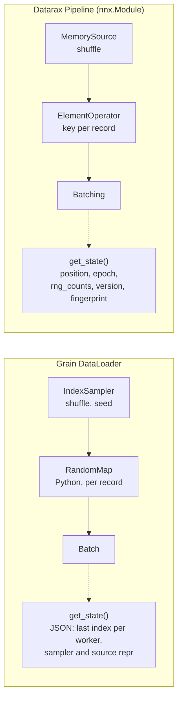

# Grain and Datarax: Iteration and Checkpoint State Quick Reference

| Metadata | Value |
|----------|-------|
| **Level** | Beginner |
| **Runtime** | ~1 min (CPU) |
| **Prerequisites** | [Pipeline Tutorial](../core/pipeline-tutorial.md) |
| **Format** | Python + Jupyter |

## Overview

Grain and Datarax both read records, apply a random transform to each record, batch them,
and resume an interrupted epoch from saved iterator state. This quick reference runs one job
with each library, so the two APIs sit side by side: what a checkpoint holds, where the
per-record randomness comes from, and where the transform runs.

Grain is installed as a Datarax dependency, so the example needs nothing beyond `datarax`.
Measured throughput and memory for both libraries are on the
[framework comparison page](../../benchmarks/comparison.md); this example makes no speed claim.

## What You'll Learn

1. Build a Grain `DataLoader` and a Datarax `Pipeline` over the same records
2. Save iterator state mid-epoch in both libraries and resume from it exactly
3. Say what each library's checkpoint holds and where its randomness comes from

## Coming from Google Grain?

| Grain | Datarax |
|-------|---------|
| `RandomAccessDataSource` with `__len__` and `__getitem__` | `MemorySource` over arrays, reading records by index |
| `IndexSampler(shuffle=True, seed=...)` fixes the order | `MemorySourceConfig(shuffle=True)` with the source's `nnx.Rngs` |
| `RandomMap.random_map(element, rng)` receives a NumPy generator per record | `ElementOperator` receives each record's JAX key |
| `transforms.Batch(batch_size=...)` as an operation | `Pipeline(..., batch_size=...)` |
| `iterator.get_state()` returns JSON bytes | `iterator.get_state()` returns `position`, `epoch`, `rng_counts` and `version` |
| Transforms run in Python, per record, optionally in worker processes | Source, stages and batching run as one compiled step |

## Files

- **Python Script**: [`examples/comparison/01_grain_datarax_quickref.py`](https://github.com/avitai/datarax/blob/main/examples/comparison/01_grain_datarax_quickref.py)
- **Jupyter Notebook**: [`examples/comparison/01_grain_datarax_quickref.ipynb`](https://github.com/avitai/datarax/blob/main/examples/comparison/01_grain_datarax_quickref.ipynb)

## Quick Start

### Run the Python Script

```bash
python examples/comparison/01_grain_datarax_quickref.py
```

### Run the Jupyter Notebook

```bash
jupyter lab examples/comparison/01_grain_datarax_quickref.ipynb
```

## Key Concepts

### Step 1: A Grain Loader

Grain reads records by index from any object with `__len__` and `__getitem__`. The
`IndexSampler` fixes the order (shuffled here) and gives every draw a NumPy generator, which
a `RandomMap` transform receives. The `DataLoader` runs the transforms record by record in
Python, in worker processes when `worker_count` is above zero.

```python
class AddNoise(grain.transforms.RandomMap):
    def random_map(self, element: dict, rng: np.random.Generator) -> dict:
        noise = rng.normal(scale=NOISE_SCALE, size=element["x"].shape).astype(np.float32)
        return {"x": element["x"] + noise}


def build_grain_loader() -> grain.DataLoader:
    sampler = grain.samplers.IndexSampler(
        num_records=NUM_RECORDS, shuffle=True, num_epochs=1, seed=SEED
    )
    return grain.DataLoader(
        data_source=FeatureRecords(features),
        sampler=sampler,
        operations=[AddNoise(), grain.transforms.Batch(batch_size=BATCH_SIZE)],
    )


grain_iterator = iter(build_grain_loader())
first_grain_batch = next(grain_iterator)
print(f"Grain batch: x={first_grain_batch['x'].shape} {type(first_grain_batch['x']).__name__}")
```

**Terminal Output:**
```
Grain batch: x=(8, 3) ndarray
```

### Step 2: Resume the Grain Loader

The iterator's `get_state()` returns JSON bytes. They record the last index each worker
served, and the `repr` of the sampler and data source the loader was built with.
`set_state()` on a loader built the same way continues from there; it refuses a checkpoint
whose sampler or data source `repr` differs, which is why `FeatureRecords` defines
`__repr__` from its data rather than inheriting the object address.

```python
grain_state = grain_iterator.get_state()
print(f"Grain checkpoint keys: {sorted(json.loads(grain_state))}")
expected_grain = [next(grain_iterator)["x"] for _ in range(2)]

resumed_grain = iter(build_grain_loader())
resumed_grain.set_state(grain_state)
resumed_grain_batches = [next(resumed_grain)["x"] for _ in range(2)]
grain_matches = all(
    np.array_equal(got, want)
    for got, want in zip(resumed_grain_batches, expected_grain, strict=True)
)
print(f"Grain resumes exactly: {grain_matches}")
```

**Terminal Output:**
```
Grain checkpoint keys: ['data_source', 'last_seen_indices', 'last_worker_index', 'sampler', 'version', 'worker_count']
Grain resumes exactly: True
```

### Step 3: A Datarax Pipeline

A Datarax `Pipeline` is an `nnx.Module`. The source shuffles, and the stochastic operator
draws each record's key from its own stable base key, as
`fold_in(fold_in(base_key, epoch), record_index)`. The operator is a JAX function of one
record, and iteration runs source, stages and batching as one compiled step.

```python
def add_noise(element, key):
    x = element.data["x"]
    return element.update_data({"x": x + NOISE_SCALE * jax.random.normal(key, x.shape)})


def build_datarax_pipeline() -> Pipeline:
    source = MemorySource(
        MemorySourceConfig(shuffle=True), data={"x": features}, rngs=nnx.Rngs(SEED)
    )
    noise = ElementOperator(
        ElementOperatorConfig(stochastic=True, stream_name="noise"),
        fn=add_noise,
        rngs=nnx.Rngs(noise=SEED),
    )
    return Pipeline(source=source, stages=[noise], batch_size=BATCH_SIZE, rngs=nnx.Rngs(SEED))


datarax_iterator = iter(build_datarax_pipeline())
first_datarax_batch = next(datarax_iterator)
print(f"Datarax batch: x={first_datarax_batch['x'].shape} {type(first_datarax_batch['x']).__name__}")
```

**Terminal Output:**
```
Datarax batch: x=(8, 3) ArrayImpl
```

### Step 4: Resume the Datarax Pipeline

The iterator's `get_state()` returns the records consumed, the epoch, one count per random
stream, and the `version` those counts are in. A stochastic operator contributes one count,
which stays 0: iteration keys each record on the operator's stable base key and never draws
from the operator's own stream. The counts that move belong to the pipeline and the source.
Position and epoch decide the batches, so a pipeline built with the same seeds continues
with the same ones.

```python
datarax_state = datarax_iterator.get_state()
print(f"Datarax checkpoint: {datarax_state}")
expected_datarax = [np.asarray(next(datarax_iterator)["x"]) for _ in range(2)]

resumed_datarax = iter(build_datarax_pipeline())
resumed_datarax.set_state(datarax_state)
resumed_datarax_batches = [np.asarray(next(resumed_datarax)["x"]) for _ in range(2)]
datarax_matches = all(
    np.array_equal(got, want)
    for got, want in zip(resumed_datarax_batches, expected_datarax, strict=True)
)
print(f"Datarax resumes exactly: {datarax_matches}")
```

**Terminal Output:**
```
Datarax checkpoint: {'position': 8, 'epoch': 0, 'rng_counts': [0, 1, 0], 'version': 2, 'fingerprint': {'batch_size': 8, 'length': 64, 'drop_last': False, 'num_epochs': 1, 'shuffled': True}}
Datarax resumes exactly: True
```

## Architecture Diagram



## Results Summary

| | Grain | Datarax |
|---|---|---|
| Loop object | `DataLoader` iterator | `Pipeline` (an `nnx.Module`) iterator |
| Checkpoint | JSON bytes: last index per worker, sampler and source description | `position`, `epoch`, one count per random stream, and their `version` |
| Per-record randomness | `np.random.Generator(Philox(key=seed + draw index))` from the sampler | `fold_in(fold_in(base_key, epoch), record_index)` from the operator's stable base key |
| Where transforms run | Python, per record, optionally in worker processes | Inside one `jax.jit` step with batching |

Both loops resume mid-epoch exactly. The difference is where the work runs: Grain keeps
transforms in Python around the data source, while Datarax traces them into the same
compiled program as batching, which is also what lets the next tutorial differentiate
through a pipeline.

## Next Steps

- [Randomness and Learnable Operators](randomness-and-learnable-operators-tutorial.md):
  where each record's randomness comes from, and gradients through operators, in both
  libraries
- [Checkpoint Quick Reference](../advanced/checkpointing/checkpoint-quickref.md): saving
  iterator state with Orbax
- [Framework comparison](../../benchmarks/comparison.md): measured throughput and memory
- [API Reference: ElementOperator](../../operators/element_operator.md)
