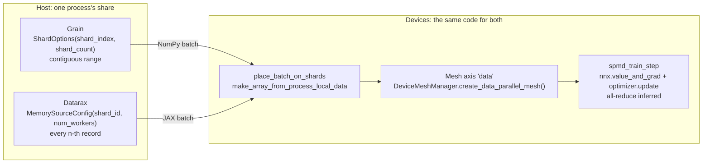

# Grain and Datarax: Process and Device Sharding Guide

| Metadata | Value |
|----------|-------|
| **Level** | Advanced |
| **Runtime** | ~1 min (CPU or GPU) |
| **Prerequisites** | [Randomness and Learnable Operators](randomness-and-learnable-operators-tutorial.md), [Sharding Guide](../advanced/distributed/sharding-guide.md) |
| **Format** | Python + Jupyter |
| **Devices** | Runs on one device; the mesh grows with the devices available |

## Overview

Distributed data loading has two halves. On the host, each process reads its own share of
the records. On the devices, the batch each process loaded becomes one global array laid
out over a device mesh, and the training step runs on that array with the gradient
all-reduce inferred by the compiler.

Grain and Datarax split the first half differently, and this guide shows both: which
records each process serves, and what that means for a record's randomness. The second
half is the same for both, because it belongs to JAX: `substrax.spmd.place_batch_on_shards`
turns either library's host batch into a global array, and `substrax.spmd.spmd_train_step`
runs the step under `jax.set_mesh`.

## What You'll Learn

1. Partition records across processes with Grain's `ShardOptions` and Datarax's
   `MemorySourceConfig(shard_id, num_workers)`, and say which records each process serves
2. Show that a Datarax record's randomness does not depend on the process that serves it
3. Place a host batch from either library on a data-parallel device mesh
4. Run `spmd_train_step` on batches from both libraries and get the same losses

## Coming from Google Grain?

| Grain | Datarax |
|-------|---------|
| `ShardOptions(shard_index, shard_count)`; `ShardByJaxProcess()` fills both from `jax.process_index()` and `jax.process_count()` | `MemorySourceConfig(shard_id=k, num_workers=n)` |
| Each process reads a contiguous range (`even_split`; the remainder goes to the first shards) | Each worker reads every `n`-th position, `[k::n]` of the global order |
| A record's generator belongs to its draw index within the shard | A record's key belongs to its global index, the same on any split |
| Batches are NumPy arrays; the last one may be short | Batches are JAX arrays of one fixed shape |
| `place_batch_on_shards(batch, sharding)` under `jax.set_mesh(mesh)` | The same call |
| `spmd_train_step(model, optimizer, loss_fn, batch)` inside `nnx.jit` | The same call |

## Files

- **Python Script**: [`examples/comparison/03_sharding_guide.py`](https://github.com/avitai/datarax/blob/main/examples/comparison/03_sharding_guide.py)
- **Jupyter Notebook**: [`examples/comparison/03_sharding_guide.ipynb`](https://github.com/avitai/datarax/blob/main/examples/comparison/03_sharding_guide.ipynb)

## Quick Start

### Run the Python Script

```bash
python examples/comparison/03_sharding_guide.py
```

To see the placement over several CPU devices on a CPU-only machine:

```bash
XLA_FLAGS=--xla_force_host_platform_device_count=4 python examples/comparison/03_sharding_guide.py
```

### Run the Jupyter Notebook

```bash
jupyter lab examples/comparison/03_sharding_guide.ipynb
```

## Key Concepts

### Part 1: Which Records Each Process Serves

Both partitions are built explicitly for shards 0 and 1 of 2 on one process, so the two
shares can be printed side by side. In a real multi-process run, Grain's
`ShardByJaxProcess()` and a Datarax config filled from `jax.process_index()` and
`jax.process_count()` pick the share for the process they run in.

```python
def build_grain_loader(shard_index: int) -> grain.DataLoader:
    shard = grain.sharding.ShardOptions(shard_index=shard_index, shard_count=NUM_PROCESSES)
    sampler = grain.samplers.IndexSampler(
        num_records=NUM_RECORDS, shard_options=shard, shuffle=False, num_epochs=1, seed=0
    )
    return grain.DataLoader(
        data_source=Records(),
        sampler=sampler,
        operations=[grain.transforms.Batch(batch_size=BATCH_SIZE)],
    )


def build_datarax_pipeline(shard_id: int, stages: list | None = None) -> Pipeline:
    source = MemorySource(
        MemorySourceConfig(shard_id=shard_id, num_workers=NUM_PROCESSES), data=data
    )
    return Pipeline(source=source, stages=stages or [], batch_size=BATCH_SIZE, rngs=nnx.Rngs(0))


grain_shares = [served_records(build_grain_loader(k)) for k in range(NUM_PROCESSES)]
datarax_shares = [served_records(build_datarax_pipeline(k)) for k in range(NUM_PROCESSES)]
```

**Terminal Output:**
```
Grain shard 0: records [0, 1, 2, 3] ... [30, 31]
Grain shard 1: records [32, 33, 34, 35] ... [62, 63]
Datarax worker 0: records [0, 2, 4, 6] ... [60, 62]
Datarax worker 1: records [1, 3, 5, 7] ... [61, 63]
ShardByJaxProcess() on this process: ShardByJaxProcess(shard_index=0, shard_count=1, drop_remainder=False)
Grain shards partition the records: True
Datarax workers partition the records: True
```

A Datarax pipeline keeps every batch at `batch_size` so the compiled step has one shape.
When a process's share of the records is not a multiple of the batch size, the last batch
is padded from the start of that process's order and the padding rows are marked invalid in
the batch's `valid_mask` (or `drop_last=True` leaves the batch out); the guide uses 64
records, two processes and batches of 8, so every batch is full and every record is served
once.

### Part 2: A Record's Randomness Does Not Depend on the Process

Datarax keys each record's randomness as `fold_in(fold_in(base_key, epoch), record_index)`
with the record's global index, which a partitioned source keeps: a record has one index on
every worker. So the noise a record receives is the same whether one process serves all 64
records or two processes serve 32 each. Grain's generator belongs to the draw index within
each shard, so the same record gets different noise under a different partition.

```python
noise_on_one_process = noise_by_record(unpartitioned)
noise_on_two_processes = np.zeros_like(features)
for k in range(NUM_PROCESSES):
    share = build_datarax_pipeline(k, stages=[noise_operator()])
    noise_on_two_processes[datarax_shares[k]] = noise_by_record(share)[datarax_shares[k]]
print(f"Datarax: same noise per record on one process and on two: "
      f"{np.array_equal(noise_on_one_process, noise_on_two_processes)}")
```

**Terminal Output:**
```
Datarax: same noise per record on one process and on two: True
```

### Part 3: Place a Host Batch on the Device Mesh

`DeviceMeshManager.create_data_parallel_mesh()` builds a one-axis mesh named `data` over
every device, with `Auto` axis types so the compiler infers the gradient all-reduce.
`create_data_parallel_sharding(mesh)` shards the leading axis of every array over that
axis. Under `jax.set_mesh(mesh)`, `place_batch_on_shards` takes the batch a loader yields,
NumPy from Grain or JAX arrays from Datarax, and returns the same batch as global arrays on
that sharding. It calls `jax.make_array_from_process_local_data`: on one process that is
one batched `device_put`; on several, each process passes the slice it loaded and jax
stitches the slices into one global array.

```python
mesh = DeviceMeshManager.create_data_parallel_mesh()
batch_sharding = create_data_parallel_sharding(mesh)

grain_batch = next(iter(build_grain_loader(0)))
datarax_batch = next(iter(build_datarax_pipeline(0)))
with jax.set_mesh(mesh):
    placed_grain = place_batch_on_shards(grain_batch, batch_sharding)
    placed_datarax = place_batch_on_shards(datarax_batch, batch_sharding)
```

**Terminal Output** (one CPU device; the mesh size varies by hardware):
```
Mesh: {'data': 1}
Grain: ndarray (8, 3) -> ArrayImpl (8, 3) on P('data',)
Datarax: ArrayImpl (8, 3) -> ArrayImpl (8, 3) on P('data',)
Both batches carry the same sharding: True
```

### Part 4: The Same Training Step on Both

`spmd_train_step(model, optimizer, loss_fn, batch)` runs `nnx.value_and_grad` and the
optimizer update; called inside `nnx.jit` under `jax.set_mesh`, its gradient all-reduce
across the `data` axis is inferred from the batch's sharding. The model is a linear
regression of `y` on `x`, trained for ten epochs. The two shares differ (Grain's shard 0 is
records 0 to 31, Datarax's worker 0 the even records), so to compare the step itself both
loaders serve Grain's share: the same records in the same order give the same losses, and
the fit reaches the true weights.

```python
@nnx.jit
def train_step(model: LinearRegression, optimizer: nnx.Optimizer, batch: dict) -> jax.Array:
    return spmd_train_step(model, optimizer, mse_loss, batch)


def train(build_batches, epochs: int = 10) -> tuple[list[float], np.ndarray]:
    model = LinearRegression(rngs=nnx.Rngs(0))
    optimizer = nnx.Optimizer(model, optax.sgd(learning_rate=0.2), wrt=nnx.Param)
    losses = []
    with jax.set_mesh(mesh):
        for _ in range(epochs):
            for batch in build_batches():
                placed = place_batch_on_shards({"x": batch["x"], "y": batch["y"]}, batch_sharding)
                losses.append(float(train_step(model, optimizer, placed)))
    return losses, np.asarray(model.linear.kernel[...])


grain_losses, grain_weights = train(lambda: build_grain_loader(0))
datarax_losses, datarax_weights = train(datarax_over_grain_share)
```

**Terminal Output:**
```
Grain:   40 steps, loss first 3.7473, last 5.77e-10
Datarax: 40 steps, loss first 3.7473, last 5.77e-10
Same records through both loaders give the same losses: True
Learned weights: [ 2.  -1.   0.5] (true [ 2.  -1.   0.5])
```

## Architecture Diagram



## Results Summary

| | Grain | Datarax |
|---|---|---|
| Host partition | `ShardOptions(shard_index, shard_count)`, contiguous ranges; `ShardByJaxProcess()` reads the JAX process | `MemorySourceConfig(shard_id, num_workers)`, every `n`-th record |
| Randomness under a partition | Keyed to the draw index within the shard | Keyed to the global record index: the same on any split |
| Batch a process yields | NumPy arrays, possibly a short last batch | JAX arrays of a fixed shape |
| Device placement | `place_batch_on_shards` under `jax.set_mesh` | The same call |
| Training step | `spmd_train_step` inside `nnx.jit` | The same call |

The host partition is where the libraries differ; from `place_batch_on_shards` on, the code
is the same, and the same records give the same losses.

## Next Steps

- [Resumed Training Guide](resumed-training-guide.md): checkpoint the pipeline, model and
  optimizer together and resume mid-epoch
- [Sharding Guide](../advanced/distributed/sharding-guide.md): the Datarax data-parallel
  pipeline over CIFAR-10 with throughput and memory analysis
- [Distributed Training](../../user_guide/distributed_training.md): the SPMD and `pmap`
  paths in the user guide
- [API Reference: MemorySource](../../sources/memory_source.md)
