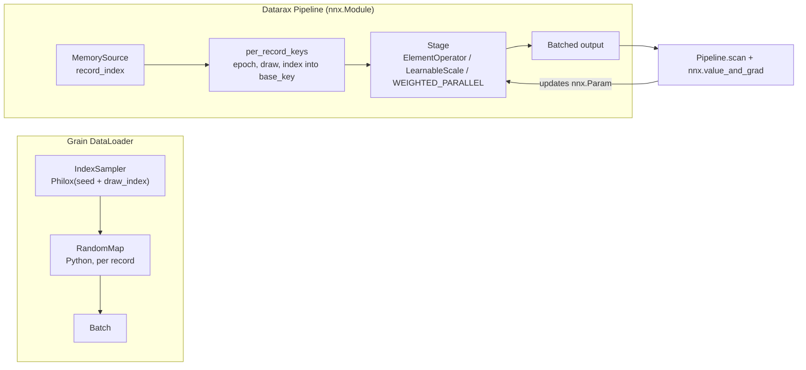

# Grain and Datarax: Randomness and Learnable Operators Tutorial

| Metadata | Value |
|----------|-------|
| **Level** | Intermediate |
| **Runtime** | ~1 min (CPU) |
| **Prerequisites** | [Grain and Datarax Quick Reference](grain-datarax-quickref.md) |
| **Format** | Python + Jupyter |

## Overview

A random transform needs a source of randomness for each record, and a transform with
parameters needs a gradient to reach them. This tutorial runs both in Grain and in Datarax
on the same 64 small images and follows what each library does: where a record's
randomness comes from, what changes it, and whether `jax.grad` can see the transform.

A Grain transform is a Python object the loader calls on each record, with a NumPy
generator the sampler hands it. A Datarax operator is an `nnx.Module` inside the pipeline
module: it receives a JAX key derived from the record itself, its variables are pipeline
state, and its computation is JAX code.

## What You'll Learn

1. Say what a record's randomness depends on in each library, and reproduce it
2. Fit the parameters of a Datarax stage by differentiating an epoch of `Pipeline.scan`
3. Learn the mixture weights of a `WEIGHTED_PARALLEL` composite of image operators

## Coming from Google Grain?

| Grain | Datarax |
|-------|---------|
| `IndexSampler(seed=...)` gives each draw `np.random.Generator(np.random.Philox(key=seed + draw_index))` | A stochastic operator holds one base key; each record's epoch, draw and index are folded into it |
| The generator belongs to the draw: another shuffle order gives a record different noise | The key belongs to the record: the same noise under any shuffle order, batch size, worker split or resume point |
| The draw index keeps counting across epochs, so each epoch draws afresh | The epoch is folded in, so each epoch draws afresh |
| A transform runs as Python and NumPy code outside any JAX trace; a learnable step belongs in the model | Any `nnx.Param` in a stage is trained through `Pipeline.scan` with `nnx.value_and_grad` |
| A `Map` that applies fixed mixture weights | `CompositeOperatorModule` with `WEIGHTED_PARALLEL` and `learnable_weights=True` |

## Files

- **Python Script**: [`examples/comparison/02_randomness_and_learnable_operators_tutorial.py`](https://github.com/avitai/datarax/blob/main/examples/comparison/02_randomness_and_learnable_operators_tutorial.py)
- **Jupyter Notebook**: [`examples/comparison/02_randomness_and_learnable_operators_tutorial.ipynb`](https://github.com/avitai/datarax/blob/main/examples/comparison/02_randomness_and_learnable_operators_tutorial.ipynb)

## Quick Start

### Run the Python Script

```bash
python examples/comparison/02_randomness_and_learnable_operators_tutorial.py
```

### Run the Jupyter Notebook

```bash
jupyter lab examples/comparison/02_randomness_and_learnable_operators_tutorial.ipynb
```

## Key Concepts

### Part 1: Where a Record's Randomness Comes From

Both loaders add Gaussian noise to each image, and a helper collects the noise each record
received, keyed by the record's index, so two runs can be compared record by record
whatever order they served the records in.

```python
def noise_by_record(batches) -> np.ndarray:
    """Return the noise each record received, indexed by record."""
    noise = np.zeros_like(images)
    for batch in batches:
        batch_index = np.asarray(batch["index"])
        noise[batch_index] = np.asarray(batch["image"]) - images[batch_index]
    return noise
```

**Grain: a generator per draw.** An `IndexSampler` with a seed gives every draw
`np.random.Generator(np.random.Philox(key=seed + draw_index))`, and a `RandomMap` receives
that generator with the record. The generator belongs to the draw, so a record's noise
changes under another shuffle seed. Rebuilding the first draw's generator and applying the
transform's arithmetic reproduces the image that was served first.

```python
class ImageRecords(grain.sources.RandomAccessDataSource):
    """``{"image": images[i], "index": i}`` records."""

    def __len__(self) -> int:
        """Return the number of records."""
        return NUM_RECORDS

    def __getitem__(self, i: int) -> dict[str, np.ndarray]:
        """Return the record at ``i``."""
        return {"image": images[i], "index": index[i]}


class AddNoise(grain.transforms.RandomMap):
    """Add Gaussian noise drawn from the generator Grain passes with each record."""

    # Grain declares RandomMap.random_map with no return annotation, so a type checker infers
    # None; its own documented override annotates the return as this one does.
    def random_map(  # pyright: ignore[reportIncompatibleMethodOverride]
        self, element: dict, rng: np.random.Generator
    ) -> dict:
        """Return the record with noise added to ``image``."""
        noise = rng.normal(scale=NOISE_SCALE, size=IMAGE_SHAPE).astype(np.float32)
        return {**element, "image": element["image"] + noise}


def build_grain_loader(shuffle_seed: int) -> grain.DataLoader:
    """A shuffled, noisy, batched loader over one epoch of the images."""
    sampler = grain.samplers.IndexSampler(
        num_records=NUM_RECORDS, shuffle=True, num_epochs=1, seed=shuffle_seed
    )
    return grain.DataLoader(
        data_source=ImageRecords(),
        sampler=sampler,
        operations=[AddNoise(), grain.transforms.Batch(batch_size=BATCH_SIZE)],
    )


grain_noise = noise_by_record(build_grain_loader(shuffle_seed=1))
grain_noise_reshuffled = noise_by_record(build_grain_loader(shuffle_seed=2))
grain_same_under_reshuffle = np.array_equal(grain_noise, grain_noise_reshuffled)
print(f"Grain: same noise per record under another shuffle order: {grain_same_under_reshuffle}")

# The first draw of the seed-1 loader used Philox(key=1 + 0). Rebuilding that generator and
# applying the transform's arithmetic reproduces the served image of whichever record came first.
first_batch = next(iter(build_grain_loader(shuffle_seed=1)))
first_record = int(np.asarray(first_batch["index"])[0])
draw_rng = np.random.Generator(np.random.Philox(key=1 + 0))
rebuilt_noise = draw_rng.normal(scale=NOISE_SCALE, size=IMAGE_SHAPE).astype(np.float32)
grain_rebuilt = np.array_equal(images[first_record] + rebuilt_noise, first_batch["image"][0])
print(
    f"Grain: record {first_record} was drawn first; Philox(seed + 0) rebuilds it: {grain_rebuilt}"
)
# Expected output:
# Grain: same noise per record under another shuffle order: False
# Grain: record 35 was drawn first; Philox(seed + 0) rebuilds it: True
```

**Terminal Output:**
```
Grain: same noise per record under another shuffle order: False
Grain: record 35 was drawn first; Philox(seed + 0) rebuilds it: True
```

**Datarax: a key per record.** A stochastic operator holds one stable base key, and
iteration gives each record a key folding its epoch, its draw and its index into that base
key (`datarax.core.prng.per_record_keys`). The key belongs to the record, so its noise is the
same under another shuffle seed and under a different batch size. The epoch is folded in,
so every epoch draws fresh noise, as Grain's draw index continuing across epochs does.

```python
def add_noise(element, key):
    """Add Gaussian noise drawn from this record's own key."""
    image = element.data["image"]
    return element.update_data({"image": image + NOISE_SCALE * jax.random.normal(key, image.shape)})


def build_datarax_pipeline(shuffle_seed: int, batch_size: int = BATCH_SIZE) -> Pipeline:
    """A shuffled, noisy, batched pipeline over the images."""
    source = MemorySource(MemorySourceConfig(), data={"image": images, "index": index})
    noise = ElementOperator(
        ElementOperatorConfig(stochastic=True, stream_name="noise"),
        fn=add_noise,
        rngs=nnx.Rngs(noise=0),
    )
    return Pipeline(
        source=source,
        stages=[noise],
        batch_size=batch_size,
        rngs=nnx.Rngs(shuffle_seed),
        shuffle=True,
    )


datarax_noise = noise_by_record(build_datarax_pipeline(shuffle_seed=1))
datarax_same_under_reshuffle = np.array_equal(
    datarax_noise, noise_by_record(build_datarax_pipeline(shuffle_seed=2))
)
datarax_same_under_rebatch = np.array_equal(
    datarax_noise, noise_by_record(build_datarax_pipeline(shuffle_seed=1, batch_size=16))
)
print(f"Datarax: same noise per record under another shuffle order: {datarax_same_under_reshuffle}")
print(f"Datarax: same noise per record under batch size 16: {datarax_same_under_rebatch}")
# Expected output:
# Datarax: same noise per record under another shuffle order: True
# Datarax: same noise per record under batch size 16: True
```

**Terminal Output:**
```
Datarax: same noise per record under another shuffle order: True
Datarax: same noise per record under batch size 16: True
```

### Part 2: Gradients Through a Learnable Stage

A stage with an `nnx.Param` is a trainable part of the pipeline. The loss runs a whole epoch
through `Pipeline.scan`, `nnx.value_and_grad` differentiates through the stage, and
`nnx.jit` compiles the step; `reset()` rewinds the pipeline before each epoch. A Grain
transform runs as Python and NumPy code outside any JAX trace, so `jax.grad` cannot reach a
parameter inside it: with Grain, a learnable preprocessing step belongs in the model.

```python
TRUE_SCALE = np.array([2.0, -1.0, 0.5], dtype=np.float32)
targets = images * TRUE_SCALE


class LearnableScale(nnx.Module):
    """Multiply ``image`` by one learnable scale per channel."""

    def __init__(self) -> None:
        """Start every scale at one."""
        self.scale = nnx.Param(jnp.ones(3))

    def __call__(self, batch: Batch) -> Batch:
        """Return the batch with ``image`` rescaled."""
        return batch.replace(data={**batch.data, "image": batch["image"] * self.scale[...]})


def build_training_pipeline(stage: nnx.Module, target: np.ndarray) -> Pipeline:
    """Batch the images and their targets in order through ``stage``."""
    source = MemorySource(MemorySourceConfig(), data={"image": images, "target": target})
    return Pipeline(source=source, stages=[stage], batch_size=BATCH_SIZE, rngs=nnx.Rngs(0))


def epoch_loss(pipeline: Pipeline) -> jax.Array:
    """Mean squared error between the stage output and the targets over one epoch."""

    def accumulate(total: jax.Array, batch: dict) -> tuple[jax.Array, None]:
        return total + jnp.mean((batch["image"] - batch["target"]) ** 2), None

    total, _ = pipeline.scan(accumulate, length=NUM_BATCHES, init_carry=jnp.zeros(()))
    return total / NUM_BATCHES


@nnx.jit
def gradient_step(pipeline: Pipeline, learning_rate: jax.Array) -> jax.Array:
    """One gradient-descent step on every ``nnx.Param`` in the pipeline.

    The learning rate is a traced array, so the compiled step is reused for any value.
    """
    loss, grads = nnx.value_and_grad(epoch_loss, argnums=nnx.DiffState(0, nnx.Param))(pipeline)
    params = nnx.state(pipeline, nnx.Param)
    nnx.update(pipeline, jax.tree.map(lambda p, g: p - learning_rate * g, params, grads))
    return loss


def train(pipeline: Pipeline, learning_rate: float, epochs: int) -> list[float]:
    """Run ``epochs`` gradient steps, each over one epoch, and return the losses."""
    rate = jnp.float32(learning_rate)
    losses = []
    for _ in range(epochs):
        pipeline.reset()
        losses.append(float(gradient_step(pipeline, rate)))
    return losses


scale_stage = LearnableScale()
scale_losses = train(build_training_pipeline(scale_stage, targets), learning_rate=3.0, epochs=30)
learned_scale = np.asarray(scale_stage.scale[...])
print(f"Loss: first {scale_losses[0]:.4f}, last {scale_losses[-1]:.2e}")
print(f"Learned scale: {np.round(learned_scale, 3)} (true {TRUE_SCALE})")
# Expected output:
# Loss: first 0.4902, last 0.00e+00
# Learned scale: [ 2.  -1.   0.5] (true [ 2.  -1.   0.5])
```

**Terminal Output:**
```
Loss: first 0.4902, last 0.00e+00
Learned scale: [ 2.  -1.   0.5] (true [ 2.  -1.   0.5])
```

### Part 3: Learning the Mixture of Image Operators

A `CompositeOperatorModule` with the `WEIGHTED_PARALLEL` strategy applies every child
operator to the same record and mixes their outputs over the field the children write. With
`learnable_weights=True` the mixture is `softmax(logits / temperature)` over an `nnx.Param`,
the relaxation DARTS and Faster AutoAugment use for augmentation search, so the same
gradient step learns which operators the data calls for. The targets are one quarter
brightened and three quarters contrast-adjusted, produced by the same two operators with
static weights `[0.25, 0.75]`.

```python
def image_operators() -> list:
    """A brightness operator and a contrast operator, both deterministic."""
    brightness = BrightnessOperator(
        BrightnessOperatorConfig(field_key="image", brightness_delta=0.2, stochastic=False),
        rngs=nnx.Rngs(0),
    )
    contrast = ContrastOperator(
        ContrastOperatorConfig(field_key="image", contrast_factor=1.5, stochastic=False),
        rngs=nnx.Rngs(0),
    )
    return [brightness, contrast]


def mixture(weights: list[float], learnable: bool) -> CompositeOperatorModule:
    """Mix the two image operators' outputs with ``weights``."""
    config = CompositeOperatorConfig(
        strategy=CompositionStrategy.WEIGHTED_PARALLEL,
        weights=weights,
        learnable_weights=learnable,
    )
    return CompositeOperatorModule(config, operators=image_operators())


target_mixture = mixture([0.25, 0.75], learnable=False)
target_pipeline = Pipeline(
    source=MemorySource(MemorySourceConfig(), data={"image": images}),
    stages=[target_mixture],
    batch_size=BATCH_SIZE,
    rngs=nnx.Rngs(0),
)
mixed_targets = np.concatenate([np.asarray(batch["image"]) for batch in target_pipeline])

learned_mixture = mixture([0.5, 0.5], learnable=True)
print(f"Mixed field: {learned_mixture.config.mix_fields}")
print(f"Initial mixture weights: {np.round(np.asarray(learned_mixture.mixture_weights()), 3)}")
mixture_losses = train(
    build_training_pipeline(learned_mixture, mixed_targets), learning_rate=5.0, epochs=200
)
learned_weights = np.asarray(learned_mixture.mixture_weights())
print(f"Loss: first {mixture_losses[0]:.5f}, last {mixture_losses[-1]:.2e}")
print(f"Learned mixture weights: {np.round(learned_weights, 3)} (target [0.25 0.75])")
# Expected output (an L40S run; the converged loss varies by hardware):
# Mixed field: ('image',)
# Initial mixture weights: [0.5 0.5]
# Loss: first 0.00296, last 8.48e-10
# Learned mixture weights: [0.25 0.75] (target [0.25 0.75])
```

**Terminal Output:**
```
Mixed field: ('image',)
Initial mixture weights: [0.5 0.5]
Loss: first 0.00296, last 8.48e-10
Learned mixture weights: [0.25 0.75] (target [0.25 0.75])
```

## Architecture Diagram


```mermaid
flowchart LR
    subgraph Grain["Grain DataLoader"]
        GS["IndexSampler<br/>Philox(seed + draw_index)"]
        GT["RandomMap<br/>Python, per record"]
        GB["Batch"]
        GS --> GT --> GB
    end

    subgraph Datarax["Datarax Pipeline (nnx.Module)"]
        DS["MemorySource<br/>record_index"]
        DK["per_record_keys<br/>epoch, draw, index into base_key"]
        DO["Stage<br/>ElementOperator / LearnableScale / WEIGHTED_PARALLEL"]
        DB["Batched output"]
        DS --> DK --> DO --> DB
    end

    DB --> G["Pipeline.scan + nnx.value_and_grad"]
    G -->|"updates nnx.Param"| DO
```

## Results Summary

| | Grain | Datarax |
|---|---|---|
| Randomness for a record | `Philox(seed + draw_index)` from the sampler: belongs to the draw | the record's epoch, draw and index folded into the base key: belongs to the record |
| Changes it | Shuffle order, worker split | The epoch |
| Learnable transform | Not reachable: Python code outside JAX; put it in the model | Any `nnx.Param` in a stage, through `Pipeline.scan` |
| Mixture of operators | A `Map` that applies fixed weights | `WEIGHTED_PARALLEL` with `learnable_weights=True` |

The Datarax stage state travels with the pipeline wherever its module state goes: the
learnable stage recovers the true scales `[2, -1, 0.5]`, and the composite recovers the
mixture `[0.25, 0.75]`, by gradient descent through the pipeline itself.

## Next Steps

- [DADA Learned Augmentation](../advanced/differentiable/dada-learned-augmentation.md): a
  learned augmentation policy trained through a Datarax pipeline
- [Resumable Training Guide](../advanced/checkpointing/resumable-training-guide.md):
  checkpointing pipeline, model and optimizer state together
- [Composition Strategies](../core/composition-strategies-tutorial.md): every strategy a
  `CompositeOperatorModule` offers
- [Framework comparison](../../benchmarks/comparison.md): measured throughput and memory
- [API Reference: CompositeOperator](../../operators/composite_operator.md)
