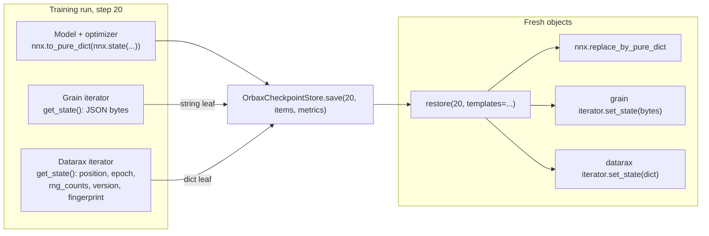

# Grain and Datarax: Resumed Training Guide

| Metadata | Value |
|----------|-------|
| **Level** | Advanced |
| **Runtime** | ~1 min (CPU) |
| **Prerequisites** | [Grain and Datarax Quick Reference](grain-datarax-quickref.md), [Process and Device Sharding](process-and-device-sharding-guide.md) |
| **Format** | Python + Jupyter |

## Overview

A training run that can be interrupted needs a checkpoint that holds three things: the
model, the optimizer, and the position of the data loader, including the randomness it was
about to use. Restore all three and the run continues as if it had never stopped; restore
two and the model trains on records it has already seen, or on different noise.

This guide trains the same model from a Grain loader and from a Datarax pipeline, saves the
three parts at the same step through one `substrax.checkpoint.OrbaxCheckpointStore`, restores
them into fresh objects, and shows that both resumed runs reproduce the uninterrupted run
loss for loss. The loss is `calibrax.metrics.functional.mse`. The two libraries differ only
in what the loader contributes to the checkpoint and how it is put back.

## What You'll Learn

1. Save model, optimizer and loader state together with `OrbaxCheckpointStore`, and read
   back the step and loss it records
2. Restore a Grain loader from its JSON state and a Datarax pipeline from its iterator state
3. Show that a resumed run reproduces the uninterrupted run exactly, in both libraries
4. Say what each loader's state holds and why the randomness resumes with it

## Coming from Google Grain?

| Grain | Datarax |
|-------|---------|
| `iterator.get_state()` returns JSON bytes: the last index each worker served, the sampler and the source description | `iterator.get_state()` returns `position`, `epoch`, one count per random stream and `version` |
| `iterator.set_state(bytes)` on a loader built the same way | `iterator.set_state(dict)` on a fresh iterator of a pipeline built the same way |
| The draw index resumes, so the same generators follow | The epoch and record index resume, so the same keys follow |
| One sampler runs `num_epochs` epochs on one iterator | One iterator per epoch; `pipeline.reset()` starts the next |
| `nnx.to_pure_dict(nnx.state(...))` for the model and optimizer | The same |
| `OrbaxCheckpointStore.save(step, items, metrics)` with the bytes as a string leaf | The same call with the state dict |

## Files

- **Python Script**: [`examples/comparison/04_resumed_training_guide.py`](https://github.com/avitai/datarax/blob/main/examples/comparison/04_resumed_training_guide.py)
- **Jupyter Notebook**: [`examples/comparison/04_resumed_training_guide.ipynb`](https://github.com/avitai/datarax/blob/main/examples/comparison/04_resumed_training_guide.ipynb)

## Quick Start

### Run the Python Script

```bash
python examples/comparison/04_resumed_training_guide.py
```

### Run the Jupyter Notebook

```bash
jupyter lab examples/comparison/04_resumed_training_guide.ipynb
```

## Key Concepts

### What a checkpoint holds

`OrbaxCheckpointStore.save(step, items, metrics=...)` writes the model, the optimizer and the
loader state as three named items (`model`, `optimizer`, `data_iterator`), each any pytree of
arrays and plain leaves, under a step number, with the loss in the record's metrics;
`restore(step, templates=...)` fills templates of the same structure and returns the items
with that record. The model and optimizer travel as `nnx.to_pure_dict(nnx.state(...))`,
Grain's bytes as a string leaf, and Datarax's iterator state as a dict of ints and lists.

```python
def training_state(model: LinearRegression, optimizer: nnx.Optimizer) -> dict:
    return {
        "model": nnx.to_pure_dict(nnx.state(model)),
        "optimizer": nnx.to_pure_dict(nnx.state(optimizer)),
    }


def load_training_state(model: LinearRegression, optimizer: nnx.Optimizer, saved: dict) -> None:
    for module, pure in ((model, saved["model"]), (optimizer, saved["optimizer"])):
        state = nnx.state(module)
        nnx.replace_by_pure_dict(state, pure)
        nnx.update(module, state)
```

### Part 1: The Uninterrupted Runs

Each library trains a linear regression for five epochs with per-record noise, and its loss
curve is the reference the resumed run must reproduce. One `nnx.jit` step with
`calibrax.metrics.functional.mse` serves both loaders.

```python
@nnx.jit
def train_step(model: LinearRegression, optimizer: nnx.Optimizer, batch: dict) -> jax.Array:
    def loss_fn(module: LinearRegression) -> jax.Array:
        return mse(module(batch["x"]), batch["y"])

    loss, grads = nnx.value_and_grad(loss_fn)(model)
    optimizer.update(model, grads)
    return loss


grain_reference, _ = train_grain(build_grain_iterator(), grain_model, grain_optimizer, TOTAL_STEPS)
datarax_reference, _ = train_datarax(build_datarax_pipeline(), datarax_model, datarax_optimizer, TOTAL_STEPS)
```

**Terminal Output:**
```
Grain reference:   40 steps, loss first 4.2264, last 0.0126
Datarax reference: 40 steps, loss first 1.9849, last 0.0402
Grain weights:   [ 1.95 -1.    0.48]
Datarax weights: [ 1.99 -0.99  0.51] (true [ 2.  -1.   0.5])
```

### Part 2: Train, Checkpoint at Step 20, Stop

Each run starts again from the same seeds, trains 20 steps, and saves model, optimizer and
loader state under step 20 in its own store. Step 20 is halfway through the third epoch, so
the loader state carries a mid-epoch position: Grain's bytes name the last index each worker
served, Datarax's dict names position 32 of epoch 2.

```python
grain_store = OrbaxCheckpointStore(checkpoint_root / "grain")
grain_before, grain_payload = train_grain(
    build_grain_iterator(), model, optimizer, CHECKPOINT_STEP, save=(CHECKPOINT_STEP, grain_store)
)
# inside train_grain, at the checkpoint step:
#   payload = {**training_state(model, optimizer), "data_iterator": iterator.get_state().decode()}
#   store.save(CHECKPOINT_STEP, payload, metrics={"loss": losses[-1]})

datarax_store = OrbaxCheckpointStore(checkpoint_root / "datarax")
datarax_before, datarax_payload = train_datarax(
    build_datarax_pipeline(), model, optimizer, CHECKPOINT_STEP, save=(CHECKPOINT_STEP, datarax_store)
)
# inside train_datarax, at the checkpoint step:
#   payload = {**training_state(model, optimizer), "data_iterator": iterator.get_state()}
```

**Terminal Output:**
```
Latest step in each store: 20, 20
Grain loader state keys: ['data_source', 'last_seen_indices', 'last_worker_index', 'sampler', 'version', 'worker_count']
Datarax loader state: {'position': 32, 'epoch': 2, 'rng_counts': [0, 1, 0], 'version': 2, 'fingerprint': {'batch_size': 8, 'length': 64, 'drop_last': False, 'num_epochs': 1, 'shuffled': True}}
```

### Part 3: Restore into Fresh Objects and Continue

A new model and optimizer are built from a different seed, so nothing but the checkpoint can
make them match. The model and optimizer arrays go back through `nnx.replace_by_pure_dict`,
Grain's bytes go to `set_state` on a loader built the same way, and Datarax's dict goes to
`set_state` on a fresh iterator of a pipeline built the same way. Each run then trains the
remaining 20 steps.

```python
model, optimizer = build_fresh_model()
templates = {**training_state(model, optimizer), "data_iterator": ""}
grain_checkpoint = grain_store.restore(CHECKPOINT_STEP, templates=templates)
load_training_state(model, optimizer, grain_checkpoint.items)
grain_iterator = build_grain_iterator()
grain_iterator.set_state(grain_checkpoint.items["data_iterator"].encode())
grain_after, _ = train_grain(grain_iterator, model, optimizer, TOTAL_STEPS - CHECKPOINT_STEP)

model, optimizer = build_fresh_model()
templates = {
    **training_state(model, optimizer),
    "data_iterator": {
        "position": 0,
        "epoch": 0,
        "rng_counts": [0, 0, 0],
        "version": 2,
        # The state names the configuration it is valid for; the template only fixes the shape.
        "fingerprint": {
            "batch_size": 0,
            "length": 0,
            "drop_last": False,
            "num_epochs": 0,
            "shuffled": False,
        },
    },
}
datarax_checkpoint = datarax_store.restore(CHECKPOINT_STEP, templates=templates)
load_training_state(model, optimizer, datarax_checkpoint.items)
pipeline = build_datarax_pipeline()
datarax_iterator = iter(pipeline)
datarax_iterator.set_state(datarax_checkpoint.items["data_iterator"])
datarax_after, _ = train_datarax(
    pipeline, model, optimizer, TOTAL_STEPS - CHECKPOINT_STEP, first=datarax_iterator
)
```

**Terminal Output:**
```
Restored Grain step 20 (loss 0.0837)
Restored Datarax step 20 (loss 0.0310)
Grain: resumed run reproduces the reference loss for loss: True
Datarax: resumed run reproduces the reference loss for loss: True
Steps 20-22 reference [0.067  0.0206 0.044 ] resumed [0.067  0.0206 0.044 ]
```

## Architecture Diagram



## Results Summary

| | Grain | Datarax |
|---|---|---|
| Loader state | JSON bytes: last index per worker, sampler and source description | `position`, `epoch`, one count per random stream, `version` |
| Restored into | `set_state(bytes)` on a loader built the same way | `set_state(dict)` on a fresh iterator of a pipeline built the same way |
| Randomness after resume | The draw index continues, so the same generators follow | The epoch and record index continue, so the same keys follow |
| Model and optimizer | `nnx.to_pure_dict` in, `nnx.replace_by_pure_dict` out | The same |
| Store | One `OrbaxCheckpointStore.save(step, items, metrics)` with `model`, `optimizer` and `data_iterator` items | The same |

Both resumed runs reproduce their reference loss for loss. The difference between the
libraries is what the loader contributes to the payload: bytes that describe a Python
loader, or a small dict that names a position in a compiled one.

## Next Steps

- [Resumable Training Guide](../advanced/checkpointing/resumable-training-guide.md): the
  Datarax pattern with the pipeline's module state and Orbax's `StandardCheckpointer`
- [Checkpoint Quick Reference](../advanced/checkpointing/checkpoint-quickref.md): iterator
  state for every Datarax source
- [Grain and Datarax Quick Reference](grain-datarax-quickref.md): the quick reference this
  guide builds on
- [Checkpointing Guide](../../user_guide/checkpointing_guide.md): iterator state and
  checkpointing across Datarax sources
