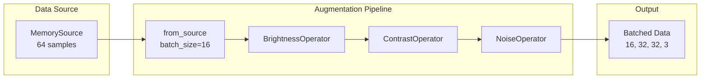

# Image Augmentation Quick Reference

| Metadata | Value |
|----------|-------|
| **Level** | Beginner |
| **Runtime** | ~5 min |
| **Prerequisites** | Basic Datarax pipeline |
| **Format** | Python + Jupyter |
| **Memory** | ~200 MB RAM |

## Overview

This quick reference demonstrates Datarax's built-in image augmentation operators. You'll learn to chain multiple operators for realistic training augmentation, using both deterministic and stochastic transformations.

## What You'll Learn

1. Use built-in image operators (Brightness, Contrast, Rotation, Noise)
2. Chain operators with the `>>` operator syntax or `.add()` method
3. Understand stochastic vs deterministic modes
4. Configure operator parameters for different augmentation strengths
5. Add clipping to keep values in valid ranges

## Coming from PyTorch?

| PyTorch | Datarax |
|---------|---------|
| `transforms.ColorJitter(brightness=0.2)` | `BrightnessOperator(brightness_range=(-0.2, 0.2))` |
| `transforms.ColorJitter(contrast=(0.8, 1.2))` | `ContrastOperator(contrast_range=(0.8, 1.2))` |
| `transforms.RandomRotation(15)` | `RotationOperator(angle_range=(-15, 15))` |
| `transforms.GaussianBlur(kernel_size)` | Custom `ElementOperator` with blur logic |
| `transforms.Compose([T1, T2, T3])` | `pipeline.add(OperatorNode(op1)).add(OperatorNode(op2))...` |

**Key difference:** Datarax operators use explicit RNG streams for reproducibility and are JAX-first with automatic JIT compilation.

## Coming from TensorFlow?

| TensorFlow | Datarax |
|------------|---------|
| `tf.image.random_brightness(image, 0.2)` | `BrightnessOperator(brightness_range=(-0.2, 0.2))` |
| `tf.image.random_contrast(image, 0.8, 1.2)` | `ContrastOperator(contrast_range=(0.8, 1.2))` |
| `tfa.image.rotate(image, angles)` | `RotationOperator(angle_range=(-180, 180))` |
| `tf.image.random_noise(...)` | `NoiseOperator(mode="gaussian", noise_std=0.05)` |
| Sequential preprocessing layers | Chain with `.add()` or `>>` operator |

**Key difference:** Datarax operators work with Element objects and provide named RNG streams for fine-grained control.

## Files

- **Python Script**: [`examples/core/05_augmentation_quickref.py`](https://github.com/avitai/datarax/blob/main/examples/core/05_augmentation_quickref.py)
- **Jupyter Notebook**: [`examples/core/05_augmentation_quickref.ipynb`](https://github.com/avitai/datarax/blob/main/examples/core/05_augmentation_quickref.ipynb)

## Quick Start

```bash
# Install datarax
uv pip install datarax

# Run the Python script
python examples/core/05_augmentation_quickref.py

# Or launch the Jupyter notebook
jupyter lab examples/core/05_augmentation_quickref.ipynb
```

## Create Sample Data

We'll create synthetic image data to demonstrate augmentations. In practice, you'd load real images from TFDSEagerSource or HFEagerSource.

```python
import jax
import numpy as np
from flax import nnx
from datarax.sources import MemorySource, MemorySourceConfig

# Create sample RGB images
np.random.seed(42)
num_samples = 64
image_shape = (32, 32, 3)  # CIFAR-10 like

data = {
    "image": np.random.rand(num_samples, *image_shape).astype(np.float32),
    "label": np.random.randint(0, 10, (num_samples,)).astype(np.int32),
}

source = MemorySource(MemorySourceConfig(), data=data, rngs=nnx.Rngs(0))

print(f"Created {num_samples} sample images: {image_shape}")
print("Image range: [0.0, 1.0] (pre-normalized)")
```

**Terminal Output:**
```
JAX version: 0.4.23
Created 64 sample images: (32, 32, 3)
Image range: [0.0, 1.0] (pre-normalized)
```

## Built-in Image Operators

Datarax provides optimized JAX-based image operators. Each operator:

- Has a Config class for parameters
- Supports stochastic (random) or deterministic modes
- Uses named RNG streams for reproducibility

### Available Operators

| Operator | Effect | Stochastic | Parameter Range |
|----------|--------|------------|-----------------|
| `BrightnessOperator` | Additive brightness delta | Yes | `brightness_range=(-0.3, 0.3)` |
| `ContrastOperator` | Multiplicative contrast factor | Yes | `contrast_range=(0.8, 1.2)` |
| `RotationOperator` | Rotation by angle | Yes | `angle_range=(-15, 15)` degrees |
| `NoiseOperator` | Gaussian/salt-pepper noise | Yes | `noise_std=0.05` |
| `DropoutOperator` | Pixel/channel dropout | Yes | `dropout_rate=0.1` |
| `PatchDropoutOperator` | Cutout-style patches | Yes | `patch_size=(8, 8)` |

## Step 1: Individual Operators

Let's examine each operator individually before chaining.

### 1. Brightness Operator

Adds a random delta to pixel values.

```python
from datarax.operators.modality.image import BrightnessOperator, BrightnessOperatorConfig

brightness_op = BrightnessOperator(
    BrightnessOperatorConfig(
        field_key="image",
        brightness_range=(-0.2, 0.2),  # Random delta in [-0.2, +0.2]
        stochastic=True,
        stream_name="brightness",
    ),
    rngs=nnx.Rngs(brightness=100),
)

print("BrightnessOperator:")
print("  - Adds random delta to all pixels")
print("  - Range: [-0.2, +0.2]")
print("  - Effect: Makes images brighter or darker")
```

**Terminal Output:**
```
BrightnessOperator:
  - Adds random delta to all pixels
  - Range: [-0.2, +0.2]
  - Effect: Makes images brighter or darker
```

### 2. Contrast Operator

Multiplies pixel values around the mean.

```python
from datarax.operators.modality.image import ContrastOperator, ContrastOperatorConfig

contrast_op = ContrastOperator(
    ContrastOperatorConfig(
        field_key="image",
        contrast_range=(0.8, 1.2),  # Factor between 0.8x and 1.2x
        stochastic=True,
        stream_name="contrast",
    ),
    rngs=nnx.Rngs(contrast=200),
)

print("ContrastOperator:")
print("  - Multiplies (pixel - mean) by random factor")
print("  - Range: [0.8, 1.2]")
print("  - Effect: Increases or decreases contrast")
```

**Terminal Output:**
```
ContrastOperator:
  - Multiplies (pixel - mean) by random factor
  - Range: [0.8, 1.2]
  - Effect: Increases or decreases contrast
```

### 3. Rotation Operator

Rotates images by random angle.

```python
from datarax.operators.modality.image import RotationOperator, RotationOperatorConfig

rotation_op = RotationOperator(
    RotationOperatorConfig(
        field_key="image",
        angle_range=(-15.0, 15.0),  # Degrees
        fill_value=0.0,  # Fill empty areas with black
    ),
    rngs=nnx.Rngs(0),
)

print("RotationOperator:")
print("  - Rotates image by random angle")
print("  - Range: [-15°, +15°]")
print("  - Uses bilinear interpolation")
```

**Terminal Output:**
```
RotationOperator:
  - Rotates image by random angle
  - Range: [-15°, +15°]
  - Uses bilinear interpolation
```

### 4. Noise Operator

Adds random noise to images.

```python
from datarax.operators.modality.image import NoiseOperator, NoiseOperatorConfig

noise_op = NoiseOperator(
    NoiseOperatorConfig(
        field_key="image",
        mode="gaussian",  # or "salt_pepper", "poisson"
        noise_std=0.05,  # Standard deviation of Gaussian noise
        stochastic=True,
        stream_name="noise",
    ),
    rngs=nnx.Rngs(noise=300),
)

print("NoiseOperator (Gaussian mode):")
print("  - Adds zero-mean Gaussian noise")
print("  - Std: 0.05")
print("  - Effect: Simulates sensor noise")
```

**Terminal Output:**
```
NoiseOperator (Gaussian mode):
  - Adds zero-mean Gaussian noise
  - Std: 0.05
  - Effect: Simulates sensor noise
```

## Step 2: Chain Operators with >>

Use the `>>` operator for fluent pipeline composition. Operators are applied left-to-right.



```python
from datarax import from_source
from datarax.dag.nodes import OperatorNode

# Create fresh source for chained pipeline
source2 = MemorySource(MemorySourceConfig(), data=data, rngs=nnx.Rngs(1))

# Create fresh operators (each needs its own RNG state)
brightness = BrightnessOperator(
    BrightnessOperatorConfig(
        field_key="image",
        brightness_range=(-0.15, 0.15),
        stochastic=True,
        stream_name="brightness",
    ),
    rngs=nnx.Rngs(brightness=10),
)

contrast = ContrastOperator(
    ContrastOperatorConfig(
        field_key="image",
        contrast_range=(0.85, 1.15),
        stochastic=True,
        stream_name="contrast",
    ),
    rngs=nnx.Rngs(contrast=20),
)

noise = NoiseOperator(
    NoiseOperatorConfig(
        field_key="image",
        mode="gaussian",
        noise_std=0.03,
        stochastic=True,
        stream_name="noise",
    ),
    rngs=nnx.Rngs(noise=30),
)

# Chain with >> operator
augmented_pipeline = (
    from_source(source2, batch_size=16)
    >> OperatorNode(brightness)
    >> OperatorNode(contrast)
    >> OperatorNode(noise)
)

print("Augmentation Pipeline:")
print("  Source -> Brightness -> Contrast -> Noise -> Output")
```

**Terminal Output:**
```
Augmentation Pipeline:
  Source -> Brightness -> Contrast -> Noise -> Output
```

## Step 3: Process Data

Run the augmented pipeline and examine results.

```python
# Process batches
print("\nProcessing augmented batches:")

for i, batch in enumerate(augmented_pipeline):
    if i >= 3:
        break

    images = batch["image"]
    labels = batch["label"]

    print(f"Batch {i}:")
    print(f"  Image shape: {images.shape}")
    print(f"  Image range: [{float(images.min()):.3f}, {float(images.max()):.3f}]")
    print(f"  Mean: {float(images.mean()):.3f}, Std: {float(images.std()):.3f}")
```

**Terminal Output:**
```
Processing augmented batches:
Batch 0:
  Image shape: (16, 32, 32, 3)
  Image range: [-0.123, 1.089]
  Mean: 0.498, Std: 0.312
Batch 1:
  Image shape: (16, 32, 32, 3)
  Image range: [-0.098, 1.102]
  Mean: 0.512, Std: 0.298
Batch 2:
  Image shape: (16, 32, 32, 3)
  Image range: [-0.145, 1.067]
  Mean: 0.487, Std: 0.305
```

Notice how augmentations can push values outside [0, 1].

## Step 4: Add Clipping (Optional)

Augmentations can push values outside [0, 1]. Add clipping if needed.

```python
import jax.numpy as jnp
from datarax.operators import ElementOperator, ElementOperatorConfig

def clip_image(element, key=None):
    """Clip image values to [0, 1] range."""
    del key
    image = element.data["image"]
    clipped = jnp.clip(image, 0.0, 1.0)
    return element.update_data({"image": clipped})

clipper = ElementOperator(
    ElementOperatorConfig(stochastic=False),
    fn=clip_image,
    rngs=nnx.Rngs(0),
)

# Create pipeline with clipping
source3 = MemorySource(MemorySourceConfig(), data=data, rngs=nnx.Rngs(2))

brightness2 = BrightnessOperator(
    BrightnessOperatorConfig(
        field_key="image",
        brightness_range=(-0.15, 0.15),
        stochastic=True,
        stream_name="brightness",
    ),
    rngs=nnx.Rngs(brightness=10),
)

clipped_pipeline = (
    from_source(source3, batch_size=16)
    >> OperatorNode(brightness2)
    >> OperatorNode(clipper)
)

# Verify clipping
batch = next(iter(clipped_pipeline))
img_min = float(batch["image"].min())
img_max = float(batch["image"].max())
print(f"With clipping - Image range: [{img_min:.3f}, {img_max:.3f}]")
```

**Terminal Output:**
```
With clipping - Image range: [0.000, 1.000]
```

## Deterministic vs Stochastic Mode

Operators can run in deterministic mode with fixed parameters.

```python
# Deterministic brightness (always +0.1)
deterministic_brightness = BrightnessOperator(
    BrightnessOperatorConfig(
        field_key="image",
        brightness_delta=0.1,  # Fixed delta, not range
        stochastic=False,  # Deterministic mode
    ),
    rngs=nnx.Rngs(0),
)

print("Deterministic BrightnessOperator:")
print("  - Always adds +0.1 to all pixels")
print("  - Useful for inference-time preprocessing")
```

**Terminal Output:**
```
Deterministic BrightnessOperator:
  - Always adds +0.1 to all pixels
  - Useful for inference-time preprocessing
```

## Results Summary

| Operator | Parameter | Effect |
|----------|-----------|--------|
| Brightness | `(-0.15, 0.15)` | ±15% brightness change |
| Contrast | `(0.85, 1.15)` | ±15% contrast change |
| Noise | `std=0.03` | Light Gaussian noise |
| Rotation | `(-15°, +15°)` | Mild rotation |

### Best Practices

1. **Strength matters**: Start mild, increase if needed. Too strong augmentation hurts performance.
2. **Order matters**: Apply geometric transforms (rotation, flip) before color transforms.
3. **RNG streams**: Use unique `stream_name` per operator for reproducibility.
4. **Clipping**: Add if values must stay in [0, 1] (e.g., for visualization or certain models).
5. **Seeds**: Set seeds for reproducibility during debugging or evaluation.

### Chaining Methods

```python
# Method 1: >> operator (fluent, recommended)
pipeline = from_source(source, batch_size=32) >> OperatorNode(op1) >> OperatorNode(op2)

# Method 2: .add() method (explicit)
pipeline = from_source(source, batch_size=32).add(OperatorNode(op1)).add(OperatorNode(op2))

# Both are equivalent!
```

## Next Steps

- [Operators Tutorial](operators-tutorial.md) - Deep dive into operator composition
- [CIFAR-10 Quick Reference](cifar10-quickref.md) - Apply augmentation to real data
- [MixUp/CutMix Tutorial](../advanced/augmentation/mixup-cutmix-tutorial.md) - Advanced batch augmentation
- [Full Training Example](mnist-tutorial.md) - Complete training workflow
- [API Reference: Image Operators](../../operators/index.md) - Complete image operator API
