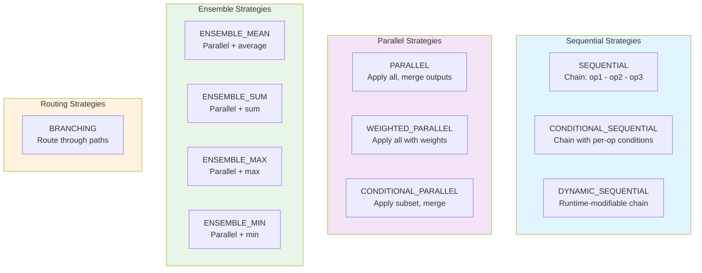

# Composition Strategies Deep Dive

| Metadata | Value |
|----------|-------|
| **Level** | Intermediate |
| **Runtime** | ~30 min |
| **Prerequisites** | Operators Tutorial, Pipeline Tutorial |
| **Format** | Python + Jupyter |

## Overview

Master the 11 composition strategies in Datarax for combining operators.
This tutorial covers sequential chaining, parallel application, ensemble
reductions, and dynamic branching - all with JAX vmap/JIT compatibility.

## Learning Goals

By the end of this tutorial, you will be able to:

1. Chain operators with Sequential strategies (basic, conditional, dynamic)
2. Apply operators in parallel with different merge modes
3. Use weighted combinations for learnable augmentation
4. Build ensemble reductions (mean, sum, max, min)
5. Route data through branches based on conditions
6. Write vmap/JIT-compatible composition patterns

## Coming from PyTorch?

| PyTorch | Datarax |
|---------|---------|
| `transforms.Compose([t1, t2])` | `CompositeOperatorModule(..., strategy=SEQUENTIAL)` |
| `transforms.RandomChoice([t1, t2])` | `CompositeOperatorModule(..., strategy=BRANCHING)` |
| `transforms.RandomApply([t], p=0.5)` | `CompositeOperatorModule(..., strategy=CONDITIONAL_SEQUENTIAL)` |
| Manual weighted ensemble | `CompositeOperatorModule(..., strategy=WEIGHTED_PARALLEL)` |

## Coming from TensorFlow?

| TensorFlow | Datarax |
|------------|---------|
| `tf.keras.Sequential([l1, l2])` | `CompositeOperatorModule(..., strategy=SEQUENTIAL)` |
| `tf.keras.layers.Average([o1, o2])` | `CompositeOperatorModule(..., strategy=ENSEMBLE_MEAN)` |
| Custom conditional logic | `CompositeOperatorModule(..., strategy=CONDITIONAL_*)` |

## Files

- **Python Script**: [`examples/core/08_composition_strategies_tutorial.py`](https://github.com/avitai/datarax/blob/main/examples/core/08_composition_strategies_tutorial.py)
- **Jupyter Notebook**: [`examples/core/08_composition_strategies_tutorial.ipynb`](https://github.com/avitai/datarax/blob/main/examples/core/08_composition_strategies_tutorial.ipynb)

## Quick Start

### Run the Python Script

```bash
python examples/core/08_composition_strategies_tutorial.py
```

### Run the Jupyter Notebook

```bash
jupyter lab examples/core/08_composition_strategies_tutorial.ipynb
```

## Strategy Overview

Datarax provides 11 composition strategies organized into 4 categories:



## Key Concepts

### Part 1: Sequential Strategies

Sequential strategies chain operators where output of one becomes input of next.

```python
from datarax.operators.composite_operator import (
    CompositeOperatorConfig,
    CompositeOperatorModule,
    CompositionStrategy,
)

# SEQUENTIAL: Basic chaining
sequential = CompositeOperatorModule(
    CompositeOperatorConfig(
        strategy=CompositionStrategy.SEQUENTIAL,
        operators=[brightness_op, contrast_op],
    ),
    rngs=nnx.Rngs(0),
)
```

**Terminal Output:**
```
SEQUENTIAL Strategy:
  Chain: Brightness(+0.1) → Contrast(×1.2)
  Input range: [0.0, 1.0]
  Output range: [0.000, 1.440]
```

### Part 2: Parallel Strategies

Apply ALL operators to the SAME input, then merge outputs.

| Merge Mode | Description | Output Shape |
|------------|-------------|--------------|
| `"concat"` | Concatenate along axis | `(N, H, W, C×num_ops)` |
| `"stack"` | Stack into new dimension | `(num_ops, N, H, W, C)` |
| `"sum"` | Element-wise sum | Same as input |
| `"mean"` | Element-wise mean | Same as input |
| `"dict"` | Keep separate in dict | `{op_0: ..., op_1: ...}` |

```python
# PARALLEL with mean merge
parallel_mean = CompositeOperatorModule(
    CompositeOperatorConfig(
        strategy=CompositionStrategy.PARALLEL,
        operators=[bright_op, contrast_op, noise_op],
        merge_strategy="mean",
    ),
    rngs=nnx.Rngs(0),
)
```

**Terminal Output:**
```
PARALLEL Strategy (merge='mean'):
  Operators: [Brightness, Contrast, Noise]
  Output shape: (16, 32, 32, 3) (same as input)
  Output is the mean of all three augmented versions
```

### Part 3: Weighted Parallel

Apply operators in parallel with learnable or fixed weights.

```python
weighted = CompositeOperatorModule(
    CompositeOperatorConfig(
        strategy=CompositionStrategy.WEIGHTED_PARALLEL,
        operators=[op1, op2, op3],
        weights=[0.5, 0.3, 0.2],  # 50%, 30%, 20%
        learnable_weights=False,  # Set True for gradient learning
    ),
    rngs=nnx.Rngs(0),
)
```

### Part 4: Ensemble Strategies

Parallel application with mathematical reduction.

| Strategy | Reduction | Formula |
|----------|-----------|---------|
| `ENSEMBLE_MEAN` | Average | `(op₁ + op₂ + ... + opₙ) / n` |
| `ENSEMBLE_SUM` | Sum | `op₁ + op₂ + ... + opₙ` |
| `ENSEMBLE_MAX` | Maximum | `max(op₁, op₂, ..., opₙ)` |
| `ENSEMBLE_MIN` | Minimum | `min(op₁, op₂, ..., opₙ)` |

```python
ensemble_mean = CompositeOperatorModule(
    CompositeOperatorConfig(
        strategy=CompositionStrategy.ENSEMBLE_MEAN,
        operators=[bright_plus, bright_minus, contrast_op],
    ),
    rngs=nnx.Rngs(0),
)
```

### Part 5: Branching Strategy

Route data through different operator branches based on conditions.

```python
def label_router(data):
    """Route based on label: 0-5 → branch 0, 6-9 → branch 1."""
    label = data["label"]
    return jax.lax.cond(label > 5, lambda: 1, lambda: 0)

branching = CompositeOperatorModule(
    CompositeOperatorConfig(
        strategy=CompositionStrategy.BRANCHING,
        operators=[brightness_op, contrast_op],
        router=label_router,
        default_branch=0,
    ),
    rngs=nnx.Rngs(0),
)
```

**Terminal Output:**
```
BRANCHING Strategy:
  Router: label <= 5 → Brightness, label > 5 → Contrast
  Batch labels: [3 7 2 8 4 6 1 9]...
  Each sample routed to appropriate augmentation branch
```

## JAX Compatibility Notes

The composition strategies are designed for `jax.vmap` and `jax.jit` compatibility:

| Pattern | Why Needed |
|---------|------------|
| Integer routing | `jax.lax.switch` requires int index |
| `jax.lax.cond` for conditions | Python `if` breaks tracing |
| Fixed output shapes | vmap requires consistent shapes |
| No dict key from traced values | Dict keys must be static |

## Strategy Selection Guide

| Use Case | Recommended Strategy |
|----------|---------------------|
| Standard augmentation chain | `SEQUENTIAL` |
| Skip augmentation conditionally | `CONDITIONAL_SEQUENTIAL` |
| Multi-view generation | `PARALLEL` (merge='dict') |
| Averaged augmentation | `PARALLEL` (merge='mean') or `ENSEMBLE_MEAN` |
| Learnable augmentation policy | `WEIGHTED_PARALLEL` |
| Class-specific augmentation | `BRANCHING` |
| Test-time augmentation | `ENSEMBLE_MEAN` |

## Results

Running the tutorial produces:

```
============================================================
Composition Strategies Tutorial
============================================================

1. SEQUENTIAL: Chain operators
   Output shape: (16, 32, 32, 3)

2. ENSEMBLE_MEAN: Average augmentations
   Output range: [0.000, 1.100]

3. BRANCHING: Route by label
   Labels: [3 7 2 8 4]... → routed to different branches

============================================================
Tutorial completed successfully!
============================================================
```

## Next Steps

- [DAG Fundamentals](../advanced/dag/dag-fundamentals-guide.md) - Pipeline architecture
- [Sharding Guide](../advanced/distributed/sharding-guide.md) - Distributed pipelines
- [Performance Guide](../advanced/performance/optimization-guide.md) - Optimization tips

## API Reference

- [`CompositeOperatorModule`](../../operators/composite_operator.md) - Full API documentation
- [`CompositionStrategy`](../../operators/composite_operator.md) - Strategy enum
