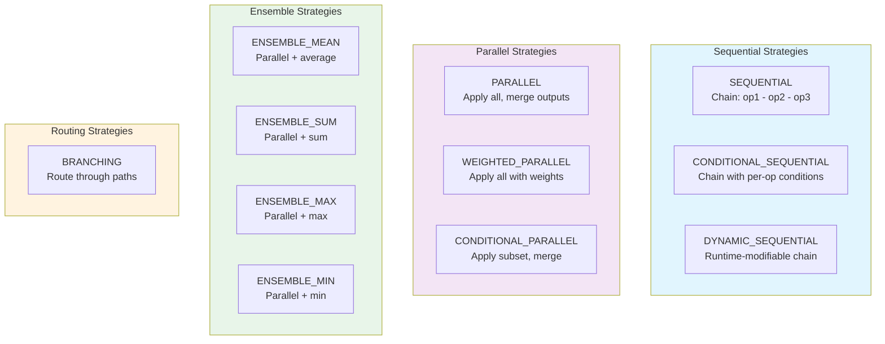

# Composition Strategies Deep Dive

| Metadata | Value |
|----------|-------|
| **Level** | Intermediate |
| **Runtime** | ~30 min |
| **Prerequisites** | Operators Tutorial, Pipeline Tutorial |
| **Format** | Python + Jupyter |

## Overview

Master the 11 composition strategies in Datarax for combining operators.
This tutorial covers sequential chaining, parallel application, ensemble
reductions, and dynamic branching - all with JAX vmap/JIT compatibility.

## Learning Goals

By the end of this tutorial, you will be able to:

1. Chain operators with Sequential strategies (basic, conditional, dynamic)
2. Apply operators in parallel with different merge modes
3. Use weighted combinations for learnable augmentation
4. Build ensemble reductions (mean, sum, max, min)
5. Route data through branches based on conditions
6. Write vmap/JIT-compatible composition patterns

## Coming from PyTorch?

| PyTorch | Datarax |
|---------|---------|
| `transforms.Compose([t1, t2])` | `CompositeOperatorModule(..., strategy=SEQUENTIAL)` |
| `transforms.RandomChoice([t1, t2])` | `CompositeOperatorModule(..., strategy=BRANCHING)` |
| `transforms.RandomApply([t], p=0.5)` | `CompositeOperatorModule(..., strategy=CONDITIONAL_SEQUENTIAL)` |
| Manual weighted ensemble | `CompositeOperatorModule(..., strategy=WEIGHTED_PARALLEL)` |

## Coming from TensorFlow?

| TensorFlow | Datarax |
|------------|---------|
| `tf.keras.Sequential([l1, l2])` | `CompositeOperatorModule(..., strategy=SEQUENTIAL)` |
| `tf.keras.layers.Average([o1, o2])` | `CompositeOperatorModule(..., strategy=ENSEMBLE_MEAN)` |
| Custom conditional logic | `CompositeOperatorModule(..., strategy=CONDITIONAL_*)` |

## Files

- **Python Script**: [`examples/core/08_composition_strategies_tutorial.py`](https://github.com/avitai/datarax/blob/main/examples/core/08_composition_strategies_tutorial.py)
- **Jupyter Notebook**: [`examples/core/08_composition_strategies_tutorial.ipynb`](https://github.com/avitai/datarax/blob/main/examples/core/08_composition_strategies_tutorial.ipynb)

## Quick Start

### Run the Python Script

```bash
python examples/core/08_composition_strategies_tutorial.py
```

### Run the Jupyter Notebook

```bash
jupyter lab examples/core/08_composition_strategies_tutorial.ipynb
```

## Strategy Overview

Datarax provides 11 composition strategies organized into 4 categories:


```mermaid
graph TB
    subgraph Sequential["Sequential Strategies"]
        SEQ["SEQUENTIAL<br/>Chain: op1 - op2 - op3"]
        CSEQ["CONDITIONAL_SEQUENTIAL<br/>Chain with per-op conditions"]
        DSEQ["DYNAMIC_SEQUENTIAL<br/>Runtime-modifiable chain"]
    end

    subgraph Parallel["Parallel Strategies"]
        PAR["PARALLEL<br/>Apply all, merge outputs"]
        WPAR["WEIGHTED_PARALLEL<br/>Apply all with weights"]
        CPAR["CONDITIONAL_PARALLEL<br/>Apply subset, merge"]
    end

    subgraph Ensemble["Ensemble Strategies"]
        EMEAN["ENSEMBLE_MEAN<br/>Parallel + average"]
        ESUM["ENSEMBLE_SUM<br/>Parallel + sum"]
        EMAX["ENSEMBLE_MAX<br/>Parallel + max"]
        EMIN["ENSEMBLE_MIN<br/>Parallel + min"]
    end

    subgraph Routing["Routing Strategies"]
        BRANCH["BRANCHING<br/>Route through paths"]
    end

    style Sequential fill:#e1f5fe
    style Parallel fill:#f3e5f5
    style Ensemble fill:#e8f5e9
    style Routing fill:#fff3e0
```

## Key Concepts

The examples draw batches from a small in-memory dataset through a pipeline helper:

```python
# Create sample image data
np.random.seed(42)
num_samples = 100
data = {
    "image": np.random.randint(0, 256, (num_samples, 32, 32, 3)).astype(np.float32) / 255.0,
    "label": np.random.randint(0, 10, (num_samples,)).astype(np.int32),
}

source = MemorySource(MemorySourceConfig(), data=data, rngs=nnx.Rngs(0))
print(f"Dataset: {num_samples} samples, shape {data['image'].shape}")


def example_pipeline(source, batch_size: int, stages=()):
    """Build the tutorial pipelines used throughout this example."""
    return Pipeline(source=source, stages=list(stages), batch_size=batch_size, rngs=nnx.Rngs(0))
```

**Terminal Output:**
```
Dataset: 100 samples, shape (100, 32, 32, 3)
```

### Helper Factories

The tutorial builds its operators through small factory functions, so each
composition example can create fresh operators with fixed parameters:

```python
def make_brightness_op(delta: float, seed: int = 0) -> BrightnessOperator:
    """Create a brightness operator with fixed delta."""
    return BrightnessOperator(
        BrightnessOperatorConfig(field_key="image", brightness_delta=delta),
        rngs=nnx.Rngs(seed),
    )


def make_contrast_op(factor: float, seed: int = 0) -> ContrastOperator:
    """Create a contrast operator with fixed factor."""
    return ContrastOperator(
        ContrastOperatorConfig(field_key="image", contrast_factor=factor),
        rngs=nnx.Rngs(seed),
    )


def make_noise_op(std: float, seed: int = 0) -> NoiseOperator:
    """Create a noise operator."""
    return NoiseOperator(
        NoiseOperatorConfig(
            field_key="image",
            mode="gaussian",
            noise_std=std,
            stochastic=True,
            stream_name="noise",
        ),
        rngs=nnx.Rngs(noise=seed),
    )
```

### Part 1: Sequential Strategies

Sequential strategies chain operators where output of one becomes input of next.

```python
# SEQUENTIAL: Basic chaining
# brightness(+0.1) → contrast(1.2) → result

bright_op = make_brightness_op(0.1, seed=1)
contrast_op = make_contrast_op(1.2, seed=2)

sequential_composite = CompositeOperatorModule(
    CompositeOperatorConfig(
        strategy=CompositionStrategy.SEQUENTIAL,
    ),
    operators=[bright_op, contrast_op],
)

# Test it
source1 = MemorySource(MemorySourceConfig(), data=data, rngs=nnx.Rngs(10))
pipeline = example_pipeline(source1, batch_size=16, stages=[sequential_composite])
batch = next(iter(pipeline))

print("SEQUENTIAL Strategy:")
print("  Chain: Brightness(+0.1) → Contrast(×1.2)")
print("  Input range: [0.0, 1.0]")
print(f"  Output range: [{batch['image'].min():.3f}, {batch['image'].max():.3f}]")
```

**Terminal Output:**
```
SEQUENTIAL Strategy:
  Chain: Brightness(+0.1) → Contrast(×1.2)
  Input range: [0.0, 1.0]
  Output range: [0.000, 1.000]
```

### Part 2: Parallel Strategies

Apply ALL operators to the SAME input, then merge outputs.

| Merge Mode | Description | Output Shape |
|------------|-------------|--------------|
| `"concat"` | Concatenate along axis | `(N, H, W, C×num_ops)` |
| `"stack"` | Stack into new dimension | `(num_ops, N, H, W, C)` |
| `"sum"` | Element-wise sum | Same as input |
| `"mean"` | Element-wise mean | Same as input |
| `"dict"` | Keep separate in dict | `{op_0: ..., op_1: ...}` |

```python
# PARALLEL: Apply multiple augmentations to same input, merge results

op_bright = make_brightness_op(0.15, seed=10)
op_contrast = make_contrast_op(1.3, seed=11)
op_noise = make_noise_op(0.05, seed=12)

# Merge with mean - creates averaged augmentation
parallel_mean = CompositeOperatorModule(
    CompositeOperatorConfig(
        strategy=CompositionStrategy.PARALLEL,
        merge_strategy="mean",  # Average the three versions
    ),
    operators=[op_bright, op_contrast, op_noise],
)

source2 = MemorySource(MemorySourceConfig(), data=data, rngs=nnx.Rngs(20))
pipeline = example_pipeline(source2, batch_size=16, stages=[parallel_mean])
batch = next(iter(pipeline))

print("PARALLEL Strategy (merge='mean'):")
print("  Operators: [Brightness, Contrast, Noise]")
print(f"  Output shape: {batch['image'].shape} (same as input)")
print("  Output is the mean of all three augmented versions")
```

**Terminal Output:**
```
PARALLEL Strategy (merge='mean'):
  Operators: [Brightness, Contrast, Noise]
  Output shape: (16, 32, 32, 3) (same as input)
  Output is the mean of all three augmented versions
```

### Part 3: Weighted Parallel

Apply operators in parallel with learnable or fixed weights.

```python
op1 = make_brightness_op(0.2, seed=40)
op2 = make_contrast_op(1.4, seed=41)
op3 = make_noise_op(0.03, seed=42)

weighted_parallel = CompositeOperatorModule(
    CompositeOperatorConfig(
        strategy=CompositionStrategy.WEIGHTED_PARALLEL,
        weights=[0.5, 0.3, 0.2],  # 50% brightness, 30% contrast, 20% noise
        learnable_weights=False,  # Set True for gradient-based learning
    ),
    operators=[op1, op2, op3],
)
```

### Part 4: Ensemble Strategies

Parallel application with mathematical reduction.

| Strategy | Reduction | Formula |
|----------|-----------|---------|
| `ENSEMBLE_MEAN` | Average | `(op₁ + op₂ + ... + opₙ) / n` |
| `ENSEMBLE_SUM` | Sum | `op₁ + op₂ + ... + opₙ` |
| `ENSEMBLE_MAX` | Maximum | `max(op₁, op₂, ..., opₙ)` |
| `ENSEMBLE_MIN` | Minimum | `min(op₁, op₂, ..., opₙ)` |

```python
ensemble_ops = [
    make_brightness_op(0.1, seed=50),
    make_brightness_op(-0.1, seed=51),
    make_contrast_op(1.2, seed=52),
]

ensemble_mean = CompositeOperatorModule(
    CompositeOperatorConfig(
        strategy=CompositionStrategy.ENSEMBLE_MEAN,
        ),
    operators=ensemble_ops,
)
```

### Part 5: Branching Strategy

Route data through different operator branches based on conditions.

```python
# BRANCHING: Route based on label
def label_router(data):
    """Route based on label value.

    Returns:
        0 if label <= 5 (bright augmentation)
        1 if label > 5 (contrast augmentation)
    """
    label = data["label"]
    # Must use jax.lax operations for traced values
    return jax.lax.cond(label > 5, lambda: 1, lambda: 0)


branch_ops = [
    make_brightness_op(0.2, seed=70),  # Branch 0: for labels 0-5
    make_contrast_op(1.4, seed=71),  # Branch 1: for labels 6-9
]

branching = CompositeOperatorModule(
    CompositeOperatorConfig(
        strategy=CompositionStrategy.BRANCHING,
        router=label_router,
        default_branch=0,  # Fallback if router fails
    ),
    operators=branch_ops,
)

source7 = MemorySource(MemorySourceConfig(), data=data, rngs=nnx.Rngs(70))
pipeline = example_pipeline(source7, batch_size=16, stages=[branching])
batch = next(iter(pipeline))

print("BRANCHING Strategy:")
print("  Router: label <= 5 → Brightness, label > 5 → Contrast")
print(f"  Batch labels: {batch['label'][:8]}...")
print("  Each sample routed to appropriate augmentation branch")
```

**Terminal Output:**
```
BRANCHING Strategy:
  Router: label <= 5 → Brightness, label > 5 → Contrast
  Batch labels: [8 2 2 4 1 0 3 6]...
  Each sample routed to appropriate augmentation branch
```

## JAX Compatibility Notes

The composition strategies are designed for `jax.vmap` and `jax.jit` compatibility:

| Pattern | Why Needed |
|---------|------------|
| Integer routing | `jax.lax.switch` requires int index |
| `jax.lax.cond` for conditions | Python `if` breaks tracing |
| Fixed output shapes | vmap requires consistent shapes |
| No dict key from traced values | Dict keys must be static |

## Strategy Selection Guide

| Use Case | Recommended Strategy |
|----------|---------------------|
| Standard augmentation chain | `SEQUENTIAL` |
| Skip augmentation conditionally | `CONDITIONAL_SEQUENTIAL` |
| Multi-view generation | `PARALLEL` (merge='dict') |
| Averaged augmentation | `PARALLEL` (merge='mean') or `ENSEMBLE_MEAN` |
| Learnable augmentation policy | `WEIGHTED_PARALLEL` |
| Class-specific augmentation | `BRANCHING` |
| Test-time augmentation | `ENSEMBLE_MEAN` |

## Results

The script ends by running its `main()` function, which prints:

```
============================================================
Composition Strategies Tutorial
============================================================

1. SEQUENTIAL: Chain operators
   Output shape: (16, 32, 32, 3)

2. ENSEMBLE_MEAN: Average augmentations
   Output range: [0.050, 0.950]

3. BRANCHING: Route by label
   Labels: [8 2 2 4 1]... → routed to different branches

============================================================
Tutorial completed successfully!
============================================================
```

## Next Steps

- [DAG Fundamentals](../advanced/dag/dag-fundamentals-guide.md) - Pipeline architecture
- [Sharding Guide](../advanced/distributed/sharding-guide.md) - Distributed pipelines
- [Performance Guide](../advanced/performance/optimization-guide.md) - Optimization tips

## API Reference

- [`CompositeOperatorModule`](../../operators/composite_operator.md) - Full API documentation
- [`CompositionStrategy`](../../operators/composite_operator.md) - Strategy enum
