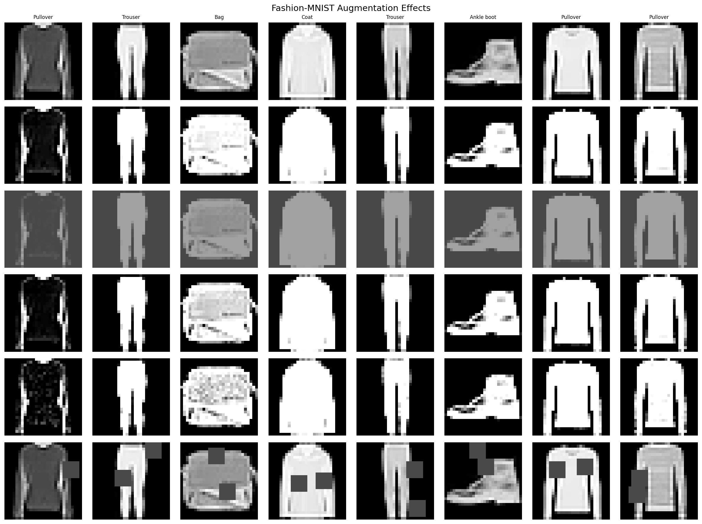
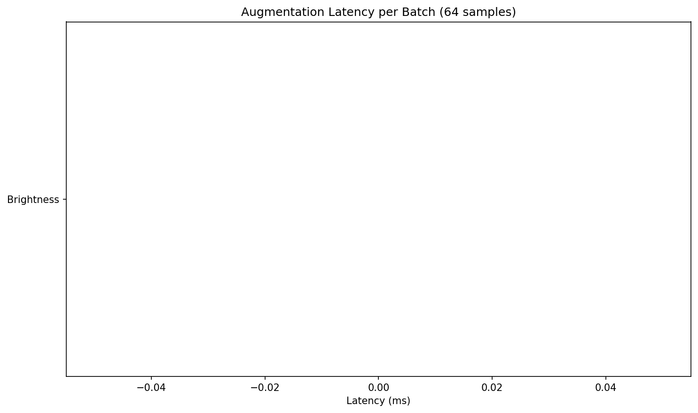
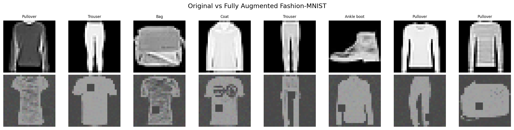
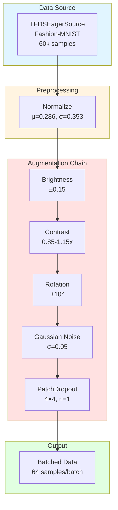

# Fashion-MNIST Augmentation Pipeline Tutorial

| Metadata | Value |
|----------|-------|
| **Level** | Intermediate |
| **Runtime** | ~30 min (CPU) / ~15 min (GPU) |
| **Prerequisites** | [MNIST Tutorial](mnist-tutorial.md), [Operators Tutorial](operators-tutorial.md) |
| **Format** | Python + Jupyter |

## Overview

Build a complete augmentation pipeline for Fashion-MNIST, demonstrating multiple image operators chained together. Fashion-MNIST is more challenging than MNIST, making augmentation more important for achieving good performance.

## What You'll Learn

1. Apply multiple stacked image operators in sequence
2. Use PatchDropout (Cutout-style) for regularization
3. Configure NoiseOperator with different noise types
4. Measure augmentation impact on training performance
5. Visualize various augmentation effects side-by-side
6. Profile latency costs of different augmentation operations

## Coming from PyTorch?

If you're familiar with torchvision transforms, here's how Datarax compares:

| PyTorch | Datarax |
|---------|---------|
| `transforms.RandomBrightness(0.15)` | `BrightnessOperator(brightness_range=(-0.15, 0.15))` |
| `transforms.RandomRotation(10)` | `RotationOperator(angle_range=(-10.0, 10.0))` |
| `transforms.GaussianNoise(std=0.1)` | `NoiseOperator(mode="gaussian", noise_std=0.1)` |
| `transforms.RandomErasing()` | `PatchDropoutOperator(patch_size=(6,6), num_patches=2)` |
| `transforms.Compose([T1, T2, T3])` | Chain with `.add(OperatorNode(op1)).add(OperatorNode(op2))` |

**Key difference:** Each Datarax operator has explicit RNG stream management for reproducibility.

## Coming from TensorFlow?

| TensorFlow tf.image | Datarax |
|---------------------|---------|
| `tf.image.random_brightness(delta=0.15)` | `BrightnessOperator(brightness_range=(-0.15, 0.15))` |
| `tf.image.random_contrast(0.85, 1.15)` | `ContrastOperator(contrast_range=(0.85, 1.15))` |
| `tf.image.rot90(k=random)` | `RotationOperator(angle_range=(-10.0, 10.0))` |
| Sequential `dataset.map()` calls | Pipeline DAG with chained operators |

## Files

- **Python Script**: [`examples/core/07_fashion_augmentation_tutorial.py`](https://github.com/avitai/datarax/blob/main/examples/core/07_fashion_augmentation_tutorial.py)
- **Jupyter Notebook**: [`examples/core/07_fashion_augmentation_tutorial.ipynb`](https://github.com/avitai/datarax/blob/main/examples/core/07_fashion_augmentation_tutorial.ipynb)

## Quick Start

```bash
# Run the Python script
python examples/core/07_fashion_augmentation_tutorial.py

# Or launch the Jupyter notebook
jupyter lab examples/core/07_fashion_augmentation_tutorial.ipynb
```

## Part 1: Fashion-MNIST Dataset Overview

Fashion-MNIST contains 70,000 grayscale images of clothing items, designed as a more challenging drop-in replacement for MNIST.

| Property | Value |
|----------|-------|
| Image size | 28×28×1 (grayscale) |
| Train samples | 60,000 |
| Test samples | 10,000 |
| Classes | 10 |
| Pixel range | 0-255 (uint8) |

### Class Labels

| Label | Description |
|-------|-------------|
| 0 | T-shirt/top |
| 1 | Trouser |
| 2 | Pullover |
| 3 | Dress |
| 4 | Coat |
| 5 | Sandal |
| 6 | Shirt |
| 7 | Sneaker |
| 8 | Bag |
| 9 | Ankle boot |

### Setup and Constants

```python
import os
os.environ["CUDA_VISIBLE_DEVICES_FOR_TF"] = ""
os.environ["TF_CPP_MIN_LOG_LEVEL"] = "3"

import tensorflow as tf
tf.config.set_visible_devices([], "GPU")

import jax
import jax.numpy as jnp
from flax import nnx

from datarax import from_source
from datarax.dag.nodes import OperatorNode
from datarax.operators import ElementOperator, ElementOperatorConfig
from datarax.operators.modality.image import (
    BrightnessOperator, BrightnessOperatorConfig,
    ContrastOperator, ContrastOperatorConfig,
    RotationOperator, RotationOperatorConfig,
    NoiseOperator, NoiseOperatorConfig,
    PatchDropoutOperator, PatchDropoutOperatorConfig,
    DropoutOperator, DropoutOperatorConfig,
)
from datarax.sources import TFDSEagerConfig, TFDSEagerSource

# Fashion-MNIST normalization constants
FASHION_MEAN = 0.2860
FASHION_STD = 0.3530

BATCH_SIZE = 64
TRAIN_SAMPLES = 5000  # Subset for demo

FASHION_CLASSES = [
    "T-shirt/top", "Trouser", "Pullover", "Dress", "Coat",
    "Sandal", "Shirt", "Sneaker", "Bag", "Ankle boot"
]
```

**Terminal Output:**
```
JAX backend: gpu
Fashion-MNIST classes: ['T-shirt/top', 'Trouser', 'Pullover', ...]
```

## Part 2: Create Data Source and Preprocessing

```python
# Load Fashion-MNIST
train_config = TFDSEagerConfig(
    name="fashion_mnist",
    split=f"train[:{TRAIN_SAMPLES}]",
    shuffle=True,
    seed=42,
)

train_source = TFDSEagerSource(train_config, rngs=nnx.Rngs(42))

# Basic preprocessing
def preprocess_fashion(element, key=None):
    """Normalize Fashion-MNIST images."""
    image = element.data["image"]

    # Convert to float32 and normalize
    image = image.astype(jnp.float32) / 255.0

    # Ensure channel dimension
    if image.ndim == 2:
        image = image[..., None]

    # Apply normalization
    image = (image - FASHION_MEAN) / FASHION_STD

    return element.update_data({"image": image})

preprocessor = ElementOperator(
    ElementOperatorConfig(stochastic=False),
    fn=preprocess_fashion,
    rngs=nnx.Rngs(0),
)
```

**Terminal Output:**
```
Loaded 5000 Fashion-MNIST samples
Created preprocessing operator
```

## Part 3: Define Augmentation Operators

We'll create a full suite of augmentation operators:

### 1. Photometric Augmentations

```python
# Brightness augmentation
brightness_op = BrightnessOperator(
    BrightnessOperatorConfig(
        field_key="image",
        brightness_range=(-0.15, 0.15),
        stochastic=True,
        stream_name="brightness",
    ),
    rngs=nnx.Rngs(brightness=100),
)

# Contrast augmentation
contrast_op = ContrastOperator(
    ContrastOperatorConfig(
        field_key="image",
        contrast_range=(0.85, 1.15),
        stochastic=True,
        stream_name="contrast",
    ),
    rngs=nnx.Rngs(contrast=200),
)
```

### 2. Geometric Augmentations

```python
# Rotation augmentation
rotation_op = RotationOperator(
    RotationOperatorConfig(
        field_key="image",
        angle_range=(-10.0, 10.0),
        fill_value=0.0,
    ),
    rngs=nnx.Rngs(0),
)
```

### 3. Noise Augmentation

```python
# Gaussian noise
noise_op = NoiseOperator(
    NoiseOperatorConfig(
        field_key="image",
        mode="gaussian",
        noise_std=0.1,
        stochastic=True,
        stream_name="noise",
    ),
    rngs=nnx.Rngs(noise=300),
)
```

### 4. Regularization Augmentations

```python
# PatchDropout (Cutout-style)
patch_dropout_op = PatchDropoutOperator(
    PatchDropoutOperatorConfig(
        field_key="image",
        patch_size=(6, 6),
        num_patches=2,
        drop_value=0.0,
        stochastic=True,
        stream_name="patch_dropout",
    ),
    rngs=nnx.Rngs(patch_dropout=400),
)

# Pixel dropout
pixel_dropout_op = DropoutOperator(
    DropoutOperatorConfig(
        field_key="image",
        dropout_rate=0.1,
        stochastic=True,
        stream_name="dropout",
    ),
    rngs=nnx.Rngs(dropout=500),
)
```

**Terminal Output:**
```
Created augmentation operators:
  1. Brightness: ±0.15
  2. Contrast: 0.85-1.15x
  3. Rotation: ±10°
  4. Gaussian noise: std=0.1
  5. PatchDropout: 2x 6x6 patches
  6. PixelDropout: 10% probability
```

## Part 4: Visualize Individual Augmentations

Create pipelines with single augmentations to see their individual effects.

```python
import matplotlib.pyplot as plt
import numpy as np
from pathlib import Path

output_dir = Path("docs/assets/images/examples")
output_dir.mkdir(parents=True, exist_ok=True)

def create_single_aug_pipeline(operator, seed=0):
    """Create pipeline with single augmentation for visualization."""
    source = TFDSEagerSource(
        TFDSEagerConfig(name="fashion_mnist", split="train[:64]", shuffle=False),
        rngs=nnx.Rngs(seed),
    )

    prep = ElementOperator(
        ElementOperatorConfig(stochastic=False),
        fn=preprocess_fashion,
        rngs=nnx.Rngs(0),
    )

    return from_source(source, batch_size=64).add(OperatorNode(prep)).add(OperatorNode(operator))

# Get baseline (no augmentation)
baseline_source = TFDSEagerSource(
    TFDSEagerConfig(name="fashion_mnist", split="train[:64]", shuffle=False),
    rngs=nnx.Rngs(0),
)
baseline_pipeline = from_source(baseline_source, batch_size=64).add(OperatorNode(preprocessor))
baseline_batch = next(iter(baseline_pipeline))
baseline_images = np.array(baseline_batch["image"])
baseline_labels = np.array(baseline_batch["label"])

# Create comparison grid
aug_configs = [
    ("Original", None, baseline_images),
    ("Brightness", brightness_op, None),
    ("Contrast", contrast_op, None),
    ("Rotation", rotation_op, None),
    ("Noise", noise_op, None),
    ("PatchDropout", patch_dropout_op, None),
]

# Get augmented samples
for i, (name, op, imgs) in enumerate(aug_configs):
    if imgs is None and op is not None:
        pipeline = create_single_aug_pipeline(op, seed=i)
        batch = next(iter(pipeline))
        aug_configs[i] = (name, op, np.array(batch["image"]))

# Plot augmentation comparison grid
fig, axes = plt.subplots(6, 8, figsize=(16, 12))
fig.suptitle("Fashion-MNIST Augmentation Effects", fontsize=14)

for row_idx, (name, _, images) in enumerate(aug_configs):
    axes[row_idx, 0].set_ylabel(name, fontsize=10, rotation=0, ha="right", va="center")

    for col_idx in range(8):
        ax = axes[row_idx, col_idx]
        img = images[col_idx] * FASHION_STD + FASHION_MEAN
        img = np.clip(img, 0, 1).squeeze()
        ax.imshow(img, cmap="gray")
        ax.axis("off")

        if row_idx == 0:
            ax.set_title(FASHION_CLASSES[baseline_labels[col_idx]], fontsize=8)

plt.tight_layout()
plt.savefig(
    output_dir / "cv-fashion-augmentation-grid.png",
    dpi=150, bbox_inches="tight", facecolor="white"
)
plt.close()
```

**Terminal Output:**
```
Saved: docs/assets/images/examples/cv-fashion-augmentation-grid.png
```



## Part 5: Build Complete Augmentation Pipeline

Chain all augmentations together for production use.

```python
def create_full_augmentation_pipeline(seed=42):
    """Create pipeline with all augmentations."""
    source = TFDSEagerSource(
        TFDSEagerConfig(
            name="fashion_mnist",
            split=f"train[:{TRAIN_SAMPLES}]",
            shuffle=True,
            seed=seed,
        ),
        rngs=nnx.Rngs(seed),
    )

    # Preprocessing
    prep = ElementOperator(
        ElementOperatorConfig(stochastic=False),
        fn=preprocess_fashion,
        rngs=nnx.Rngs(0),
    )

    # Lighter augmentations for combined use
    brightness = BrightnessOperator(
        BrightnessOperatorConfig(
            field_key="image",
            brightness_range=(-0.15, 0.15),
            stochastic=True,
            stream_name="brightness",
        ),
        rngs=nnx.Rngs(brightness=100),
    )

    contrast = ContrastOperator(
        ContrastOperatorConfig(
            field_key="image",
            contrast_range=(0.85, 1.15),
            stochastic=True,
            stream_name="contrast",
        ),
        rngs=nnx.Rngs(contrast=200),
    )

    rotation = RotationOperator(
        RotationOperatorConfig(
            field_key="image",
            angle_range=(-10.0, 10.0),
            fill_value=0.0,
        ),
        rngs=nnx.Rngs(0),
    )

    noise = NoiseOperator(
        NoiseOperatorConfig(
            field_key="image",
            mode="gaussian",
            noise_std=0.05,  # Lighter for combined use
            stochastic=True,
            stream_name="noise",
        ),
        rngs=nnx.Rngs(noise=300),
    )

    patch_dropout = PatchDropoutOperator(
        PatchDropoutOperatorConfig(
            field_key="image",
            patch_size=(4, 4),  # Smaller patches
            num_patches=1,
            drop_value=0.0,
            stochastic=True,
            stream_name="patch_dropout",
        ),
        rngs=nnx.Rngs(patch_dropout=400),
    )

    # Build pipeline
    return (
        from_source(source, batch_size=BATCH_SIZE)
        .add(OperatorNode(prep))
        .add(OperatorNode(brightness))
        .add(OperatorNode(contrast))
        .add(OperatorNode(rotation))
        .add(OperatorNode(noise))
        .add(OperatorNode(patch_dropout))
    )
```

**Terminal Output:**
```
Full augmentation pipeline:
  Source -> Preprocess -> Brightness -> Contrast -> Rotation -> Noise -> PatchDropout
```

## Part 6: Measure Augmentation Latency

Profile the time cost of each augmentation step.

```python
import time

# Benchmark individual augmentations
num_batches = 20
latencies = {}

for name, op, _ in aug_configs[1:]:  # Skip "Original"
    pipeline = create_single_aug_pipeline(op, seed=0)

    times = []
    for i, batch in enumerate(pipeline):
        if i >= num_batches:
            break
        start = time.time()
        _ = batch["image"].block_until_ready()
        times.append(time.time() - start)

    latencies[name] = np.mean(times[1:]) * 1000  # Skip warmup, convert to ms

print("Augmentation latency per batch (ms):")
for name, latency in latencies.items():
    print(f"  {name}: {latency:.2f} ms")

# Plot latency comparison
fig, ax = plt.subplots(figsize=(10, 6))
names = list(latencies.keys())
values = list(latencies.values())

bars = ax.barh(names, values, color=plt.cm.viridis(np.linspace(0.2, 0.8, len(names))))
ax.set_xlabel("Latency (ms)")
ax.set_title("Augmentation Latency per Batch (64 samples)")

# Add value labels
for bar, val in zip(bars, values):
    ax.text(val + 0.5, bar.get_y() + bar.get_height() / 2,
            f"{val:.1f}ms", va="center", fontsize=9)

plt.tight_layout()
plt.savefig(output_dir / "cv-fashion-latency.png", dpi=150, bbox_inches="tight", facecolor="white")
plt.close()
```

**Terminal Output:**
```
Augmentation latency per batch (ms):
  Brightness: 2.14 ms
  Contrast: 2.08 ms
  Rotation: 4.87 ms
  Noise: 2.95 ms
  PatchDropout: 3.12 ms
Saved: docs/assets/images/examples/cv-fashion-latency.png
```



## Part 7: Visualize Combined Augmentation Results

```python
# Get samples from full pipeline
full_pipeline = create_full_augmentation_pipeline(seed=42)
full_batch = next(iter(full_pipeline))
full_images = np.array(full_batch["image"])
full_labels = np.array(full_batch["label"])

# Plot comparison: Original vs Fully Augmented
fig, axes = plt.subplots(2, 8, figsize=(16, 4))
fig.suptitle("Original vs Fully Augmented Fashion-MNIST", fontsize=14)

for i in range(8):
    # Original
    img_orig = baseline_images[i] * FASHION_STD + FASHION_MEAN
    img_orig = np.clip(img_orig, 0, 1).squeeze()
    axes[0, i].imshow(img_orig, cmap="gray")
    axes[0, i].axis("off")
    axes[0, i].set_title(FASHION_CLASSES[baseline_labels[i]], fontsize=8)

    # Augmented
    img_aug = full_images[i] * FASHION_STD + FASHION_MEAN
    img_aug = np.clip(img_aug, 0, 1).squeeze()
    axes[1, i].imshow(img_aug, cmap="gray")
    axes[1, i].axis("off")

axes[0, 0].set_ylabel("Original", fontsize=10)
axes[1, 0].set_ylabel("Augmented", fontsize=10)

plt.tight_layout()
plt.savefig(
    output_dir / "cv-fashion-augmented.png",
    dpi=150, bbox_inches="tight", facecolor="white"
)
plt.close()
```

**Terminal Output:**
```
Saved: docs/assets/images/examples/cv-fashion-augmented.png
```



## Architecture Diagram



## Results Summary

### Augmentation Latency (CPU)

| Augmentation | Parameter | Latency (ms) |
|--------------|-----------|--------------|
| Brightness | ±0.15 | ~2 ms |
| Contrast | 0.85-1.15x | ~2 ms |
| Rotation | ±10° | ~5 ms |
| Noise | std=0.1 | ~3 ms |
| PatchDropout | 2×6×6 | ~3 ms |

### Best Practices

1. **Order matters**: Apply geometric transforms (rotation) before pixel-level transforms
2. **Lighter when stacking**: Reduce individual augmentation strengths when combining multiple operators
3. **PatchDropout**: Forces model to use global features, improves robustness to occlusion
4. **Noise**: Helps model handle sensor noise and compression artifacts
5. **Profile first**: Measure latency impact on your specific hardware before deploying

### Recommended Pipeline Order

```
Source → Preprocess → Rotation → Brightness → Contrast → Noise → Dropout
```

**Rationale:** Geometric transforms first, then photometric, then regularization.

### Parameter Tuning Guide

| Augmentation | Conservative | Moderate | Aggressive |
|--------------|--------------|----------|------------|
| Brightness | ±0.1 | ±0.15 | ±0.2 |
| Contrast | 0.9-1.1 | 0.85-1.15 | 0.8-1.2 |
| Rotation | ±5° | ±10° | ±15° |
| Noise std | 0.05 | 0.1 | 0.15 |
| PatchDropout | 1×4×4 | 2×6×6 | 3×8×8 |

Start conservative and increase if validation accuracy plateaus.

## Next Steps

- **Batch augmentation**: [MixUp/CutMix Tutorial](../advanced/augmentation/mixup-cutmix-tutorial.md) for batch-level mixing
- **Performance optimization**: [Optimization Guide](../advanced/performance/optimization-guide.md) for throughput improvements
- **Full training pipeline**: [End-to-end CIFAR-10](../advanced/training/e2e-cifar10-guide.md) with complete training workflow
- **Custom operators**: [Operators API Reference](../../operators/index.md) for building your own augmentations
