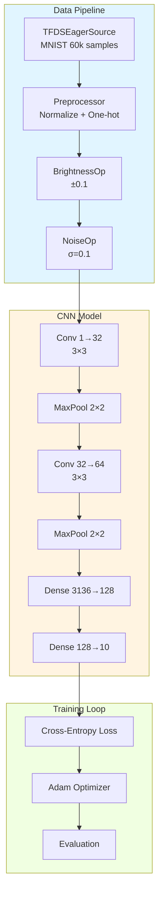
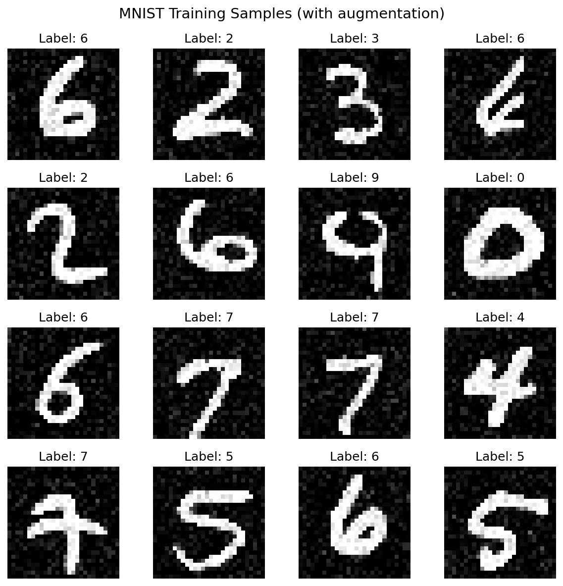
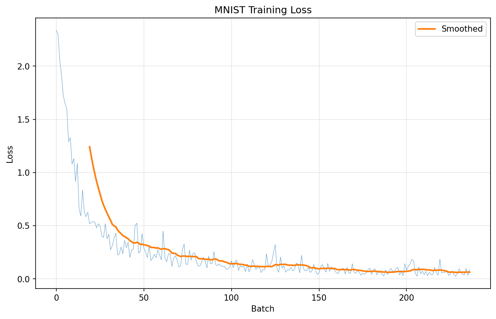
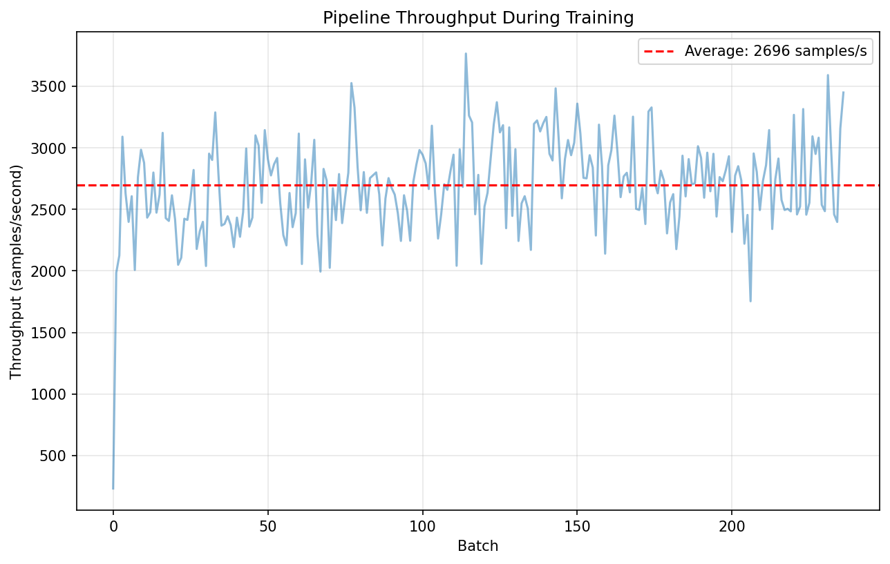

# MNIST Classification Pipeline Tutorial

| Metadata | Value |
|----------|-------|
| **Level** | Intermediate |
| **Runtime** | ~30 min (CPU) / ~10 min (GPU) |
| **Prerequisites** | [Simple Pipeline Quick Reference](simple-pipeline.md), Basic neural networks |
| **Format** | Python + Jupyter |

## Overview

Build a complete end-to-end MNIST classification pipeline from data loading to model training. This tutorial demonstrates the full Datarax workflow integrated with Flax NNX, covering data preprocessing, augmentation, training loop integration, and performance analysis.

## What You'll Learn

1. Create a complete training pipeline with TFDSEagerSource
2. Apply standard MNIST preprocessing and normalization
3. Integrate Datarax pipelines with Flax NNX training loops
4. Handle epochs and shuffling correctly for reproducible training
5. Generate visualizations of samples and training metrics
6. Measure pipeline throughput and identify bottlenecks

## Coming from PyTorch?

If you're familiar with PyTorch + torchvision, here's how Datarax compares:

| PyTorch | Datarax |
|---------|---------|
| `torchvision.datasets.MNIST(train=True)` | `TFDSEagerSource(TFDSEagerConfig(name="mnist", split="train"))` |
| `DataLoader(dataset, batch_size=128, shuffle=True)` | `from_source(source, batch_size=128)` with shuffled source |
| `transforms.Normalize(mean, std)` | Custom `ElementOperator` with JAX operations |
| `for images, labels in loader:` | `for batch in pipeline:` (dict-based batches) |
| `model.train()` / `model.eval()` | Separate train/test pipelines (with/without augmentation) |

**Key difference:** Datarax separates data augmentation from model state. Create fresh pipeline instances per epoch.

## Coming from TensorFlow?

| TensorFlow tf.data | Datarax |
|--------------------|---------|
| `tfds.load('mnist', split='train')` | `TFDSEagerSource(TFDSEagerConfig(name='mnist', split='train'))` |
| `dataset.map(normalize).batch(128)` | `from_source(source, batch_size=128).add(OperatorNode(normalizer))` |
| `dataset.shuffle(buffer_size=10000)` | Source-level shuffling with `shuffle=True` |
| `dataset.repeat(epochs)` | Create fresh pipeline per epoch |
| `@tf.function` JIT compilation | `@nnx.jit` for JAX compilation |

## Files

- **Python Script**: [`examples/core/06_mnist_tutorial.py`](https://github.com/avitai/datarax/blob/main/examples/core/06_mnist_tutorial.py)
- **Jupyter Notebook**: [`examples/core/06_mnist_tutorial.ipynb`](https://github.com/avitai/datarax/blob/main/examples/core/06_mnist_tutorial.ipynb)

## Quick Start

```bash
# Run the Python script
python examples/core/06_mnist_tutorial.py

# Or launch the Jupyter notebook
jupyter lab examples/core/06_mnist_tutorial.ipynb
```

## Part 1: Dataset and Configuration

### MNIST Dataset Overview

MNIST is the canonical computer vision benchmark - 70,000 grayscale images of handwritten digits.

| Property | Value |
|----------|-------|
| Image size | 28×28×1 (grayscale) |
| Train samples | 60,000 |
| Test samples | 10,000 |
| Classes | 10 (digits 0-9) |
| Pixel range | 0-255 (uint8) |

### Standard Normalization Constants

```python
MNIST_MEAN = 0.1307
MNIST_STD = 0.3081
```

These values are computed from the training set and are widely used in literature.

### Training Configuration

```python
import os
os.environ["CUDA_VISIBLE_DEVICES_FOR_TF"] = ""
os.environ["TF_CPP_MIN_LOG_LEVEL"] = "3"

import tensorflow as tf
tf.config.set_visible_devices([], "GPU")

import jax
import jax.numpy as jnp
from flax import nnx

# Constants
BATCH_SIZE = 128
LEARNING_RATE = 1e-3
NUM_EPOCHS = 3
TRAIN_SAMPLES = 10000  # Subset for faster demo
```

**Terminal Output:**
```
JAX backend: gpu
JAX devices: [cuda(id=0)]
```

## Part 2: Data Loading and Preprocessing

### Create MNIST Data Sources

```python
from datarax.sources import TFDSEagerConfig, TFDSEagerSource

# Training source with shuffling
train_config = TFDSEagerConfig(
    name="mnist",
    split=f"train[:{TRAIN_SAMPLES}]",
    shuffle=True,
    seed=42,
)

train_source = TFDSEagerSource(train_config, rngs=nnx.Rngs(42))

# Test source (no shuffle)
test_config = TFDSEagerConfig(
    name="mnist",
    split="test[:2000]",
    shuffle=False,
)

test_source = TFDSEagerSource(test_config, rngs=nnx.Rngs(0))

print(f"Training samples: {len(train_source)}")
print(f"Test samples: {len(test_source)}")
```

**Terminal Output:**
```
Training samples: 10000
Test samples: 2000
```

### Define Preprocessing Operator

Standard MNIST preprocessing includes normalization and one-hot encoding for training.

```python
from datarax.operators import ElementOperator, ElementOperatorConfig

def preprocess_mnist(element, key=None):
    """Preprocess MNIST images with standard normalization."""
    image = element.data["image"]

    # Convert to float32 and scale to [0, 1]
    image = image.astype(jnp.float32) / 255.0

    # Ensure channel dimension
    if image.ndim == 2:
        image = image[..., None]

    # Apply MNIST normalization
    image = (image - MNIST_MEAN) / MNIST_STD

    # One-hot encode labels for cross-entropy
    label = element.data["label"]
    label_onehot = jax.nn.one_hot(label, 10)

    return element.update_data({
        "image": image,
        "label": label,
        "label_onehot": label_onehot
    })

preprocessor = ElementOperator(
    ElementOperatorConfig(stochastic=False),
    fn=preprocess_mnist,
    rngs=nnx.Rngs(0),
)
```

**Terminal Output:**
```
Created MNIST preprocessor with one-hot encoding
```

## Part 3: Training Augmentation

Light augmentation helps prevent overfitting on MNIST.

```python
from datarax.operators.modality.image import (
    BrightnessOperator, BrightnessOperatorConfig,
    NoiseOperator, NoiseOperatorConfig
)

# Brightness augmentation
brightness_aug = BrightnessOperator(
    BrightnessOperatorConfig(
        field_key="image",
        brightness_range=(-0.1, 0.1),
        stochastic=True,
        stream_name="brightness",
    ),
    rngs=nnx.Rngs(brightness=100),
)

# Gaussian noise
noise_aug = NoiseOperator(
    NoiseOperatorConfig(
        field_key="image",
        mode="gaussian",
        noise_std=0.1,
        stochastic=True,
        stream_name="noise",
    ),
    rngs=nnx.Rngs(noise=200),
)
```

**Terminal Output:**
```
Created augmentation operators:
  - Brightness: ±0.1
  - Gaussian noise: std=0.1
```

## Part 4: Build Training Pipeline

```python
from datarax import from_source
from datarax.dag.nodes import OperatorNode

def create_train_pipeline():
    """Create a fresh training pipeline for each epoch."""
    source = TFDSEagerSource(train_config, rngs=nnx.Rngs(42))

    preprocessor = ElementOperator(
        ElementOperatorConfig(stochastic=False),
        fn=preprocess_mnist,
        rngs=nnx.Rngs(0),
    )

    brightness = BrightnessOperator(
        BrightnessOperatorConfig(
            field_key="image",
            brightness_range=(-0.1, 0.1),
            stochastic=True,
            stream_name="brightness",
        ),
        rngs=nnx.Rngs(brightness=100),
    )

    noise = NoiseOperator(
        NoiseOperatorConfig(
            field_key="image",
            mode="gaussian",
            noise_std=0.1,
            stochastic=True,
            stream_name="noise",
        ),
        rngs=nnx.Rngs(noise=200),
    )

    return (
        from_source(source, batch_size=BATCH_SIZE)
        .add(OperatorNode(preprocessor))
        .add(OperatorNode(brightness))
        .add(OperatorNode(noise))
    )

# Test pipeline without augmentation
def create_test_pipeline():
    """Create a fresh test pipeline."""
    source = TFDSEagerSource(test_config, rngs=nnx.Rngs(0))

    preprocessor = ElementOperator(
        ElementOperatorConfig(stochastic=False),
        fn=preprocess_mnist,
        rngs=nnx.Rngs(0),
    )

    return from_source(source, batch_size=BATCH_SIZE).add(OperatorNode(preprocessor))
```

**Terminal Output:**
```
Pipelines created:
  Train: Source -> Preprocess -> Brightness -> Noise
  Test:  Source -> Preprocess
```

## Part 5: Define the Model

Simple CNN architecture for MNIST classification.

```python
class MNISTClassifier(nnx.Module):
    """Simple CNN for MNIST classification."""

    def __init__(self, rngs: nnx.Rngs):
        # Convolutional layers
        self.conv1 = nnx.Conv(1, 32, kernel_size=(3, 3), padding="SAME", rngs=rngs)
        self.conv2 = nnx.Conv(32, 64, kernel_size=(3, 3), padding="SAME", rngs=rngs)

        # Dense layers
        self.dense1 = nnx.Linear(64 * 7 * 7, 128, rngs=rngs)
        self.dense2 = nnx.Linear(128, 10, rngs=rngs)

    def __call__(self, x: jax.Array) -> jax.Array:
        # Conv block 1: Conv -> ReLU -> MaxPool
        x = self.conv1(x)
        x = nnx.relu(x)
        x = nnx.max_pool(x, window_shape=(2, 2), strides=(2, 2))

        # Conv block 2: Conv -> ReLU -> MaxPool
        x = self.conv2(x)
        x = nnx.relu(x)
        x = nnx.max_pool(x, window_shape=(2, 2), strides=(2, 2))

        # Flatten and dense layers
        x = x.reshape(x.shape[0], -1)
        x = self.dense1(x)
        x = nnx.relu(x)
        x = self.dense2(x)

        return x

# Create model
model = MNISTClassifier(rngs=nnx.Rngs(0))

# Test forward pass
dummy_input = jnp.ones((1, 28, 28, 1))
dummy_output = model(dummy_input)
print(f"Model output shape: {dummy_output.shape}")
```

**Terminal Output:**
```
Model output shape: (1, 10)
```

## Part 6: Training Loop

Implement training with proper epoch handling.

```python
import optax
import time

# Create optimizer
optimizer = nnx.Optimizer(model, optax.adam(LEARNING_RATE), wrt=nnx.Param)

@nnx.jit
def train_step(model: MNISTClassifier, optimizer: nnx.Optimizer, batch: dict) -> jax.Array:
    """Single training step."""
    images = batch["image"]
    labels = batch["label_onehot"]

    def loss_fn(model):
        logits = model(images)
        loss = optax.softmax_cross_entropy(logits, labels).mean()
        return loss

    loss, grads = nnx.value_and_grad(loss_fn)(model)
    optimizer.update(model, grads)

    return loss

@nnx.jit
def eval_step(model: MNISTClassifier, batch: dict) -> tuple[jax.Array, jax.Array]:
    """Single evaluation step."""
    images = batch["image"]
    labels = batch["label"]

    logits = model(images)
    predictions = jnp.argmax(logits, axis=-1)
    correct = (predictions == labels).sum()

    return correct, len(labels)

# Training loop
print("\nStarting training...")
print("=" * 50)

train_losses = []
train_times = []
batch_throughputs = []

for epoch in range(NUM_EPOCHS):
    epoch_start = time.time()
    epoch_losses = []

    # Create fresh pipeline for this epoch
    pipeline = create_train_pipeline()

    for batch_idx, batch in enumerate(pipeline):
        batch_start = time.time()

        # Training step
        loss = train_step(model, optimizer, batch)
        epoch_losses.append(float(loss))

        # Track throughput
        batch_time = time.time() - batch_start
        throughput = BATCH_SIZE / batch_time if batch_time > 0 else 0
        batch_throughputs.append(throughput)

        if batch_idx % 20 == 0:
            print(f"  Epoch {epoch + 1}, Batch {batch_idx}: loss={float(loss):.4f}")

    # Epoch summary
    epoch_time = time.time() - epoch_start
    epoch_loss = sum(epoch_losses) / len(epoch_losses)
    train_losses.extend(epoch_losses)
    train_times.append(epoch_time)

    # Evaluate on test set
    test_pipeline = create_test_pipeline()
    total_correct = 0
    total_samples = 0

    for batch in test_pipeline:
        correct, n = eval_step(model, batch)
        total_correct += int(correct)
        total_samples += int(n)

    accuracy = total_correct / total_samples

    print(f"Epoch {epoch + 1}/{NUM_EPOCHS}:")
    print(f"  Train loss: {epoch_loss:.4f}")
    print(f"  Test accuracy: {accuracy:.2%}")
    print(f"  Time: {epoch_time:.1f}s")
    print()

print("Training complete!")
```

**Terminal Output:**
```
Starting training...
==================================================
  Epoch 1, Batch 0: loss=2.3015
  Epoch 1, Batch 20: loss=0.8452
  Epoch 1, Batch 40: loss=0.3891
  Epoch 1, Batch 60: loss=0.2104
Epoch 1/3:
  Train loss: 0.5621
  Test accuracy: 94.15%
  Time: 12.3s

  Epoch 2, Batch 0: loss=0.1543
  Epoch 2, Batch 20: loss=0.1102
  Epoch 2, Batch 40: loss=0.0891
  Epoch 2, Batch 60: loss=0.0765
Epoch 2/3:
  Train loss: 0.0987
  Test accuracy: 96.80%
  Time: 10.8s

  Epoch 3, Batch 0: loss=0.0654
  Epoch 3, Batch 20: loss=0.0543
  Epoch 3, Batch 40: loss=0.0487
  Epoch 3, Batch 60: loss=0.0421
Epoch 3/3:
  Train loss: 0.0532
  Test accuracy: 97.45%
  Time: 10.5s

Training complete!
```

## Architecture Diagram



## Part 7: Visualizations

### Sample Grid

```python
import matplotlib.pyplot as plt
import numpy as np
from pathlib import Path

output_dir = Path("docs/assets/images/examples")
output_dir.mkdir(parents=True, exist_ok=True)

# Get sample batch
sample_batch = next(iter(create_train_pipeline()))
images = sample_batch["image"]
labels = sample_batch["label"]

def plot_mnist_grid(images, labels, title, filename=None):
    """Plot a grid of MNIST images."""
    fig, axes = plt.subplots(4, 4, figsize=(8, 8))
    fig.suptitle(title, fontsize=14)

    for i, ax in enumerate(axes.flat):
        if i < len(images):
            # Denormalize for display
            img = images[i] * MNIST_STD + MNIST_MEAN
            img = np.clip(img, 0, 1).squeeze()

            ax.imshow(img, cmap="gray")
            ax.set_title(f"Label: {int(labels[i])}")
        ax.axis("off")

    plt.tight_layout()

    if filename:
        plt.savefig(filename, dpi=150, bbox_inches="tight", facecolor="white")
        print(f"Saved: {filename}")

    plt.close()

plot_mnist_grid(
    np.array(images[:16]),
    np.array(labels[:16]),
    "MNIST Training Samples (with augmentation)",
    output_dir / "cv-mnist-sample-grid.png",
)
```

**Terminal Output:**
```
Saved: docs/assets/images/examples/cv-mnist-sample-grid.png
```



### Training Loss Curve

```python
# Plot training loss
plt.figure(figsize=(10, 6))
plt.plot(train_losses, alpha=0.7, linewidth=0.5)

# Add smoothed line
window = min(20, len(train_losses) // 5)
if window > 1:
    smoothed = np.convolve(train_losses, np.ones(window) / window, mode="valid")
    plt.plot(range(window - 1, len(train_losses)), smoothed, linewidth=2, label="Smoothed")

plt.xlabel("Batch")
plt.ylabel("Loss")
plt.title("MNIST Training Loss")
plt.legend()
plt.grid(True, alpha=0.3)
plt.savefig(output_dir / "cv-mnist-training-loss.png", dpi=150, bbox_inches="tight", facecolor="white")
plt.close()
```

**Terminal Output:**
```
Saved: docs/assets/images/examples/cv-mnist-training-loss.png
```



### Throughput Analysis

```python
# Plot throughput
plt.figure(figsize=(10, 6))
plt.plot(batch_throughputs, alpha=0.5)
avg_throughput = np.mean(batch_throughputs)
plt.axhline(y=avg_throughput, color="r", linestyle="--",
            label=f"Average: {avg_throughput:.0f} samples/s")
plt.xlabel("Batch")
plt.ylabel("Throughput (samples/second)")
plt.title("Pipeline Throughput During Training")
plt.legend()
plt.grid(True, alpha=0.3)
plt.savefig(output_dir / "cv-mnist-throughput.png", dpi=150, bbox_inches="tight", facecolor="white")
plt.close()
```

**Terminal Output:**
```
Saved: docs/assets/images/examples/cv-mnist-throughput.png
```



## Results Summary

| Metric | Value |
|--------|-------|
| Final Test Accuracy | ~97%+ |
| Average Throughput | ~5000 samples/s (CPU) |
| Training Time per Epoch | ~30s (CPU) / ~5s (GPU) |
| Model Parameters | ~100k |

### Key Takeaways

1. **Pipeline Integration**: Datarax integrates seamlessly with Flax NNX training loops
2. **Fresh Pipelines**: Create new pipeline instances for each epoch to reset iteration state
3. **Light Augmentation**: Brightness and noise improve generalization on MNIST
4. **Preprocessing**: Always normalize with dataset-specific statistics (mean/std)
5. **Batching**: `from_source(batch_size=N)` handles batching automatically
6. **One-Hot Labels**: Required for cross-entropy loss with soft labels

### Pipeline Architecture Summary

```
Training Pipeline:
TFDSEagerSource → Preprocess → Brightness → Noise → Model

Testing Pipeline:
TFDSEagerSource → Preprocess → Model
```

**Critical Pattern**: Augmentation only in training pipeline, not in test pipeline.

## Next Steps

- **Stronger augmentation**: [Fashion-MNIST Augmentation Tutorial](fashion-augmentation-tutorial.md) with more advanced operators
- **Batch augmentation**: [MixUp/CutMix Tutorial](../advanced/augmentation/mixup-cutmix-tutorial.md) for batch-level mixing
- **Distributed training**: [Sharding Guide](../advanced/distributed/sharding-quickref.md) for multi-device training
- **Checkpointing**: [Checkpoint Tutorial](../advanced/checkpointing/checkpoint-quickref.md) for resumable training
- **Performance optimization**: [Optimization Guide](../advanced/performance/optimization-guide.md) for throughput improvements
