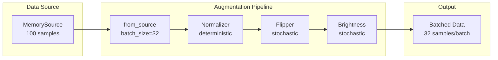

# Operators Deep Dive Tutorial

| Metadata | Value |
|----------|-------|
| **Level** | Intermediate |
| **Runtime** | ~45 min |
| **Prerequisites** | [Simple Pipeline](simple-pipeline.md), [Pipeline Tutorial](pipeline-tutorial.md) |
| **Format** | Python + Jupyter |

## Overview

Master the Datarax operator system - the building blocks for data transformations. This tutorial covers built-in operators, custom operator creation, and advanced composition patterns for building production-ready data pipelines.

## What You'll Learn

1. Understand operator types: deterministic vs stochastic
2. Use built-in image augmentation operators (Brightness, Contrast, Noise, Rotation)
3. Create custom operators with proper RNG handling
4. Select and transform specific data fields
5. Compose operators with different strategies (sequential, parallel)
6. Apply conditional transformations based on data properties
7. Build full augmentation pipelines for training

## Coming from PyTorch?

| PyTorch | Datarax |
|---------|---------|
| `transforms.Normalize(mean, std)` | `ElementOperator` with custom normalization fn |
| `transforms.RandomHorizontalFlip(p=0.5)` | `ElementOperator(stochastic=True)` with flip logic |
| `transforms.ColorJitter(brightness=0.2)` | `BrightnessOperator(brightness_range=(-0.2, 0.2))` |
| `transforms.RandomRotation(15)` | `RotationOperator(angle_range=(-15, 15))` |
| `transforms.Compose([T1, T2])` | `CompositeOperatorModule` with SEQUENTIAL strategy |

**Key difference:** Datarax operators use JAX random keys and explicit RNG streams for fine-grained reproducibility. Each stochastic operator needs a unique `stream_name`.

## Coming from TensorFlow?

| TensorFlow | Datarax |
|------------|---------|
| `tf.keras.layers.Normalization()` | `ElementOperator` with normalization function |
| `tf.image.random_brightness(image, 0.2)` | `BrightnessOperator(brightness_range=(-0.2, 0.2))` |
| `tf.image.random_contrast(image, 0.8, 1.2)` | `ContrastOperator(contrast_range=(0.8, 1.2))` |
| `tf.image.rot90(image, k=random)` | `RotationOperator(angle_range=(0, 360))` |
| Sequential preprocessing layers | `CompositeOperatorModule` |

**Key difference:** Datarax operators are JAX-first with JIT compilation support and work with the Element abstraction rather than raw tensors.

## Files

- **Python Script**: [`examples/core/03_operators_tutorial.py`](https://github.com/avitai/datarax/blob/main/examples/core/03_operators_tutorial.py)
- **Jupyter Notebook**: [`examples/core/03_operators_tutorial.ipynb`](https://github.com/avitai/datarax/blob/main/examples/core/03_operators_tutorial.ipynb)

## Quick Start

```bash
# Install Datarax with data dependencies
uv pip install "datarax[data]"

# Run the Python script
python examples/core/03_operators_tutorial.py

# Or launch the Jupyter notebook
jupyter lab examples/core/03_operators_tutorial.ipynb
```

## Part 1: Operator Fundamentals

Operators are the transformation units in Datarax pipelines. They receive data elements and return transformed elements.

### Key Concepts

| Concept | Description |
|---------|-------------|
| **Deterministic** | Same input always produces same output (e.g., normalization) |
| **Stochastic** | Uses random keys for randomized transformations (e.g., random flip) |
| **Element** | Single data sample with `.data` dictionary |
| **Batch** | Collection of elements processed together |
| **Stream Name** | Unique identifier for RNG stream in stochastic operators |

```python
import numpy as np
from flax import nnx
from datarax.sources import MemorySource, MemorySourceConfig

# Create sample image data
np.random.seed(42)
num_samples = 100
data = {
    "image": np.random.randint(0, 256, (num_samples, 32, 32, 3)).astype(np.float32),
    "label": np.random.randint(0, 10, (num_samples,)).astype(np.int32),
    "metadata": np.random.rand(num_samples, 4).astype(np.float32),
}

source = MemorySource(MemorySourceConfig(), data=data, rngs=nnx.Rngs(0))
```

**Terminal Output:**
```
Created dataset: 100 samples
  image: (100, 32, 32, 3)
  label: (100,)
  metadata: (100, 4)
```

## Part 2: ElementOperator - Custom Transformations

`ElementOperator` is the most flexible operator - wrap any function to transform data elements.

### Example 1: Deterministic Normalization

```python
import jax.numpy as jnp
from datarax.operators import ElementOperator, ElementOperatorConfig

def normalize_image(element, key=None):
    """Normalize image pixels to [0, 1] range."""
    del key  # Unused - deterministic operator
    image = element.data["image"]
    normalized = image / 255.0
    return element.update_data({"image": normalized})

normalizer = ElementOperator(
    ElementOperatorConfig(stochastic=False),
    fn=normalize_image,
    rngs=nnx.Rngs(0),
)

# Test it
from datarax import from_source
from datarax.dag.nodes import OperatorNode

pipeline = from_source(source, batch_size=16).add(OperatorNode(normalizer))
batch = next(iter(pipeline))

print(f"Range: [{batch['image'].min():.3f}, {batch['image'].max():.3f}]")
```

**Terminal Output:**
```
Normalization result:
  Range: [0.000, 1.000]
```

### Example 2: Stochastic Horizontal Flip

```python
import jax
import jax.numpy as jnp

def random_flip(element, key):
    """Randomly flip image horizontally."""
    flip_key, _ = jax.random.split(key)
    should_flip = jax.random.bernoulli(flip_key, 0.5)

    image = element.data["image"]
    flipped = jax.lax.cond(
        should_flip,
        lambda x: jnp.flip(x, axis=1),
        lambda x: x,
        image,
    )
    return element.update_data({"image": flipped})

flipper = ElementOperator(
    ElementOperatorConfig(stochastic=True, stream_name="flip"),
    fn=random_flip,
    rngs=nnx.Rngs(flip=42),
)
```

**Terminal Output:**
```
Created stochastic flipper operator
```

## Part 3: Built-in Image Operators

Datarax provides optimized image augmentation operators. These follow a consistent pattern: Config + Operator.

### Brightness Adjustment

```python
from datarax.operators.modality.image import BrightnessOperator, BrightnessOperatorConfig

brightness_op = BrightnessOperator(
    BrightnessOperatorConfig(
        field_key="image",
        brightness_range=(-0.3, 0.3),  # Additive delta range
        stochastic=True,
        stream_name="brightness",
    ),
    rngs=nnx.Rngs(brightness=100),
)
```

**Terminal Output:**
```
Built-in operators created:
  - BrightnessOperator (range: -0.3 to +0.3)
```

### Contrast Adjustment

```python
from datarax.operators.modality.image import ContrastOperator, ContrastOperatorConfig

contrast_op = ContrastOperator(
    ContrastOperatorConfig(
        field_key="image",
        contrast_range=(0.8, 1.2),  # Multiplicative factor range
        stochastic=True,
        stream_name="contrast",
    ),
    rngs=nnx.Rngs(contrast=200),
)
```

**Terminal Output:**
```
  - ContrastOperator (factor: 0.8-1.2)
```

### Gaussian Noise

```python
from datarax.operators.modality.image import NoiseOperator, NoiseOperatorConfig

noise_op = NoiseOperator(
    NoiseOperatorConfig(
        field_key="image",
        mode="gaussian",
        noise_std=0.05,
        stochastic=True,
        stream_name="noise",
    ),
    rngs=nnx.Rngs(noise=300),
)
```

**Terminal Output:**
```
  - NoiseOperator (gaussian, std=0.05)
```

### Rotation

```python
from datarax.operators.modality.image import RotationOperator, RotationOperatorConfig

rotation_op = RotationOperator(
    RotationOperatorConfig(
        field_key="image",
        angle_range=(-15.0, 15.0),  # Degrees
        fill_value=0.0,  # Fill empty areas with black
    ),
    rngs=nnx.Rngs(0),
)
```

**Terminal Output:**
```
RotationOperator:
  - Rotates image by random angle
  - Range: [-15°, +15°]
  - Uses bilinear interpolation
```

## Part 4: Field Filtering

Transform or filter specific fields from the data dictionary.

```python
def filter_fields(element, key=None):
    """Keep only image and label fields."""
    del key  # Unused - deterministic operator
    filtered = {k: v for k, v in element.data.items() if k in ["image", "label"]}
    return element.update_data(filtered)

field_filter = ElementOperator(
    ElementOperatorConfig(stochastic=False),
    fn=filter_fields,
    rngs=nnx.Rngs(0),
)

# Test field filtering
source2 = MemorySource(MemorySourceConfig(), data=data, rngs=nnx.Rngs(1))
pipeline = from_source(source2, batch_size=8).add(OperatorNode(field_filter))
batch = next(iter(pipeline))

print(f"Image present: {batch['image'].shape}")
print(f"Label present: {batch['label'].shape}")
print(f"Metadata removed: {'metadata' not in batch}")
```

**Terminal Output:**
```
After field filtering:
  Image present: (8, 32, 32, 3)
  Label present: (8,)
  Metadata removed: True
```

## Part 5: CompositeOperator - Chaining Transforms

Chain multiple operators with `CompositeOperatorModule`. Different strategies control how operators interact.

### Composition Strategies

| Strategy | Description |
|----------|-------------|
| SEQUENTIAL | Chain: out₁ → in₂ → out₂ → ... |
| PARALLEL | Apply all to same input, merge outputs |
| ENSEMBLE_MEAN | Parallel + average outputs |

```python
from datarax.operators.composite_operator import (
    CompositeOperatorConfig,
    CompositeOperatorModule,
    CompositionStrategy,
)

# Create individual operators for composition
norm_op = ElementOperator(
    ElementOperatorConfig(stochastic=False),
    fn=normalize_image,
    rngs=nnx.Rngs(0),
)

flip_op = ElementOperator(
    ElementOperatorConfig(stochastic=True, stream_name="flip"),
    fn=random_flip,
    rngs=nnx.Rngs(flip=42),
)

# Sequential composition: normalize → flip
sequential_augment = CompositeOperatorModule(
    CompositeOperatorConfig(
        strategy=CompositionStrategy.SEQUENTIAL,
        operators=[norm_op, flip_op],
        stochastic=True,
        stream_name="seq_augment",
    ),
    rngs=nnx.Rngs(seq_augment=500),
)
```

**Terminal Output:**
```
Created SEQUENTIAL composite: normalize → flip
```

Test the composite operator:

```python
source3 = MemorySource(MemorySourceConfig(), data=data, rngs=nnx.Rngs(2))
pipeline = from_source(source3, batch_size=16).add(OperatorNode(sequential_augment))
batch = next(iter(pipeline))

print(f"Image shape: {batch['image'].shape}")
print(f"Image range: [{batch['image'].min():.3f}, {batch['image'].max():.3f}]")
```

**Terminal Output:**
```
Sequential composite result:
  Image shape: (16, 32, 32, 3)
  Image range: [0.000, 1.000]
```

## Part 6: Building a Full Augmentation Pipeline

Combine everything into a production-ready augmentation pipeline.



```python
# Create fresh operators for the full pipeline
normalizer = ElementOperator(
    ElementOperatorConfig(stochastic=False),
    fn=normalize_image,
    rngs=nnx.Rngs(0),
)

flipper = ElementOperator(
    ElementOperatorConfig(stochastic=True, stream_name="flip"),
    fn=random_flip,
    rngs=nnx.Rngs(flip=42),
)

brightness = BrightnessOperator(
    BrightnessOperatorConfig(
        field_key="image",
        brightness_range=(-0.2, 0.2),
        stochastic=True,
        stream_name="brightness",
    ),
    rngs=nnx.Rngs(brightness=100),
)

# Build pipeline with chained operators
source4 = MemorySource(MemorySourceConfig(), data=data, rngs=nnx.Rngs(3))
full_pipeline = (
    from_source(source4, batch_size=32)
    .add(OperatorNode(normalizer))
    .add(OperatorNode(flipper))
    .add(OperatorNode(brightness))
)

print("Full augmentation pipeline:")
print("  Source → Normalize → Flip → Brightness → Output")
```

**Terminal Output:**
```
Full augmentation pipeline:
  Source → Normalize → Flip → Brightness → Output
```

Process and collect statistics:

```python
stats = {"batches": 0, "samples": 0, "mean_values": []}

for batch in full_pipeline:
    stats["batches"] += 1
    stats["samples"] += batch["image"].shape[0]
    stats["mean_values"].append(float(batch["image"].mean()))

print(f"\nBatches: {stats['batches']}")
print(f"Samples: {stats['samples']}")
print(f"Mean pixel value: {sum(stats['mean_values']) / len(stats['mean_values']):.4f}")
```

**Terminal Output:**
```
Pipeline processed:
  Batches: 4
  Samples: 100
  Mean pixel value: 0.4982
```

## Part 7: Custom Operator Patterns

Best practices for creating robust custom operators.

### Pattern 1: Multi-field Transformation

Apply the same random transform to image and corresponding mask:

```python
def augment_image_and_mask(element, key):
    """Apply same random transform to image and corresponding mask."""
    key1, _ = jax.random.split(key)

    # Random rotation angle
    angle = jax.random.uniform(key1, minval=-15, maxval=15)

    # Apply to both fields (simplified - real rotation would use jax.scipy)
    image = element.data["image"]
    # In production, apply actual rotation here

    return element.update_data({"image": image, "rotation_angle": angle})
```

### Pattern 2: Conditional Transformation

Apply augmentation only to certain samples based on metadata:

```python
def conditional_augment(element, key):
    """Apply augmentation only to certain samples based on metadata."""
    key1, _ = jax.random.split(key)

    image = element.data["image"]
    label = element.data.get("label", 0)

    # Apply stronger augmentation to minority classes (e.g., label > 5)
    strength = jax.lax.cond(
        label > 5,
        lambda: 0.2,  # Strong augmentation
        lambda: 0.05,  # Weak augmentation
    )

    noise = jax.random.normal(key1, image.shape) * strength
    augmented = jnp.clip(image + noise, 0.0, 1.0)

    return element.update_data({"image": augmented})

conditional_op = ElementOperator(
    ElementOperatorConfig(stochastic=True, stream_name="cond"),
    fn=conditional_augment,
    rngs=nnx.Rngs(cond=999),
)
```

**Terminal Output:**
```
Created conditional augmentation operator
```

## Results Summary

| Operator Type | Use Case | Stochastic | Config Required |
|---------------|----------|------------|-----------------|
| ElementOperator | Custom transforms | Configurable | ElementOperatorConfig |
| BrightnessOperator | Image brightness | Yes | BrightnessOperatorConfig |
| ContrastOperator | Image contrast | Yes | ContrastOperatorConfig |
| NoiseOperator | Add noise | Yes | NoiseOperatorConfig |
| RotationOperator | Rotate images | Yes | RotationOperatorConfig |
| CompositeOperator | Chain operators | Depends on children | CompositeOperatorConfig |

### Key Takeaways

1. **Deterministic operators**: Use `stochastic=False`, ignore `key` parameter
2. **Stochastic operators**: Use `stochastic=True`, split `key` for each random op
3. **Composition**: Use `CompositionStrategy.SEQUENTIAL` for chained transforms
4. **Field targeting**: Image operators use `field_key` parameter
5. **RNG management**: Each stochastic operator needs unique `stream_name`
6. **Custom patterns**: Leverage JAX control flow (`jax.lax.cond`) for conditional logic

## Next Steps

- [Augmentation Quick Reference](augmentation-quickref.md) - Quick guide to image operators
- [CIFAR-10 Quick Reference](cifar10-quickref.md) - Apply operators to real data
- [MixUp/CutMix Tutorial](../advanced/augmentation/mixup-cutmix-tutorial.md) - Advanced augmentation techniques
- [Sharding Guide](../advanced/distributed/sharding-quickref.md) - Distributed training with operators
- [API Reference: Operators](../../operators/index.md) - Complete operator API documentation
