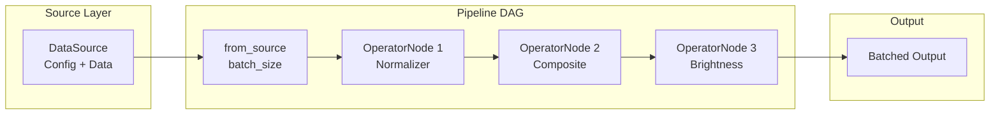

# Complete Pipeline Tutorial

| Metadata | Value |
|----------|-------|
| **Level** | Beginner to Intermediate |
| **Runtime** | ~30 min |
| **Prerequisites** | [Simple Pipeline Quick Reference](simple-pipeline.md) |
| **Format** | Python + Jupyter |

## Overview

This tutorial provides a comprehensive introduction to building data pipelines
with Datarax. You'll learn to create data sources, compose multiple operators,
handle different data modalities, and build production-ready pipelines.

## What You'll Learn

1. Understand the DAG-based pipeline architecture
2. Create and configure different data sources
3. Build custom transformation operators
4. Compose operators using CompositeOperator
5. Apply probabilistic augmentations
6. Handle multi-field data (images + labels)
7. Build reproducible pipelines with proper RNG management

## Coming from PyTorch?

| PyTorch | Datarax |
|---------|---------|
| `transforms.Compose([T1, T2, T3])` | `CompositeOperatorModule(config, operators=[op1, op2, op3])` |
| `transforms.RandomApply([t], p=0.5)` | `ProbabilisticOperator(config, operator=t, p=0.5)` |
| `DataLoader(shuffle=True)` | `MemorySource` with `ShuffleSampler` |
| Manual seed setting | `nnx.Rngs(seed)` with stream names |

**Key insight:** Datarax separates RNG streams by name (e.g., `flip`, `noise`) for fine-grained reproducibility control.

## Coming from TensorFlow?

| TensorFlow tf.data | Datarax |
|--------------------|---------|
| `dataset.map(fn1).map(fn2)` | `pipeline.add(OperatorNode(op1)).add(OperatorNode(op2))` |
| `tf.function` compiled transforms | JAX JIT compilation with `jax.jit` |
| `dataset.shuffle(buffer_size)` | Sampler-based shuffling in source |
| `tf.random.Generator` | `nnx.Rngs` with stream-based key management |

## Files

- **Python Script**: [`examples/core/02_pipeline_tutorial.py`](https://github.com/avitai/datarax/blob/main/examples/core/02_pipeline_tutorial.py)
- **Jupyter Notebook**: [`examples/core/02_pipeline_tutorial.ipynb`](https://github.com/avitai/datarax/blob/main/examples/core/02_pipeline_tutorial.ipynb)

## Quick Start

```bash
# Run the Python script
python examples/core/02_pipeline_tutorial.py

# Or launch the Jupyter notebook
jupyter lab examples/core/02_pipeline_tutorial.ipynb
```

## Part 1: Understanding the Pipeline Architecture

Datarax pipelines follow a **Directed Acyclic Graph (DAG)** pattern:



**Key concepts:**

| Concept | Role |
|---------|------|
| **Source** | Produces raw data elements |
| **OperatorNode** | Wraps an operator for the pipeline DAG |
| **Operator** | Transforms data elements |
| **Pipeline** | Connects source and operators, handles batching |

## Part 2: Creating a Data Source

`MemorySource` wraps in-memory data. Data must be dictionary-based
with arrays sharing the same first dimension (sample dimension).

```python
import numpy as np
from flax import nnx
from datarax.sources import MemorySource, MemorySourceConfig

np.random.seed(42)
num_samples = 500

# Simulate RGB images and one-hot encoded labels
data = {
    "image": np.random.randint(0, 256, (num_samples, 32, 32, 3)).astype(np.float32),
    "label": np.eye(10)[np.random.randint(0, 10, num_samples)].astype(np.float32),
    "metadata": np.random.rand(num_samples, 4).astype(np.float32),
}

source = MemorySource(MemorySourceConfig(), data=data, rngs=nnx.Rngs(0))
print(f"Source created: {len(source)} samples")
```

**Terminal Output:**
```
Dataset structure:
  image: shape=(500, 32, 32, 3), dtype=float32
  label: shape=(500, 10), dtype=float32
  metadata: shape=(500, 4), dtype=float32

Source created: 500 samples
```

## Part 3: Building Custom Operators

Operators transform data elements. Each operator receives:

- `element`: A data element with `.data` dict
- `key`: JAX random key (for stochastic operators)

```python
import jax
import jax.numpy as jnp
from datarax.operators import ElementOperator, ElementOperatorConfig

# Deterministic operator: Normalize images to [0, 1]
def normalize_image(element, key=None):
    image = element.data["image"]
    normalized = image / 255.0
    return element.update_data({"image": normalized})

normalizer = ElementOperator(
    ElementOperatorConfig(stochastic=False),
    fn=normalize_image,
    rngs=nnx.Rngs(0),
)

# Stochastic operator: Random horizontal flip
def random_flip(element, key):
    flip_key, _ = jax.random.split(key)
    should_flip = jax.random.bernoulli(flip_key, 0.5)

    image = element.data["image"]
    flipped = jax.lax.cond(
        should_flip,
        lambda x: jnp.flip(x, axis=1),
        lambda x: x,
        image,
    )
    return element.update_data({"image": flipped})

flipper = ElementOperator(
    ElementOperatorConfig(stochastic=True, stream_name="flip"),
    fn=random_flip,
    rngs=nnx.Rngs(flip=42),
)
```

**Terminal Output:**
```
Created: normalizer (deterministic)
Created: flipper (stochastic)
```

## Part 4: Composing Operators

`CompositeOperatorModule` chains multiple operators together,
applying them sequentially to each element.

```python
from datarax.operators.composite_operator import (
    CompositeOperatorConfig,
    CompositeOperatorModule,
    CompositionStrategy,
)

augmentation_config = CompositeOperatorConfig(
    strategy=CompositionStrategy.SEQUENTIAL,
    operators=[flipper, noise_adder],
    stochastic=True,
    stream_name="augment",
)

augmentation_pipeline = CompositeOperatorModule(
    augmentation_config,
    rngs=nnx.Rngs(augment=999),
)
```

**Terminal Output:**
```
Created composite operator with SEQUENTIAL strategy (2 operators)
```

## Part 5: Building the Complete Pipeline

Chain everything together using the DAG API.

```python
from datarax import from_source
from datarax.dag.nodes import OperatorNode

pipeline = (
    from_source(source, batch_size=32)
    .add(OperatorNode(normalizer))
    .add(OperatorNode(augmentation_pipeline))
    .add(OperatorNode(brightness_op))
)
```

**Terminal Output:**
```
Pipeline structure:
  Source → Normalize → [Flip + Noise] → Brightness → Output
  Batch size: 32
  Total samples: 500
```

## Part 6: Running the Pipeline

```python
print("Processing batches:")
stats = {"min": [], "max": [], "mean": []}

for i, batch in enumerate(pipeline):
    if i >= 5:
        break

    image_batch = batch["image"]
    stats["min"].append(float(image_batch.min()))
    stats["max"].append(float(image_batch.max()))
    stats["mean"].append(float(image_batch.mean()))

    print(f"Batch {i}: shape={image_batch.shape}, range=[{image_batch.min():.3f}, {image_batch.max():.3f}]")
```

**Terminal Output:**
```
Processing batches:
Batch 0: shape=(32, 32, 32, 3), range=[0.000, 1.000]
Batch 1: shape=(32, 32, 32, 3), range=[0.000, 1.000]
Batch 2: shape=(32, 32, 32, 3), range=[0.000, 1.000]
Batch 3: shape=(32, 32, 32, 3), range=[0.000, 1.000]
Batch 4: shape=(32, 32, 32, 3), range=[0.000, 1.000]
```

## Part 7: Reproducibility

Datarax ensures reproducible pipelines through explicit RNG management.

```python
def create_pipeline_with_seed(seed: int):
    src = MemorySource(MemorySourceConfig(), data=data, rngs=nnx.Rngs(seed))
    norm = ElementOperator(ElementOperatorConfig(stochastic=False), fn=normalize_image, rngs=nnx.Rngs(0))
    flip = ElementOperator(
        ElementOperatorConfig(stochastic=True, stream_name="flip"),
        fn=random_flip,
        rngs=nnx.Rngs(flip=seed),
    )
    return from_source(src, batch_size=8).add(OperatorNode(norm)).add(OperatorNode(flip))

# Create two pipelines with same seed
p1 = create_pipeline_with_seed(42)
p2 = create_pipeline_with_seed(42)

batch1 = next(iter(p1))
batch2 = next(iter(p2))

print(f"Same seed produces identical results: {jnp.allclose(batch1['image'], batch2['image'])}")
```

**Terminal Output:**
```
Same seed produces identical results: True
```

## Results Summary

| Component | Type | Purpose |
|-----------|------|---------|
| MemorySource | Source | In-memory data storage |
| ElementOperator | Operator | Element-wise transforms |
| CompositeOperator | Operator | Chain multiple operators |
| OperatorNode | DAG Node | Wrap operators for pipeline |

**Pipeline features:**

- **Lazy evaluation**: Data processed only when iterated
- **Reproducibility**: Deterministic with same seeds
- **Composability**: Operators can be nested and chained
- **Type safety**: Strong typing throughout

## Next Steps

- [Operators Tutorial](operators-tutorial.md) - Deep dive into operator types and composition
- [CIFAR-10 Quick Reference](cifar10-quickref.md) - Work with real CIFAR-10 data
- [HuggingFace Integration](../integration/huggingface/hf-quickref.md) - Load external datasets
- [Sharding Guide](../advanced/distributed/sharding-quickref.md) - Distributed training
- [Checkpointing](../advanced/checkpointing/checkpoint-quickref.md) - Save and resume pipelines
