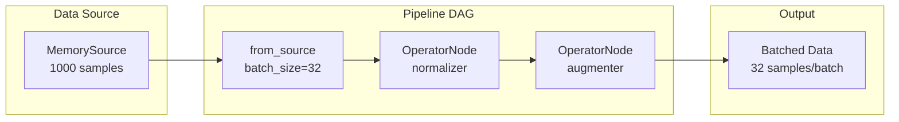

# Simple Pipeline Quick Reference

| Metadata | Value |
|----------|-------|
| **Level** | Beginner |
| **Runtime** | ~5 min |
| **Prerequisites** | Basic Python, NumPy fundamentals |
| **Format** | Python + Jupyter |

## Overview

This quick reference demonstrates building a basic data pipeline with Datarax.
You'll create an in-memory data source, apply transformations using operators,
and iterate through batched data - the core workflow for any Datarax pipeline.

## What You'll Learn

1. Create a `MemorySource` from dictionary data
2. Build a pipeline using the DAG-based `from_source()` API
3. Apply deterministic and stochastic operators to data
4. Iterate through batched pipeline output

## Coming from PyTorch?

If you're familiar with PyTorch DataLoader, here's how Datarax compares:

| PyTorch | Datarax |
|---------|---------|
| `DataLoader(dataset, batch_size=32)` | `from_source(source, batch_size=32)` |
| `transforms.Compose([T1, T2])` | `pipeline.add(OperatorNode(op1)).add(OperatorNode(op2))` |
| `for images, labels in loader:` | `for batch in pipeline:` (dict-based) |
| `TensorDataset(images, labels)` | `MemorySource(config, data={"image": ..., "label": ...})` |

**Key difference:** Datarax uses JAX arrays and supports automatic device sharding.

## Coming from TensorFlow?

| TensorFlow tf.data | Datarax |
|--------------------|---------|
| `tf.data.Dataset.from_tensor_slices(data)` | `MemorySource(config, data=data)` |
| `dataset.batch(32).prefetch(2)` | `from_source(source, batch_size=32)` |
| `dataset.map(transform_fn)` | `pipeline.add(OperatorNode(operator))` |
| `for batch in dataset:` | `for batch in pipeline:` |

**Key difference:** Datarax operators receive `element` objects with `.data` dict instead of raw tensors.

## Files

- **Python Script**: [`examples/core/01_simple_pipeline.py`](https://github.com/avitai/datarax/blob/main/examples/core/01_simple_pipeline.py)
- **Jupyter Notebook**: [`examples/core/01_simple_pipeline.ipynb`](https://github.com/avitai/datarax/blob/main/examples/core/01_simple_pipeline.ipynb)

## Quick Start

### Run the Python Script
```bash
python examples/core/01_simple_pipeline.py
```

### Run the Jupyter Notebook
```bash
jupyter lab examples/core/01_simple_pipeline.ipynb
```

## Key Concepts

### Step 1: Create Sample Data

Datarax works with dictionary-based data where each key maps to an array.
The first dimension is the sample dimension.

```python
import numpy as np
from flax import nnx

# Create MNIST-like sample data
num_samples = 1000
data = {
    "image": np.random.randint(0, 255, (num_samples, 28, 28, 1)).astype(np.float32),
    "label": np.random.randint(0, 10, (num_samples,)).astype(np.int32),
}
print(f"Created data: image={data['image'].shape}, label={data['label'].shape}")
```

**Terminal Output:**
```
Created data: image=(1000, 28, 28, 1), label=(1000,)
```

### Step 2: Create Data Source

`MemorySource` wraps in-memory data for pipeline consumption.
It requires a config object and random number generators (rngs).

```python
from datarax.sources import MemorySource, MemorySourceConfig

source_config = MemorySourceConfig()
source = MemorySource(source_config, data=data, rngs=nnx.Rngs(0))
print(f"Source contains {len(source)} samples")
```

**Terminal Output:**
```
Source contains 1000 samples
```

### Step 3: Define Operators

Operators transform data elements. There are two types:

- **Deterministic**: Same input always produces same output
- **Stochastic**: Uses random keys for randomized transformations

```python
from datarax.operators import ElementOperator, ElementOperatorConfig

# Deterministic operator: Normalize pixel values to [0, 1]
def normalize(element, key=None):
    return element.update_data({"image": element.data["image"] / 255.0})

normalizer = ElementOperator(
    ElementOperatorConfig(stochastic=False),
    fn=normalize,
    rngs=nnx.Rngs(0)
)
```

### Step 4: Build Pipeline

Chain the source and operators using the DAG-based API.

```python
from datarax import from_source
from datarax.dag.nodes import OperatorNode

pipeline = (
    from_source(source, batch_size=32)
    .add(OperatorNode(normalizer))
)
print("Pipeline created with batch_size=32")
```

**Terminal Output:**
```
Pipeline created with batch_size=32
```

### Step 5: Iterate Through Data

The pipeline is iterable. Each iteration yields a batch dictionary.

```python
print("Processing batches:")
for i, batch in enumerate(pipeline):
    if i >= 3:
        break
    print(f"Batch {i}: image={batch['image'].shape}, range=[{batch['image'].min():.3f}, {batch['image'].max():.3f}]")
```

**Terminal Output:**
```
Processing batches:
Batch 0: image=(32, 28, 28, 1), range=[0.000, 1.000]
Batch 1: image=(32, 28, 28, 1), range=[0.000, 1.000]
Batch 2: image=(32, 28, 28, 1), range=[0.000, 1.000]
```

## Architecture Diagram



## Results Summary

| Component | Description |
|-----------|-------------|
| Data Source | 1000 samples of 28x28 grayscale images |
| Batch Size | 32 samples per batch |
| Operators | Normalization (deterministic) + Flip (stochastic) |
| Output Range | [0.0, 1.0] after normalization |

The pipeline processes data lazily - batches are only created when iterated.

## Next Steps

- [Pipeline Tutorial](pipeline-tutorial.md) - Comprehensive pipeline guide with advanced features
- [Operators Tutorial](operators-tutorial.md) - Deep dive into operator types and composition
- [CIFAR-10 Quick Reference](cifar10-quickref.md) - Work with real image data
- [HuggingFace Integration](../integration/huggingface/hf-quickref.md) - Load datasets from HuggingFace Hub
- [API Reference: MemorySource](../../sources/memory_source.md) - Complete API documentation
