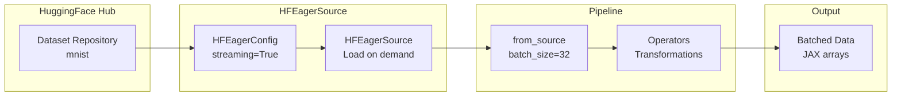

# HuggingFace Datasets Quick Reference

| Metadata | Value |
|----------|-------|
| **Level** | Beginner |
| **Runtime** | ~5 min |
| **Prerequisites** | Basic Datarax pipeline knowledge |
| **Format** | Python + Jupyter |

## Overview

Load and process datasets from [HuggingFace Hub](https://huggingface.co/datasets) using Datarax's `HFEagerSource`. This enables access to thousands of pre-built datasets with seamless integration into your data pipelines.

## What You'll Learn

1. Configure `HFEagerSource` for HuggingFace datasets
2. Use streaming mode for large datasets
3. Inspect dataset structure and contents
4. Apply transformations to HuggingFace data
5. Handle different data types (images, text, tabular)

## Coming from PyTorch?

| PyTorch | Datarax |
|---------|---------|
| `datasets.load_dataset("mnist")` | `HFEagerSource(HFEagerConfig(name="mnist"))` |
| `dataset["train"]` | `HFEagerConfig(split="train")` |
| `IterableDataset` + `DataLoader` | `HFEagerSource` with `streaming=True` |
| `dataset.map(transform)` | `pipeline.add(OperatorNode(operator))` |
| Manual batching in DataLoader | `from_source(source, batch_size=32)` |

**Key difference:** Datarax integrates HuggingFace datasets directly into JAX pipelines with automatic array conversion.

## Coming from TensorFlow?

| TensorFlow | Datarax |
|------------|---------|
| `tfds.load("mnist")` | `HFEagerSource(HFEagerConfig(name="mnist"))` |
| `dataset.take(1000)` | Use split syntax: `split="train[:1000]"` |
| `dataset.batch(32).prefetch(2)` | `from_source(source, batch_size=32)` |
| `dataset.map(preprocess)` | `pipeline.add(OperatorNode(operator))` |

**Key difference:** HuggingFace Hub has a larger dataset catalog (100,000+) compared to TFDS, and Datarax provides unified access.

## Files

- **Python Script**: [`examples/integration/huggingface/01_hf_quickref.py`](https://github.com/avitai/datarax/blob/main/examples/integration/huggingface/01_hf_quickref.py)
- **Jupyter Notebook**: [`examples/integration/huggingface/01_hf_quickref.ipynb`](https://github.com/avitai/datarax/blob/main/examples/integration/huggingface/01_hf_quickref.ipynb)

## Quick Start

```bash
# Install datarax with data dependencies
uv pip install "datarax[data]"

# Run the Python script
python examples/integration/huggingface/01_hf_quickref.py

# Or launch the Jupyter notebook
jupyter lab examples/integration/huggingface/01_hf_quickref.ipynb
```

**Note:** First run may download dataset files from HuggingFace Hub.

## Step 1: Configure HuggingFace Source

`HFEagerConfig` specifies which dataset to load.

> **Note:** You can also use the factory function `from_hf(name, split, ...)` which auto-selects between eager and streaming modes.

### Key Parameters

| Parameter | Description | Example |
|-----------|-------------|---------|
| `name` | Dataset identifier | `"mnist"`, `"imdb"`, `"squad"` |
| `split` | Which split to use | `"train"`, `"test"`, `"validation"` |
| `streaming` | Enable for large datasets | `True` avoids full download |
| `subset` | Dataset variant/configuration | `"en"` for multilingual datasets |

```python
import jax
from flax import nnx
from datarax.sources import HFEagerConfig, HFEagerSource

# Load MNIST dataset in streaming mode
config = HFEagerConfig(
    name="mnist",
    split="train",
    streaming=True,  # Stream data instead of downloading all
)

source = HFEagerSource(config, rngs=nnx.Rngs(0))
print(f"Loaded HuggingFace dataset: {config.name}")

# Check dataset size (may not be available in streaming mode)
try:
    print(f"Dataset size: {len(source)}")
except (NotImplementedError, TypeError):
    print("Dataset size: N/A (streaming mode)")
```

**Terminal Output:**
```
JAX devices: [CudaDevice(id=0)]
Loaded HuggingFace dataset: mnist
Dataset size: N/A (streaming mode)
```

## Step 2: Create Pipeline and Inspect Data

Build a pipeline and examine what data the dataset provides.



```python
from datarax import from_source

# Create pipeline with batch_size=1 for inspection
pipeline = from_source(source, batch_size=1)

# Get first few examples
print("First 3 examples:")
example_iter = iter(pipeline)

for i in range(3):
    batch = next(example_iter)
    data = batch.get_data()

    print(f"\nExample {i + 1}:")
    print(f"  Keys: {list(data.keys())}")

    for key, value in data.items():
        if hasattr(value, "shape"):
            print(f"  {key}: shape={value.shape}, dtype={value.dtype}")
        else:
            print(f"  {key}: {type(value).__name__} = {value}")
```

**Terminal Output:**
```
First 3 examples:

Example 1:
  Keys: ['image', 'label']
  image: shape=(1, 28, 28), dtype=uint8
  label: shape=(1,), dtype=int64

Example 2:
  Keys: ['image', 'label']
  image: shape=(1, 28, 28), dtype=uint8
  label: shape=(1,), dtype=int64

Example 3:
  Keys: ['image', 'label']
  image: shape=(1, 28, 28), dtype=uint8
  label: shape=(1,), dtype=int64
```

## Step 3: Apply Transformations

Add operators to transform the HuggingFace data.

```python
import jax.numpy as jnp
from datarax.dag.nodes import OperatorNode
from datarax.operators import ElementOperator, ElementOperatorConfig

# Define a normalization transform
def normalize_image(element, key=None):
    """Normalize image to [0, 1] range and add channel dimension."""
    image = element.data.get("image")
    if image is not None and hasattr(image, "dtype"):
        # Normalize to [0, 1]
        normalized = image.astype(jnp.float32) / 255.0
        # Add channel dimension if needed
        if normalized.ndim == 2:
            normalized = normalized[..., None]
        return element.update_data({"image": normalized})
    return element

# Create operator
normalizer = ElementOperator(
    ElementOperatorConfig(stochastic=False),
    fn=normalize_image,
    rngs=nnx.Rngs(0),
)

# Build transformed pipeline (need fresh source for new iteration)
source2 = HFEagerSource(config, rngs=nnx.Rngs(1))
transformed_pipeline = from_source(source2, batch_size=32).add(OperatorNode(normalizer))

# Process a batch
batch = next(iter(transformed_pipeline))
image_batch = batch["image"]

print("Transformed batch:")
print(f"  Image shape: {image_batch.shape}")
print(f"  Image range: [{image_batch.min():.3f}, {image_batch.max():.3f}]")
```

**Terminal Output:**
```
Transformed batch:
  Image shape: (32, 28, 28, 1)
  Image range: [0.000, 1.000]
```

## Popular HuggingFace Datasets

### Computer Vision

```python
# CIFAR-10: 60K 32x32 color images, 10 classes
config = HFEagerConfig(name="cifar10", split="train", streaming=True)

# ImageNet-1K: 1.28M images, 1000 classes
config = HFEagerConfig(name="imagenet-1k", split="train", streaming=True)

# Fashion-MNIST: 70K 28x28 grayscale fashion items
config = HFEagerConfig(name="fashion_mnist", split="train", streaming=True)
```

### Natural Language Processing

```python
# IMDB: 50K movie reviews (sentiment analysis)
config = HFEagerConfig(name="imdb", split="train", streaming=True)

# SQuAD: Reading comprehension dataset
config = HFEagerConfig(name="squad", split="train", streaming=True)

# WikiText-103: Language modeling dataset
config = HFEagerConfig(name="wikitext", subset="wikitext-103-v1", split="train", streaming=True)
```

### Multimodal

```python
# COCO Captions: Image captioning
config = HFEagerConfig(name="coco", subset="2017", split="train", streaming=True)

# Conceptual Captions: 3.3M image-text pairs
config = HFEagerConfig(name="conceptual_captions", split="train", streaming=True)
```

## Streaming vs Non-Streaming Mode

### Streaming Mode (Recommended for Large Datasets)

```python
# Streaming: Downloads data on-demand
config = HFEagerConfig(
    name="imagenet-1k",
    split="train",
    streaming=True,  # No full download
)
source = HFEagerSource(config, rngs=nnx.Rngs(0))

# Advantages:
# - No large upfront download
# - Lower disk space usage
# - Start training immediately

# Disadvantages:
# - Requires network connection
# - May have variable latency
```

### Non-Streaming Mode

```python
# Non-streaming: Downloads full dataset first
config = HFEagerConfig(
    name="mnist",
    split="train",
    streaming=False,
)
source = HFEagerSource(config, rngs=nnx.Rngs(0))

# Advantages:
# - Faster iteration (local access)
# - Works offline after download
# - Deterministic ordering

# Disadvantages:
# - Large upfront download
# - Requires disk space
```

## Results Summary

| Feature | Value |
|---------|-------|
| Dataset | MNIST from HuggingFace Hub |
| Mode | Streaming (no full download) |
| Batch Size | 32 |
| Output Shape | (32, 28, 28, 1) |
| Normalization | [0, 255] → [0, 1] |

### HuggingFace Integration Benefits

- Access to 100,000+ datasets across all domains
- Automatic caching and versioning
- Streaming for large datasets (TB-scale)
- Seamless Datarax pipeline integration
- Community-maintained datasets

### Dataset Discovery

Explore datasets at [HuggingFace Hub](https://huggingface.co/datasets):

```bash
# Search datasets by keyword
# Visit: https://huggingface.co/datasets?search=mnist

# View dataset card for details
# Visit: https://huggingface.co/datasets/mnist
```

## Next Steps

- [TFDS Quick Reference](../../core/cifar10-quickref.md) - Alternative dataset source
- [Operators Tutorial](../../core/operators-tutorial.md) - Advanced transformations
- [Text Processing Tutorial](hf-tutorial.md) - NLP pipelines
- [Multimodal Tutorial](hf-tutorial.md) - Image-text datasets
- [API Reference: HFEagerSource](../../../sources/hf_source.md) - Complete HuggingFace API documentation
