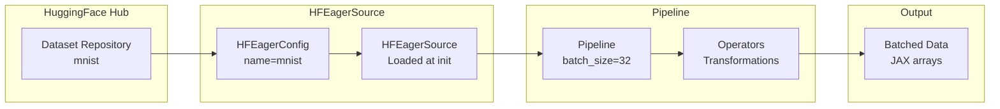

# HuggingFace Datasets Quick Reference

| Metadata | Value |
|----------|-------|
| **Level** | Beginner |
| **Runtime** | ~5 min |
| **Prerequisites** | Basic Datarax pipeline knowledge |
| **Format** | Python + Jupyter |

## Overview

Load and process datasets from [HuggingFace Hub](https://huggingface.co/datasets) using Datarax's `HFEagerSource`. This enables access to thousands of pre-built datasets with seamless integration into your data pipelines.

## What You'll Learn

1. Configure `HFEagerSource` for HuggingFace datasets
2. Use `HFStreamingSource` for large datasets
3. Inspect dataset structure and contents
4. Apply transformations to HuggingFace data
5. Handle different data types (images, text, tabular)

## Coming from PyTorch?

| PyTorch | Datarax |
|---------|---------|
| `datasets.load_dataset("ylecun/mnist")` | `HFEagerSource(HFEagerConfig(name="ylecun/mnist"))` |
| `dataset["train"]` | `HFEagerConfig(split="train")` |
| `IterableDataset` + `DataLoader` | `HFStreamingSource` (via `from_hf(..., streaming=True)`) |
| `dataset.map(transform)` | `Pipeline(source=..., stages=[operator], ...)` |
| Manual batching in DataLoader | `Pipeline(source=source, stages=[], batch_size=32, rngs=nnx.Rngs(0))` |

**Key difference:** Datarax integrates HuggingFace datasets directly into JAX pipelines with automatic array conversion.

## Coming from TensorFlow?

| TensorFlow | Datarax |
|------------|---------|
| `tfds.load("mnist")` | `HFEagerSource(HFEagerConfig(name="ylecun/mnist"))` |
| `dataset.take(1000)` | Use split syntax: `split="train[:1000]"` |
| `dataset.batch(32).prefetch(2)` | `Pipeline(source=source, stages=[], batch_size=32, rngs=nnx.Rngs(0))` |
| `dataset.map(preprocess)` | `Pipeline(source=..., stages=[operator], ...)` |

**Key difference:** HuggingFace Hub has a larger dataset catalog (100,000+) compared to TFDS, and Datarax provides unified access.

## Files

- **Python Script**: [`examples/integration/huggingface/01_hf_quickref.py`](https://github.com/avitai/datarax/blob/main/examples/integration/huggingface/01_hf_quickref.py)
- **Jupyter Notebook**: [`examples/integration/huggingface/01_hf_quickref.ipynb`](https://github.com/avitai/datarax/blob/main/examples/integration/huggingface/01_hf_quickref.ipynb)

## Quick Start

```bash
# Install datarax with data dependencies
uv pip install "datarax[data]"

# Run the Python script
python examples/integration/huggingface/01_hf_quickref.py

# Or launch the Jupyter notebook
jupyter lab examples/integration/huggingface/01_hf_quickref.ipynb
```

**Note:** First run may download dataset files from HuggingFace Hub.

## Step 1: Configure HuggingFace Source

`HFEagerConfig` specifies which dataset to load.

> **Note:** You can also use the factory function `from_hf(name, split, ...)` which auto-selects between eager and streaming modes.

### Key Parameters

| Parameter | Description | Example |
|-----------|-------------|---------|
| `name` | Dataset identifier | `"mnist"`, `"imdb"`, `"squad"` |
| `split` | Which split to use | `"train"`, `"test"`, `"validation"` |
| `shuffle` | Shuffle rows (O(1) index shuffle) | `True` |
| `seed` | Seed for shuffling | `42` |

> **Streaming large datasets?** Use `from_hf(name, split, streaming=True, rngs=...)`
> (or `HFStreamingConfig`/`HFStreamingSource` directly) instead of `HFEagerConfig`,
> which always loads the full dataset into JAX arrays at init.

```python
import jax
from flax import nnx
from datarax.sources import HFEagerConfig, HFEagerSource

# Load the MNIST training split (eager: loaded into JAX arrays at init)
config = HFEagerConfig(
    name="ylecun/mnist",
    split="train",
)

source = HFEagerSource(config, rngs=nnx.Rngs(0))
print(f"Loaded HuggingFace dataset: {config.name}")

# Eager sources expose their length directly
print(f"Dataset size: {len(source)}")
```

**Terminal Output:**
```
JAX devices: [CudaDevice(id=0)]
Loaded HuggingFace dataset: mnist
Dataset size: 60000
```

## Step 2: Create Pipeline and Inspect Data

Build a pipeline and examine what data the dataset provides.


```mermaid
flowchart LR
    subgraph HF["HuggingFace Hub"]
        HUB[Dataset Repository<br/>mnist]
    end

    subgraph Source["HFEagerSource"]
        CFG[HFEagerConfig<br/>name=mnist]
        SRC[HFEagerSource<br/>Loaded at init]
    end

    subgraph Pipeline["Pipeline"]
        FS[Pipeline<br/>batch_size=32]
        OPS[Operators<br/>Transformations]
    end

    subgraph Output["Output"]
        OUT[Batched Data<br/>JAX arrays]
    end

    HUB --> CFG --> SRC --> FS --> OPS --> OUT
```

```python
from datarax.pipeline import Pipeline

# Create pipeline with batch_size=1 for inspection
pipeline = Pipeline(source=source, stages=[], batch_size=1, rngs=nnx.Rngs(0))

# Get first few examples
print("First 3 examples:")
example_iter = iter(pipeline)

for i in range(3):
    batch = next(example_iter)
    data = batch  # pipelines yield plain dicts

    print(f"\nExample {i + 1}:")
    print(f"  Keys: {list(data.keys())}")

    for key, value in data.items():
        if hasattr(value, "shape"):
            print(f"  {key}: shape={value.shape}, dtype={value.dtype}")
        else:
            print(f"  {key}: {type(value).__name__} = {value}")
```

**Terminal Output:**
```
First 3 examples:

Example 1:
  Keys: ['image', 'label']
  image: shape=(1, 28, 28), dtype=uint8
  label: shape=(1,), dtype=int32

Example 2:
  Keys: ['image', 'label']
  image: shape=(1, 28, 28), dtype=uint8
  label: shape=(1,), dtype=int32

Example 3:
  Keys: ['image', 'label']
  image: shape=(1, 28, 28), dtype=uint8
  label: shape=(1,), dtype=int32
```

## Step 3: Apply Transformations

Add operators to transform the HuggingFace data.

```python
import jax.numpy as jnp
from datarax.pipeline import Pipeline
from datarax.operators import ElementOperator, ElementOperatorConfig

# Define a normalization transform
def normalize_image(element, key=None):
    """Normalize image to [0, 1] range and add channel dimension."""
    image = element.data.get("image")
    if image is not None and hasattr(image, "dtype"):
        # Normalize to [0, 1]
        normalized = image.astype(jnp.float32) / 255.0
        # Add channel dimension if needed
        if normalized.ndim == 2:
            normalized = normalized[..., None]
        return element.update_data({"image": normalized})
    return element

# Create operator
normalizer = ElementOperator(
    ElementOperatorConfig(stochastic=False),
    fn=normalize_image,
    rngs=nnx.Rngs(0),
)

# Build transformed pipeline (need fresh source for new iteration)
source2 = HFEagerSource(config, rngs=nnx.Rngs(1))
transformed_pipeline = Pipeline(source=source2, stages=[normalizer], batch_size=32, rngs=nnx.Rngs(0))

# Process a batch
batch = next(iter(transformed_pipeline))
image_batch = batch["image"]

print("Transformed batch:")
print(f"  Image shape: {image_batch.shape}")
print(f"  Image range: [{image_batch.min():.3f}, {image_batch.max():.3f}]")
```

**Terminal Output:**
```
Transformed batch:
  Image shape: (32, 28, 28, 1)
  Image range: [0.000, 1.000]
```

## Popular HuggingFace Datasets

Large datasets are best loaded with the `from_hf` factory in streaming mode; small
ones can use `HFEagerConfig`/`HFEagerSource` directly.

### Computer Vision

```python
from datarax.sources import from_hf

# CIFAR-10: 60K 32x32 color images, 10 classes
source = from_hf("cifar10", "train", streaming=True, rngs=nnx.Rngs(0))

# ImageNet-1K: 1.28M images, 1000 classes
source = from_hf("imagenet-1k", "train", streaming=True, rngs=nnx.Rngs(0))

# Fashion-MNIST: 70K 28x28 grayscale fashion items
source = from_hf("fashion_mnist", "train", streaming=True, rngs=nnx.Rngs(0))
```

### Natural Language Processing

```python
from datarax.sources import from_hf

# IMDB: 50K movie reviews (sentiment analysis)
source = from_hf("stanfordnlp/imdb", "train", streaming=True, rngs=nnx.Rngs(0))

# SQuAD: Reading comprehension dataset
source = from_hf("squad", "train", streaming=True, rngs=nnx.Rngs(0))

# WikiText: Language modeling dataset
source = from_hf("wikitext", "train", streaming=True, rngs=nnx.Rngs(0))
```

### Multimodal

```python
from datarax.sources import from_hf

# COCO Captions: Image captioning
source = from_hf("coco", "train", streaming=True, rngs=nnx.Rngs(0))

# Conceptual Captions: 3.3M image-text pairs
source = from_hf("conceptual_captions", "train", streaming=True, rngs=nnx.Rngs(0))
```

## Streaming vs Eager Sources

Datarax exposes two source types for HuggingFace data. `HFEagerSource` loads the
whole split into JAX arrays at init; `HFStreamingSource` pulls records on demand.

### Streaming (Recommended for Large Datasets)

```python
from flax import nnx
from datarax.sources import HFStreamingConfig, HFStreamingSource

# Streaming: pulls records on-demand
config = HFStreamingConfig(
    name="imagenet-1k",
    split="train",
    streaming=True,  # No full download
)
source = HFStreamingSource(config, rngs=nnx.Rngs(0))

# Advantages:
# - No large upfront download
# - Lower disk space usage
# - Start training immediately

# Disadvantages:
# - Requires network connection
# - May have variable latency
```

### Eager

```python
from flax import nnx
from datarax.sources import HFEagerConfig, HFEagerSource

# Eager: loads the full split into JAX arrays at init
config = HFEagerConfig(
    name="ylecun/mnist",
    split="train",
)
source = HFEagerSource(config, rngs=nnx.Rngs(0))

# Advantages:
# - Fast random access (local arrays)
# - Works offline after download
# - Deterministic ordering, exposes len()

# Disadvantages:
# - Whole split held in memory
# - Not suitable for very large datasets
```

## Results Summary

| Feature | Value |
|---------|-------|
| Dataset | MNIST from HuggingFace Hub |
| Mode | Eager |
| Batch Size | 32 |
| Output Shape | (32, 28, 28, 1) |
| Normalization | [0, 255] → [0, 1] |

### HuggingFace Integration Benefits

- Access to 100,000+ datasets across all domains
- Automatic caching and versioning
- Streaming for large datasets (TB-scale)
- Seamless Datarax pipeline integration
- Community-maintained datasets

### Dataset Discovery

Explore datasets at [HuggingFace Hub](https://huggingface.co/datasets):

```bash
# Search datasets by keyword
# Visit: https://huggingface.co/datasets?search=mnist

# View dataset card for details
# Visit: https://huggingface.co/datasets/mnist
```

## Next Steps

- [TFDS Quick Reference](../tfds/tfds-quickref.md) - Alternative dataset source
- [Operators Tutorial](../../core/operators-tutorial.md) - Advanced transformations
- [Text Processing](imdb-quickref.md) - NLP pipelines
- [API Reference: HFEagerSource](../../../sources/hf_source.md) - Complete HuggingFace API documentation
