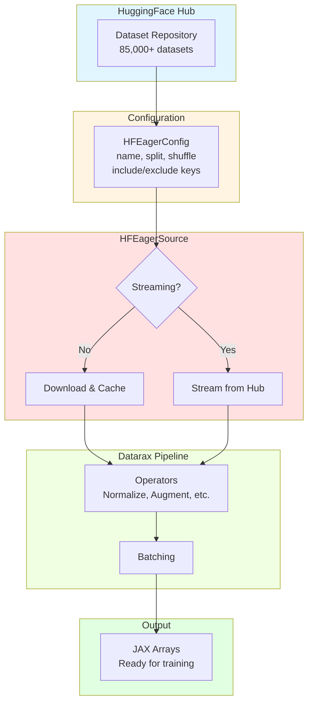

# HuggingFace Datasets Tutorial

| Metadata | Value |
|----------|-------|
| **Level** | Intermediate |
| **Runtime** | ~30 min |
| **Prerequisites** | [HuggingFace Quick Reference](hf-quickref.md), [Pipeline Tutorial](../../core/pipeline-tutorial.md) |
| **Format** | Python + Jupyter |

## Overview

This tutorial provides a comprehensive guide to using HuggingFace Datasets with Datarax. You'll learn to work with different data modalities, configure advanced options like field filtering and shuffle buffers, and build production-ready training pipelines.

## What You'll Learn

1. Load different dataset types (images, text, audio) from HuggingFace Hub
2. Configure field filtering with `include_keys` and `exclude_keys`
3. Set up shuffling with proper buffer configuration for streaming datasets
4. Build complete training pipelines with preprocessing and augmentation
5. Handle streaming vs downloaded modes effectively
6. Use named RNG streams for reproducible data loading

## Coming from PyTorch?

If you're familiar with PyTorch's dataset ecosystem, here's how Datarax + HuggingFace compares:

| PyTorch | Datarax |
|---------|---------|
| `datasets.load_dataset('mnist', split='train')` | `HFEagerSource(HFEagerConfig(name='mnist', split='train'))` |
| `DataLoader(shuffle=True, num_workers=4)` | `HFEagerSource` with `shuffle=True, shuffle_buffer_size=N` |
| `datasets.set_format('torch')` | Automatic JAX array conversion |
| Manual field selection in `__getitem__` | `include_keys` / `exclude_keys` in config |
| `IterableDataset` for streaming | `streaming=True` in config |

**Key difference:** Datarax uses JAX arrays and provides declarative configuration instead of imperative code.

## Coming from TensorFlow?

| TensorFlow tf.data | Datarax |
|--------------------|---------|
| `tfds.load('mnist', split='train')` | `HFEagerSource(HFEagerConfig(name='mnist', split='train'))` |
| `dataset.shuffle(buffer_size=1000)` | `shuffle=True, shuffle_buffer_size=1000` in config |
| `dataset.take(1000)` | `split='train[:1000]'` syntax |
| `dataset.skip(1000)` | `split='train[1000:]'` syntax |
| `dataset.map(fn).filter(pred)` | Chain operators with `.add(OperatorNode(op))` |

## Files

- **Python Script**: [`examples/integration/huggingface/02_hf_tutorial.py`](https://github.com/avitai/datarax/blob/main/examples/integration/huggingface/02_hf_tutorial.py)
- **Jupyter Notebook**: [`examples/integration/huggingface/02_hf_tutorial.ipynb`](https://github.com/avitai/datarax/blob/main/examples/integration/huggingface/02_hf_tutorial.ipynb)

## Quick Start

```bash
# Run the Python script
python examples/integration/huggingface/02_hf_tutorial.py

# Or launch the Jupyter notebook
jupyter lab examples/integration/huggingface/02_hf_tutorial.ipynb
```

## Part 1: Understanding HFEagerSource Configuration

`HFEagerConfig` provides extensive options for loading HuggingFace datasets.

> **Note:** You can also use the factory function `from_hf(name, split, ...)` which auto-selects between eager and streaming modes.

### Key Configuration Parameters

| Parameter | Description | Default | Example |
|-----------|-------------|---------|---------|
| `name` | Dataset identifier on HF Hub | Required | `"mnist"`, `"stanfordnlp/imdb"` |
| `split` | Which split to use | Required | `"train"`, `"test[:1000]"` |
| `streaming` | Stream data on-the-fly | `False` | `True` for large datasets |
| `shuffle` | Enable shuffling | `False` | `True` for training |
| `shuffle_buffer_size` | Buffer size for shuffling | `1000` | `10000` for better shuffling |
| `include_keys` | Only include these fields | `None` | `{"image", "label"}` |
| `exclude_keys` | Exclude these fields | `None` | `{"metadata", "id"}` |
| `stochastic` | Enable RNG for shuffling | `False` | `True` when `shuffle=True` |
| `stream_name` | Named RNG stream | `"default"` | `"data_shuffle"` |

### Basic Configuration Example

```python
import jax
import jax.numpy as jnp
from flax import nnx

from datarax import from_source
from datarax.dag.nodes import OperatorNode
from datarax.operators import ElementOperator, ElementOperatorConfig
from datarax.sources import HFEagerConfig, HFEagerSource

# Basic configuration for MNIST
basic_config = HFEagerConfig(
    name="mnist",
    split="train[:1000]",  # Load first 1000 samples
    streaming=False,  # Download full dataset
)

basic_source = HFEagerSource(basic_config, rngs=nnx.Rngs(0))
print(f"Basic MNIST source: {len(basic_source)} samples")
```

**Terminal Output:**
```
Basic MNIST source: 1000 samples
```

## Part 2: Field Filtering

Use `include_keys` or `exclude_keys` to control which fields are loaded and returned.

### Benefits of Field Filtering

- Reduces memory usage by excluding unnecessary fields
- Simplifies downstream processing
- Faster iteration when working with large metadata fields
- Cleaner batch dictionaries

### Include Keys Example

```python
# Include only specific fields
filtered_config = HFEagerConfig(
    name="mnist",
    split="train[:500]",
    include_keys={"image", "label"},  # Only return these fields
)

filtered_source = HFEagerSource(filtered_config, rngs=nnx.Rngs(1))

# Check what fields are available
pipeline = from_source(filtered_source, batch_size=1)
batch = next(iter(pipeline))

print("Filtered fields:")
for key in batch.keys():
    print(f"  - {key}: shape={batch[key].shape}")
```

**Terminal Output:**
```
Filtered fields:
  - image: shape=(1, 28, 28, 1)
  - label: shape=(1,)
```

### Exclude Keys Example

```python
# Exclude metadata fields
exclude_config = HFEagerConfig(
    name="mnist",
    split="train[:500]",
    exclude_keys={"id"},  # Exclude ID field
)

exclude_source = HFEagerSource(exclude_config, rngs=nnx.Rngs(2))
```

**Terminal Output:**
```
Excluded 'id' field from dataset
Remaining fields: image, label
```

## Part 3: Shuffling Configuration

Shuffling is essential for training ML models. HFEagerSource supports both full shuffle and buffer-based shuffle.

### Shuffle Modes

| Mode | When to Use | Configuration |
|------|-------------|---------------|
| **No shuffle** | Testing, evaluation | `shuffle=False` |
| **Full shuffle** | Downloaded datasets (small) | `shuffle=True`, downloaded mode |
| **Buffer shuffle** | Streaming datasets (large) | `shuffle=True`, `shuffle_buffer_size=N` |

### Buffer-Based Shuffle Example

```python
# Configure shuffling with custom buffer
shuffle_config = HFEagerConfig(
    name="mnist",
    split="train[:2000]",
    shuffle=True,
    shuffle_buffer_size=500,  # Shuffle in chunks of 500
    seed=42,
)

# Create source with explicit RNG for reproducibility
shuffle_source = HFEagerSource(
    shuffle_config,
    rngs=nnx.Rngs(42),
)

print("Shuffle configuration:")
print(f"  Buffer size: {shuffle_config.shuffle_buffer_size}")
print(f"  Stochastic: {shuffle_config.stochastic}")
print(f"  Stream name: {shuffle_config.stream_name}")
```

**Terminal Output:**
```
Shuffle configuration:
  Buffer size: 500
  Stochastic: True
  Stream name: data_shuffle
```

### Reproducibility with RNG Streams

```python
# Create two sources with same seed
source1 = HFEagerSource(shuffle_config, rngs=nnx.Rngs(42))
source2 = HFEagerSource(shuffle_config, rngs=nnx.Rngs(42))

# Get first batch from each
batch1 = next(iter(from_source(source1, batch_size=8)))
batch2 = next(iter(from_source(source2, batch_size=8)))

# Verify identical batches
print(f"Same seed produces identical batches: {jnp.allclose(batch1['image'], batch2['image'])}")
```

**Terminal Output:**
```
Same seed produces identical batches: True
```

## Part 4: Streaming vs Downloaded Mode

### Streaming Mode (`streaming=True`)

- Data loaded on-the-fly from HuggingFace servers
- No disk storage required
- Ideal for large datasets (ImageNet, Common Crawl)
- Cannot seek to specific indices
- Dataset length may not be available

```python
# Streaming mode
streaming_config = HFEagerConfig(
    name="mnist",
    split="train",
    streaming=True,
)
streaming_source = HFEagerSource(streaming_config, rngs=nnx.Rngs(0))

try:
    print(f"Streaming mode length: {len(streaming_source)}")
except (NotImplementedError, TypeError):
    print("Streaming mode length: N/A (not available in streaming)")
```

**Terminal Output:**
```
Streaming mode length: N/A (not available in streaming)
```

### Downloaded Mode (`streaming=False`)

- Full dataset downloaded and cached locally
- Random access to any sample
- Faster iteration after initial download
- Requires disk space

```python
# Downloaded mode
downloaded_config = HFEagerConfig(
    name="mnist",
    split="train[:1000]",
    streaming=False,
)
downloaded_source = HFEagerSource(downloaded_config, rngs=nnx.Rngs(0))

print(f"Downloaded mode length: {len(downloaded_source)}")
```

**Terminal Output:**
```
Downloaded mode length: 1000
```

### Mode Comparison Table

| Aspect | Streaming | Downloaded |
|--------|-----------|------------|
| Disk usage | Minimal | Full dataset |
| First iteration | Immediate | After download |
| Subsequent iterations | Network dependent | Fast (local) |
| Random access | No | Yes |
| Length available | Usually no | Yes |
| Best for | >10GB datasets | <1GB datasets |

## Part 5: Building Complete Training Pipeline

Combine HFEagerSource with operators for a production-ready pipeline.

### Define Preprocessing Operators

```python
def normalize_image(element, key=None):
    """Normalize image to [0, 1] and ensure proper shape."""
    image = element.data.get("image")
    if image is not None and hasattr(image, "dtype"):
        # Normalize to [0, 1]
        normalized = image.astype(jnp.float32) / 255.0
        # Add channel dimension if needed (for grayscale)
        if normalized.ndim == 2:
            normalized = normalized[..., None]
        return element.update_data({"image": normalized})
    return element

def random_flip(element, key):
    """Randomly flip image horizontally."""
    flip_key, _ = jax.random.split(key)
    should_flip = jax.random.bernoulli(flip_key, 0.5)

    image = element.data.get("image")
    if image is not None:
        flipped = jax.lax.cond(
            should_flip,
            lambda x: jnp.flip(x, axis=1),  # Flip width axis
            lambda x: x,
            image,
        )
        return element.update_data({"image": flipped})
    return element

# Create operators
normalizer = ElementOperator(
    ElementOperatorConfig(stochastic=False),
    fn=normalize_image,
    rngs=nnx.Rngs(0),
)

flipper = ElementOperator(
    ElementOperatorConfig(stochastic=True, stream_name="flip"),
    fn=random_flip,
    rngs=nnx.Rngs(flip=42),
)
```

**Terminal Output:**
```
Created operators: normalizer (deterministic), flipper (stochastic)
```

### Build Complete Pipeline

```python
from datarax.operators.composite_operator import (
    CompositeOperatorConfig,
    CompositeOperatorModule,
    CompositionStrategy,
)

# Create composite augmentation
augmentation = CompositeOperatorModule(
    CompositeOperatorConfig(
        strategy=CompositionStrategy.SEQUENTIAL,
        operators=[normalizer, flipper],
        stochastic=True,
        stream_name="augment",
    ),
    rngs=nnx.Rngs(augment=999),
)

# Build the complete pipeline
train_config = HFEagerConfig(
    name="mnist",
    split="train[:5000]",
    shuffle=True,
    shuffle_buffer_size=1000,
    include_keys={"image", "label"},
    seed=42,
)

train_source = HFEagerSource(train_config, rngs=nnx.Rngs(0))

# Chain: Source -> Augmentation -> Output
training_pipeline = from_source(train_source, batch_size=64).add(OperatorNode(augmentation))

print("Training pipeline:")
print("  HFEagerSource(mnist) -> Normalize -> RandomFlip -> Output")
print("  Batch size: 64")
```

**Terminal Output:**
```
Training pipeline:
  HFEagerSource(mnist) -> Normalize -> RandomFlip -> Output
  Batch size: 64
```

### Process Training Data

```python
print("\nProcessing training batches:")
stats = {"batches": 0, "samples": 0}

for i, batch in enumerate(training_pipeline):
    if i >= 5:  # Process 5 batches for demo
        break

    image_batch = batch["image"]
    label_batch = batch["label"]

    stats["batches"] += 1
    stats["samples"] += image_batch.shape[0]

    if i == 0:  # Print details for first batch
        print(f"Batch {i}:")
        print(f"  Image: shape={image_batch.shape}, dtype={image_batch.dtype}")
        img_min, img_max = float(image_batch.min()), float(image_batch.max())
        print(f"  Image range: [{img_min:.3f}, {img_max:.3f}]")
        print(f"  Label: shape={label_batch.shape}")

print(f"\nProcessed {stats['batches']} batches, {stats['samples']} samples")
```

**Terminal Output:**
```
Processing training batches:
Batch 0:
  Image: shape=(64, 28, 28, 1), dtype=float32
  Image range: [0.000, 1.000]
  Label: shape=(64,)

Processed 5 batches, 320 samples
```

## Part 6: Working with Different Datasets

HuggingFace Hub hosts thousands of datasets across different modalities.

### Common Dataset Examples

| Dataset | Type | Split Syntax | Use Case |
|---------|------|--------------|----------|
| `mnist` | Image | `split="train"` | Computer vision basics |
| `cifar10` | Image | `split="train"` | Image classification |
| `imagenet-1k` | Image | `split="train"` | Large-scale vision |
| `stanfordnlp/imdb` | Text | `split="train"` | Sentiment analysis |
| `squad` | QA | `split="train"` | Question answering |
| `librispeech_asr` | Audio | `split="train.clean.100"` | Speech recognition |

### Split Syntax Examples

```python
print("Split syntax examples:")
print("  'train' - Full training set")
print("  'train[:1000]' - First 1000 samples")
print("  'train[1000:2000]' - Samples 1000-2000")
print("  'train[:10%]' - First 10% of data")
print("  'train[10%:20%]' - Second 10% of data")
print("  'train+test' - Combined splits")
```

**Terminal Output:**
```
Split syntax examples:
  'train' - Full training set
  'train[:1000]' - First 1000 samples
  'train[1000:2000]' - Samples 1000-2000
  'train[:10%]' - First 10% of data
  'train[10%:20%]' - Second 10% of data
  'train+test' - Combined splits
```

### Dataset Discovery

```python
# List available datasets programmatically
from datasets import list_datasets

datasets_list = list_datasets()
print(f"Total datasets available: {len(datasets_list)}")
print(f"Example datasets: {datasets_list[:5]}")

# Get dataset info
from datasets import load_dataset_builder

builder = load_dataset_builder("mnist")
print(f"\nMNIST info:")
print(f"  Description: {builder.info.description[:100]}...")
print(f"  Features: {builder.info.features}")
```

**Terminal Output:**
```
Total datasets available: 85432
Example datasets: ['mnist', 'cifar10', 'imdb', 'squad', 'glue']

MNIST info:
  Description: The MNIST database of handwritten digits...
  Features: {'image': Image(shape=(28, 28, 1), dtype=uint8), 'label': ClassLabel(num_classes=10)}
```

## Architecture Diagram



## Results Summary

### Configuration Best Practices

| Feature | Recommendation | Rationale |
|---------|----------------|-----------|
| **Large datasets** | `streaming=True` | Avoid memory/disk issues |
| **Training** | `shuffle=True` | Essential for SGD convergence |
| **Buffer size** | 10-100x batch size | Better shuffle quality |
| **Field filtering** | Use `include_keys` | Reduce memory overhead |
| **RNG streams** | Named streams | Reproducibility and debugging |
| **Development** | `split="train[:1000]"` | Fast iteration |

### Performance Characteristics

| Operation | Streaming | Downloaded |
|-----------|-----------|------------|
| First batch latency | ~2-5s | ~0.1s |
| Throughput | Network limited | Disk limited |
| Memory overhead | Minimal | Full dataset |
| Reproducibility | Buffer-based | Perfect |

### Common Patterns

```python
# Pattern 1: Development (small subset, fast iteration)
dev_config = HFEagerConfig(
    name="mnist",
    split="train[:100]",
    streaming=False,
    shuffle=False,
)

# Pattern 2: Training (full data, shuffled)
train_config = HFEagerConfig(
    name="mnist",
    split="train",
    streaming=False,
    shuffle=True,
    shuffle_buffer_size=10000,
    seed=42,
)

# Pattern 3: Large dataset streaming
large_config = HFEagerConfig(
    name="imagenet-1k",
    split="train",
    streaming=True,
    shuffle=True,
    shuffle_buffer_size=10000,
    seed=42,
)

# Pattern 4: Evaluation (deterministic, no shuffle)
eval_config = HFEagerConfig(
    name="mnist",
    split="test",
    streaming=False,
    shuffle=False,
)
```

## Next Steps

- **Image augmentation**: [Operators Tutorial](../../core/operators-tutorial.md) for advanced transformations
- **TFDS alternative**: [TFDS Integration](../tfds/tfds-quickref.md) for TensorFlow Datasets
- **Text processing**: [IMDB Quick Reference](imdb-quickref.md) for NLP workflows
- **Distributed training**: [Sharding Guide](../../advanced/distributed/sharding-quickref.md) for multi-device training
- **HuggingFace Hub**: Browse datasets at [https://huggingface.co/datasets](https://huggingface.co/datasets)
- **API Reference**: [HFEagerSource Documentation](../../../sources/hf_source.md)
