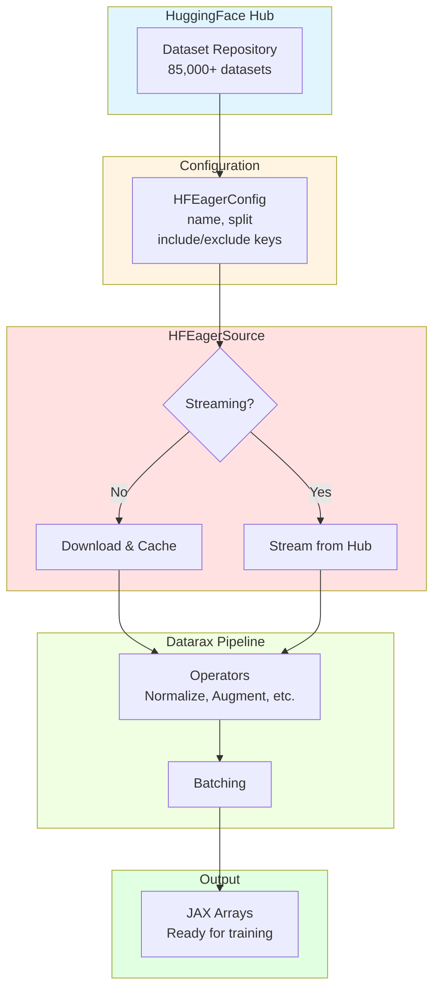

# HuggingFace Datasets Tutorial

| Metadata | Value |
|----------|-------|
| **Level** | Intermediate |
| **Runtime** | ~30 min |
| **Prerequisites** | [HuggingFace Quick Reference](hf-quickref.md), [Pipeline Tutorial](../../core/pipeline-tutorial.md) |
| **Format** | Python + Jupyter |

## Overview

This tutorial provides a detailed guide to using HuggingFace Datasets with Datarax. You'll learn to work with different data modalities, configure advanced options like field filtering and shuffle buffers, and build production-ready training pipelines.

## What You'll Learn

1. Load different dataset types (images, text, audio) from HuggingFace Hub
2. Configure field filtering with `include_keys` and `exclude_keys`
3. Set up shuffling with proper buffer configuration for streaming datasets
4. Build complete training pipelines with preprocessing and augmentation
5. Handle streaming vs downloaded modes effectively
6. Use named RNG streams for reproducible data loading

## Coming from PyTorch?

If you're familiar with PyTorch's dataset ecosystem, here's how Datarax + HuggingFace compares:

| PyTorch | Datarax |
|---------|---------|
| `datasets.load_dataset('mnist', split='train')` | `HFEagerSource(HFEagerConfig(name='mnist', split='train'))` |
| `DataLoader(shuffle=True, num_workers=4)` | `Pipeline(source=HFEagerSource(...), ..., shuffle=True)` |
| `datasets.set_format('torch')` | Automatic JAX array conversion |
| Manual field selection in `__getitem__` | `include_keys` / `exclude_keys` in config |
| `IterableDataset` for streaming | `from_hf(name, split, streaming=True)` / `HFStreamingSource` |

**Key difference:** Datarax uses JAX arrays and provides declarative configuration instead of imperative code.

## Coming from TensorFlow?

| TensorFlow tf.data | Datarax |
|--------------------|---------|
| `tfds.load('mnist', split='train')` | `HFEagerSource(HFEagerConfig(name='mnist', split='train'))` |
| `dataset.shuffle(buffer_size=1000)` | `shuffle=True` in config (O(1) index shuffle, no buffer) |
| `dataset.take(1000)` | `split='train[:1000]'` syntax |
| `dataset.skip(1000)` | `split='train[1000:]'` syntax |
| `dataset.map(fn).filter(pred)` | Chain operators by passing them in the `stages=[...]` list |

## Files

- **Python Script**: [`examples/integration/huggingface/02_hf_tutorial.py`](https://github.com/avitai/datarax/blob/main/examples/integration/huggingface/02_hf_tutorial.py)
- **Jupyter Notebook**: [`examples/integration/huggingface/02_hf_tutorial.ipynb`](https://github.com/avitai/datarax/blob/main/examples/integration/huggingface/02_hf_tutorial.ipynb)

## Quick Start

```bash
# Run the Python script
python examples/integration/huggingface/02_hf_tutorial.py

# Or launch the Jupyter notebook
jupyter lab examples/integration/huggingface/02_hf_tutorial.ipynb
```

## Part 1: Understanding HFEagerSource Configuration

`HFEagerConfig` provides extensive options for loading HuggingFace datasets.

> **Note:** The factory `from_hf(name, split, ...)` builds `HFEagerSource`, or `HFStreamingSource` with `streaming=True`.

### Key Configuration Parameters

| Parameter | Description | Default | Example |
|-----------|-------------|---------|---------|
| `name` | Dataset identifier on HF Hub | Required | `"mnist"`, `"stanfordnlp/imdb"` |
| `split` | Which split to use | Required | `"train"`, `"test[:1000]"` |
| `include_keys` | Only include these fields | `None` | `{"image", "label"}` |
| `exclude_keys` | Exclude these fields | `None` | `{"metadata", "id"}` |

> **Order:** the order an eager source's records are served in belongs to the pipeline:
> `Pipeline(..., shuffle=True)` serves each epoch in a new order, an O(1) Feistel index
> shuffle keyed by the pipeline's `rngs`, so there is no shuffle buffer in eager mode.

### Basic Configuration Example

```python
# Imports
import jax
import jax.numpy as jnp
from flax import nnx

from datarax.operators import (
    ElementOperator,
    ElementOperatorConfig,
    ProbabilisticOperator,
    ProbabilisticOperatorConfig,
)
from datarax.operators.composite_operator import (
    CompositeOperatorConfig,
    CompositeOperatorModule,
    CompositionStrategy,
)
from datarax.operators.modality.image import FlipOperator, FlipOperatorConfig
from datarax.pipeline import Pipeline
from datarax.sources import HFEagerConfig, HFEagerSource, HFStreamingConfig, HFStreamingSource


print(f"JAX version: {jax.__version__}")
print(f"JAX backend: {jax.default_backend()}")
```

**Terminal Output:**
```
JAX version: 0.11.1
JAX backend: gpu
```

```python
# Example: Basic configuration for MNIST
basic_config = HFEagerConfig(
    name="ylecun/mnist",
    split="train[:1000]",  # Load first 1000 samples
)

basic_source = HFEagerSource(basic_config)
print(f"Basic MNIST source: {len(basic_source)} samples")
```

**Terminal Output:**
```
Basic MNIST source: 1000 samples
```

## Part 2: Field Filtering

Use `include_keys` or `exclude_keys` to control which fields are loaded and returned.

### Benefits of Field Filtering

- Reduces memory usage by excluding unnecessary fields
- Simplifies downstream processing
- Faster iteration when working with large metadata fields
- Cleaner batch dictionaries

### Include Keys Example

```python
# Include only specific fields
filtered_config = HFEagerConfig(
    name="ylecun/mnist",
    split="train[:500]",
    include_keys={"image", "label"},  # Only return these fields
)

filtered_source = HFEagerSource(filtered_config)

# Check what fields are available
pipeline = Pipeline(source=filtered_source, stages=[], batch_size=1, rngs=nnx.Rngs(0))
batch = next(iter(pipeline))
data = batch.data

print("Filtered fields:")
for key in data.keys():
    print(f"  - {key}")
```

**Terminal Output:**
```
Filtered fields:
  - image
  - label
```

### Exclude Keys Example

```python
# Exclude metadata fields
exclude_config = HFEagerConfig(
    name="ylecun/mnist",
    split="train[:500]",
    exclude_keys={"id"},  # Exclude ID field
)

exclude_source = HFEagerSource(exclude_config)
```

## Part 3: Shuffling Configuration

Shuffling is essential for training ML models. For an eager source the pipeline owns the
order: `Pipeline(..., shuffle=True)` shuffles with an O(1) Feistel index shuffle - there is
no shuffle buffer, and the pipeline's `rngs` seeds it.

### Shuffle Modes

| Mode | When to Use | Configuration |
|------|-------------|---------------|
| **No shuffle** | Testing, evaluation | `Pipeline(..., shuffle=False)` (the default) |
| **Index shuffle** | Eager (downloaded) datasets | `Pipeline(..., shuffle=True)`, seeded by its `rngs` |
| **Buffer shuffle** | Streams (large datasets) | `Pipeline(..., shuffle=True)` over `HFStreamingSource`; buffer `HFStreamingConfig(shuffle_buffer_size=N)` |

### Eager Shuffle Example

```python
# Shuffle the whole split every epoch, reproducibly from the pipeline's seed
shuffle_source = HFEagerSource(HFEagerConfig(name="ylecun/mnist", split="train[:2000]"))
shuffle_pipeline = Pipeline(
    source=shuffle_source, stages=[], batch_size=8, rngs=nnx.Rngs(42), shuffle=True
)

print("Shuffle configuration:")
print(f"  Pipeline shuffles: {shuffle_pipeline.shuffle}")
```

**Terminal Output:**
```
Shuffle configuration:
  Pipeline shuffles: True
```

## Part 4: Streaming vs Eager Loading

### Eager (`HFEagerSource`)

- Full split downloaded, cached and loaded into host memory
- Random access to any record, and its text by index (`provenance(indices)`)
- Faster iteration after the initial download
- Requires disk space and host memory

### Streaming (`HFStreamingSource`)

- Data read on the fly with HuggingFace's streaming mode (`load_dataset(..., streaming=True)`)
- No disk storage required
- Ideal for large datasets (ImageNet, Common Crawl)
- Records named by their arrival; the length is not known
- Text and other objects travel beside each batch as provenance
- A shuffling pipeline seeds HuggingFace's buffer shuffle (`shuffle_buffer_size` records),
  each pass in its own order

The comparison below builds one source of each kind: the stream has no length until it is
read, while the eager subset reports its size.

```python
# Compare streaming and eager loading
print("Mode Comparison:")

# Streaming: records are read on the fly, so the length is unknown
streaming_source = HFStreamingSource(HFStreamingConfig(name="ylecun/mnist", split="train"))

try:
    print(f"Streaming length: {len(streaming_source)}")
except NotImplementedError:
    print("Streaming length: unknown until the stream is read")
first_batch = streaming_source.get_batch(1)
print(f"First streamed record's fields: {sorted(first_batch.data)}")

# Eager (using a subset)
eager_source = HFEagerSource(HFEagerConfig(name="ylecun/mnist", split="train[:1000]"))
print(f"Eager length: {len(eager_source)}")
```

**Terminal Output:**
```
Mode Comparison:
Streaming length: unknown until the stream is read
First streamed record's fields: ['image', 'label']
Eager length: 1000
```

> **Tip:** `from_hf(name, split)` builds `HFEagerSource`; `from_hf(name, split, streaming=True)`
> builds `HFStreamingSource`.

### Mode Comparison Table

| Aspect | Streaming | Downloaded |
|--------|-----------|------------|
| Disk usage | Minimal | Full dataset |
| First iteration | Immediate | After download |
| Subsequent iterations | Network dependent | Fast (local) |
| Random access | No | Yes |
| Length available | Usually no | Yes |
| Best for | >10GB datasets | <1GB datasets |

## Part 5: Building Complete Training Pipeline

Combine HFEagerSource with operators for a production-ready pipeline.

### Define Preprocessing Operators

```python
# Define operators
def normalize_image(element, key=None):  # noqa: ARG001
    """Normalize image to [0, 1] and ensure proper shape."""
    del key  # Unused - deterministic
    image = element.data.get("image")
    if image is not None and hasattr(image, "dtype"):
        # Normalize to [0, 1]
        normalized = image.astype(jnp.float32) / 255.0
        # Add channel dimension if needed (for grayscale)
        if normalized.ndim == 2:
            normalized = normalized[..., None]
        return element.update_data({"image": normalized})
    return element


# Create operators
normalizer = ElementOperator(
    ElementOperatorConfig(stochastic=False),
    fn=normalize_image,
    rngs=nnx.Rngs(0),
)

# Random horizontal flip: FlipOperator, applied to each record with probability 0.5
flipper = ProbabilisticOperator(
    ProbabilisticOperatorConfig(probability=0.5),
    operator=FlipOperator(FlipOperatorConfig(field_key="image")),
    rngs=nnx.Rngs(augment=42),
)

# Create composite augmentation
augmentation = CompositeOperatorModule(
    CompositeOperatorConfig(
        strategy=CompositionStrategy.SEQUENTIAL,
        stochastic=True,
        stream_name="augment",
    ),
    operators=[normalizer, flipper],
)

print("Created operators: normalizer, flipper, augmentation")
```

**Terminal Output:**
```
Created operators: normalizer, flipper, augmentation
```

### Build Complete Pipeline

```python
# Build the complete pipeline
train_config = HFEagerConfig(
    name="ylecun/mnist",
    split="train[:5000]",
    include_keys={"image", "label"},
)

train_source = HFEagerSource(train_config)

# Chain: Source -> Augmentation -> Output
training_pipeline = Pipeline(
    source=train_source, stages=[augmentation], batch_size=64, rngs=nnx.Rngs(0), shuffle=True
)

print("Training pipeline:")
print("  HFEagerSource(mnist) -> Normalize -> RandomFlip -> Output")
print("  Batch size: 64")
```

**Terminal Output:**
```
Training pipeline:
  HFEagerSource(mnist) -> Normalize -> RandomFlip -> Output
  Batch size: 64
```

### Process Training Data

```python
# Process training data
print("\nProcessing training batches:")
stats = {"batches": 0, "samples": 0}

for i, batch in enumerate(training_pipeline):
    if i >= 5:  # Process 5 batches for demo
        break

    image_batch = batch["image"]
    label_batch = batch["label"]

    stats["batches"] += 1
    stats["samples"] += image_batch.shape[0]

    if i == 0:  # Print details for first batch
        print(f"Batch {i}:")
        print(f"  Image: shape={image_batch.shape}, dtype={image_batch.dtype}")
        img_min, img_max = float(image_batch.min()), float(image_batch.max())
        print(f"  Image range: [{img_min:.3f}, {img_max:.3f}]")
        print(f"  Label: shape={label_batch.shape}")

print(f"\nProcessed {stats['batches']} batches, {stats['samples']} samples")
```

**Terminal Output:**
```

Processing training batches:
Batch 0:
  Image: shape=(64, 28, 28, 1), dtype=float32
  Image range: [0.000, 1.000]
  Label: shape=(64,)

Processed 5 batches, 320 samples
```

## Part 6: Working with Different Datasets

HuggingFace Hub hosts thousands of datasets across different modalities.

### Common Dataset Examples

| Dataset | Type | Split Syntax | Use Case |
|---------|------|--------------|----------|
| `mnist` | Image | `split="train"` | Computer vision basics |
| `cifar10` | Image | `split="train"` | Image classification |
| `imagenet-1k` | Image | `split="train"` | Large-scale vision |
| `stanfordnlp/imdb` | Text | `split="train"` | Sentiment analysis |
| `squad` | QA | `split="train"` | Question answering |
| `librispeech_asr` | Audio | `split="train.clean.100"` | Speech recognition |

### Split Syntax Examples

```python
# Example: Different split syntax
print("Split syntax examples:")
print("  'train' - Full training set")
print("  'train[:1000]' - First 1000 samples")
print("  'train[1000:2000]' - Samples 1000-2000")
print("  'train[:10%]' - First 10% of data")
print("  'train+test' - Combined splits")
```

**Terminal Output:**
```
Split syntax examples:
  'train' - Full training set
  'train[:1000]' - First 1000 samples
  'train[1000:2000]' - Samples 1000-2000
  'train[:10%]' - First 10% of data
  'train+test' - Combined splits
```

### Dataset Discovery

```python
# List available datasets programmatically
from huggingface_hub import list_datasets

datasets_list = list(list_datasets(limit=100))
print(f"Datasets fetched: {len(datasets_list)}")
print(f"Example datasets: {datasets_list[:5]}")

# Get dataset info
from datasets import load_dataset_builder

builder = load_dataset_builder("mnist")
print(f"\nMNIST info:")
print(f"  Description: {builder.info.description[:100]}...")
print(f"  Features: {builder.info.features}")
```

## Architecture Diagram


```mermaid
flowchart TB
    subgraph HF["HuggingFace Hub"]
        Hub[Dataset Repository<br/>85,000+ datasets]
    end

    subgraph Config["Configuration"]
        Cfg[HFEagerConfig<br/>name, split<br/>include/exclude keys]
    end

    subgraph Source["HFEagerSource"]
        Stream{Streaming?}
        Download[Download & Cache]
        StreamLoad[Stream from Hub]
    end

    subgraph Pipeline["Datarax Pipeline"]
        Ops[Operators<br/>Normalize, Augment, etc.]
        Batch[Batching]
    end

    subgraph Output["Output"]
        JAX[JAX Arrays<br/>Ready for training]
    end

    Hub --> Cfg
    Cfg --> Stream
    Stream -->|No| Download --> Ops
    Stream -->|Yes| StreamLoad --> Ops
    Ops --> Batch --> JAX

    style HF fill:#e1f5ff
    style Config fill:#fff4e1
    style Source fill:#ffe1e1
    style Pipeline fill:#f0ffe1
    style Output fill:#e1ffe1
```

## Results Summary

### Configuration Best Practices

| Feature | Recommendation | Rationale |
|---------|----------------|-----------|
| **Large datasets** | `HFStreamingSource` (or `from_hf(..., streaming=True)`) | Avoid memory/disk issues |
| **Training** | `Pipeline(..., shuffle=True)` | Essential for SGD convergence |
| **Streaming shuffle** | `Pipeline(shuffle=True)` with `shuffle_buffer_size` on `HFStreamingConfig` | Better shuffle quality when streaming |
| **Field filtering** | Use `include_keys` | Reduce memory overhead |
| **Reproducibility** | A fixed pipeline seed, `rngs=nnx.Rngs(seed)` | Deterministic index shuffle |
| **Development** | `split="train[:1000]"` | Fast iteration |

### Performance Characteristics

| Operation | Streaming | Downloaded |
|-----------|-----------|------------|
| First batch latency | ~2-5s | ~0.1s |
| Throughput | Network limited | Disk limited |
| Memory overhead | Minimal | Full dataset |
| Reproducibility | Buffer-based | Perfect |

### Common Patterns

```python
# Pattern 1: Development (small subset, fast iteration)
dev_config = HFEagerConfig(
    name="ylecun/mnist",
    split="train[:100]",
)

# Pattern 2: Training (full data; shuffle with Pipeline(..., shuffle=True))
train_config = HFEagerConfig(
    name="ylecun/mnist",
    split="train",
)

# Pattern 3: Large dataset streaming (HFStreamingSource)
large_source = from_hf(
    "imagenet-1k",
    "train",
    streaming=True,
)

# Pattern 4: Evaluation (deterministic, no shuffle)
eval_config = HFEagerConfig(
    name="ylecun/mnist",
    split="test",
)
```

## Next Steps

- **Image augmentation**: [Operators Tutorial](../../core/operators-tutorial.md) for advanced transformations
- **TFDS alternative**: [TFDS Integration](../tfds/tfds-quickref.md) for TensorFlow Datasets
- **Text processing**: [IMDB Quick Reference](imdb-quickref.md) for NLP workflows
- **Distributed training**: [Sharding Guide](../../advanced/distributed/sharding-quickref.md) for multi-device training
- **HuggingFace Hub**: Browse datasets at [https://huggingface.co/datasets](https://huggingface.co/datasets)
- **API Reference**: [HFEagerSource Documentation](../../../sources/hf_source.md)
