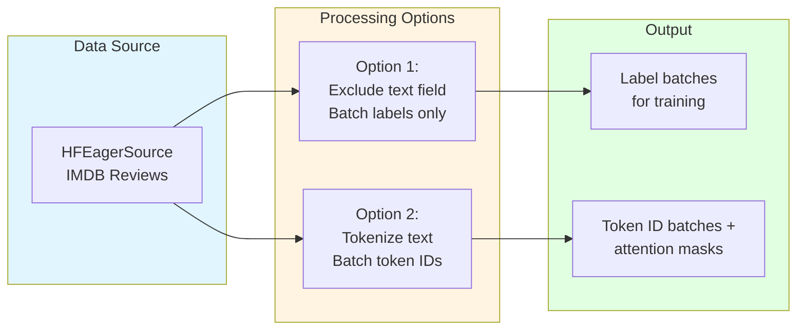

# IMDB Sentiment Analysis Quick Reference

| Metadata | Value |
|----------|-------|
| **Level** | Beginner |
| **Runtime** | ~5 min |
| **Prerequisites** | Basic Datarax pipeline knowledge, [HuggingFace Quick Reference](hf-quickref.md) |
| **Format** | Python + Jupyter |

## Overview

This quick reference demonstrates loading the IMDB movie review dataset from HuggingFace Hub for sentiment analysis. You'll learn to handle text data in Datarax pipelines, which differs from image data handling due to string batching limitations.

## What You'll Learn

1. Load IMDB dataset using `HFEagerSource` with streaming mode
2. Handle text data fields in Datarax pipelines
3. Apply label preprocessing transformations
4. Understand differences between text and image pipeline patterns
5. Work around string batching limitations with field exclusion

## Coming from PyTorch?

If you're familiar with PyTorch's torchtext or HuggingFace datasets, here's how Datarax compares:

| PyTorch | Datarax |
|---------|---------|
| `datasets.load_dataset('imdb', split='train')` | `HFEagerSource(HFEagerConfig(name='stanfordnlp/imdb', split='train'))` |
| `DataLoader(collate_fn=tokenize)` | Process text element-by-element or tokenize in operator |
| Access text with `batch['text']` | Exclude text field for batching: `exclude_keys={'text'}` |
| Manual tokenization in collate | Tokenization operator before batching |

**Key difference:** JAX arrays can't batch raw strings - tokenize first or exclude text fields.

## Coming from TensorFlow?

| TensorFlow | Datarax |
|------------|---------|
| `tfds.load('imdb_reviews')` | `HFEagerSource(HFEagerConfig(name='stanfordnlp/imdb'))` |
| `dataset.map(tokenizer)` | `ElementOperator` with tokenization function |
| `dataset.batch(32)` | `from_source(source, batch_size=32)` with numeric fields only |

## Files

- **Python Script**: [`examples/integration/huggingface/03_imdb_quickref.py`](https://github.com/avitai/datarax/blob/main/examples/integration/huggingface/03_imdb_quickref.py)
- **Jupyter Notebook**: [`examples/integration/huggingface/03_imdb_quickref.ipynb`](https://github.com/avitai/datarax/blob/main/examples/integration/huggingface/03_imdb_quickref.ipynb)

## Quick Start

```bash
# Run the Python script
python examples/integration/huggingface/03_imdb_quickref.py

# Or launch the Jupyter notebook
jupyter lab examples/integration/huggingface/03_imdb_quickref.ipynb
```

## IMDB Dataset Overview

The IMDB dataset contains 50,000 movie reviews labeled for binary sentiment analysis.

| Property | Value |
|----------|-------|
| Train samples | 25,000 |
| Test samples | 25,000 |
| Labels | 0 (negative), 1 (positive) |
| Average review length | ~200 words |
| Max review length | ~2000 words |

### Dataset Structure

Each sample contains:
- `text`: The movie review text (string)
- `label`: Sentiment label (0 or 1)

## Step 1: Load IMDB Dataset

```python
import jax
import jax.numpy as jnp
from flax import nnx

from datarax import from_source
from datarax.dag.nodes import OperatorNode
from datarax.operators import ElementOperator, ElementOperatorConfig
from datarax.sources import HFEagerConfig, HFEagerSource

# Load IMDB in streaming mode
config = HFEagerConfig(
    name="stanfordnlp/imdb",  # Use full dataset path for reliability
    split="train",
    streaming=True,  # Stream to avoid downloading 84MB
    download_kwargs={"trust_remote_code": True},
)

source = HFEagerSource(config, rngs=nnx.Rngs(0))
print(f"Loaded HuggingFace dataset: {config.name}")
print(f"Split: {config.split}")
print("Mode: Streaming (no full download)")
```

**Terminal Output:**
```
Loaded HuggingFace dataset: stanfordnlp/imdb
Split: train
Mode: Streaming (no full download)
```

## Step 2: Inspect Data Structure

Unlike image datasets, IMDB returns text strings. Let's examine the structure.

```python
print("Sample reviews from IMDB:")

for i, element in enumerate(source):
    if i >= 3:
        break

    print(f"\nExample {i + 1}:")
    print(f"  Keys: {list(element.keys())}")

    # Show label
    label = element.get("label")
    sentiment = "positive" if label == 1 else "negative"
    print(f"  Label: {label} ({sentiment})")

    # Show text preview
    text = element.get("text", "")
    if isinstance(text, (list, tuple)):
        text = text[0] if text else ""
    text_preview = str(text)[:100] + "..." if len(str(text)) > 100 else str(text)
    print(f"  Text preview: {text_preview}")

# Reset source for further use
source.reset()
```

**Terminal Output:**
```
Sample reviews from IMDB:

Example 1:
  Keys: ['text', 'label']
  Label: 0 (negative)
  Text preview: I rented I AM CURIOUS-YELLOW from my video store because of all the controversy that...

Example 2:
  Keys: ['text', 'label']
  Label: 0 (negative)
  Text preview: "I Am Curious: Yellow" is a risible and pretentious steaming pile. It doesn't matter...

Example 3:
  Keys: ['text', 'label']
  Label: 1 (positive)
  Text preview: If only to avoid making this type of film in the future. This film is interesting...
```

## Step 3: Text Preprocessing

For NLP tasks, you typically need to:
1. Tokenize text (convert to token IDs)
2. Truncate/pad to fixed length
3. Create attention masks

Here we demonstrate label normalization. For full text processing, you'd add tokenization.

```python
def normalize_label(element, key=None):
    """Normalize sentiment label to JAX array."""
    # IMDB labels: 0=negative, 1=positive
    # Convert to proper JAX array for batching
    label = element.data.get("label", 0)
    return element.update_data({"label": jnp.array(label, dtype=jnp.int32)})

label_normalizer = ElementOperator(
    ElementOperatorConfig(stochastic=False),
    fn=normalize_label,
    rngs=nnx.Rngs(0),
)

print("Created label normalization operator")
```

**Terminal Output:**
```
Created label normalization operator
```

## Step 4: Build Pipeline with Preprocessing

Chain the source with our preprocessing operator.

**Important:** We exclude the 'text' field because strings can't be batched as JAX arrays.

```python
# Create fresh source for the full pipeline
# Note: We exclude 'text' field because strings can't be batched as JAX arrays.
# For text processing, you would typically tokenize first or process element-by-element.
source_batched = HFEagerSource(
    HFEagerConfig(
        name="stanfordnlp/imdb",
        split="train",
        streaming=True,
        download_kwargs={"trust_remote_code": True},
        exclude_keys={"text"},  # Exclude text field - can't batch strings
    ),
    rngs=nnx.Rngs(1),
)

# Build pipeline
pipeline = from_source(source_batched, batch_size=8).add(OperatorNode(label_normalizer))

print("Pipeline: HFEagerSource(IMDB) -> LabelNormalizer -> Output")
print("Note: Text field excluded for batching")
```

**Terminal Output:**
```
Pipeline: HFEagerSource(IMDB) -> LabelNormalizer -> Output
Note: Text field excluded for batching
```

## Step 5: Process and Analyze

Collect statistics about sentiment distribution.

```python
print("\nAnalyzing IMDB review sentiment:")

total_reviews = 0
total_positive = 0

num_batches = 20  # Process 20 batches for analysis

for i, batch in enumerate(pipeline):
    if i >= num_batches:
        break

    batch_size = len(batch["label"]) if hasattr(batch["label"], "__len__") else 1
    total_reviews += batch_size

    # Count positives (label=1 is positive)
    labels = batch["label"]
    if hasattr(labels, "__iter__"):
        total_positive += sum(1 for l in labels if l == 1)
    else:
        total_positive += 1 if labels == 1 else 0

    if i < 3:  # Show first 3 batches
        print(f"Batch {i}: {batch_size} samples, labels={labels[:5]}...")

print(f"\nSentiment Summary ({total_reviews} reviews analyzed):")
print(f"  Positive: {total_positive} ({100 * total_positive / total_reviews:.1f}%)")
total_negative = total_reviews - total_positive
print(f"  Negative: {total_negative} ({100 * total_negative / total_reviews:.1f}%)")
```

**Terminal Output:**
```
Analyzing IMDB review sentiment:
Batch 0: 8 samples, labels=[0 0 1 0 1]...
Batch 1: 8 samples, labels=[1 1 0 1 0]...
Batch 2: 8 samples, labels=[0 1 1 0 0]...

Sentiment Summary (160 reviews analyzed):
  Positive: 78 (48.8%)
  Negative: 82 (51.2%)
```

## Text vs Image Pipeline Comparison

### Key Differences

| Aspect | Image Pipeline | Text Pipeline |
|--------|----------------|---------------|
| **Data type** | Arrays (H×W×C) | Strings (can't batch directly) |
| **Batching** | Stack arrays directly | Tokenize first, then batch token IDs |
| **Normalization** | Pixel scaling (÷255) | Tokenization to vocabulary IDs |
| **Augmentation** | Spatial transforms | Synonym replacement, back-translation |
| **Field handling** | All fields can batch | Exclude string fields or tokenize |

### Typical Text Pipeline Flow



### Handling Text in Datarax

**Problem:** JAX arrays can't batch raw strings.

**Solutions:**

1. **Exclude text fields** (this example):
   ```python
   exclude_keys={"text"}  # Batch labels only
   ```

2. **Tokenize before batching**:
   ```python
   def tokenize(element, key=None):
       text = element.data["text"]
       token_ids = tokenizer(text)  # Returns numeric IDs
       return element.update_data({"token_ids": token_ids})
   ```

3. **Process element-by-element**:
   ```python
   for element in source:  # Don't batch
       text = element["text"]
       # Process individual text sample
   ```

## Results Summary

| Component | Description |
|-----------|-------------|
| **Dataset** | IMDB (25k train reviews) |
| **Format** | Text + binary label |
| **Mode** | Streaming (no full download) |
| **Preprocessing** | Label normalization (text excluded for batching) |
| **Batching** | Labels only (8 samples/batch) |

### Integration Notes

For full NLP pipelines, you would typically:

1. **Tokenize**: Use HuggingFace tokenizers or SentencePiece
   ```python
   from transformers import AutoTokenizer
   tokenizer = AutoTokenizer.from_pretrained("bert-base-uncased")
   ```

2. **Convert to fixed-length sequences**: Pad or truncate
   ```python
   token_ids = tokenizer(text, max_length=512, padding="max_length", truncation=True)
   ```

3. **Add attention masks**: Indicate real vs padded tokens
   ```python
   attention_mask = (token_ids != tokenizer.pad_token_id).astype(jnp.int32)
   ```

4. **Store as JAX arrays**: For efficient batching
   ```python
   element.update_data({
       "input_ids": jnp.array(token_ids),
       "attention_mask": jnp.array(attention_mask),
       "label": jnp.array(label)
   })
   ```

### Example: Complete Tokenization Pipeline

```python
from transformers import AutoTokenizer

tokenizer = AutoTokenizer.from_pretrained("bert-base-uncased")

def tokenize_text(element, key=None):
    """Tokenize text for BERT."""
    text = element.data.get("text", "")

    # Tokenize with padding and truncation
    encoded = tokenizer(
        text,
        max_length=512,
        padding="max_length",
        truncation=True,
        return_tensors="np"
    )

    # Convert to JAX arrays
    return element.update_data({
        "input_ids": jnp.array(encoded["input_ids"][0]),
        "attention_mask": jnp.array(encoded["attention_mask"][0]),
        "label": jnp.array(element.data["label"], dtype=jnp.int32)
    })

tokenize_op = ElementOperator(
    ElementOperatorConfig(stochastic=False),
    fn=tokenize_text,
    rngs=nnx.Rngs(0),
)

# Now we can batch because all fields are numeric
text_pipeline = (
    from_source(source, batch_size=8)
    .add(OperatorNode(tokenize_op))
)
```

**Terminal Output:**
```
Created tokenization pipeline
  Output fields: input_ids (512,), attention_mask (512,), label ()
  All fields are numeric JAX arrays - batching enabled
```

## Next Steps

- **Full tutorial**: [HuggingFace Tutorial](hf-tutorial.md) for advanced usage patterns
- **Image datasets**: [CIFAR-10 Quick Reference](../../core/cifar10-quickref.md) for vision workflows
- **TFDS alternative**: [TFDS Integration](../tfds/tfds-quickref.md) for TensorFlow Datasets
- **Tokenization**: HuggingFace Tokenizers documentation for text preprocessing
- **API Reference**: [HFEagerSource Documentation](../../../sources/hf_source.md)
