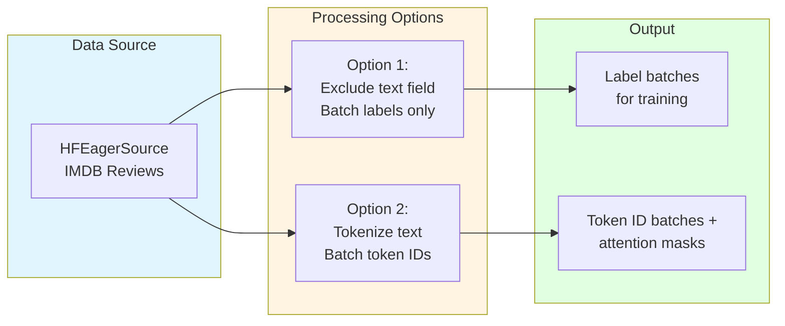

# IMDB Sentiment Analysis Quick Reference

| Metadata | Value |
|----------|-------|
| **Level** | Beginner |
| **Runtime** | ~5 min |
| **Prerequisites** | Basic Datarax pipeline knowledge, [HuggingFace Quick Reference](hf-quickref.md) |
| **Format** | Python + Jupyter |

## Overview

This quick reference demonstrates loading the IMDB movie review dataset from HuggingFace Hub for sentiment analysis. You'll learn to handle text data in Datarax pipelines, which differs from image data handling due to string batching limitations.

## What You'll Learn

1. Load IMDB dataset using `HFEagerSource` in eager mode
2. Handle text data fields in Datarax pipelines
3. Apply label preprocessing transformations
4. Understand differences between text and image pipeline patterns
5. Work around string batching limitations with field exclusion

## Coming from PyTorch?

If you're familiar with PyTorch's torchtext or HuggingFace datasets, here's how Datarax compares:

| PyTorch | Datarax |
|---------|---------|
| `datasets.load_dataset('imdb', split='train')` | `HFEagerSource(HFEagerConfig(name='stanfordnlp/imdb', split='train'))` |
| `DataLoader(collate_fn=tokenize)` | Process text element-by-element or tokenize in operator |
| Access text with `batch['text']` | Exclude text field for batching: `exclude_keys={'text'}` |
| Manual tokenization in collate | Tokenization operator before batching |

**Key difference:** JAX arrays can't batch raw strings - tokenize first or exclude text fields.

## Coming from TensorFlow?

| TensorFlow | Datarax |
|------------|---------|
| `tfds.load('imdb_reviews')` | `HFEagerSource(HFEagerConfig(name='stanfordnlp/imdb'))` |
| `dataset.map(tokenizer)` | `ElementOperator` with tokenization function |
| `dataset.batch(32)` | `Pipeline(source=source, stages=[], batch_size=32, rngs=nnx.Rngs(0))` with numeric fields only |

## Files

- **Python Script**: [`examples/integration/huggingface/03_imdb_quickref.py`](https://github.com/avitai/datarax/blob/main/examples/integration/huggingface/03_imdb_quickref.py)
- **Jupyter Notebook**: [`examples/integration/huggingface/03_imdb_quickref.ipynb`](https://github.com/avitai/datarax/blob/main/examples/integration/huggingface/03_imdb_quickref.ipynb)

## Quick Start

```bash
# Run the Python script
python examples/integration/huggingface/03_imdb_quickref.py

# Or launch the Jupyter notebook
jupyter lab examples/integration/huggingface/03_imdb_quickref.ipynb
```

## IMDB Dataset Overview

The IMDB dataset contains 50,000 movie reviews labeled for binary sentiment analysis.

| Property | Value |
|----------|-------|
| Train samples | 25,000 |
| Test samples | 25,000 |
| Labels | 0 (negative), 1 (positive) |
| Average review length | ~200 words |
| Max review length | ~2000 words |

### Dataset Structure

Each sample contains:
- `text`: The movie review text (string)
- `label`: Sentiment label (0 or 1)

## Step 1: Load IMDB Dataset

```python
# Imports
import jax
import jax.numpy as jnp
import numpy as np
from flax import nnx

from datarax.core.index_words import to_words
from datarax.operators import ElementOperator, ElementOperatorConfig
from datarax.pipeline import Pipeline
from datarax.sources import HFEagerConfig, HFEagerSource


print(f"JAX devices: {jax.devices()}")
```

**Terminal Output:**
```
JAX devices: [CudaDevice(id=0)]
```

```python
# Load IMDB eagerly: numeric columns on the host, text as each record's provenance
config = HFEagerConfig(
    name="stanfordnlp/imdb",  # Use full dataset path for reliability
    split="train",
)

source = HFEagerSource(config)
print(f"Loaded HuggingFace dataset: {config.name}")
print(f"Split: {config.split}")
print("Mode: Eager load with local HuggingFace cache")
```

**Terminal Output:**
```
Loaded HuggingFace dataset: stanfordnlp/imdb
Split: train
Mode: Eager load with local HuggingFace cache
```

## Step 2: Inspect Data Structure

Unlike image datasets, IMDB returns text strings. The eager source keeps each review's text
as the record's provenance, beside its numeric columns, and never batches it. A batch names its
records by their indices, and `source.provenance(indices)` reads those records' text back.

```python
# Strings can't be batched as JAX arrays (text needs tokenization first): read the first
# three records' labels as a batch and their reviews by the same indices
print("Sample reviews from IMDB:")
first = to_words(np.arange(3, dtype=np.uint64))
labels = source.get_batch(first)["label"]

for i, (label, record) in enumerate(zip(labels, source.provenance(first), strict=True)):
    print(f"\nExample {i + 1}:")
    print(f"  Provenance keys: {list(record.keys())}")

    # Show label
    sentiment = "positive" if label == 1 else "negative"
    print(f"  Label: {int(label)} ({sentiment})")

    # Show text preview
    text = str(record["text"])
    text_preview = text[:100] + "..." if len(text) > 100 else text
    print(f"  Text preview: {text_preview}")

# Expected output:
# Example 1:
#   Provenance keys: ['text']
#   Label: 0 (negative)
#   Text preview: I rented I AM CURIOUS-YELLOW from my video store because of...
```

**Terminal Output:**
```
Sample reviews from IMDB:

Example 1:
  Provenance keys: ['text']
  Label: 0 (negative)
  Text preview: I rented I AM CURIOUS-YELLOW from my video store because of all the controversy that surrounded it w...

Example 2:
  Provenance keys: ['text']
  Label: 0 (negative)
  Text preview: "I Am Curious: Yellow" is a risible and pretentious steaming pile. It doesn't matter what one's poli...

Example 3:
  Provenance keys: ['text']
  Label: 0 (negative)
  Text preview: If only to avoid making this type of film in the future. This film is interesting as an experiment b...
```

## Step 3: Text Preprocessing

For NLP tasks, you typically need to:
1. Tokenize text (convert to token IDs)
2. Truncate/pad to fixed length
3. Create attention masks

Here we demonstrate label normalization. For full text processing, you'd add tokenization.

```python
def normalize_label(element, key=None):  # noqa: ARG001
    """Normalize sentiment label to JAX array."""
    del key  # Unused - deterministic operator

    # IMDB labels: 0=negative, 1=positive
    # Convert to proper JAX array for batching
    label = element.data.get("label", 0)
    return element.update_data({"label": jnp.array(label, dtype=jnp.int32)})


text_stats_op = ElementOperator(
    ElementOperatorConfig(stochastic=False),
    fn=normalize_label,
    rngs=nnx.Rngs(0),
)

print("Created label normalization operator")
```

**Terminal Output:**
```
Created label normalization operator
```

## Step 4: Build Pipeline with Preprocessing

Chain the source with our preprocessing operator.

**Important:** We exclude the 'text' field because strings can't be batched as JAX arrays.
The pipeline also shuffles the split, which stores its negative reviews first.

```python
# Create fresh source for the full pipeline
# Note: We exclude 'text' field because strings can't be batched as JAX arrays.
# For text processing, you would typically tokenize first or process element-by-element.
source2 = HFEagerSource(
    HFEagerConfig(
        name="stanfordnlp/imdb",
        split="train",
        exclude_keys={"text"},  # Exclude text field - can't batch strings
    ),
)

# Build pipeline; the split starts with negative reviews, so shuffle for a mixed sample
pipeline = Pipeline(
    source=source2, stages=[text_stats_op], batch_size=8, rngs=nnx.Rngs(0), shuffle=True
)

print("Pipeline: HFEagerSource(IMDB) -> TextStats -> Output")
```

**Terminal Output:**
```
Pipeline: HFEagerSource(IMDB) -> TextStats -> Output
```

## Step 5: Process and Analyze

Collect statistics about sentiment distribution.

```python
# Process batches and collect sentiment statistics
print("\nAnalyzing IMDB review sentiment:")

total_reviews = 0
total_positive = 0

num_batches = 20  # Process 20 batches for analysis

for i, batch in enumerate(pipeline):
    if i >= num_batches:
        break

    data = batch.data

    batch_size = len(data["label"]) if hasattr(data["label"], "__len__") else 1
    total_reviews += batch_size

    # Count positives (label=1 is positive)
    labels = data["label"]
    if hasattr(labels, "__iter__"):
        total_positive += sum(1 for l in labels if l == 1)
    else:
        total_positive += 1 if labels == 1 else 0

    if i < 3:  # Show first 3 batches
        label_preview = labels[:5] if hasattr(labels, "__getitem__") else labels  # type: ignore[reportIndexIssue]
        print(f"Batch {i}: {batch_size} samples, labels={label_preview}...")

print(f"\nSentiment Summary ({total_reviews} reviews analyzed):")
print(f"  Positive: {total_positive} ({100 * total_positive / total_reviews:.1f}%)")
total_negative = total_reviews - total_positive
print(f"  Negative: {total_negative} ({100 * total_negative / total_reviews:.1f}%)")

# Expected output:
# Sentiment Summary (160 reviews analyzed):
#   Positive: ~50%
#   Negative: ~50%
```

**Terminal Output:**
```

Analyzing IMDB review sentiment:
Batch 0: 8 samples, labels=[0 1 0 0 0]...
Batch 1: 8 samples, labels=[0 0 0 0 0]...
Batch 2: 8 samples, labels=[1 0 0 0 1]...

Sentiment Summary (160 reviews analyzed):
  Positive: 72 (45.0%)
  Negative: 88 (55.0%)
```

The `stanfordnlp/imdb` train split starts with negative reviews (the three inspected in
Step 2 are all negative). The pipeline is built with `shuffle=True`, so the 160
reviews analyzed mix both sentiments.

## Text vs Image Pipeline Comparison

### Key Differences

| Aspect | Image Pipeline | Text Pipeline |
|--------|----------------|---------------|
| **Data type** | Arrays (H×W×C) | Strings (can't batch directly) |
| **Batching** | Stack arrays directly | Tokenize first, then batch token IDs |
| **Normalization** | Pixel scaling (÷255) | Tokenization to vocabulary IDs |
| **Augmentation** | Spatial transforms | Synonym replacement, back-translation |
| **Field handling** | All fields can batch | Exclude string fields or tokenize |

### Typical Text Pipeline Flow


```mermaid
flowchart LR
    subgraph Source["Data Source"]
        HF[HFEagerSource<br/>IMDB Reviews]
    end

    subgraph Process["Processing Options"]
        Path1[Option 1:<br/>Exclude text field<br/>Batch labels only]
        Path2[Option 2:<br/>Tokenize text<br/>Batch token IDs]
    end

    subgraph Output["Output"]
        O1[Label batches<br/>for training]
        O2[Token ID batches +<br/>attention masks]
    end

    HF --> Path1 --> O1
    HF --> Path2 --> O2

    style Source fill:#e1f5ff
    style Process fill:#fff4e1
    style Output fill:#e1ffe1
```

### Handling Text in Datarax

**Problem:** JAX arrays can't batch raw strings.

**Solutions:**

1. **Exclude text fields** (this example):
   ```python
   exclude_keys={"text"}  # Batch labels only
   ```

2. **Tokenize before batching**:
   ```python
   def tokenize(element, key=None):
       text = element.data["text"]
       token_ids = tokenizer(text)  # Returns numeric IDs
       return element.update_data({"token_ids": token_ids})
   ```

3. **Process element-by-element**:
   ```python
   for element in source:  # Don't batch
       text = element["text"]
       # Process individual text sample
   ```

## Results Summary

| Component | Description |
|-----------|-------------|
| **Dataset** | IMDB (25k train reviews) |
| **Format** | Text + binary label |
| **Mode** | Eager load with local HuggingFace cache |
| **Preprocessing** | Label normalization (text excluded for batching) |
| **Batching** | Labels only (8 samples/batch) |

### Integration Notes

For full NLP pipelines, you would typically:

1. **Tokenize**: Use HuggingFace tokenizers or SentencePiece
   ```python
   from transformers import AutoTokenizer
   tokenizer = AutoTokenizer.from_pretrained("bert-base-uncased")
   ```

2. **Convert to fixed-length sequences**: Pad or truncate
   ```python
   token_ids = tokenizer(text, max_length=512, padding="max_length", truncation=True)
   ```

3. **Add attention masks**: Indicate real vs padded tokens
   ```python
   attention_mask = (token_ids != tokenizer.pad_token_id).astype(jnp.int32)
   ```

4. **Store as JAX arrays**: For efficient batching
   ```python
   element.update_data({
       "input_ids": jnp.array(token_ids),
       "attention_mask": jnp.array(attention_mask),
       "label": jnp.array(label)
   })
   ```

### Example: Complete Tokenization Pipeline

> **Note:** The following is an illustrative pattern, not run by the example
> script. It shows how you would wire a real tokenizer into the pipeline.

```python
from transformers import AutoTokenizer

tokenizer = AutoTokenizer.from_pretrained("bert-base-uncased")

def tokenize_text(element, key=None):
    """Tokenize text for BERT."""
    text = element.data.get("text", "")

    # Tokenize with padding and truncation
    encoded = tokenizer(
        text,
        max_length=512,
        padding="max_length",
        truncation=True,
        return_tensors="np"
    )

    # Convert to JAX arrays
    return element.update_data({
        "input_ids": jnp.array(encoded["input_ids"][0]),
        "attention_mask": jnp.array(encoded["attention_mask"][0]),
        "label": jnp.array(element.data["label"], dtype=jnp.int32)
    })

tokenize_op = ElementOperator(
    ElementOperatorConfig(stochastic=False),
    fn=tokenize_text,
    rngs=nnx.Rngs(0),
)

# Now we can batch because all fields are numeric
text_pipeline = (
    Pipeline(source=source, stages=[tokenize_op], batch_size=8, rngs=nnx.Rngs(0))
)
```

With every field reduced to numeric JAX arrays (`input_ids`, `attention_mask`,
`label`), the pipeline can batch text the same way it batches images.

## Next Steps

- **Full tutorial**: [HuggingFace Tutorial](hf-tutorial.md) for advanced usage patterns
- **Image datasets**: [CIFAR-10 Quick Reference](../../core/cifar10-quickref.md) for vision workflows
- **TFDS alternative**: [TFDS Integration](../tfds/tfds-quickref.md) for TensorFlow Datasets
- **Tokenization**: HuggingFace Tokenizers documentation for text preprocessing
- **API Reference**: [HFEagerSource Documentation](../../../sources/hf_source.md)
