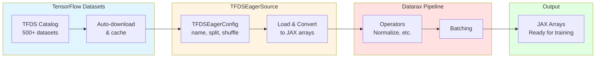

# TFDS Integration Quick Reference

| Metadata | Value |
|----------|-------|
| **Level** | Beginner |
| **Runtime** | ~5 min |
| **Prerequisites** | Basic Python, NumPy fundamentals |
| **Format** | Python + Jupyter |

## Overview

This quick reference demonstrates loading datasets from TensorFlow Datasets (TFDS) using Datarax's `TFDSEagerSource`. You'll load MNIST, apply transformations, and iterate through batched data using the standard Datarax pipeline API.

## What You'll Learn

1. Configure and create a `TFDSEagerSource` with proper configuration
2. Apply transformations to TFDS data using operators
3. Build a batched pipeline with preprocessing
4. Iterate through transformed data efficiently
5. Integrate TFDS datasets into JAX workflows

## Coming from PyTorch?

If you're familiar with PyTorch's torchvision datasets, here's how Datarax + TFDS compares:

| PyTorch | Datarax |
|---------|---------|
| `torchvision.datasets.MNIST(train=True)` | `TFDSEagerSource(TFDSEagerConfig(name="mnist", split="train"))` |
| `DataLoader(dataset, shuffle=True)` | `TFDSEagerSource` with `shuffle=True` in config |
| `transforms.ToTensor()` | JAX arrays by default (no conversion needed) |
| `transforms.Normalize(mean, std)` | Custom operator with JAX operations |

**Key difference:** TFDS provides automatic downloads and caching, while Datarax handles JAX array conversion.

## Coming from TensorFlow?

| TensorFlow tf.data | Datarax |
|--------------------|---------|
| `tfds.load('mnist', split='train')` | `TFDSEagerSource(TFDSEagerConfig(name='mnist', split='train'))` |
| `dataset.map(normalize).batch(32)` | `from_source(source, batch_size=32).add(OperatorNode(normalizer))` |
| `dataset.shuffle(buffer_size=1000)` | `shuffle=True` in config |
| TensorFlow tensors | JAX arrays |

**Key difference:** Datarax uses JAX instead of TensorFlow for computation.

## Files

- **Python Script**: [`examples/integration/tfds/01_tfds_quickref.py`](https://github.com/avitai/datarax/blob/main/examples/integration/tfds/01_tfds_quickref.py)
- **Jupyter Notebook**: [`examples/integration/tfds/01_tfds_quickref.ipynb`](https://github.com/avitai/datarax/blob/main/examples/integration/tfds/01_tfds_quickref.ipynb)

## Quick Start

```bash
# Run the Python script
python examples/integration/tfds/01_tfds_quickref.py

# Or launch the Jupyter notebook
jupyter lab examples/integration/tfds/01_tfds_quickref.ipynb
```

## Setup

### GPU Memory Configuration

IMPORTANT: Configure TensorFlow to not use GPU (JAX handles GPU computation).

```python
# GPU Memory Configuration
# This MUST be set BEFORE importing tensorflow
import os

os.environ["CUDA_VISIBLE_DEVICES_FOR_TF"] = ""  # TF-specific GPU disable
os.environ["TF_CPP_MIN_LOG_LEVEL"] = "3"  # Suppress all TF logs

# Force TF to CPU-only mode BEFORE importing JAX
import tensorflow as tf
tf.config.set_visible_devices([], "GPU")

# Now import JAX which will handle GPU
import jax.numpy as jnp
from flax import nnx

# Import Datarax TFDS source
try:
    from datarax.sources import TFDSEagerConfig, TFDSEagerSource
except ImportError as e:
    raise ImportError(
        "This example requires TensorFlow Datasets. Install with: uv pip install datarax[tfds]"
    ) from e

from datarax import from_source
from datarax.dag.nodes import OperatorNode
from datarax.operators import ElementOperator, ElementOperatorConfig
```

**Terminal Output:**
```
TensorFlow configured for CPU-only mode
JAX will use GPU for computation
```

## Step 1: Create TFDS Data Source

`TFDSEagerSource` wraps TensorFlow Datasets for use in Datarax pipelines.

> **Note:** You can also use the factory function `from_tfds(name, split, ...)` which auto-selects between eager and streaming modes.

### Configuration Options

| Parameter | Description | Default | Example |
|-----------|-------------|---------|---------|
| `name` | TFDS dataset name | Required | `"mnist"`, `"cifar10"` |
| `split` | Dataset split | Required | `"train"`, `"test[:500]"` |
| `shuffle` | Enable shuffling | `False` | `True` for training |
| `stochastic` | Use RNG for shuffle | `False` | `True` when shuffling |
| `stream_name` | Named RNG stream | `"default"` | `"shuffle"` |

### Basic Example

```python
# Configure TFDS source for MNIST
config = TFDSEagerConfig(
    name="mnist",
    split="train[:500]",  # Use subset for quick demo
    shuffle=True,
    seed=42,
)

source = TFDSEagerSource(config, rngs=nnx.Rngs(42))

print("Dataset: MNIST")
print(f"Samples: {len(source)}")
print(f"Shuffle: {config.shuffle}")
```

**Terminal Output:**
```
Dataset: MNIST
Samples: 500
Shuffle: True
```

## Step 2: Define Transformations

Create operators to preprocess the data. TFDS data comes as raw uint8 images which need normalization for training.

```python
def normalize_image(element, key=None):
    """Normalize image to [0, 1] range."""
    image = element.data["image"]
    normalized = image.astype(jnp.float32) / 255.0
    return element.update_data({"image": normalized})

normalizer = ElementOperator(
    ElementOperatorConfig(stochastic=False),
    fn=normalize_image,
    rngs=nnx.Rngs(0),
)

print("Created normalizer operator")
print("  Input: uint8 [0-255]")
print("  Output: float32 [0-1]")
```

**Terminal Output:**
```
Created normalizer operator
  Input: uint8 [0-255]
  Output: float32 [0-1]
```

## Step 3: Build Pipeline

Chain source and operators using the DAG-based `from_source()` API.

```python
# Build the pipeline
pipeline = from_source(source, batch_size=32).add(OperatorNode(normalizer))

print("Pipeline: TFDSEagerSource(MNIST) -> Normalize -> Output")
print("Batch size: 32")
```

**Terminal Output:**
```
Pipeline: TFDSEagerSource(MNIST) -> Normalize -> Output
Batch size: 32
```

## Step 4: Iterate Through Data

Process batches and inspect the transformed data.

```python
print("\nProcessing batches:")
for i, batch in enumerate(pipeline):
    if i >= 3:  # Show first 3 batches
        break

    image_batch = batch["image"]
    label_batch = batch["label"]

    print(f"Batch {i}:")
    print(f"  Image: shape={image_batch.shape}, dtype={image_batch.dtype}")
    print(f"  Image range: [{float(image_batch.min()):.3f}, {float(image_batch.max()):.3f}]")
    print(f"  Label: shape={label_batch.shape}, dtype={label_batch.dtype}")
    print(f"  Sample labels: {label_batch[:5]}")
```

**Terminal Output:**
```
Processing batches:
Batch 0:
  Image: shape=(32, 28, 28, 1), dtype=float32
  Image range: [0.000, 1.000]
  Label: shape=(32,), dtype=int64
  Sample labels: [5 0 4 1 9]
Batch 1:
  Image: shape=(32, 28, 28, 1), dtype=float32
  Image range: [0.000, 1.000]
  Label: shape=(32,), dtype=int64
  Sample labels: [2 1 3 1 4]
Batch 2:
  Image: shape=(32, 28, 28, 1), dtype=float32
  Image range: [0.000, 1.000]
  Label: shape=(32,), dtype=int64
  Sample labels: [3 5 3 6 1]
```

## Architecture Diagram



## Available TFDS Datasets

TFDS provides access to 500+ datasets across multiple domains:

### Computer Vision

| Dataset | Samples | Image Size | Classes |
|---------|---------|------------|---------|
| `mnist` | 70k | 28×28×1 | 10 |
| `fashion_mnist` | 70k | 28×28×1 | 10 |
| `cifar10` | 60k | 32×32×3 | 10 |
| `cifar100` | 60k | 32×32×3 | 100 |
| `imagenet2012` | 1.3M | 224×224×3 | 1000 |

### Natural Language Processing

| Dataset | Type | Samples |
|---------|------|---------|
| `imdb_reviews` | Sentiment | 50k |
| `glue/sst2` | Sentiment | 67k |
| `squad` | QA | 100k |

### Audio

| Dataset | Type | Hours |
|---------|------|-------|
| `librispeech` | Speech | 1000 |
| `common_voice` | Speech | Variable |

### Discover More

```python
# List all available datasets
import tensorflow_datasets as tfds

builders = tfds.list_builders()
print(f"Total TFDS datasets: {len(builders)}")
print(f"Example datasets: {builders[:10]}")
```

**Terminal Output:**
```
Total TFDS datasets: 537
Example datasets: ['abstract_reasoning', 'accentdb', 'aeslc', 'ag_news_subset', 'ai2_arc', 'amazon_us_reviews', 'anli', 'arc', 'bair_robot_pushing_small', 'beans']
```

## Results Summary

| Component | Description |
|-----------|-------------|
| **Data Source** | TFDS MNIST (500 samples) |
| **Batch Size** | 32 samples per batch |
| **Transforms** | Image normalization [0, 255] → [0, 1] |
| **Output** | Normalized float32 JAX arrays |

### Pipeline Flow

```
TFDSEagerSource → Normalize → Batch → JAX Arrays
```

The pipeline integrates TFDS datasets into the Datarax ecosystem, enabling the use of all standard operators and augmentations with JAX-based computation.

### Key Benefits

1. **Auto-download**: TFDS handles dataset downloads and caching
2. **Standardization**: Consistent API across 500+ datasets
3. **JAX Integration**: Automatic conversion to JAX arrays
4. **Versioning**: Dataset versions for reproducibility
5. **Metadata**: Rich dataset information and statistics

## Common Patterns

### Pattern 1: Training Pipeline

```python
# Full training set with shuffling
train_config = TFDSEagerConfig(
    name="mnist",
    split="train",
    shuffle=True,
    seed=42,
)

train_source = TFDSEagerSource(train_config, rngs=nnx.Rngs(42))
train_pipeline = from_source(train_source, batch_size=128).add(OperatorNode(normalizer))
```

### Pattern 2: Evaluation Pipeline

```python
# Test set without shuffling
test_config = TFDSEagerConfig(
    name="mnist",
    split="test",
    shuffle=False,
)

test_source = TFDSEagerSource(test_config, rngs=nnx.Rngs(0))
test_pipeline = from_source(test_source, batch_size=128).add(OperatorNode(normalizer))
```

### Pattern 3: Development/Debug

```python
# Small subset for fast iteration
dev_config = TFDSEagerConfig(
    name="mnist",
    split="train[:100]",
    shuffle=False,
)

dev_source = TFDSEagerSource(dev_config, rngs=nnx.Rngs(0))
dev_pipeline = from_source(dev_source, batch_size=32).add(OperatorNode(normalizer))
```

## Split Syntax

TFDS supports flexible split syntax:

```python
print("Split syntax examples:")
print("  'train' - Full training set")
print("  'test' - Full test set")
print("  'train[:1000]' - First 1000 training samples")
print("  'train[1000:2000]' - Samples 1000-2000")
print("  'train[:10%]' - First 10% of training data")
print("  'train[80%:]' - Last 20% of training data")
print("  'train+test' - Combined train and test splits")
```

**Terminal Output:**
```
Split syntax examples:
  'train' - Full training set
  'test' - Full test set
  'train[:1000]' - First 1000 training samples
  'train[1000:2000]' - Samples 1000-2000
  'train[:10%]' - First 10% of training data
  'train[80%:]' - Last 20% of training data
  'train+test' - Combined train and test splits
```

## Best Practices

### 1. GPU Configuration

Always configure TensorFlow to use CPU only when using JAX for computation:

```python
import os
os.environ["CUDA_VISIBLE_DEVICES_FOR_TF"] = ""

import tensorflow as tf
tf.config.set_visible_devices([], "GPU")
```

### 2. Reproducibility

Use named RNG streams for reproducible shuffling:

```python
config = TFDSEagerConfig(
    name="mnist",
    split="train",
    shuffle=True,
    seed=42,
)

source = TFDSEagerSource(config, rngs=nnx.Rngs(42))
```

### 3. Memory Efficiency

Use split syntax to load subsets during development:

```python
# Development: Small subset
dev_config = TFDSEagerConfig(name="imagenet2012", split="train[:1000]")

# Production: Full dataset
prod_config = TFDSEagerConfig(name="imagenet2012", split="train")
```

### 4. Dataset Information

Check dataset info before loading:

```python
import tensorflow_datasets as tfds

builder = tfds.builder("mnist")
print(builder.info.description)
print(builder.info.features)
print(builder.info.splits)
```

## Next Steps

- **More datasets**: Try `cifar10`, `imagenet2012`, or other TFDS datasets
- **Augmentations**: Add image operators from [Operators Tutorial](../../core/operators-tutorial.md)
- **HuggingFace alternative**: [HuggingFace Integration](../huggingface/hf-quickref.md) for Hub datasets
- **Distributed training**: [Sharding Guide](../../advanced/distributed/sharding-quickref.md) for multi-device training
- **API Reference**: [TFDSEagerSource Documentation](../../../sources/tfds_source.md)
- **TFDS Catalog**: Browse datasets at [https://www.tensorflow.org/datasets/catalog](https://www.tensorflow.org/datasets/catalog)
