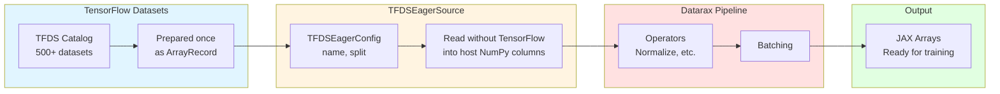

# TFDS Integration Quick Reference

| Metadata | Value |
|----------|-------|
| **Level** | Beginner |
| **Runtime** | ~5 min |
| **Prerequisites** | Basic Python, NumPy fundamentals |
| **Format** | Python + Jupyter |

## Overview

This quick reference demonstrates loading datasets from TensorFlow Datasets (TFDS) using Datarax's `TFDSEagerSource`. You'll load MNIST, apply transformations, and iterate through batched data using the standard Datarax pipeline API.

## What You'll Learn

1. Configure and create a `TFDSEagerSource` with proper configuration
2. Apply transformations to TFDS data using operators
3. Build a batched pipeline with preprocessing
4. Iterate through transformed data efficiently
5. Integrate TFDS datasets into JAX workflows

## Coming from PyTorch?

If you're familiar with PyTorch's torchvision datasets, here's how Datarax + TFDS compares:

| PyTorch | Datarax |
|---------|---------|
| `torchvision.datasets.MNIST(train=True)` | `TFDSEagerSource(TFDSEagerConfig(name="mnist", split="train"))` |
| `DataLoader(dataset, shuffle=True)` | `Pipeline(source=TFDSEagerSource(...), ..., shuffle=True)` |
| `transforms.ToTensor()` | JAX arrays by default (no conversion needed) |
| `transforms.Normalize(mean, std)` | Custom operator with JAX operations |

**Key difference:** TFDS prepares a dataset once (downloads it and writes it as ArrayRecord), while Datarax reads the prepared copy into host NumPy columns without TensorFlow.

## Coming from TensorFlow?

| TensorFlow tf.data | Datarax |
|--------------------|---------|
| `tfds.load('mnist', split='train')` | `TFDSEagerSource(TFDSEagerConfig(name='mnist', split='train'))` |
| `dataset.map(normalize).batch(32)` | `Pipeline(source=source, stages=[normalizer], batch_size=32, rngs=nnx.Rngs(0))` |
| `dataset.shuffle(buffer_size=1000)` | `shuffle=True` in config |
| TensorFlow tensors | JAX arrays |

**Key difference:** Datarax uses JAX instead of TensorFlow for computation.

## Files

- **Python Script**: [`examples/integration/tfds/01_tfds_quickref.py`](https://github.com/avitai/datarax/blob/main/examples/integration/tfds/01_tfds_quickref.py)
- **Jupyter Notebook**: [`examples/integration/tfds/01_tfds_quickref.ipynb`](https://github.com/avitai/datarax/blob/main/examples/integration/tfds/01_tfds_quickref.ipynb)

## Quick Start

```bash
# Prepare the example datasets once as ArrayRecord (in its own process: it imports
# TensorFlow; the example reads them without it)
python scripts/prepare_example_datasets.py

# Run the Python script
python examples/integration/tfds/01_tfds_quickref.py

# Or launch the Jupyter notebook
jupyter lab examples/integration/tfds/01_tfds_quickref.ipynb
```

## Setup

### Imports

Datarax reads the prepared dataset without TensorFlow, so the process needs no TensorFlow device setup:

```python
import jax.numpy as jnp
from flax import nnx


# Conditionally import TFDS source
try:
    from datarax.sources import TFDSEagerConfig, TFDSEagerSource
except ImportError as e:
    raise ImportError(
        "This example requires TensorFlow Datasets. Install with: uv pip install datarax[data]"
    ) from e

from datarax.operators import ElementOperator, ElementOperatorConfig
from datarax.pipeline import Pipeline
```

## Step 1: Create TFDS Data Source

`TFDSEagerSource` reads a prepared TFDS split into host columns for Datarax pipelines.

> **Note:** The factory `from_tfds(name, split, ...)` picks the source by the format the copy is prepared in: `TFDSEagerSource` for ArrayRecord (or, with `in_memory=False`, an `ArrayRecordSourceModule` reading per batch), `TFDSStreamingSource` for TFRecord.

### Configuration Options

| Parameter | Description | Default | Example |
|-----------|-------------|---------|---------|
| `name` | TFDS dataset name | Required | `"mnist"`, `"cifar10"` |
| `split` | Dataset split | Required | `"train"`, `"test[:500]"` |
| `include_keys` / `exclude_keys` | Fields to keep or drop | `None` | `{"id"}` |

The order records are served in belongs to the pipeline: `Pipeline(..., shuffle=True)` serves
each epoch in a new order, reproducibly from the pipeline's `rngs`.

### Basic Example

```python
# Configure TFDS source for MNIST
config = TFDSEagerConfig(
    name="mnist",
    split="train[:500]",  # Use subset for quick demo
)

source = TFDSEagerSource(config)

print("Dataset: MNIST")
print(f"Samples: {len(source)}")
```

**Terminal Output:**
```
Dataset: MNIST
Samples: 500
```

## Step 2: Define Transformations

Create operators to preprocess the data. TFDS data comes as raw uint8 images which need normalization for training.

```python
def normalize_image(element, key=None):  # noqa: ARG001
    """Normalize image to [0, 1] range."""
    del key  # Unused - deterministic operator
    image = element.data["image"]
    normalized = image.astype(jnp.float32) / 255.0
    return element.update_data({"image": normalized})


normalizer = ElementOperator(
    ElementOperatorConfig(stochastic=False),
    fn=normalize_image,
    rngs=nnx.Rngs(0),
)

print("Created normalizer operator")
```

**Terminal Output:**
```
Created normalizer operator
```

## Step 3: Build Pipeline

Chain source and operators using the `Pipeline()` constructor API.

```python
# Build the pipeline
pipeline = Pipeline(
    source=source, stages=[normalizer], batch_size=32, rngs=nnx.Rngs(0), shuffle=True
)

print("Pipeline: TFDSEagerSource(MNIST) -> Normalize -> Output")
print("Batch size: 32")
```

**Terminal Output:**
```
Pipeline: TFDSEagerSource(MNIST) -> Normalize -> Output
Batch size: 32
```

## Step 4: Iterate Through Data

Process batches and inspect the transformed data.

```python
# Process batches
print("\nProcessing batches:")
for i, batch in enumerate(pipeline):
    if i >= 3:  # Show first 3 batches
        break

    image_batch = batch["image"]
    label_batch = batch["label"]

    print(f"Batch {i}:")
    print(f"  Image: shape={image_batch.shape}, dtype={image_batch.dtype}")
    print(f"  Image range: [{float(image_batch.min()):.3f}, {float(image_batch.max()):.3f}]")
    print(f"  Label: shape={label_batch.shape}")

# Expected output:
# Batch 0:
#   Image: shape=(32, 28, 28, 1), dtype=float32
#   Image range: [0.000, 1.000]
#   Label: shape=(32,)
```

**Terminal Output:**
```

Processing batches:
Batch 0:
  Image: shape=(32, 28, 28, 1), dtype=float32
  Image range: [0.000, 1.000]
  Label: shape=(32,)
Batch 1:
  Image: shape=(32, 28, 28, 1), dtype=float32
  Image range: [0.000, 1.000]
  Label: shape=(32,)
Batch 2:
  Image: shape=(32, 28, 28, 1), dtype=float32
  Image range: [0.000, 1.000]
  Label: shape=(32,)
```

## Architecture Diagram


```mermaid
flowchart LR
    subgraph TFDS["TensorFlow Datasets"]
        Catalog[TFDS Catalog<br/>500+ datasets]
        Prepare[Prepared once<br/>as ArrayRecord]
    end

    subgraph Source["TFDSEagerSource"]
        Config[TFDSEagerConfig<br/>name, split]
        Load[Read without TensorFlow<br/>into host NumPy columns]
    end

    subgraph Pipeline["Datarax Pipeline"]
        Op[Operators<br/>Normalize, etc.]
        Batch[Batching]
    end

    subgraph Output["Output"]
        JAX[JAX Arrays<br/>Ready for training]
    end

    Catalog --> Prepare
    Prepare --> Config
    Config --> Load
    Load --> Op
    Op --> Batch
    Batch --> JAX

    style TFDS fill:#e1f5ff
    style Source fill:#fff4e1
    style Pipeline fill:#ffe1e1
    style Output fill:#e1ffe1
```

## Available TFDS Datasets

TFDS provides access to 500+ datasets across multiple domains:

### Computer Vision

| Dataset | Samples | Image Size | Classes |
|---------|---------|------------|---------|
| `mnist` | 70k | 28×28×1 | 10 |
| `fashion_mnist` | 70k | 28×28×1 | 10 |
| `cifar10` | 60k | 32×32×3 | 10 |
| `cifar100` | 60k | 32×32×3 | 100 |
| `imagenet2012` | 1.3M | variable size (commonly resized to 224) | 1000 |

### Natural Language Processing

| Dataset | Type | Samples |
|---------|------|---------|
| `imdb_reviews` | Sentiment | 50k |
| `glue/sst2` | Sentiment | 67k |
| `squad` | QA | 100k |

### Audio

| Dataset | Type | Hours |
|---------|------|-------|
| `librispeech` | Speech | 1000 |
| `common_voice` | Speech | Variable |

### Discover More

```python
# List all available datasets
import tensorflow_datasets as tfds

builders = tfds.list_builders()
print(f"Total TFDS datasets: {len(builders)}")
print(f"Example datasets: {builders[:10]}")
```

## Results Summary

| Component | Description |
|-----------|-------------|
| **Data Source** | TFDS MNIST (500 samples) |
| **Batch Size** | 32 samples per batch |
| **Transforms** | Image normalization [0, 255] → [0, 1] |
| **Output** | Normalized float32 JAX arrays |

### Pipeline Flow

```
TFDSEagerSource → Normalize → Batch → JAX Arrays
```

The pipeline integrates TFDS datasets into the Datarax ecosystem, enabling the use of all standard operators and augmentations with JAX-based computation.

### Key Benefits

1. **Prepared once**: TFDS downloads a dataset and writes it as ArrayRecord, once
2. **Standardization**: Consistent API across 500+ datasets
3. **No TensorFlow in training**: the eager source reads the prepared copy without TensorFlow
4. **Versioning**: Dataset versions for reproducibility
5. **Metadata**: Rich dataset information and statistics

## Common Patterns

### Pattern 1: Training Pipeline

```python
# Full training set, shuffled every epoch by the pipeline
train_config = TFDSEagerConfig(
    name="mnist",
    split="train",
)

train_source = TFDSEagerSource(train_config)
train_pipeline = Pipeline(
    source=train_source, stages=[normalizer], batch_size=128, rngs=nnx.Rngs(0), shuffle=True
)
```

### Pattern 2: Evaluation Pipeline

```python
# Test set without shuffling
test_config = TFDSEagerConfig(
    name="mnist",
    split="test",
)

test_source = TFDSEagerSource(test_config)
test_pipeline = Pipeline(source=test_source, stages=[normalizer], batch_size=128, rngs=nnx.Rngs(0))
```

### Pattern 3: Development/Debug

```python
# Small subset for fast iteration
dev_config = TFDSEagerConfig(
    name="mnist",
    split="train[:100]",
)

dev_source = TFDSEagerSource(dev_config)
dev_pipeline = Pipeline(source=dev_source, stages=[normalizer], batch_size=32, rngs=nnx.Rngs(0))
```

## Split Syntax

TFDS supports flexible split syntax:

```python
print("Split syntax examples:")
print("  'train' - Full training set")
print("  'test' - Full test set")
print("  'train[:1000]' - First 1000 training samples")
print("  'train[1000:2000]' - Samples 1000-2000")
print("  'train[:10%]' - First 10% of training data")
print("  'train[80%:]' - Last 20% of training data")
print("  'train+test' - Combined train and test splits")
```

## Best Practices

### 1. Keep TensorFlow Out of the Training Process

Prepare datasets in a process of their own (preparing imports TensorFlow); the eager source then
reads them without it. TensorFlow in a JAX process breaks JAX's multi-GPU collectives:

```bash
python -c "import tensorflow_datasets as tfds; tfds.builder('mnist', file_format='array_record').download_and_prepare()"
```

A copy that is not prepared, or is prepared only as TFRecord, is refused with a
`FileNotFoundError` that names this call.

### 2. Reproducibility

The pipeline's `rngs` seeds its shuffle, so the same seed serves the same orders:

```python
source = TFDSEagerSource(TFDSEagerConfig(name="mnist", split="train"))
pipeline = Pipeline(source=source, stages=[normalizer], batch_size=128, rngs=nnx.Rngs(42), shuffle=True)
```

### 3. Memory Efficiency

Use split syntax to load subsets during development:

```python
# Development: Small subset
dev_config = TFDSEagerConfig(name="imagenet2012", split="train[:1000]")

# Production: Full dataset
prod_config = TFDSEagerConfig(name="imagenet2012", split="train")
```

### 4. Dataset Information

Check dataset info before loading:

```python
import tensorflow_datasets as tfds

builder = tfds.builder("mnist")
print(builder.info.description)
print(builder.info.features)
print(builder.info.splits)
```

## Next Steps

- **More datasets**: Try `cifar10`, `imagenet2012`, or other TFDS datasets
- **Augmentations**: Add image operators from [Operators Tutorial](../../core/operators-tutorial.md)
- **HuggingFace alternative**: [HuggingFace Integration](../huggingface/hf-quickref.md) for Hub datasets
- **Distributed training**: [Sharding Guide](../../advanced/distributed/sharding-quickref.md) for multi-device training
- **API Reference**: [TFDSEagerSource Documentation](../../../sources/tfds_source.md)
- **TFDS Catalog**: Browse datasets at [https://www.tensorflow.org/datasets/catalog](https://www.tensorflow.org/datasets/catalog)
