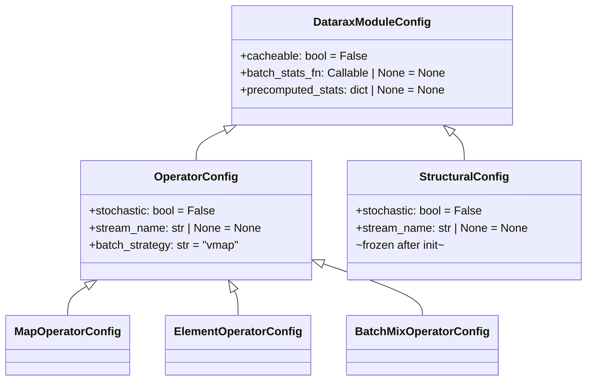

# Configuration Reference

All Datarax config dataclasses and their fields. Configs are validated at construction time via `__post_init__`.

## Config Hierarchy



## DataraxModuleConfig

**Source**: `datarax.core.config.DataraxModuleConfig`

Base config for all Datarax modules.

| Field | Type | Default | Description |
|-------|------|---------|-------------|
| `cacheable` | `bool` | `False` | Enable caching for this module |
| `batch_stats_fn` | `Callable \| nnx.Module \| None` | `None` | Function to compute batch statistics dynamically |
| `precomputed_stats` | `dict[str, Any] \| None` | `None` | Static precomputed statistics |

**Validation**: `batch_stats_fn` and `precomputed_stats` are mutually exclusive.

## OperatorConfig

**Source**: `datarax.core.config.OperatorConfig`

Config for parametric operators (mutable, learnable). Inherits all `DataraxModuleConfig` fields.

| Field | Type | Default | Description |
|-------|------|---------|-------------|
| `stochastic` | `bool` | `False` | Whether operator uses randomness |
| `stream_name` | `str \| None` | `None` | RNG stream name (required if `stochastic=True`) |
| `batch_strategy` | `str` | `"vmap"` | `"vmap"` (parallel) or `"scan"` (sequential, low memory) |

**Validation**:

- `stochastic=True` requires `stream_name`
- `stochastic=False` forbids `stream_name`
- `batch_strategy` must be `"vmap"` or `"scan"`

## MapOperatorConfig

**Source**: `datarax.core.config.MapOperatorConfig`

Config for `MapOperator`. Inherits all `OperatorConfig` fields.

| Field | Type | Default | Description |
|-------|------|---------|-------------|
| `subtree` | `PyTree \| None` | `None` | Nested dict matching `element.data` structure. `None` = full-tree mode |

```python
# Full-tree: fn applied to entire data dict
MapOperatorConfig(subtree=None)

# Single field: fn applied to "image" only
MapOperatorConfig(subtree={"image": None})

# Multiple fields
MapOperatorConfig(subtree={"image": None, "mask": None})
```

## ElementOperatorConfig

**Source**: `datarax.core.config.ElementOperatorConfig`

Config for `ElementOperator`. Inherits all `OperatorConfig` fields. No additional fields.

```python
# Deterministic
ElementOperatorConfig()

# Stochastic
ElementOperatorConfig(stochastic=True, stream_name="augment")
```

## BatchMixOperatorConfig

**Source**: `datarax.core.config.BatchMixOperatorConfig`

Config for `BatchMixOperator` (MixUp/CutMix). Always stochastic.

| Field | Type | Default | Description |
|-------|------|---------|-------------|
| `mode` | `str` | `"mixup"` | `"mixup"` or `"cutmix"` |
| `alpha` | `float` | `1.0` | Beta distribution parameter for mixing ratio |
| `data_field` | `str` | `"image"` | Field containing data to mix |
| `label_field` | `str` | `"label"` | Field containing labels to mix |
| `stochastic` | `bool` | `True` | Always `True` (forced) |
| `stream_name` | `str` | `"batch_mix"` | RNG stream name |

**Validation**: `mode` must be `"mixup"` or `"cutmix"`, `alpha` must be positive.

## StructuralConfig

**Source**: `datarax.core.config.StructuralConfig`

Config for structural modules (samplers, sources). **Frozen after initialization** -- cannot be modified at runtime.

| Field | Type | Default | Description |
|-------|------|---------|-------------|
| `stochastic` | `bool` | `False` | Whether module uses randomness |
| `stream_name` | `str \| None` | `None` | RNG stream name |

**Validation**: Same stochastic rules as `OperatorConfig`. Raises `FrozenInstanceError` on modification after init.

```python
config = StructuralConfig(stochastic=True, stream_name="sample")
config.stochastic = False  # Raises FrozenInstanceError!
```

## Specialized Configs

These configs extend the base classes for specific use cases:

| Config | Extends | Module | Key Fields |
|--------|---------|--------|------------|
| `MemorySourceConfig` | `StructuralConfig` | `MemorySource` | `shuffle`, `seed`, `num_epochs` |
| `TFDSEagerConfig` | `StructuralConfig` | `TFDSEagerSource` | `name`, `split`, `data_dir`, `try_gcs` |
| `HFEagerConfig` | `StructuralConfig` | `HFEagerSource` | `name`, `split`, `data_dir` |
| `EpochAwareSamplerConfig` | `StructuralConfig` | `EpochAwareSamplerModule` | `num_records`, `num_epochs`, `shuffle`, `seed` |
| `CompositeOperatorConfig` | `OperatorConfig` | `CompositeOperatorModule` | `strategy` |
| `ProbabilisticOperatorConfig` | `OperatorConfig` | `ProbabilisticOperator` | `probability` |
| `SelectorOperatorConfig` | `OperatorConfig` | `SelectorOperator` | `selection_mode` |

See the [API Reference](../../api_reference/index.md) for complete field documentation.
