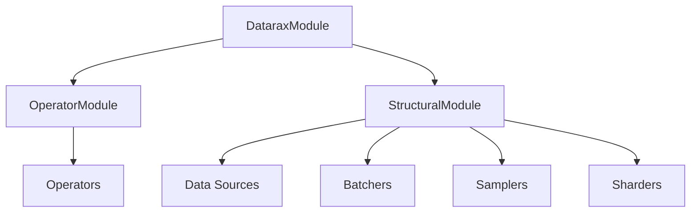

# Core Concepts

This guide explains the **Three-Tier Architecture** of Datarax, designed to provide a clear separation of concerns between state management, parametric operations, and structural data organization.

## Architecture Guidelines

The Datarax architecture is built on three hierarchical tiers:

1.  **Tier 1: DataraxModule** (Base Foundation)
2.  **Tier 2A: OperatorModule** (Parametric & Learnable)
3.  **Tier 2B: StructuralModule** (Non-Parametric & Structural)

This conceptual separation ensures that components are highly composable, type-safe, and easy to reason about.



---

## Tier 1: DataraxModule (The Foundation)

**`DataraxModule`** is the base class for ALL components in the library. It inherits from `flax.nnx.Module`, providing the fundamental capabilities required for robust state management in JAX.

### Key Capabilities
-   **State Management**: Automatically tracks state (parameters, RNG keys, metrics) using Flax NNX.
-   **Checkpointing**: Integration with Orbax for saving and restoring full pipeline state.
-   **Statistics**: Built-in support for computing and tracking batch statistics.
-   **Caching**: Mechanisms to cache processed results for efficiency.
-   **Iteration Tracking**: Keeps track of the number of iterations/calls.

All Datarax components, regardless of their specific role, share this common DNA.

---

## Tier 2A: OperatorModule (Parametric Transformations)

**`OperatorModule`** represents the "compute" layer of your data pipeline. These modules perform **differentiable, parametric transformations** on data.

### Characteristics
-   **Parametric**: Can have learnable parameters (e.g., weights in a normalization layer).
-   **Differentiable**: Fully compatible with JAX's automatic differentiation (`jax.grad`).
-   **Input/Output**: Expects and returns a `Batch` of data.
-   **Modes**:
    -   **Deterministic**: output = f(input) (e.g., Resize, Crop, Normalize)
    -   **Stochastic**: output = f(input, rng) (e.g., RandomFlip, ColorJitter, Mixup)

### Operator Definition

An **`OperatorModule`** is a unified abstraction for all data transformations. Whether a transformation is deterministic (like resizing an image) or stochastic (like adding random noise), it is implemented as an Operator.

This abstraction simplifies the mental model: everything that *changes* data values is an Operator.

### Usage Example

from datarax.core.operator import OperatorModule, OperatorConfig
import flax.nnx as nnx
import jax

# Defining a custom Deterministic Operator
class NormalizeOperator(OperatorModule):
    def __init__(self, config, mean, std):
        super().__init__(config)
        self.mean = mean
        self.std = std

    def apply(self, data, state, metadata, random_params=None, stats=None):
        # Simplified implementation
        return data, state, metadata

# Defining a custom Stochastic Operator
class RandomFlipOperator(OperatorModule):
    def apply(self, data, state, metadata, random_params=None, stats=None):
        # random_params would contain the key here
        return data, state, metadata

# Instantiation
norm_op = NormalizeOperator(
    OperatorConfig(stochastic=False),
    mean=0.5, std=0.5
)

augment_op = RandomFlipOperator(
    OperatorConfig(stochastic=True, stream_name="augment"),
    rngs=nnx.Rngs(augment=42)
)

---

## Tier 2B: StructuralModule (Data Organization)

**`StructuralModule`** represents the "organization" layer. These modules change the **structure** or **arrangement** of data but do not modify the data values themselves in a learnable way.

### Characteristics
-   **Non-Parametric**: Configuration is static and known at compile-time (e.g., batch size).
-   **Metadata-Aware**: Handles data organization, batching, and distribution.
-   **Immutable Config**: Uses frozen configuration classes to ensure structural stability.
-   **Input/Output**: Flexible (can be individual elements, batches, or indices).

### Key Implementations
1.  **Data Sources**: specialized `StructuralModule` that yields initial data Element.
2.  **Batchers**: Group individual elements into a `Batch`.
3.  **Samplers**: Generate sequences of indices for data retrieval.
4.  **Sharders**: Split batches across multiple devices (GPUs/TPUs).

### Usage Example

```python
from datarax.core.structural import StructuralConfig, StructuralModule
from datarax.core.batcher import BatcherModule
import flax.nnx as nnx

# Defining a custom Batcher
class SimpleBatcher(BatcherModule):
    def process(self, elements, *args, batch_size, drop_remainder=False, **kwargs):
        # Simplified batching logic for demonstration
        batch = []
        for element in elements:
            batch.append(element)
            if len(batch) == batch_size:
                yield batch
                batch = []
        if not drop_remainder and batch:
            yield batch

# Instantiation (batch_size is NOT in init)
batcher = SimpleBatcher(
    StructuralConfig(stochastic=False)
)

# Usage
# batches = list(batcher(data_stream, batch_size=32))
```

---

## Summary of Differences

| Feature | OperatorModule | StructuralModule |
| :--- | :--- | :--- |
| **Primary Role** | Data Transformation | Data Organization |
| **Learnable?** | Yes | No |
| **Differentiable?** | Yes | No |
| **Configuration** | Mutable/Tenable parameters | Immutable constants |
| **Examples** | Normalization, Augmentation | Batching, Sampling, Sharding |

## The DAG Execution Model

Datarax pipelines are constructed as a Directed Acyclic Graph (DAG) of these modules, wrapped in `Node` containers.

-   **`OperatorNode`**: Wraps an `OperatorModule`.
-   **`DataSourceNode`**: Wraps a `DataSourceModule`.
-   **`BatchNode`**: Wraps a `BatcherModule`.

Data flows through these nodes, with `DataraxModule` ensuring that state is correctly propagated and managed at every step.
